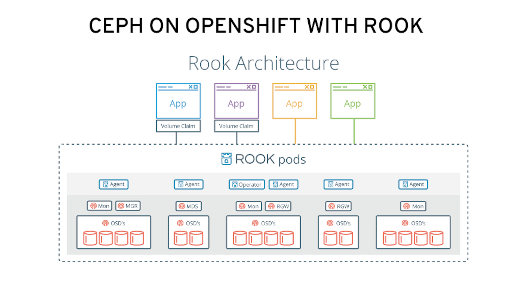

= Lab: Deploying and Managing OpenShift Container Storage with Rook-Ceph Operator

== Lab Overview

This hands-on workshop is for both system administrators and application developers interested in learning how to deploy and manage OpenShift Container Storage (OCS). In this lab you will be using OpenShift Container Platform (OCP) 4.x and Rook.io v1.0 to deploy Ceph as a persistent storage solution for OCP workloads.

=== In this lab you will learn how to

* Configure and deploy containerized Ceph using Rook’s cluster CustomResourceDefinitions (CRD)
* Validate deployment of Ceph Mimic containerized using OpenShift CLI
* Deploy the Rook toolbox to run cn ceph and rados commands
* Create a Persistent Volume (PV) on the Ceph cluster using a Rook OCP `StorageClass` for deployment of Rails application using a PostgreSQL database.
* Upgrade Ceph version from Mimic to Nautilus using the Rook operator
* Add more storage to the Ceph cluster

.Rook and Kubernetes Architecture 
image::images/rook_diagram_3.png[]

.Ceph deployed on OpenShift using Rook

== Lab Environment

This lab assumes that you have access to an OpenShift Container Platform (OCP) 4.x IPI cluster on AWS. You can create an OCP4 cluster by going to http://try.openshift.com and following instructions. Or you could use your RHPDS account (https://rhpds.redhat.com) and order Catalog item `OCP 4 Preview`. Lastly, you could be provided instructions during a Red Hat workshop or lab event to access your environment. 

To do these lab activities you will need to use an openshift user with cluster-admin privileges. 

[[labexercises]]
:numbered:
== Deploy Ceph using Rook.io

=== Scale OCP cluster and add 3 new nodes

In this section, you will validate the OCP environment has 3 master and 3 worker nodes before increasing the cluster size by 3 worker nodes. The NAME of your OCP nodes will be different than shown below.

----
oc get nodes
NAME                                         STATUS   ROLES    AGE    VERSION
ip-10-0-135-64.us-east-2.compute.internal    Ready    worker   117m   v1.13.4+da48e8391
ip-10-0-139-44.us-east-2.compute.internal    Ready    master   124m   v1.13.4+da48e8391
ip-10-0-146-50.us-east-2.compute.internal    Ready    worker   117m   v1.13.4+da48e8391
ip-10-0-147-157.us-east-2.compute.internal   Ready    master   124m   v1.13.4+da48e8391
ip-10-0-160-232.us-east-2.compute.internal   Ready    worker   118m   v1.13.4+da48e8391
ip-10-0-169-223.us-east-2.compute.internal   Ready    master   124m   v1.13.4+da48e8391
----

Now going to add 3 more OCP compute nodes to cluster.

----
oc get machinesets -n openshift-machine-api
----

This will show you the existing machinesets used to create the 3 worker nodes in the cluster already. There is a machineset for each AWS AZ (us-east-2a, us-east-2b, us-east-2a). Your machinesets `NAME` will be different than below. 

----
NAME                                   DESIRED   CURRENT   READY   AVAILABLE   AGE
cluster-a26e-rx8bk-worker-us-east-2a   1         1         1       1           127m
cluster-a26e-rx8bk-worker-us-east-2b   1         1         1       1           127m
cluster-a26e-rx8bk-worker-us-east-2c   1         1         1       1           127m
----

To create the 3 new worker nodes with available storage you will download 3 more machineset definition files.
----
curl -O https://raw.githubusercontent.com/openshift/openshift-cns-testdrive/40-rewrite/support/cluster-workerocs-us-east-2a.yaml
curl -O https://raw.githubusercontent.com/openshift/openshift-cns-testdrive/40-rewrite/support/cluster-workerocs-us-east-2b.yaml
curl -O https://raw.githubusercontent.com/openshift/openshift-cns-testdrive/40-rewrite/support/cluster-workerocs-us-east-2c.yaml
----

The files just downloaded do not have the correct `cluster-api-cluster` for your lab because every environment is unique. This command will find the correct value.

----
CLUSTERID=$(oc get machineset -n openshift-machine-api -o jsonpath='{.items[0].metadata.labels.machine\.openshift\.io/cluster-api-cluster}')
echo $CLUSTERID
----

Using this correct `cluster-api-cluster` value for your lab environment modify each of the 3 machinesets downloaded earlier using the variable `$CLUSTERID`.

----
sed -i "s/cluster-28cf-t22gs/$CLUSTERID/g" cluster-workerocs-us-east-2a.yaml
sed -i "s/cluster-28cf-t22gs/$CLUSTERID/g" cluster-workerocs-us-east-2b.yaml
sed -i "s/cluster-28cf-t22gs/$CLUSTERID/g" cluster-workerocs-us-east-2c.yaml
----

Check that `cluster-api-cluster` has been changed.

----
grep cluster-api-cluster cluster-workerocs-us-east-2*
----

The value for `cluster-api-cluster` should now match the results of `echo $CLUSTERID` from above for all occurrences.

Now you are ready to create your 3 new OCP worker nodes using these machinesets.

----
oc create -f cluster-workerocs-us-east-2a.yaml
oc create -f cluster-workerocs-us-east-2b.yaml
oc create -f cluster-workerocs-us-east-2c.yaml
----

Check that you have new machines created. 

----
oc get machines -n openshift-machine-api
----

They may be in `pending` for sometime so repeat command above until they are in a `running` STATE. The NAME of your machines will be different than below. 

----
NAME                                            INSTANCE              STATE     TYPE         REGION      ZONE         AGE
cluster-a26e-rx8bk-master-0                     i-097221131442bbfbb   running   m4.xlarge    us-east-2   us-east-2a   174m
cluster-a26e-rx8bk-master-1                     i-0267d53e93238917b   running   m4.xlarge    us-east-2   us-east-2b   174m
cluster-a26e-rx8bk-master-2                     i-01078f70ca5c9edb4   running   m4.xlarge    us-east-2   us-east-2c   174m
cluster-a26e-rx8bk-worker-us-east-2a-rbfzc      i-0866fa2a597f9b55c   running   m5.2xlarge   us-east-2   us-east-2a   174m
cluster-a26e-rx8bk-worker-us-east-2b-pk9k7      i-0c930c718134b2625   running   m5.2xlarge   us-east-2   us-east-2b   174m
cluster-a26e-rx8bk-worker-us-east-2c-v2jfq      i-0d5361d4219903e7c   running   m5.2xlarge   us-east-2   us-east-2c   173m
cluster-a26e-rx8bk-workerocs-us-east-2a-8pnf4   i-0a497998c19a59ba3   running   m5d.large    us-east-2   us-east-2a   4m1s
cluster-a26e-rx8bk-workerocs-us-east-2b-wwcmd   i-0c25eb473e452645d   running   m5d.large    us-east-2   us-east-2b   95s
cluster-a26e-rx8bk-workerocs-us-east-2c-8456v   i-0e0d311e4590fa7e3   running   m5d.large    us-east-2   us-east-2c   91s
----

You can see that the workerocs machines are using a different AWS instance type `m5d.large`. This is because this instance type has a 75GB NVMe SSD that will be used for our storage cluster. Now we want to see if our new machines are added to the OCP cluster.

----
oc get machinesets -n openshift-machine-api
----

The result of this command needs to look like below before you proceed. All workerocs machinesets should have an integer, in this case '1', under columns `READY` and `AVAILABLE`. This step could take more than 5 minutes. The NAME of your machinesets will be different than below. 

----
NAME                                      DESIRED   CURRENT   READY   AVAILABLE   AGE
cluster-a26e-rx8bk-worker-us-east-2a      1         1         1       1           179m
cluster-a26e-rx8bk-worker-us-east-2b      1         1         1       1           179m
cluster-a26e-rx8bk-worker-us-east-2c      1         1         1       1           179m
cluster-a26e-rx8bk-workerocs-us-east-2a   1         1         1       1           9m4s
cluster-a26e-rx8bk-workerocs-us-east-2b   1         1         1       1           6m38s
cluster-a26e-rx8bk-workerocs-us-east-2c   1         1         1       1           6m34s
----

Now you can see if you have 3 new OCP worker nodes. The NAME of your OCP nodes will be different than below.

----
oc get nodes -l node-role.kubernetes.io/worker

NAME                                         STATUS   ROLES    AGE     VERSION
ip-10-0-135-6.us-east-2.compute.internal     Ready    worker   5m58s   v1.13.4+da48e8391
ip-10-0-135-64.us-east-2.compute.internal    Ready    worker   175m    v1.13.4+da48e8391
ip-10-0-146-50.us-east-2.compute.internal    Ready    worker   175m    v1.13.4+da48e8391
ip-10-0-156-83.us-east-2.compute.internal    Ready    worker   3m7s    v1.12.4+30e6a0f55
ip-10-0-160-232.us-east-2.compute.internal   Ready    worker   176m    v1.13.4+da48e8391
ip-10-0-164-65.us-east-2.compute.internal    Ready    worker   3m30s   v1.12.4+30e6a0f55
----

=== Download Rook deployment files and install Ceph

In this section you will be using the new workerocs OCP nodes created in last section and Rook 1.0 images and configuration files. You will download and use files common.yaml, operator-openshift.yaml and cluster.yaml to create Rook and Ceph resources as shown in Figure 1 and Figure 2 above. 

First, validate that the 3 new workerocs nodes are labeled with role=storage-node. This label was in each of the machinesets you used in last section so should not need to manually add it now. 

----
oc get nodes --show-labels | grep storage-node
----

The first step to deploy Rook is to create the common resources. The configuration for these resources will be the same for most deployments. The common.yaml sets these resources up.

----
curl -O https://raw.githubusercontent.com/openshift/openshift-cns-testdrive/40-rewrite/support/common.yaml
oc create -f common.yaml
----

After the common resources are created, the next step is to create the Operator deployment. 

----
curl -O https://raw.githubusercontent.com/openshift/openshift-cns-testdrive/40-rewrite/support/operator-openshift.yaml
oc create -f operator-openshift.yaml
watch oc get pods -n rook-ceph
----

Wait for all rook-ceph-agent, rook-discover and rook-ceph-operator pods to be in a `Running` STATUS. The log for the rook-ceph-operator pod should show that the operator is looking for a cluster. Look for `the server could not find the requested resource (get clusters.ceph.rook.io)` in the rook-ceph-operator log file. This means the operator is looking for a Ceph cluster. Next you will create the cluster.

----
operator=$(oc get pod -l app=rook-ceph-operator -n rook-ceph -o jsonpath='{.items[0].metadata.name}')
echo $operator
oc logs $operator -n rook-ceph | grep "get clusters.ceph.rook.io"
----

Now that your operator is running, let’s create your Ceph storage cluster. This cluster.yaml file contains common settings for a production Ceph storage cluster. Requires at least three nodes. These will be the 3 new OCP nodes using the AWS m5d.large instance type each with a 75GB NVMe SSD.

----
curl -O https://raw.githubusercontent.com/openshift/openshift-cns-testdrive/40-rewrite/support/cluster.yaml
----

Take a look at the cluster.yaml file. It specifies the version of Ceph and the label used for the rook resources. This label, `role=storage-node` was validated as being on our new OCP nodes. Also `useAllNodes=true` and `useAllDevices=true` means that if a OCP node has label `role=storage-node` then all storage devices will be used for the Ceph cluster on this node.

----
cat cluster.yaml
...
    image: ceph/ceph:v13
...

  placement:
    all:
      nodeAffinity:
        requiredDuringSchedulingIgnoredDuringExecution:
          nodeSelectorTerms:
          - matchExpressions:
            - key: role
              operator: In
              values:
              - storage-node
...

  storage: # cluster level storage configuration and selection
    useAllNodes: true
    useAllDevices: true
    deviceFilter:
    location:
    config:	
...	

----

Now create the MONs, MGR and OSD pods.

----
oc create -f cluster.yaml
----

It may take more than 5 minutes to create all of the new MONs, MGR and OSD pods. Your pod names will have a different NAME. 
----
watch oc get pods -n rook-ceph

NAME                                        READY    STATUS     RESTARTS    AGE
...
rook-ceph-mgr-a-86b5b58769-xngqm             1/1     Running     0          110s
rook-ceph-mon-a-f95bc46-2jffm                1/1     Running     0          3m13s
rook-ceph-mon-b-54588c7d68-prm8f             1/1     Running     0          2m45s
rook-ceph-mon-c-5567868987-t72zz             1/1     Running     0          2m24s
rook-ceph-operator-9bb6f7745-r7rft           1/1     Running     0          53m
rook-ceph-osd-0-88d4c654-lsz2m               1/1     Running     0          66s
rook-ceph-osd-1-55b49d48df-lvnlv             1/1     Running     0          66s
rook-ceph-osd-2-745b7669d7-gkhl5             1/1     Running     0          66s
rook-ceph-osd-prepare-ip-10-0-135-6-p8rsz    0/2     Completed   0          91s
rook-ceph-osd-prepare-ip-10-0-156-83-tjft2   0/2     Completed   0          91s
rook-ceph-osd-prepare-ip-10-0-164-65-9wq67   0/2     Completed   0          90s
...

----

Once all pods are in a Running state it is time to verify that Ceph is operating correctly. Download toolbox.yaml to run Ceph commands.

----
curl -O https://raw.githubusercontent.com/openshift/openshift-cns-testdrive/40-rewrite/support/toolbox.yaml 
oc create -f toolbox.yaml
----

Now you can login to toolbox pod to run Ceph commands.

----
oc -n rook-ceph exec -it $(oc -n rook-ceph get pod -l "app=rook-ceph-tools" -o jsonpath='{.items[0].metadata.name}') bash
----

[NOTE]
====
Disregard these messages when logging into the toolbox pod:
----
bash: warning: setlocale: LC_CTYPE: cannot change locale (en_US.UTF-8): No such file or directory
bash: warning: setlocale: LC_COLLATE: cannot change locale (en_US.UTF-8): No such file or directory
bash: warning: setlocale: LC_MESSAGES: cannot change locale (en_US.UTF-8): No such file or directory
bash: warning: setlocale: LC_NUMERIC: cannot change locale (en_US.UTF-8): No such file or directory
bash: warning: setlocale: LC_TIME: cannot change locale (en_US.UTF-8): No such file or directory
----
====

Once logged in to toolbox use commands below to investigate the Ceph status and configuration. 

----
ceph status
ceph osd status
ceph osd tree
ceph df
rados df
exit
----

=== Create Rook storageclass for creating Ceph RBD volumes

In this section you will download storageclass.yaml and then create the OCP storageclass `rook-ceph-block` that can be used by applications to dynamically claim persistent storage or volumes (PVCs). The Ceph pool `replicapool` is created when the storageclass is created.

----
curl -O https://raw.githubusercontent.com/openshift/openshift-cns-testdrive/40-rewrite/support/storageclass.yaml
cat  storageclass.yaml
----

Notice the `provisioner: ceph.rook.io/block` and that `replicated: size=2` which is best practice when there are only 3 OSDs. This is because each volume created will be replica=2 and if one OSD is down volumes can continue to be created and used. 

----
oc create -f storageclass.yaml
----

Login to toolbox pod to run Ceph commands. Compare results for `ceph df` and `rados df` executed in prior section before the `rook-ceph-block` storageclass was created. You will see there is now a Ceph pool called `replicapool`. Also, the command `ceph osd pool ls detail` gives you information on how this pool is configured. 

----
oc -n rook-ceph exec -it $(oc -n rook-ceph get pod -l "app=rook-ceph-tools" -o jsonpath='{.items[0].metadata.name}') bash

ceph df
rados df
rados -p replicapool ls
ceph osd pool ls detail
exit
----

== Create new OCP deployment using Ceph RBD volume

In this section the `rook-ceph-block` storageclass will be used by an application + database deployment to create persistent storage. The persistent storage will be a Ceph RBD (RADOS Block Device) volume (object) in the pool=replicapool.

Because the Rails + PostgreSQL deployment uses the `default` storageclass we need to modify the current default storageclass (gp2) and then make `rook-ceph-block` the default storageclass.

----
oc get sc

NAME              PROVISIONER             AGE
gp2 (default)     kubernetes.io/aws-ebs   2d
rook-ceph-block   ceph.rook.io/block      8m27s
----

Now we want to change which `storageclass` is default. 

----
oc edit sc gp2
----

Remove this portion shown below from storageclass `gp2`. Make sure to note EXACTLY where this annotations is located in the `storageclass` (copying this portion to clipboard would be a good idea). The editing tool is `vi` when using `oc edit`. Make sure to save your changes before exiting `:wq!`.

----
  annotations:
    storageclass.kubernetes.io/is-default-class: "true"
----

Add the removed portion to `rook-ceph-block` in same place in the file so it will be the `default` storageclass. Make sure to save your changes before exiting `:wq!`. 

----
oc edit sc rook-ceph-block
----

After editing storageclass `rook-ceph-block` the result should be similar to below and `rook-ceph-block` should now be the `default` storageclass.

----
apiVersion: storage.k8s.io/v1
kind: StorageClass
metadata:
  annotations:
    storageclass.kubernetes.io/is-default-class: "true"
  creationTimestamp: "2019-04-26T22:24:29Z"
  name: rook-ceph-block
...omitted...
----

Validate that `rook-ceph-block` is now the default storageclass before starting the OCP application deployment.

----
oc get sc

NAME                        PROVISIONER             AGE
gp2                         kubernetes.io/aws-ebs   2d1h
rook-ceph-block (default)   ceph.rook.io/block      10m32s
----

Now you are ready to start the Rails + PostgreSQL deployment and monitor the deployment. 

----
oc new-project my-database-app
oc new-app rails-pgsql-persistent -p VOLUME_CAPACITY=5Gi
----

After the deployment is started you can monitor with these commands.

----
oc status
oc get pvc -n my-database-app
watch oc get pods -n my-database-app
----

Wait until the pods are all in a `Running` or `Completed` STATUS. This could take 5 or more minutes.

----
oc get pods -n my-database-app

NAME                                READY   STATUS      RESTARTS   AGE
postgresql-1-deploy                 0/1     Completed   0          5m48s
postgresql-1-lf7qt                  1/1     Running     0          5m40s
rails-pgsql-persistent-1-build      0/1     Completed   0          5m49s
rails-pgsql-persistent-1-deploy     0/1     Completed   0          3m36s
rails-pgsql-persistent-1-hook-pre   0/1     Completed   0          3m28s
rails-pgsql-persistent-1-pjh6q      1/1     Running     0          3m14s
----

Once the deployment is complete you can now test the application and the persistent storage Ceph RBD volume.

----
oc get route -n my-database-app

NAME                     HOST/PORT                                                                         PATH   SERVICES                 PORT    TERMINATION   WILDCARD
rails-pgsql-persistent   rails-pgsql-persistent-my-database-app.apps.cluster-a26e.sandbox295.opentlc.com          rails-pgsql-persistent   
----

Your results for `oc get route` will be different in your lab. You can find your `rails-pgsql-persistent` route using this method:

----
route=$(oc get route -n my-database-app -o jsonpath='{.items[0].spec.host}')
echo $route
----

Copy your results of `echo $route/articles` to your browser to create articles. Enter the `username` and `password` below to create articles and comments. The articles and comments are saved in a PostgreSQL database which stores its table spaces on the Ceph RBD volume provisioned using the `rook-ceph-block` storagclass.

----
username: openshift
password: secret
----

Lets now take another look at the Ceph `replicapool` created by the storageclass. Log into the toolbox pod again.

----
oc -n rook-ceph exec -it $(oc -n rook-ceph get pod -l "app=rook-ceph-tools" -o jsonpath='{.items[0].metadata.name}') bash
----

Run the same Ceph commands as before the application deployment and compare to results in prior section. Notice the number of objects in `replicapool` now.

----
ceph df
rados df
rados -p replicapool ls | grep pvc
exit
----

Validate the OCP PVC is the same name as the PVC object in the replicapool.

----
oc get pvc -n my-database-app
----

== Using Rook to Upgrade Ceph

In this section you will upgrade Ceph from from Mimic to Nautilus using the Rook operator. First verify the current version by logging into the toolbox pod.

----
oc -n rook-ceph exec -it $(oc -n rook-ceph get pod -l "app=rook-ceph-tools" -o jsonpath='{.items[0].metadata.name}') bash
ceph version
----

The result should be `ceph version 13.2.5 (cbff874f9007f1869bfd3821b7e33b2a6ffd4988) mimic (stable)`. The next thing we need to do is update the cluster CRD with the Nautilus image name and version. 

----
oc edit cephcluster rook-ceph -n rook-ceph
----

Modify the Ceph version in the cluster CRD. Using `oc edit` is the same as using editing tool `vi`. 

----
spec:
  cephVersion:
    image: ceph/ceph:v13
----

To the version for Nautilus. Make sure to save your changes before exiting `:wq!`.

----
spec:
  cephVersion:
    image: ceph/ceph:v14
----

Once the change to the Ceph version is edited as shown above, the MONs, MGR, and OSD pods will be restarted. This could take 5 minutes or more.

----
watch oc get pods -n rook-ceph

NAME                                         READY   STATUS      RESTARTS   AGE
...
rook-ceph-mgr-a-777d64fb8f-q7tcz             1/1     Running     0          2m55s
rook-ceph-mon-a-5c7fcdfcc4-zwzb7             1/1     Running     0          3m18s
rook-ceph-mon-b-5597dbd64d-cdvjf             1/1     Running     0          4m33s
rook-ceph-mon-c-779cbf9bc-2rfl5              1/1     Running     0          3m58s
rook-ceph-operator-5f7967846f-zqqjl          1/1     Running     0          27h
rook-ceph-osd-0-855bc669cd-45sk7             1/1     Running     0          2m8s
rook-ceph-osd-1-7cc9cd8c8c-j9ffl             1/1     Running     0          115s
rook-ceph-osd-2-5977cd8bff-9x85n             1/1     Running     0          98s
...

----

Now let's check the version of Ceph to see if it is upgraded. First we need to login to the toolbox pod again. 

----
oc -n rook-ceph exec -it $(oc -n rook-ceph get pod -l "app=rook-ceph-tools" -o jsonpath='{.items[0].metadata.name}') bash
----

Running the `ceph versions` command shows each of the Ceph daemons have been upgraded to Nautilus. Run other Ceph commands to satisfy yourself (e.g., ceph status) the system is healthy after the upgrade from Mimic to Nautilus. You might even want to go back to the $route used for the Rails+PostgreSQL application and save a few more articles to make sure applications using Ceph storage are still working.

----
ceph versions
{
    "mon": {
        "ceph version 14.2.0 (3a54b2b6d167d4a2a19e003a705696d4fe619afc) nautilus (stable)": 3
    },
    "mgr": {
        "ceph version 14.2.0 (3a54b2b6d167d4a2a19e003a705696d4fe619afc) nautilus (stable)": 1
    },
    "osd": {
        "ceph version 14.2.0 (3a54b2b6d167d4a2a19e003a705696d4fe619afc) nautilus (stable)": 3
    },
    "mds": {},
    "overall": {
        "ceph version 14.2.0 (3a54b2b6d167d4a2a19e003a705696d4fe619afc) nautilus (stable)": 7
    }
}

exit
----

== Adding storage to the Ceph Cluster

In this section you will add more storage to the cluster by increasing the number of OCP workerocs nodes from 3 to 4 using one of the machinesets already used to create new worker nodes. The new machine will also have a 75 GB NVMe SSD. The Rook operator will `observe` when the new OCP node is added to the cluster and will then create a new OSD pod on this new worker node and the 75 GB SSD will be added to the Ceph cluster with no manual effort from the user.

To increase the number of machines and the OCP nodes we will again use a machineset. Each of the machinesets we used earlier created just one machine because `replicas: 1`. Your `cluster-api-cluster` and `name` is different than example shown below.

----
cat machineset cluster-workerocs-us-east-2a.yaml | more

apiVersion: machine.openshift.io/v1beta1
kind: MachineSet
metadata:
  labels:
    machine.openshift.io/cluster-api-cluster: cluster-a26e-rx8bk
    machine.openshift.io/cluster-api-machine-role: workerocs
    machine.openshift.io/cluster-api-machine-type: workerocs
  name: cluster-a26e-rx8bk-workerocs-us-east-2a
  namespace: openshift-machine-api
spec:
  replicas: 1
...

----

Find your `cluster-api-cluster` by using the command below.

----
CLUSTERID=$(oc get machineset -n openshift-machine-api -o jsonpath='{.items[0].metadata.labels.machine\.openshift\.io/cluster-api-cluster}')
echo $CLUSTERID
----

We can easily create a new machine in AWS AZ us-east-2a by just increasing the replicas count. Using the machineset `name` from above edit this machineset to increase from `replicas: 1` to `replicas: 2`. Make sure to save your changes before exiting `:wq!`.

----
oc edit machineset $CLUSTERID-workerocs-us-east-2a -n openshift-machine-api
----

Verify you now have 4 workerocs machines. One of the machines should have just been created in us-east-2a AZ so there are two machines in this AZ now. Your NAME will be different than shown below. 

----
oc get machines -n openshift-machine-api

NAME                                            INSTANCE              STATE     TYPE         REGION      ZONE         AGE
...
cluster-a26e-rx8bk-workerocs-us-east-2a-8pnf4   i-0a497998c19a59ba3   running   m5d.large    us-east-2   us-east-2a   2d
cluster-a26e-rx8bk-workerocs-us-east-2a-l4v5l   i-0e22f1078f1228086   running   m5d.large    us-east-2   us-east-2a   33s
cluster-a26e-rx8bk-workerocs-us-east-2b-wwcmd   i-0c25eb473e452645d   running   m5d.large    us-east-2   us-east-2b   47h
cluster-a26e-rx8bk-workerocs-us-east-2c-8456v   i-0e0d311e4590fa7e3   running   m5d.large    us-east-2   us-east-2c   47h
----

Now you need to verify that this new machine is added to the OCP cluster. All workerocs machinesets should be `READY` and `AVAILABLE` before you proceed. The NAME of your machinesets will be different than below. You can see now that `cluster-a26e-rx8bk-workerocs-us-east-2a` now has 2 machines. The machineset in us-east-2 should have an integer, in this case '2', under columns `READY` and `AVAILABLE`. This step could take more than 5 minutes. 

----
oc get machinesets -n openshift-machine-api

NAME                                      DESIRED   CURRENT   READY   AVAILABLE   AGE
...
cluster-a26e-rx8bk-workerocs-us-east-2a   2         2         2       2           2d
cluster-a26e-rx8bk-workerocs-us-east-2b   1         1         1       1           2d
cluster-a26e-rx8bk-workerocs-us-east-2c   1         1         1       1           2d
----

Also verify that you have a new OCP worker node. You should now have 7 worker nodes. 

----
oc get nodes -l node-role.kubernetes.io/worker

NAME                                         STATUS   ROLES    AGE     VERSION
ip-10-0-135-6.us-east-2.compute.internal     Ready    worker   2d      v1.13.4+da48e8391
ip-10-0-135-64.us-east-2.compute.internal    Ready    worker   2d2h    v1.13.4+da48e8391
ip-10-0-137-156.us-east-2.compute.internal   Ready    worker   4m28s   v1.13.4+da48e8391
ip-10-0-146-50.us-east-2.compute.internal    Ready    worker   2d2h    v1.13.4+da48e8391
ip-10-0-156-83.us-east-2.compute.internal    Ready    worker   2d      v1.13.4+da48e8391
ip-10-0-160-232.us-east-2.compute.internal   Ready    worker   2d2h    v1.13.4+da48e8391
ip-10-0-164-65.us-east-2.compute.internal    Ready    worker   2d      v1.13.4+da48e8391
----

The rook operator pod now needs to be restarted. 

----
operator=$(oc get pod -l app=rook-ceph-operator -n rook-ceph -o jsonpath='{.items[0].metadata.name}')
echo $operator
oc delete pod $operator -n rook-ceph
----

Now lets look again at the Rook pods. We can see a new OSD pod, `rook-ceph-osd-3` has just been created. It could take 5 minutes or more for the forth OSD pod to be in a `Running` state. 

----
watch oc get pods -n rook-ceph

NAME                                          READY   STATUS      RESTARTS   AGE
...
rook-ceph-osd-0-855bc669cd-45sk7              1/1     Running     0          55m
rook-ceph-osd-1-7cc9cd8c8c-j9ffl              1/1     Running     0          55m
rook-ceph-osd-2-5977cd8bff-9x85n              1/1     Running     0          55m
rook-ceph-osd-3-56b6c4f459-q7mhz              1/1     Running     0          114s
...

----

Let's now validate that Ceph is healthy and has the additional storage. We again login to the toolbox pod.

----
oc -n rook-ceph exec -it $(oc -n rook-ceph get pod -l "app=rook-ceph-tools" -o jsonpath='{.items[0].metadata.name}') bash
----

And run Ceph commands to see the new OSDs.

----
ceph osd status

+----+--------------------------------------------+-------+-------+--------+---------+--------+---------+-----------+
| id |                    host                    |  used | avail | wr ops | wr data | rd ops | rd data |   state   |
+----+--------------------------------------------+-------+-------+--------+---------+--------+---------+-----------+
| 0  |  ip-10-0-135-6.us-east-2.compute.internal  | 1051M | 68.8G |    0   |     0   |    0   |     0   | exists,up |
| 1  | ip-10-0-156-83.us-east-2.compute.internal  | 1060M | 68.8G |    0   |     0   |    0   |     0   | exists,up |
| 2  | ip-10-0-164-65.us-east-2.compute.internal  | 1062M | 68.8G |    0   |     0   |    0   |     0   | exists,up |
| 3  | ip-10-0-137-156.us-east-2.compute.internal | 1061M | 67.9G |    0   |     0   |    0   |     0   | exists,up |
+----+--------------------------------------------+-------+-------+--------+---------+--------+---------+-----------+
----

And we can see that Ceph is healthy and happy! There are now 4 OSDs `up` and `in`. You might even want to go back to the $route used for the Rails+PostgreSQL application and save a few more articles to make sure applications using Ceph storage are still working.

----
ceph status

  cluster:
    id:     90306026-6e42-4877-9d4e-26eca2ecf6ef
    health: HEALTH_OK
 
  services:
    mon: 3 daemons, quorum b,a,c (age 59m)
    mgr: a(active, since 5m)
    osd: 4 osds: 4 up, 4 in
 
  data:
    pools:   1 pools, 100 pgs
    objects: 36 objects, 73 MiB
    usage:   4.1 GiB used, 274 GiB / 279 GiB avail
    pgs:     100 active+clean
----
