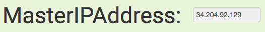

# Welcome to the OpenShift Test Drive for Administrators

Please follow below instructions to get started.

## 1. Pre-requisites

For this lab you need to fulfill the following pre-requisites:

- Workstation with Internet access

- SSH client supporting authentication with a private key

## 2. How to start your Test Drive

To start the Test Drive press <b>&nbsp;&nbsp;Start Lab&nbsp;&nbsp;</b> button in the top bar.

## 3. How to access your lab guide

When you started your Test Drive the lab environment will provision in roughly 5 minutes. During this time you'll see a progress bar above this page.

When your lab infrastructure is ready this progress bar disappear and you will
see a button to end your lab session and countdown until automatic shutdown
instead:

Click the &nbsp;&nbsp;Addl. Info&nbsp;&nbsp; button to retrieve the URL to your lab guide:

Open this URL in a new tab to view your personalized lab guide!

## 4. How to access the lab environment

When your lab infrastructure is ready click the &nbsp;&nbsp;Connect&nbsp;&nbsp; button and download the SSH private key to your computer:

&#8680; To login via SSH download the PEM file to your machine and change the permissions:

    chmod 0400 ~/Downloads/<pem-file-name>

Click the &nbsp;&nbsp;Addl. Info&nbsp;&nbsp; button again to retrieve IP address of your environment:

&#8680; Then login with the ssh client like this:

    ssh -i ~/Downloads/<pem-file-name> -l cloud-user <MasterIPAddress>

Follow the lab guide to navigate the environment and conduct the prepared exercises.

Have fun!
