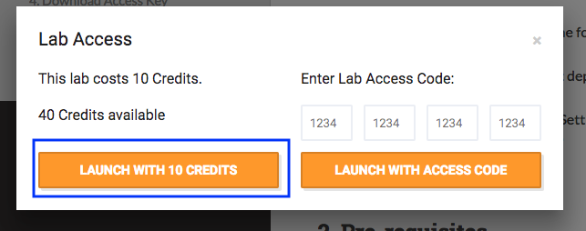
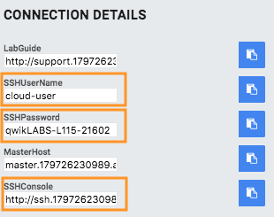
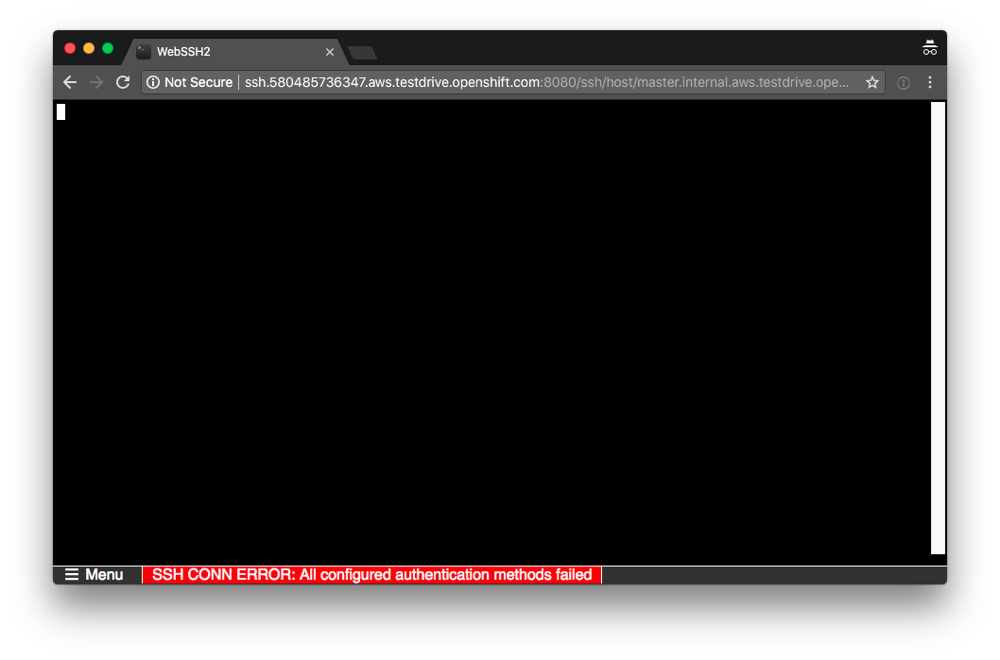

# Welcome to the OpenShift for Ops Test Drive

Please follow below instructions to get started. In case of problems please reach out to [openshift-ops-testdrive@redhat.com](mailto:openshift-ops-testdrive@redhat.com).
Completing the entire lab content will typically take between 2 and 3 hours.

## 1. Contents of this lab

In this lab you will be guided through the following operational topics:

1. Exploring a ready-to-run OpenShift deployment
2. Application Management Basics
3. Project Template, Quota and Limit Settings
4. External Authentication with LDAP
5. Infrastructure Management Basics
6. Container-Native Storage

## 2. Pre-requisites

For this lab you need to fulfill the following pre-requisites:

- Workstation with Internet access

- SSH client

## 3. How to start your Test Drive

To start the Test Drive press  button in the top bar.

If you have not signed up for this Test Drive as part of an event you will be asked if you want to spend 10 credits on this lab. Answer with **Launch with 10 credits**. It might take 2-3 seconds to proceed.
If you do not see that option you have run out of credits.
You should have initially received 40 credits as part of registering for this lab online. If you ran out please contact [testdrivetokens@redhat.com](mailto:testdrivetokens@redhat.com).

In total you can start the lab **4** times. Then your either your credits or your quota of free lab environments has reached it's limit. Contact us if you want to run even more labs ([openshift-ops-testdrive@redhat.com](mailto:openshift-ops-testdrive@redhat.com)).

## 4. Wait for lab provisioning to complete

When you started your Test Drive the lab environment provision process initiated in the background. During provisioning you can monitor progress in the top bar above this guide:

In total provisioning usually takes about 15 minutes and should not exceed 20 minutes.
When your lab infrastructure is ready this progress bar disappears. Upon launch you will see a button to end your lab session and a countdown until automatic shutdown:

## 5. Access the lab environment via (web-based) SSH

Once the lab is provisioned on the left side of the screen credential information will appear below **CONNECTION DETAILS**:

Note the **SSHUserName** and **SSHPassword**. Navigate to the provided URL in the field **SSHConsole** to launch the web-based SSH console. This is a browser-based SSH client that is hosted in your lab environment for convenient access to the lab.
Enter the previously collected user name and password when prompted in your browser.

If you mistype your password the screen will stay black and you don't get a prompt.

In this case restart your browser to get another prompt again. When done correctly it should look like this:

It is possible that a spotty connection to the lab environment will cause the browser-based SSH console to timeout. The console will be in status **WEBSOCKET SERVER DISCONNECTED: transport close**.

In this case simply reload your browser to restore the connection.

Alternatively, if you prefer your own SSH client you can do that too. Any SSH client is ok (OpenSSH, PuTTY, etc). Please note that your network / VPN must permit outbound traffic to TCP port 22 - this might be blocked on corporate machines.

~~~
ssh -l <UserName> <HostName>
~~~

When logged in with the password provided, you end up on the OpenShift Master node from where the lab guide will run you through the exercises.

## 6. How to access your personalized lab guide

This lab features a personalized lab guide which is ready as soon as the environment is provisioned. A field called "LabGuide" will appear on the left hand side of your screen as soon as that is the case.

To access it, copy the complete URL of the lab guide from the field (or simply press the copy button next to it) in the left pane to your clipboard:

Open the URL in a new tab to view your personalized lab guide!
It will walk you through the rest of the lab show you how to access your environment.

Have fun!
