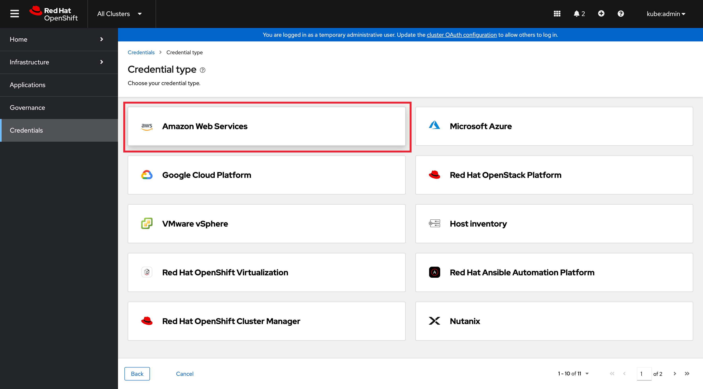
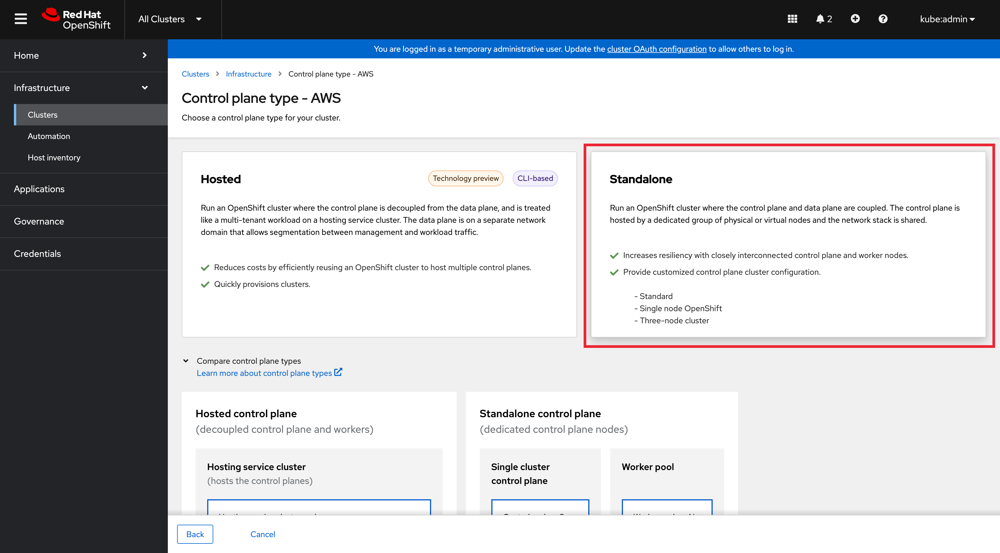
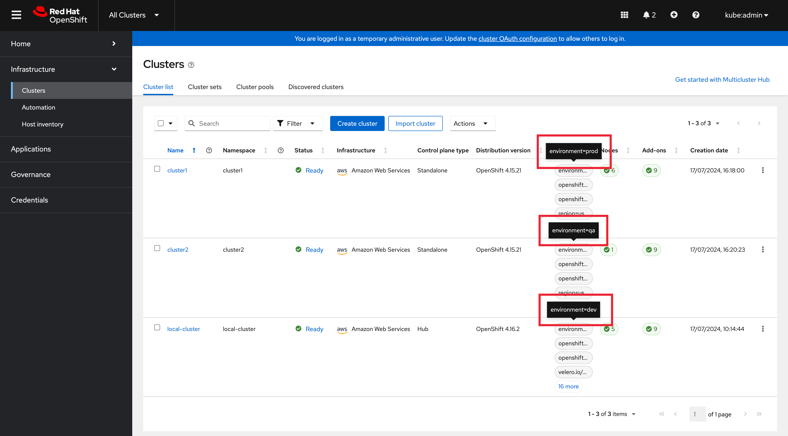
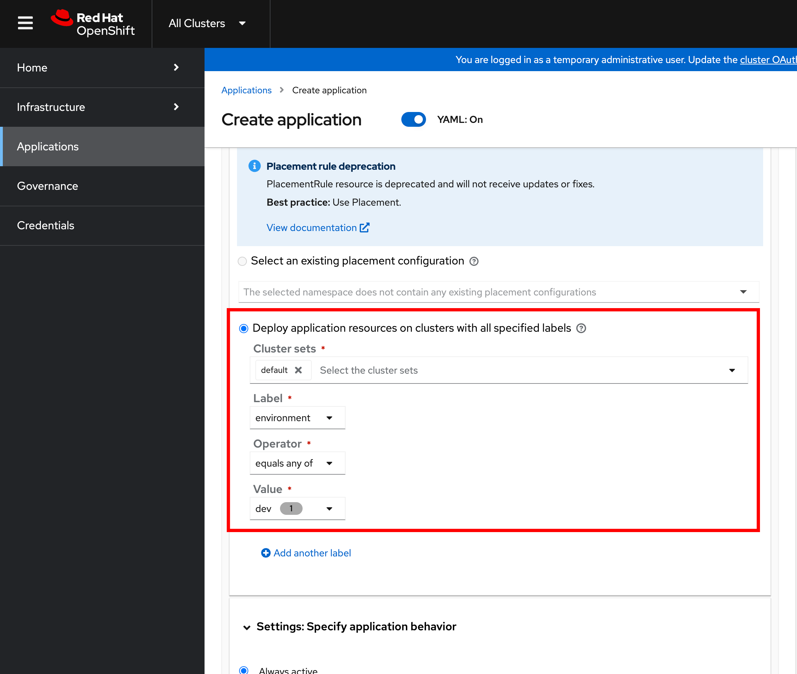
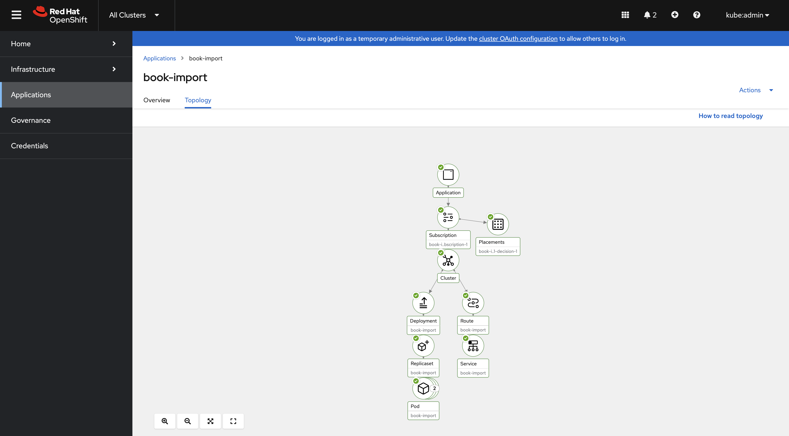
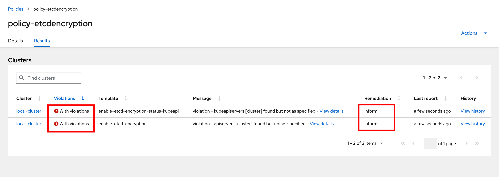

= Advanced Cluster Management for Kubernetes - RHACM

== Working with Clusters and Cluster Lifecycle

At a high level Cluster Lifecycle management is about creating, upgrading, and destroying and importing clusters in a multi cloud environment.

In the demo console you will find that ACM from 4.7 onwards is now intergrated with the OpenShift Cosnole. 

Please find your console located below: 

{{ MASTER_URL }}

If you navigate to `Local-cluster` then you should see the new ACM console when you select `All Clusters`.

Once there you can proceed with the module.

image::images/acm-images-new/RHACM_all_cluster.png[]

[start=1]
1. Once you have logged in to ACM, Navigate to *Credentials menu* and then select *Add Credentials*

image::images/acm-images-new/credentials.png[]

image::images/acm-images-new/add_cred.png[]

=== You will need to provide connection details:

* Cloud Provider Credentials: Choose *Amazon Web Services* +

### Screen 1: Basic Info

* Credential Name:  `aws`
* Namespace: `open-cluster-management`
* Base DNS Domain:  This information is located on the demo console under the field *rhacm_aws_subdomain*. You can also find it on the creds page for this workshop under *Top level domain*.

When copy and pasting this information, make sure you omit the dot on the url, for example it should read `sandbox1536.opentlc.com` not `.sandbox1536.opentlc.com`

image::images/acm-images-new/cred_basicinfo.png[]

[start=2]
2. Click NEXT

### Screen 2 Amazon Web Services

* Access Key ID: This information is located on the creds page for the 
demo console under the field *AWS_ACCESS_KEY_ID*

* Secret Access Key ID: This information is located on the creds page 
for the demo console under the field *AWS_SECRET_ACCESS_KEY*

image::images/acm-images-new/screen2.png[]

[start=3]
3. Click NEXT - We don't need to configure a Proxy so we can skip this screen

* Click NEXT

### Screen 4 Pull secret and SSH

* Red Hat OpenShift pull secret:  https://cloud.redhat.com/openshift/install/pull-secret[Get the pull secret from cloud.redhat.com - RH login Required]

image::images/acm-images-new/pull_secret.png[]

* SSH private and public keys:  Use an existing key pair or https://docs.openshift.com/container-platform/4.14/installing/installing_aws/installing-aws-default.html#ssh-agent-using_installing-aws-default[generate a new ssh key]

> Please note you might need *console.redhat.com* access to get these keys

[start=4]
4. Click NEXT

image::images/acm-images-new/screen4.png[]

[start=5]
5. Verify the information and click *ADD*

== Create a new OpenShift cluster in AWS

1. From the menu select *Infrastructure → Clusters*
2. Click *Create Cluster*

image::images/acm-images-new/create_cluster.png[]

[start=3]
3. Select *Amazon Web services*

image::images/acm-images-new/aws_cluster.png[]

[start=4]
4. Select *Standalone*

[start=5]
5. Select the *Infrastructure provider credential* we just created called *AWS*

* Add the desired *cluster name*.
* Leave the *Cluster set empty for now*
* Select a *Release Image*, select the `4.16.2` version
* Add an Additional labels of *environment=prod*
* Click NEXT

Change the region to *see table below*

|===
|Your Location | AWS Region to select
|*NORTH AMERICA*|Select *us-west-1* or *us-west-2*

|*EUROPE / EMEA*|Select *eu-west-2* or *eu-west-3*
|*ASIA PACIFIC*|Select *ap-southeast-2* or *ap-northeast-2* or *ap-east-1*
|===

[start=6]
6. Click NEXT on the other screens or select *7 - Review* on the menu and then click *CREATE*

_This process takes about 30 to 40 minutes depending on AWS traffic at the time this course is taken. Make sure you monitor for any failures and address as needed_

== Creating a Single Node Cluster (SNO) in AWS

While we wait for the main cluster to provision, lets go ahead and provision a Single Node Cluster. In this exercise we will show you how to create a single node cluster (OCP 4.8 and Above required) in order to save some time and resources when building clusters for testing.

*Please NOTE* that provisioning SNO clusters in public clouds is not currently supported, we only support SNO clusters as bare metal, we leverage the public cloud in the example below to showcase the functionality only.

1. From the menu select *Infrastructure → Clusters*
2. Click *Create Cluster*
3. Select *Amazon Web services*
4. Select *Standalone*

[start=5]
5. Please set it up as follows:
* Select the *Infrastructure provider credential*  *AWS*
* Click NEXT
* Add the desired cluster name. Leave the Cluster set empty for now
* Select a *Release Image*, select a *OCP 4.16.2 version*
* Add an Additional label of *environment=qa*
* Click NEXT
* Change the region to *see table below*

|===
|Your Location | AWS Region to select
|*NORTH AMERICA*|Select *us-west-1* or *us-west-2*

|*EUROPE / EMEA*|Select *eu-west-2* or *eu-west-3*
|*ASIA PACIFIC*|Select *ap-southeast-2* or *ap-northeast-2* or *ap-east-1*
|===

[start=6]
6. Expand the *Worker Pools*, and change the worker node count to 0

image::images/acm-images-new/node_0.png[]

[start=7]
7. Click on step 7 to Review *before* proceeding, turn *YAML: ON at the top of the screen.*

[start=8]
8. Click on the *install-config* tab in the YAML window pane and *change the master replica number to 1* (will likely be 3).  Double check that the worker replica is 0.

image::images/acm-images-new/install-config.png[]

[start=9]
9. Click back on the *cluster* tab in the YAML window pane and locate the section that defines an object of type: *kind: MachinePool*. Add the following line at the end of the *MachinePool* section.
----
  skipMachinePools: true
----

It should look something like this:
----
apiVersion: hive.openshift.io/v1
kind: MachinePool
metadata:
  name: cluster2-worker
  namespace: 'cluster2'
spec:
  clusterDeploymentRef:
    name: 'cluster2'
  name: worker
  platform:
    aws:
      rootVolume:
        iops: 2000
        size: 100
        type: io1
      type: m5.xlarge
  replicas: 0
  skipMachinePools: true
----

Be sure the new line is at the same indentation as the previous line.

[start=10]
10. Click on “*Create*” and the single node cluster creation will go through.

_This process takes about 10 to 20 minutes depending on AWS traffic at the time this course is taken. Make sure you monitor for any failures and address as needed_

== Creating and Managing Applications with Red Hat Advanced Cluster Management For Kubernetes

In the previous lab, you explored the Cluster Lifecycle functionality in RHACM. This allowed you to create new OpenShift® clusters, which you can now use to deploy applications.

Application Lifecycle functionality in RHACM provides the processes that are used to manage application resources on your managed clusters. This allows you to define a single or multi-cluster application using Kubernetes specifications, but with additional automation of the deployment and lifecycle management of resources to individual clusters. An application designed to run on a single cluster is straightforward and something you ought to be familiar with from working with OpenShift fundamentals. A multi-cluster application allows you to orchestrate the deployment of these same resources to multiple clusters, based on a set of rules you define for which clusters run the application components.

This table describes the different components that the Application Lifecycle model in RHACM is composed of:

|===
|*Resource*|*Purpose *

|Channel|Defines a place where deployable resources are stored, such as an object store, Kubernetes namespace, Helm repository, or GitHub repository.
|Subscription|Definitions that identify deployable resources available in a Channel resource that are to be deployed to a target cluster.
|PlacementRule|Defines the target clusters where subscriptions deploy and maintain the application. It is composed of Kubernetes resources identified by the Subscription resource and pulled from the location defined in the Channel resource.
|Application|A way to group the components here into a more easily viewable single resource. An Application resource typically references a Subscription resource.
|===

These are all Kubernetes custom resources, defined by a Custom Resource Definition (CRD), that are created for you when RHACM is installed. By creating these as Kubernetes native objects, you can interact with them the same way you would with a Pod. For instance, running +oc get application+ retrieves a list of deployed RHACM applications just as +oc get pods+ retrieves a list of deployed Pods.

This may seem like a lot of extra resources to manage in addition to the deployables that actually make up your application. However, they make it possible to automate the composition, placement, and overall control of your applications when you are deploying to many clusters. With a single cluster, it is easy to log in and run +oc create -f…​.+ If you need to do that on a dozen clusters, you want to make sure you do not make a mistake or miss a cluster, and you need a way to schedule and orchestrate updates to your applications. Leveraging the Application Lifecycle Builder in RHACM allows you to easily manage multi-cluster applications.

== Creating an Application

Prerequisites:

* Navigate to *Infrastructure → Clusters*
* Click on the *local-cluster*
* Click the *edit* button under *Labels* and add a *label* : `environment=dev`
* Verify the new clusters you build have the correct labels, it should be as follows:
** *Local-Cluster* - `environment=dev`
** *AWS 1st Cluster* - `environment=prod`
** *AWS 2nd Cluster* - `environment=qa`

[start=1]
1. Navigate to *Applications*
2. Click *Create application, select Subscription*. 

image::images/acm-images-new/create_sub_app.png[]

[start=3]
3. Enter the following information:

** *Name*: `book-import`
** *Namespace*: `book-import`
** Under repository types, select the *GIT* repository
** *URL:*  https://github.com/hichammourad/book-import.git[https://github.com/hichammourad/book-import.git]
** *Branch*:  `master-no-pre-post`
** *Path:*  `book-import`

[start=4]
4. Verify that *Deploy application resources only on clusters matching specified labels* is selected and enter the following information
** *environment*: `dev`. It may ask you to select a 'Cluster set' if it does please choose `default`.

[start=5]
5. Verify all the information is correct. Click *Create*

It will take a few minutes to deploy the application, *Click* on the *Topology* view and verify that *all of the check marks are green*.

[start=6]
6. Under the topology view, Select the *Route* and click on the *Launch Route* *URL*, this will take you to the Book Import application with several books available.
(Please note that the URL should be http instead of https)

Feel free to experiment with the application.  Edit it and change the label to `environment=prod`.  What happens to the application?

You have now completed the overview of the *Application Lifecycle functionality in RHACM.*

You successfully deployed an application to a target cluster using RHACM. This approach leveraged a Git repository which housed all of the manifests that defined your application. RHACM was able to take those manifests and use them as deployables, which were then deployed to the target cluster.

You also leverage the power of labels and deploy the application to your imported cluster. I highly encourage you to play around with the labels and deploy this application to your local cluster. You can also create other clusters and or applications if you so desire.

== Governance, Risk, and Compliance (Security and compliance use case)

=== Creating Policies in ACM

At this point, you have completed the overview labs for Cluster Lifecycle and Application Lifecycle capabilities in RHACM. In the Cluster Lifecycle Lab, you learned how RHACM can help manage the lifecycles of your Kubernetes clusters, including both deploying new clusters and importing existing clusters. In that lab, you created new clsters and used your RHACM instance to manage them.

In the Application Lifecycle Lab, you continued exploring RHACM functionality and learned how to deploy and configure an application. You used the cluster that you added in the first module as the target for deploying an application.

Now that you have a cluster and a deployed application, you need to make sure that they do not drift from their original configurations. This kind of drift is a serious problem, because it can happen from benign and benevolent fixes and changes, as well as malicious activities that you might not notice but can cause significant problems. The solution that RHACM provides for this is the Governance, Risk, and Compliance, or GRC, functionality.

==== Review GRC Functionality

To begin, it is important to define exactly what GRC is. In RHACM, you build policies that are applied to managed clusters. These policies can do different things, which are described below, but they ultimately serve to govern the configurations of your clusters. This governance over your cluster configurations reduces risk and ensures compliance with standards defined by stakeholders, which can include security teams and operations teams

This table describes the three types of policy controllers available in RHACM along with the remediation mode they support:

|===
|*Policy Controller*|*Purpose*|*Enforce or Inform*

|Configuration|Used to configure any Kubernetes resource across your clusters. Where these resources are created or configured is determined by the namespaces you include (or exclude) in the policy.|Both
|Certificate|Used to detect certificates that are close to expiring. You can configure the certificate policy controller by updating the minimum duration parameter in your controller policy. When a certificate expires in less than the minimum duration, the policy becomes noncompliant. Certificates are identified from secrets in the included namespaces.|Inform
|Identity and Access Management (IAM)|Used to receive notifications about IAM policies that are noncompliant. In the 1.0 version of RHACM, this checks for compliance with the number of cluster administrators you allow in your cluster.    |inform
|===

You need to create three different resources in order to implement the policy controllers:

|===
|*Resource*|*Function*

|Policy|The Policy defines what you actually want to check and possibly configure (with enforce). Policies include a policy-template which defines a list of objectDefinitions. The policy also determines the namespaces it is applied to, as well as the remediation actions it takes.
|Placement Rule|Identifies a list of managed clusters that are targeted when using this PlacementRule.
|PlacementBinding|Connect the policy to the PlacementRule.
|===

This is a complex topic, and this course is only providing an overview. Please consult the https://access.redhat.com/documentation/en-us/red_hat_advanced_cluster_management_for_kubernetes/2.5/html-single/governance/index#governance[GRC product documentation] for more details on any of these policy controllers.

1. Navigate to the *Governance* screen and click *create policy.*
2. Under the *Create Policy* screen, enable the *YAML*. Copy and Paste the *ETCD Encryption Policy YAML* we have provided below:

It should look something like this (make sure to include the namespace field like below):

----
apiVersion: policy.open-cluster-management.io/v1
kind: Policy
metadata:
  name: policy-etcdencryption
  namespace: open-cluster-management
  annotations:
    policy.open-cluster-management.io/standards: NIST SP 800-53
    policy.open-cluster-management.io/categories: SC System and Communications Protection
    policy.open-cluster-management.io/controls: SC-28 Protection Of Information At Rest
spec:
  remediationAction: inform
  disabled: false
  policy-templates:
    - objectDefinition:
        apiVersion: policy.open-cluster-management.io/v1
        kind: ConfigurationPolicy
        metadata:
          name: enable-etcd-encryption
        spec:
          remediationAction: inform
          severity: low
          object-templates:
            - complianceType: musthave
              objectDefinition:
                apiVersion: config.openshift.io/v1
                kind: APIServer
                metadata:
                  name: cluster
                spec:
                  encryption:
                    type: aescbc
    - objectDefinition:
        apiVersion: policy.open-cluster-management.io/v1
        kind: ConfigurationPolicy
        metadata:
          name: enable-etcd-encryption-status-kubeapi
        spec:
          remediationAction: inform
          severity: low
          object-templates:
            - complianceType: musthave
              objectDefinition:
                apiVersion: operator.openshift.io/v1
                kind: KubeAPIServer
                metadata:
                  name: cluster
                status:
                  conditions:
                    - message: "All resources encrypted: secrets, configmaps"
                      reason: EncryptionCompleted
---
apiVersion: policy.open-cluster-management.io/v1
kind: PlacementBinding
metadata:
  name: policy-etcdencryption-placement
  namespace: open-cluster-management
placementRef:
  name: policy-etcdencryption-placement
  kind: PlacementRule
  apiGroup: apps.open-cluster-management.io
subjects:
  - name: policy-etcdencryption
    kind: Policy
    apiGroup: policy.open-cluster-management.io
---
apiVersion: apps.open-cluster-management.io/v1
kind: PlacementRule
metadata:
  name: policy-etcdencryption-placement
  namespace: open-cluster-management
spec:
  clusterSelector:
    matchExpressions:
      - key: environment
        operator: In
        values:
          - dev
----

[start=6]
6. Continue filling out the infromation:

* *Namespace*: `open-cluster-management`
* Click on Step 5 and verify that everything looks correct.
* Click Submit.

[start=7]
7. Navigate to the Results screen, allow the scan to complete.

Once complete notice the violations you have, since we created this policy as a Inform only it will not fix any of the violations, lets go ahead and fix them

[start=8]
8. On the top of the policy click on the *Actions → Edit Policy*
9. Select *Step 2* and change the Remediation to *Enforce*
10. Select *Step 5* review that is under Remediation is set to *Enforce*
11. Click *Submit*

[start=12]
12. Navigate to the Results screen, allow the remediation to complete, _it may take longer (20-30 mins) to enforce the policy._

image::images/acm-images-new/enforce_results.png[]

Now you have succesfully created a Policy to scan your clusters, if you would like to play with other policies please visit the https://github.com/stolostron/policy-collection[Policy Repo] for more Policies you can test out.
