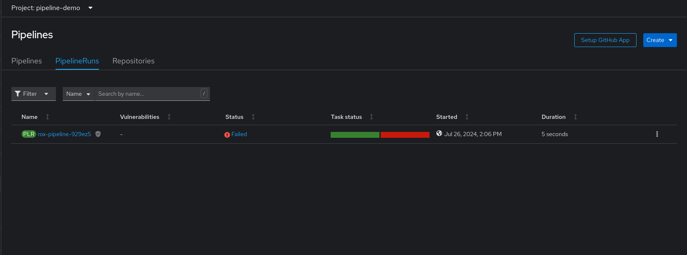
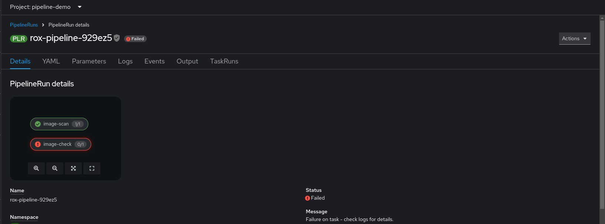
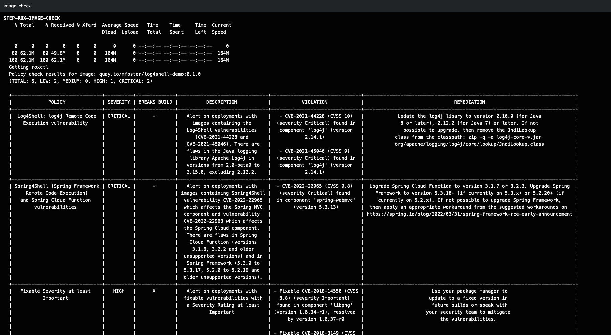

= DevSecOps and Policy Enforcement with Red Hat Advanced Cluster Security (4.5 Draft)

== Using OpenShift Pipelines to Automate Red Hat Advanced Cluster Security for Kubernetes

=== Introduction

This workshop will discuss how OpenShift Pipelines, based on the Tekton open source project, can be used to automate the execution of Red Hat Advanced Cluster Security for Kubernetes as part of a more comprehensive continuous integration solution. The objective is to bring into the continuous integration process the validation of Kubernetes resources such that any violations against defined policy can be addressed earlier in the development life cycle. 

== Pipeline Requirements and Necessary Features

=== RHACS Command Line Interface

Red Hat Advanced Cluster Security for Kubernetes has a command line interface (roxctl) for evaluating images and resources against policy definitions held on the RHACS server. The command line interface may be downloaded from the RHACS web user interface for ad-hoc use, and in the automation steps presented here, roxctl is downloaded from the RHACS server during each execution of the analysis. This ensures that the correct version matching the server is always used.

=== roxctl Analysis Options

The roxctl command line interface has several options for resource and image analysis. Of particular interest in this blog is the "deployment" option, which is traditionally used to check for deployment readiness of Kubernetes resources. By using this option during the build phase of development, teams can get a much earlier indication of deployment issues rather than waiting until deployment time. This enables teams to fix the problems during development, lowering costs and leading to smoother deployments.


=== Continuous Integration and roxctl Process

The CI process in the example below takes advantage of the tasks, skeleton pipeline, and pipeline run resources that users can build into their own wider OpenShift Pipelines process. The resources and their interaction are shown in figure 1:

image::images/acs-images/tekton-1.png[]

_Figure 1: OpenShift Pipeline process_ +

=== Pipeline Run Resource

The OpenShift Pipelines "pipeline run" resource calls the pipeline resource, passing with it the required parameters. Some of the parameters are highlighted in figure 1 above, and all are described in the table below. The pipeline run defines a workspace on a 10 Mb persistent volume claim called "files," to which the source assets are cloned, and the results files are written. If you wish to add the tasks described here to an existing OpenShift Pipelines process, add the parameter definitions and the workspace volume to your existing pipeline run.

|===
|Parameter|Description|Used by task

|acs_central_endpoint|The name of a secret that contains the URL of the RHACS central server.|Resource deployment check
|acs_api_token|The name of a secret that contains the access token generated within the RHACS web user interface. This is a continuous integration access token as described https://help-internal.stackrox.com/docs/integrate-with-other-tools/integrate-with-ci-systems/#configure-access[here].|Resource deployment check
|The above two parameters can reference a single secret containing both data items.||
|git-url|The URL of the GitHub repository that contains the resources to be validated.|Git clone workspace
|git-revision|The identifier to be used to check out the content. (branch, tag, sha, ref…)|Git clone workspace
|file-location-in-git-repo|The directory containing the resources to be examined.|Resource deployment check
|recursive-search|If 'true,' the above path will be searched recursively for all files with the extension yaml or yml.|Resource deployment check
|===

=== Pipeline Resource

The OpenShift Pipelines "pipeline" resource in the GitHub repository mentioned above orchestrates the execution of the tasks and the passing of parameters between tasks. Further information on the pipeline use is given in the section "Making a decision based on the scan result."

== Workshop Setup

=== Deploy the Pipeline Assets

The assets described below are available in a public GitHub repository https://github.com/mfosterrox/demo.git. To deploy the assets, run the following:

|===
NOTE: Skip the *git clone* command if you have the existing folder ready, But you will need to the commands after to ensure all of the resources are available. 
|===

[source,bash,role="execute"]
----
git clone https://github.com/openshiftdemos/openshift-ops-workshops acs-workshop
----

[source,bash,role="execute"]
----
export TUTORIAL_HOME="$(pwd)/acs-workshop"
kubectl apply -f $TUTORIAL_HOME/workshop/demo-apps/configuration --recursive
kubectl apply -f $TUTORIAL_HOME/workshop/demo-apps/ --recursive
----

|===
*NOTE* This command applies a plethora of manifests to your environment. The important part is that the deployments are up and running. The

Run the following command and ensure that the applications are up and running
|===

[source,bash,role="execute"]
----
kubectl get deployments -l demo=acs -A
----

*Output*
```bash
NAMESPACE      NAME               READY   UP-TO-DATE   AVAILABLE   AGE
backend        api-server         1/1     1            1           0d
frontend       asset-cache        1/1     1            1           0d
log4shell      log4shell-app      3/3     3            3           0d
medical        reporting          1/1     1            1           0d
operations     jump-host          1/1     1            1           0d
payments       visa-processor     1/1     1            1           0d
spring4shell   spring4shell-app   3/3     3            3           0d
```

==== Image Scan Pod Task

The first of two tasks in the pipeline is the *image scan test* task. The task starts by asking the user for an image to scan. Next, the roxctl CLI will send this information to central and ask for an analysis. ACS Central will send back all the fixable and nonfixable vulnerabilities associated with the image. The *image scan* file will show you the necessary variables, the steps required to complete the scan, and the script itself. 

To see the *image scan* task, run the following on the command line;

[source,bash,role="execute"]
----
cat $TUTORIAL_HOME/workshop/demo-apps/pipelines/tasks/rox-image-scan-task.yml 
----

After the scan is completed, we must check if the container violates specific policies.

==== Image Check Test Task

The *image check test* will tell ACS central to check the scanned image against the policies enabled in ACS. The file is extremely similar to the *image scan test* with the roxctl command being the main difference in the file.

To see the *image check* task, run the following on the command line;

[source,bash,role="execute"]
----
cat $TUTORIAL_HOME/workshop/demo-apps/pipelines/tasks/rox-image-check-task.yml 
----

Two variables are missing in both files: the *ROX_CENTRAL_ENDPOINT* and the *ROX_API_TOKEN*. Any automated check need to be given the correct access so that the pipeline, and cluster, cannot be breached by an external source. 

In the next step, access will be granted to the pipeline to be able to run these commands. 

=== Authorizing the CI Process

First, we will need to create a token to access ACS central. 

Access the RHACS web user interface, select "Platform Configuration" from the left-hand side menu, and then select integrations. Scroll down to the section for authentication tokens and select "StackRox API Token." 

image::images/acs-images/ci-1.gif[]

Press the *Generate Token* button in the top right corner and select the token role of "Continuous Integration." Give the token a name and press the button titled "Generate".

* Create a token name and click the 'Continuous Integration' role.

* Make sure to copy the token as we need to add it to the *rox-secrets.yml* file.

* Next, edit the *rox-secrets.yml* file in the demo directory. Use *vi/vim/nano/your favorite command line editor* to add the API token to the following file.

----
$TUTORIAL_HOME/workshop/demo-apps/pipelines/pipeline/rox-secrets.yml 
----

|===
NOTE: make sure to only alter the line that says *rox_api_token: "YOUR_API_TOKEN_HERE"*
|===

Then apply the changes.

[source,bash,role="execute"]
----
kubectl apply -f $TUTORIAL_HOME/workshop/demo-apps/pipelines/pipeline/rox-secrets.yml 
----

|===
NOTE: If you’re unfamiliar with text editors, you can also edit this via the OpenShift console. Go to Workloads -> Secrets, click on ‘roxsecrets’, switch to the YAML tab and make your changes there and save them.
|===

You are now ready to run your pipeline!

== Executing the Pipeline

First, head to the OpenShift console to execute the pipeline. Then click on the *Pipelines* tab to select the *Pipelines* dropdown.


You should see a pipeline labeled *rox-pipeline*. Let's run one.

To run a pipeline, you can click the three dots to the left of the pipeline and click *start*, OR you can click on the *rox-pipeline* to be brought to a details page where you can select *actions -> start* 

* You will need to add the image you wish to scan (quay.io/mfoster/log4shell-demo:0.1.0). In this case, we want to look at the image we know has the log4shell vulnerability.

* Click start and ensure that the pipeline is in its running phase.

image::images/acs-images/pipeline-1.gif[]

Since this image is designed to fail, we should only have 1 of the tasks pass. Therefore the outcome will look like the following. 





From the image above, the log snippet shows that 5 policies have been violated. 

* Click on the *Logs* tab to view the total output of the pipeline.

If you expand the log snippet, you will get an output like the following.



Congratulations! The log shows that the policy log4shell policy has been violated, breaking the pipeline.

If this check was added to other builds/deploy pipelines, it could halt the deployment of vulnerable apps moving forward. 

== Extra Challenge

Suppose you are looking for a challenge. Try the following.

Create a policy that will target a specific CVE deployed in the cluster (i.e., the Apache Struts violation=CVE-2013-1965) and run the pipeline again with a new container to see if the policy is triggered.

|===
*Hint:* Find a container with a critical vulnerability first, create the policy, and alter the pipeline.
|===


