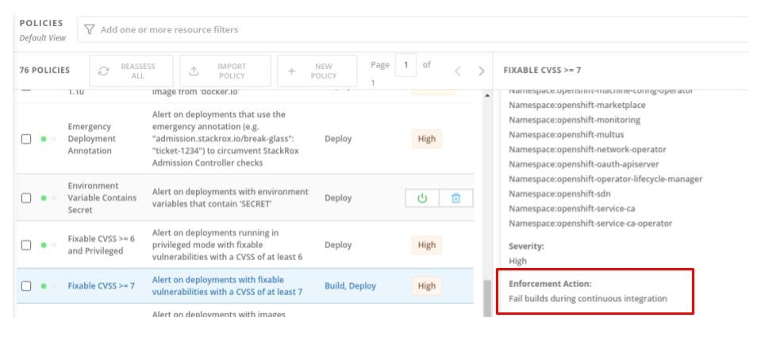
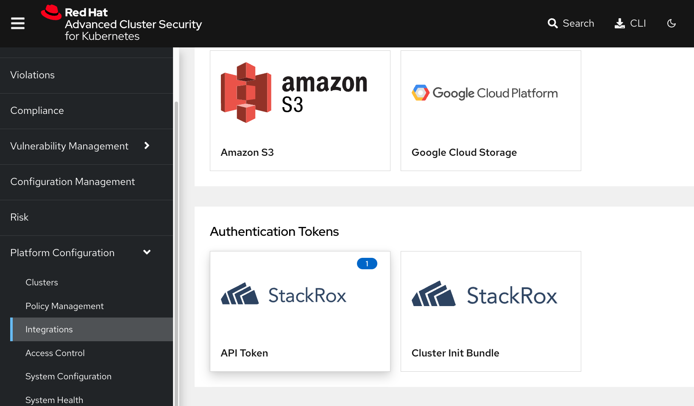
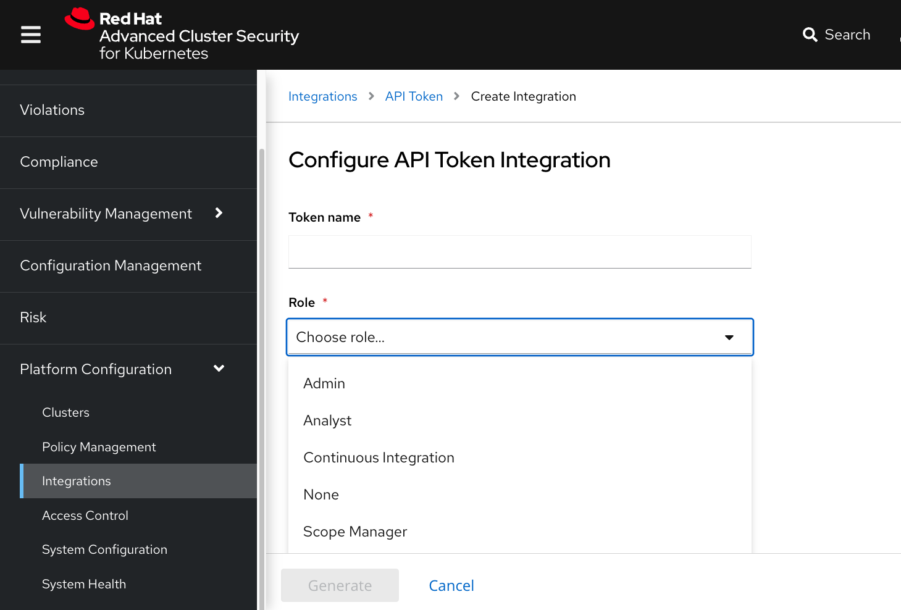
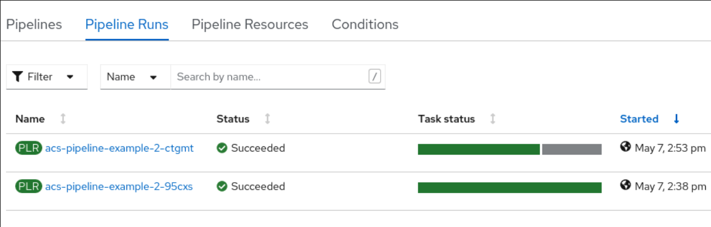
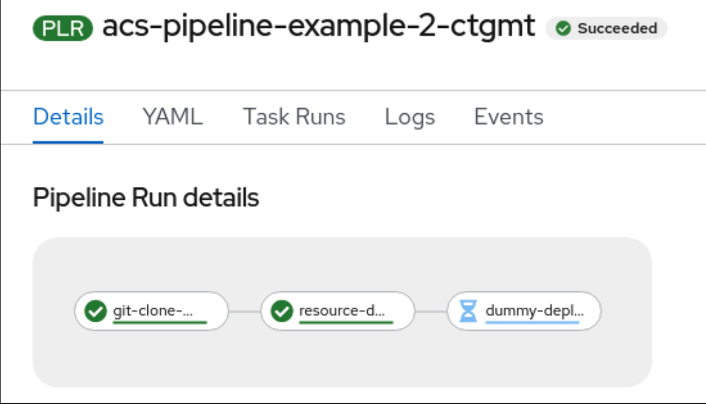

= DevSecOps and Policy Enforcement with Red Hat Advanced Cluster Security

== Using OpenShift Pipelines to Automate Red Hat Advanced Cluster Security for Kubernetes

=== Introduction

This article shows how OpenShift Pipelines, based on the Tekton open source project, can be used to automate the execution of Red Hat Advanced Cluster Security for Kubernetes as part of a wider continuous integration solution. The objective is to bring into the continuous integration process the validation of Kubernetes resources such that any violations against defined policy can be addressed earlier in the development life cycle. +
Red Hat Advanced Cluster Security for Kubernetes (RHACS) is based on the products of StackRox which was acquired by Red Hat in 2021. RHACS provides a comprehensive solution for the following areas:

* The analysis of container images and Kubernetes resources for vulnerabilities and miss-configuration issues.
* The analysis of the Kubernetes cluster for configuration issues and permission exposures to ensure the platform has an acceptable security posture.
* The identification and prioritization of risk to enable teams to focus on the most important issues first.
* The management of policies based on industry standard compliance requirements including  CIS Benchmarks, PCI, HIPAA, and NIST SP 800-190 and SP 800-53.
* The management of network communication within and outside the project or namespace.
* The identification of baseline application behavior which enables anomalous behaviors to be identified.
RHACS is able to analyze application deployment files in yaml format against the policies held within the product. This enables teams to “shift left” the analysis activity and ensure that it is performed at the build phase of the CI process. Teams can define the policies to identify the container image issues or resource misconfigurations that they wish to ensure do not make it past the development stage. There are many advantages to this approach. The “shift left” strategy ensures that defects are removed close to when they are introduced and are therefore fresh in the minds of the developer. There is also a cost benefit to fixing defects early in the development cycle. If the phase of creating Kubernetes resources is aligned to the code development phase, then a study by IBM shows that fixing the issue in the development test phase costs around 4 times as much as fixing it at the code development stage. The costs escalate further to 7 times the development cost if found in acceptance testing and up to 100 times the cost if found in operational use. Of course, there are also the tangible and intangible costs associated with a potential data leak due to regulatory fines and reputational damage. Clearly, assessing the quality of the image supply chain and the assets used to configure an application on a Kubernetes platform is critical. The earlier this is done in the software development process and the more integrated that process becomes with the day-to-day continuous integration processes the better.

=== RHACS Command Line Interface

Red Hat Advanced Cluster Security for Kubernetes has a command line interface (roxctl) for the evaluation of images and resources against policy definitions held on the RHACS server. The command line interface may be downloaded from the RHACS web user interface for ad-hoc use, and in the automation steps presented here, roxctl is downloaded from the RHACS server during each execution of the analysis. This ensures that the correct version matching the server is always used.

=== Roxctl Analysis Options

The roxctl command line interface has a number of options for resource and image analysis. Of particular interest in this blog is the “deployment” option, which traditionally is used to check for deployment readiness of Kubernetes resources. By using this option during the build phase of development, teams can get a much earlier indication of deployment issues rather than waiting until deployment time. This enables teams to fix the problems during development, which will lower costs and lead to smoother deployments.

==== Access to Pipeline Assets

The assets described below are available in the public GitHub repository https://github.com/marrober/acs-automation.git[here]. The relevant files are in the directory ci/OpenShift-Pipelines. EIther clone or fork the GitHub repository to get access to the files, or simply browse to the location and view the files.

=== Continuous Integration and Roxctl Process

The CI process used in the example below takes advantage of the tasks and skeleton pipeline and pipeline run resources that users can build into their own wider OpenShift Pipelines process. The resources and their interaction are shown in figure 1:

image::images/acs-tekton.png[]

_Figure 1 : OpenShift Pipeline process_ +
The process shown in figure 1 is explained in detail in the following sections.

==== Pipeline Run Resource

The OpenShift Pipelines “pipeline run” resource calls the pipeline resource passing with it the parameters that are required. Some of the parameters are highlighted in figure 1 above, and all are described in the table below. The pipeline run defines a workspace on a 10 Mb persistent volume claim called “files” to which the source assets are cloned and the results files are written. If you wish to add the tasks described here to an existing OpenShift Pipelines process, then add the parameter definitions and the workspace volume to your existing pipeline run.
|===
|Parameter|Description|Used by task

|acs_central_endpoint|The name of a secret that contains the url of the RHACS central server.|Resource deployment check
|acs_api_token|The name of a secret that contains the access token generated within the RHACS web user interface. This is a continuous integration access token as described https://help-internal.stackrox.com/docs/integrate-with-other-tools/integrate-with-ci-systems/#configure-access[here].|Resource deployment check
|The above two parameters can reference a single secret that contains both items of data.||
|git-url|The url of the GitHub repository that contains the resources that are to be validated.|Git clone workspace
|git-revision|The identifier to be used to checkout the content. (branch, tag, sha, ref…)|Git clone workspace
|file-location-in-git-repo|The directory containing the resources to be examined.|Resource deployment check
|recursive-search|If ‘true’ the above path will be searched recursively for all files with the extension yaml or yml.|Resource deployment check
|===

=== Pipeline Resource

The OpenShift Pipelines “pipeline” resource in the above-mentioned GitHub repository orchestrates the execution of the tasks and the passing of parameters between tasks. Further information on the use of the pipeline is given in the section “Making a decision based on scan result.”

=== Tasks

==== GIT CLONE TASK

The OpenShift Pipelines cluster task called “git-clone” is used to clone the resources under investigation. The cluster task requires the parameters “url” and “revision” to be supplied, with other parameters described in the task documentation being optional. The task also requires a workspace called “output” onto which the content will be cloned. The workspace called “files” created by the pipeline run resource is passed to the task under the name “output.”

==== RESOURCE DEPLOYMENT CHECK TASK

The task called “resource-deployment-check” has one step that performs the roxctl analysis of the resources under investigation. A result file is created for each file analyzed which has the same name as the file under test with the addition of the extension .scan-result. The content of this file is the roxctl json format output, which is described below in an abbreviated manner:

image::images/json.png[]

In the above example alert 0 has an enforcement action to fail the build and alert 1 does not. More information is given on this area in the next section. +
The script in the task first identifies and reports the number of alerts that have been raised against the file from the json object .alerts[]. For each alert the script then examines the value of the parameter .alerts[x].policy.enforcementActions[], to see whether the policy has an enforcement action of FAIL_BUILD_ENFORCEMENT. If there is such a parameter, then a flag is set to report that the overall result of the scan process is a ‘‘fail.” +
The script then gathers further information on the name of the policy within the alert from the json content .alerts[x].policy.name and it gets a list of the violations from the json content .alerts[x].violations[y].message. +
The task has an output parameter called scan-result into which a value is written based on the overall result of the scans. The definition of this parameter is shown below: +
----
 results:
   - name: scan-result
----
For some files there will be no violations at all; for others, there will be violations that do not fail the build, but if the script finds any violations that should halt the build process, then the task output parameter scan-result is set to “fail.” If there are no violations or if the violations are not considered enough to halt a build process, then scan-result will have a value of “pass.”

=== Policy Enforcement in RHACS

The json output for the roxctl scans may include an enforcementAction as described above. This is set as a property on the policy as shown in the RHACS system policies in figure 2. The policy for “Fixable CVSS >= 7” is a build and deployment policy that is configured to fail builds during continuous integration.

_Figure 2: Fixable CVSS>= 7 policy._ +
The policy “Latest tag” is also a build time policy, but this will not fail builds during continuous integration processes as indicated in the policy editor section of RHACS shown in figure 3. This should  be considered to be a warning policy rather than a strict enforcement. Each organization can create and delete policies and set the enforcement behavior on each policy as required.

image::images/acs-tekton-2.png[]

_Figure 3: Policy editor for the “Latest Tag” policy._

==== Making a Decision Based on Scan Result

The pipeline example in the GitHub repository shows how the output of the scan result can be used to control further progression of the pipeline. If the scan assessment fails, then it is possible to stop subsequent tasks from being executed. This requires the use of the “when” clause of a pipeline task definition. Earlier implementations of Tekton offered “conditions” to control task progress, but that has now been deprecated in favor of the “when” clause.

A section of the pipeline example is shown below: +
----
##------------------------------------------------------------------
# Perform resource deployment check on files of interest
##------------------------------------------------------------------         
- name: resource-deployment-check
  params:
  - name: acs_central_endpoint
    value: $(params.acs_central_endpoint)
  - name: acs_api_token
    value: $(params.acs_api_token)
  - name: source_location
    value: $(params.file-location-in-git-repo)
  - name: recursive-search
    value: $(params.recursive-search)
  taskRef:
    kind: Task
    name: acs-deployment-check
  workspaces:
  - name: files
    workspace: files
  runAfter:
  - git-clone-workspace
##------------------------------------------------------------------
# Dummy deploy phase - only do this if all resource checks are clean
##------------------------------------------------------------------         
- name: dummy-deploy-phase
  taskRef:
    kind: Task
    name: deploy
  when:
  - input: "$(tasks.resource-deployment-check.results.scan-result)"
    operator: in
    values:
    - "pass"
  runAfter:
  - resource-deployment-check
----
The “when” clause takes an input property with the format:
---
$(tasks.<task-generating-result>.results.<result-name>)
---
In the definition of the task called “resource-deployment-check,” the result file is constructed using the -n option on the echo command. This avoids the default behavior of the inclusion of a new line character that would cause the failure of the comparison in the “when” clause.

=== Example Use of CI Process

The process for getting access to the example files used in this article is described in the section “Access to pipeline assets" above. To create the scenario perform the following steps:

==== Steps

- Install the OpenShift Pipelines operator on the OpenShift cluster.
- Clone the GitHub repository located https://github.com/marrober/acs-automation.git[here].
----
git clone https://github.com/marrober/acs-automation rhacs-pipeline
----
- Create a new project. You can select your own or use the default 'rox-ctl-pipeline'
----
oc new-project rox-ctl-pipeline
----
- Create the tasks:
----
oc apply -f rhacs-pipeline/ci/OpenShift-Pipelines/Tasks/
----
- Create the pipeline:
----
oc apply -f rhacs-pipeline/ci/OpenShift-Pipelines/Pipeline/
----
- Create a token for access to RHACS central. Open the RHACS web user interface and select “Platform Configuration” from the left-hand side menu, then select integrations. Scroll down to the section for authentication tokens and select “StackRox API Token.” Press the + sign in the top right corner and select the token role of “Continuous Integration.” Give the token a name and press the green button marked “Generate.” Press the green copy symbol and create a token for the pipeline. 

Create a token name and click the 'Continous Integration' role

----
oc create secret generic acs-secret \
--from-literal=acs_api_token=<token from above step> \
--from-literal=acs_central_endpoint=<url-for-rhacs-central-server>:443
----

|===
|The URL that you put into the above command does not have http:// or https:// on the front of it.
|===

- Execute the pipeline:
----
oc create -f rhacs-pipeline/ci/OpenShift-Pipelines/PipelineRun/
----

The pipeline run instance name will be displayed. You can observe the progress of the pipeline run in the OpenShift web user interface by selecting the project, then selecting the developer perspective on the left-hand side, and then selecting the Pipelines menu on the left. This will display the single pipeline called config-validation. Select this and then select Pipeline Runs from the sub menu. Select the running pipeline to see progress. +
It is also possible to see the consolidated log of progress using the command: +

----
tkn pipelinerun logs <pipeline-run-instance-name>
----

The above command will display something similar to that which is shown in figure 4: +

----
[git-clone-workspace : clone] {"level":"info","msg":"Successfully cloned https://github.com/marrober/contributions.git @ 646a89a1d044f21f9bc28179dde107e4a013bcbf (grafted, HEAD, origin/main) in path /workspace/output/"}
[git-clone-workspace : clone] {"level":"info","msg":"Successfully initialized and updated submodules in path /workspace/output/"}
[resource-deployment-check : rox-deployment-check] Getting roxctl
[resource-deployment-check : rox-deployment-check] Deployment check on file : /files/ci/Tekton/Scenario2/assets-for-validation/namespace.yaml
[resource-deployment-check : rox-deployment-check] -- No errors found in this file --
[resource-deployment-check : rox-deployment-check] Setting overall result to pass
[dummy-deploy-phase : dummy-deploy-phase] dummy deploy phase ....
----

_Figure 4: Successful deployment because all files pass the RHACS validation._

The OpenShift web user interface will display that the pipeline run has been completed as shown in figure 5. 

image::images/acs-tekton-3.png[]

The green bar extends across the full extent of the task status section showing all tasks have been completed and the pipeline run has a status of Succeeded.

image::images/acs-tekton-4.png[]

_Figure 5: Successful completion of all steps of the pipeline run._

==== Showing a Resource Check Failure

At this point, the pipeline run has the settings:

----
 - name: recursive-search
  value: "false"
----

Edit the file 
----
rhacs-pipeline/ci/OpenShift-Pipelines/PipelineRun/acs-pipelineRun.yaml
---- 
and switch the above value to "true". 

This will cause three more files to be analyzed in a subdirectory, two of which have errors. Execute the pipeline run again using the command:

----
oc create -f rhacs-pipeline/ci/OpenShift-Pipelines/PipelineRun/
----

When the pipeline run completes, you will see a difference compared to the result shown previously. In figure 6, the green bar on the most recent deployment does not extend across the full extent of the task status section indicating that not all tasks have been completed. The pipeline run still has a status of Succeeded indicating that it has reached a successful conclusion in which it has elected not to run some of the tasks.

_Figure 6: Partial completion of the pipeline._ +
The pipeline run details for the task ending ctgmt shows that the dummy deployment task has not been executed as indicated in figure 7.

_Figure 7: Dummy deployment talk not completed._

Looking closer at the detail of the tasks in the pipeline, and examining the output of the “resource-deployment-check” task shows that more files have been examined as shown in figure 8.

image::images/tekton-3.png[]

_Figure 8: Deployment check information showing some clean files and some with violations._ +

The details of the violation information is shown in figure 9, including the content that shows which files have violations, whether the build will be halted, and the specific violation information. The headers in square brackets from Tekton have been abbreviated and additional color and bold have been added to aid readability. +

----
[rdc] Getting roxctl
[rdc] Deployment check on file :
        /files/ci/Tekton/Scenario2/assets-for-validation/namespace.yaml
[rdc] -- No errors found in this file --
[rdc] Deployment check on file :
/files/ci/Tekton/Scenario2/assets-for-validation/layer1/layer1-service.yaml
[rdc] -- No errors found in this file --
[rdc] Deployment check on file :
/files/ci/Tekton/Scenario2/assets-for-validation/layer1/pod.yml
[rdc] 2 alerts found ...
[rdc] Alert policy name : Fixable CVSS >= 7
[rdc] -- Build will be halted --
[rdc] - - - - - - - - - - - - - - - - - - - - - - - - - -
[rdc] 2 violations found ...
[rdc] violation : -- Fixable CVE-2021-28831 (CVSS 7.5) found in component 'busybox' (version 1.32.1-r3) in container 'app-container', resolved by version 1.32.1-r4
[rdc] violation : -- Fixable CVE-2021-30139 (CVSS 7.5) found in component 'apk-tools' (version 2.12.1-r0) in container 'app-container', resolved by version 2.12.5-r0
[rdc] -  -  -  -  -  -  -  -  -  -  -  -  -  -  -  -  -
[rdc] Alert policy name : Docker CIS 4.1: Ensure That a User for the Container Has Been Created
[rdc] -- Policy violations will not stop the build process --
[rdc] - - - - - - - - - - - - - - - - - - - - - - - - - -
[rdc] 1 violation found ...
[rdc] violation : -- Container 'app-container' has image with user 'root'
[rdc] -  -  -  -  -  -  -  -  -  -  -  -  -  -  -  -  -
[rdc] -----------------------------------------------------
[rdc] Deployment check on file : /files/ci/Tekton/Scenario2/assets-for-validation/layer1/layer1.yaml
[rdc] 3 alerts found ...
[rdc] Alert policy name : Latest tag
[rdc] -- Policy violations will not stop the build process --
[rdc] - - - - - - - - - - - - - - - - - - - - - - - - - -
[rdc] 1 violation found ...
[rdc] violation : -- Container 'layer1' has image with tag 'latest'
[rdc] -  -  -  -  -  -  -  -  -  -  -  -  -  -  -  -  -
[rdc] Alert policy name : Fixable CVSS >= 7
[rdc] -- Build will be halted --
[rdc] - - - - - - - - - - - - - - - - - - - - - - - - - -
[rdc] 11 violations found ...
[rdc] violation : -- Fixable CVE-2020-25648 (CVSS 7.5) found in component 'nss' ...
[rdc] violation : -- Fixable CVE-2020-25648 (CVSS 7.5) found in ...
[rdc] -  -  -  -  -  -  -  -  -  -  -  -  -  -  -  -  -
[rdc] Alert policy name : No resource requests or limits specified
[rdc] -- Policy violations will not stop the build process --
[rdc] - - - - - - - - - - - - - - - - - - - - - - - - - -
[rdc] 4 violations found ...
[rdc] violation : -- CPU limit set to 0 cores for container 'layer1'
[rdc] violation : -- CPU request set to 0 cores for container 'layer1'
[rdc] violation : -- Memory limit set to 0 MB for container 'layer1'
[rdc] violation : -- Memory request set to 0 MB for container 'layer1'
[rdc] -  -  -  -  -  -  -  -  -  -  -  -  -  -  -  -  -
[rdc] -----------------------------------------------------
[rdc] Setting overall result to fail
----
_Figure 9: Output from the deployment check with violations._

=== Summary

The process shown in this article is a simple way to include the execution of the roxctl policy scanner for resources as part of a continuous integration process. This is a quick way to “shift left” the resource analysis and to bring good practices for writing application resources to the attention of developers. Highlighting and fixing issues earlier in the development process will reduce cost and rework and lead to more reliable and secure applications. +
The content presented in this article is open for anyone to use and modify to suit their specific needs. +
If you have specific requirements for what you would like this process to accomplish then please get in touch.

