= Vulnerability Management in Kubernetes with Red Hat Advanced Cluster Security

== Goal of the Workshop

This 30-minute session aims to get accustomed to identifying vulnerabilities in Kubernetes using the ACS dashboard. The session will discuss what makes particular vulnerabilities different and how to effectively implement controls in a Kubernetes cluster.

This workshop will focus on the log4shell export. However, multiple applications will be deployed in this use case. If you have time in the end, please explore the interface to see if you can find more security features that may help your use cases.

== Red Hat Advanced Cluster Security for Kubernetes Basics

Red Hat Advanced Cluster Security for Kubernetes (Red Hat Advanced Cluster Security or ACS for short) provides the tools and capabilities to address the security needs of a cloud-native development approach on Kubernetes.

The ACS solution offers visibility into the security of your cluster, vulnerability management, and security compliance through auditing, network segmentation awareness and configuration, security risk profiling, security-related configuration management, threat detection, and incident response. In addition, ACS grants an ability to pull the actions from that tooling deep into the application code development process through APIs.

These security features represent any developer or administrator's primary work as they work across various environments, including multiple datacenters, private clouds, or public clouds that run Kubernetes clusters.

=== ACS Features

Using Red Hat Advanced Cluster Security for Kubernetes, you can gain comprehensive Kubernetes security that includes the following use cases:

* Visibility: See your entire landscape of images, registries, containers, deployments, and runtime behavior.
* Vulnerability Management: Identify and remediate vulnerabilities in container images and Kubernetes across the entire software development life cycle.
* Compliance: Audit your systems against CIS Benchmarks, NIST, PCI, and HIPAA, with interactive dashboards and one-click audit reports.
* Network Segmentation: Visualize existing connections and enforce tighter segmentation using Kubernetes-native controls to reduce your blast radius.
* Risk Profiling: See all your deployments ranked by risk level, using context from Kubernetes' declarative data, to prioritize remediation.
* Configuration Management: Apply best practices for Docker and Kubernetes to harden your environment for a more secure and stable application.
* Threat Detection: Use rules, automated allow lists, and baselining to identify suspicious activity in your running applications accurately.
Incident Response: Take action, from failing builds and blocking deployments to killing pods and thwarting attacks, using Kubernetes for enforcement.

=== ACS Architecture

The ACS Platform installs as a set of pods in your Kubernetes or OpenShift cluster and includes the following components:


image::images/acs-images/acs-2-2.png[]

* https://docs.openshift.com/acs/architecture/acs-architecture.html#centralized-components_acs-architecture[Central]: [Centralized components] Central is the main component of Red Hat Advanced Cluster Security for Kubernetes, and it is installed as a Kubernetes deployment. It handles data persistence, API interactions, and user interface (Portal) access. You can use the same Central instance to secure multiple OpenShift Container Platform or Kubernetes clusters.
* https://docs.openshift.com/acs/architecture/acs-architecture.html#centralized-components_acs-architecture[Scanner]: [Centralized component] Red Hat Advanced Cluster Security for Kubernetes includes an image vulnerability scanning component called Scanner. It analyzes all image layers to check for known vulnerabilities from the Common Vulnerabilities and Exposures (CVEs) list. The Scanner also identifies vulnerabilities in package managers' packages and dependencies for multiple programming languages.
* https://docs.openshift.com/acs/architecture/acs-architecture.html#per-cluster-components_acs-architecture[Sensor]: [1 x Per Cluster] Red Hat Advanced Cluster Security for Kubernetes uses the Sensor component to monitor Kubernetes and OpenShift Container Platform clusters. It handles interactions with the OpenShift Container Platform or Kubernetes API server for policy detection and enforcement, and it coordinates with Collector.
* https://docs.openshift.com/acs/architecture/acs-architecture.html#per-cluster-components_acs-architecture[Admission controller]: [1 x Cluster] The admission controller prevents users from creating workloads that violate security policies in Red Hat Advanced Cluster Security for Kubernetes. [1 x Admission Controller]
* https://redhat-scholars.github.io/acs-workshop/acs-workshop/03-overview-acs.html#acs_architecture[Collector]: [1 x Node OCP/K8s Nodes] Collector collects and monitors information about container runtime and network activity. It then sends the collected information to Sensor.

|===
Scanner only scans those images not already scanned by other integrated vulnerability scanners. It means that if you have integrated Red Hat Advanced Cluster Security for Kubernetes with other vulnerability scanners, Scanner checks and uses the scanning results from the integrated Scanner if available.
|===

== Workshop Setup

=== Deploying Demo Application Sources - MANDATORY

In order to have the applications and vulnerabilities necessary for the demo, we need to introduce a few vulnerable applications into the cluster.

The command below will clone the tutorial sources and set the *TUTORIAL_HOME* environment variable to point to the root directory of the tutorial and deploy the applications:

[source,bash,role="execute"]
----
git clone https://github.com/openshiftdemos/openshift-ops-workshops acs-workshop
export TUTORIAL_HOME="$(pwd)/acs-workshop"
kubectl apply -f $TUTORIAL_HOME/workshop/demo-apps/configuration --recursive
kubectl apply -f $TUTORIAL_HOME/workshop/demo-apps/ --recursive
----

|===
*NOTE* This command applies a plethora of manifests to your environment. The important part is that the deployments are up and running.

Run the following command and ensure that the applications are up and running
|===

[source,bash,role="execute"]
----
kubectl get deployments -l demo=acs -A
----

*Output*
```bash
NAMESPACE      NAME               READY   UP-TO-DATE   AVAILABLE   AGE
backend        api-server         1/1     1            1           0d
frontend       asset-cache        1/1     1            1           0d
log4shell      log4shell-app      3/3     3            3           0d
medical        reporting          1/1     1            1           0d
operations     jump-host          1/1     1            1           0d
payments       visa-processor     1/1     1            1           0d
spring4shell   spring4shell-app   3/3     3            3           0d
```

=== Accessing the ACS Dashboard

The ACS password will be necessary to access the dashboard. The information to access the ACS dashboard is found on the main access page of the demo.

|===
*NOTE* You will get a warning page that the webpage is not private. During setup, ACS can utilize your certification server to avoid these errors. 

It is also best practice to integrate the application with your authentication server. 
|===

image::images/acs-images/webpage-warning.png[]

== Working in the ACS Dashboard

When logging into ACS, you will be redirected to the dashboard's main view.

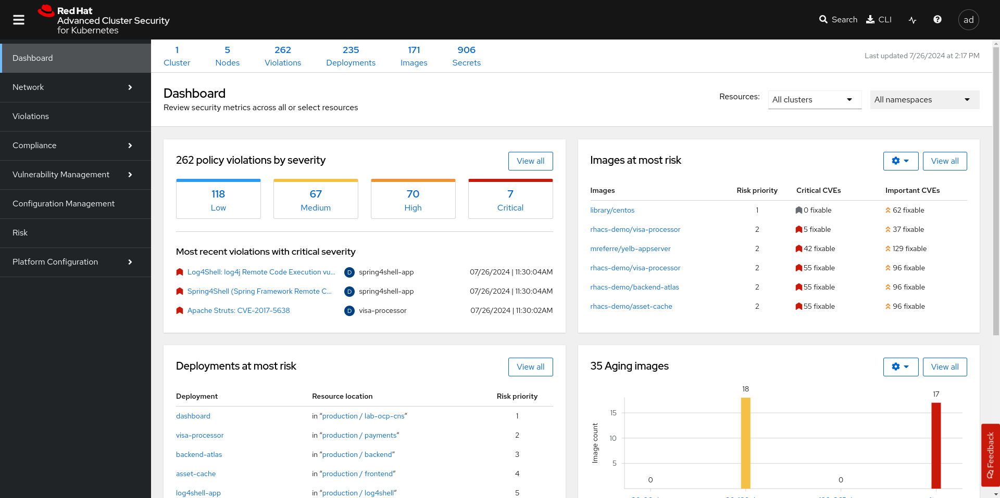

This central view will display a high-level view of the information about the Kubernetes clusters. It is essential to understand the primary components to navigate it effectively.

In the ACS Dashboard, we have three main sections:

* The header
* The menu
* The information

=== Dashboard Header

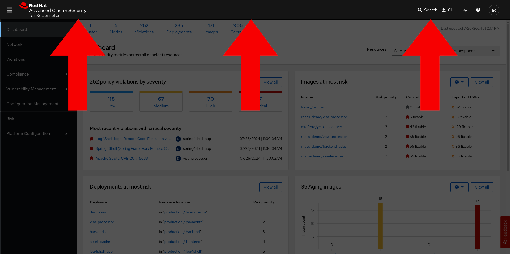

The header contains the following (from left to right):

* The drop-down menu
* The search bar
* The roxctl CLI
* Light or dark mode
* Cluster status and problems
* Help bar
* User information

=== Dashboard Left Menu

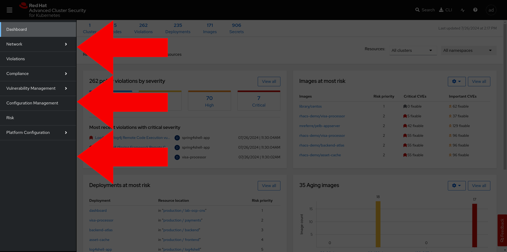

In the left part of the dashboard, we can see the different sections we can access in ACS to gather information about the security in the clusters we have configured in ACS. Later we will go deeper into a few of them. For the time being, we will introduce each of these:

* Dashboard: where we are at this moment. We can get a summary vision of our environment.
* Network Graph: we can get information about the configured network flows and the real ones. We can use it to create Network Policies to implement network segmentation.
* Violations: we can get all the events that do not match the defined security policies.
* Compliance: we can get compliance with our environment according to several industries and regulatory security standards such as PCI DSS.
* Vulnerability Management (2): includes Workload CVEs currently in tech preview, you can prioritize and manage scanned CVEs across images and deployments, enhancing your ability to secure your environment.
* Vulnerability Management (1): get information about known vulnerabilities affecting your environment. Not only deployed workloads but infrastructure as well.
* Configuration Management: review configuration to prevent possible misconfigurations which can lead to security issues.
* Risk: review risks affecting your environment, such as suspicious executions.
* Platform Configuration: ACS configuration and integrations.

|===
*NOTE:* Please explore the application if you have time between the sessions. Some extra containers and apps are deployed in the cluster if you wish to find more vulnerabilities and policy violations.
|===

=== Dashboard Information

The main dashboard gives us a summary of the security state of the whole environment. 

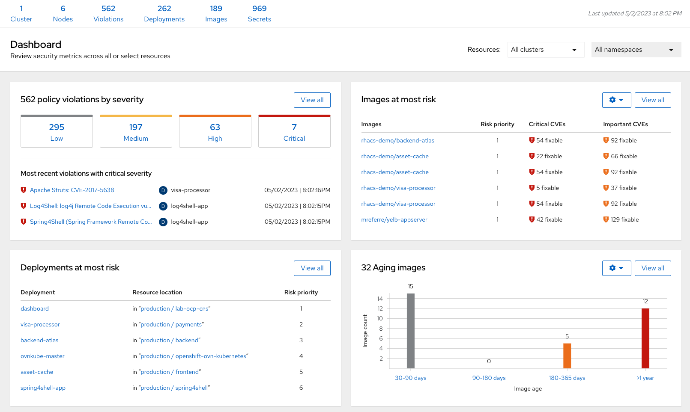

Including information by:

* Cluster
* Node
* Violation
* Deployments
* Images 
* Secrets

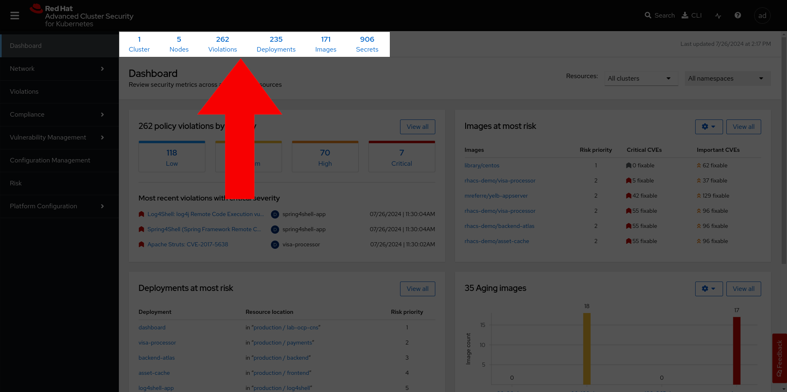

Each tab at the top can be clicked to see more. 

|===
If you have extra time, alter and click through the individual dashboard panels. They will take you to other sections of the ACS dashboard with the filters already applied. 
|===

== Vulnerability Management Dashboard

Let us start with Vulnerability Management, a familiar topic for most security teams. Click the *Vulnerability Management (1.0)* tab, and then select *Dashboard*

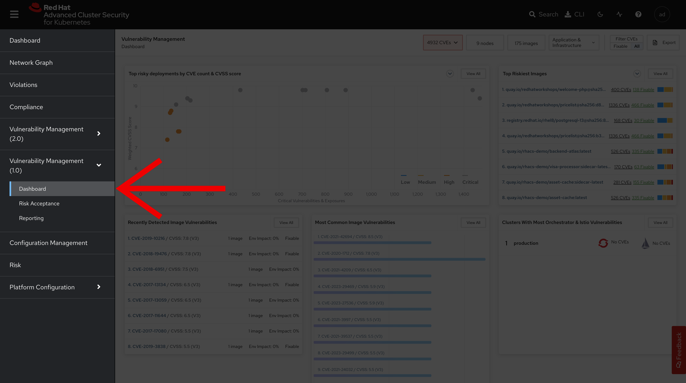

The overview provides several important reports - where the vulnerabilities are, the most widespread or the most recent, where Docker images are coming from, and important vulnerabilities in the cluster itself.

|===
*NOTE:* the locations and size of your panels may vary depending on your screen size and zoom. The pictures below will help to highlight the specific panels.
|===

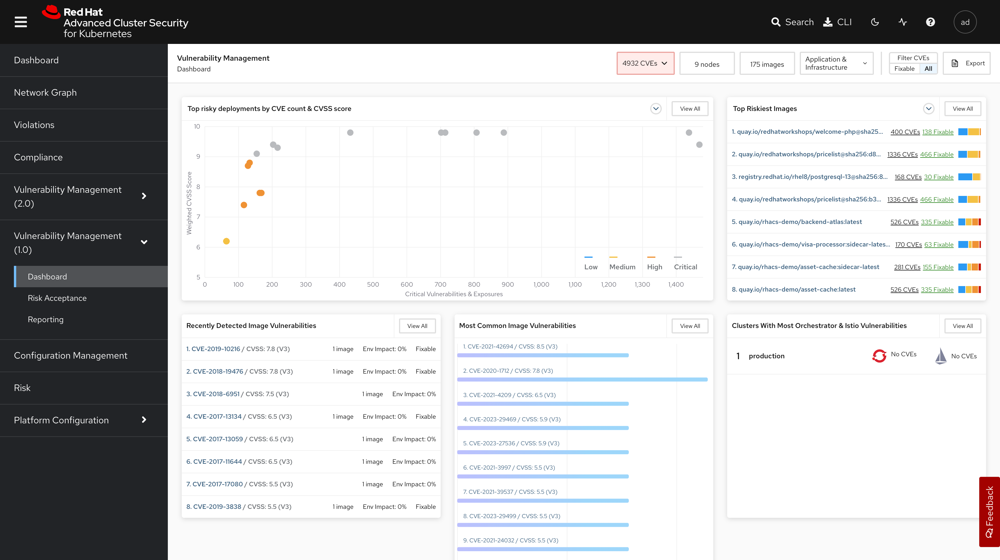

More important than fixing any vulnerability is establishing a process to keep container images updated and to prevent the promotion through the pipeline for images with serious, fixable vulnerabilities. ACS displays this through the *Top Risky Deployments by CVE and CVSS Score*. ACS takes the container's configuration and vulnerability details to show you the most *at risk* deployments in your cluster.

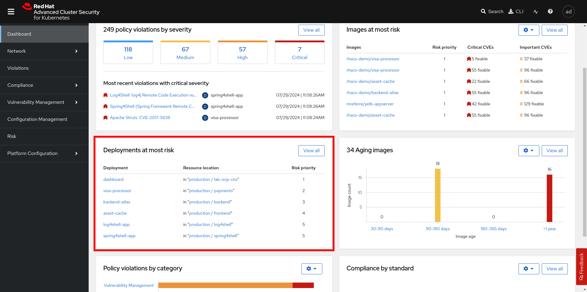

Above the *Risky Deployment* section, there are buttons to link you to all policies, CVEs, and images, and a menu to bring you to reports by cluster, namespace, deployment, and component. The vulnerability dashboard can be filtered by clicking the *Fixable CVSS* score button.

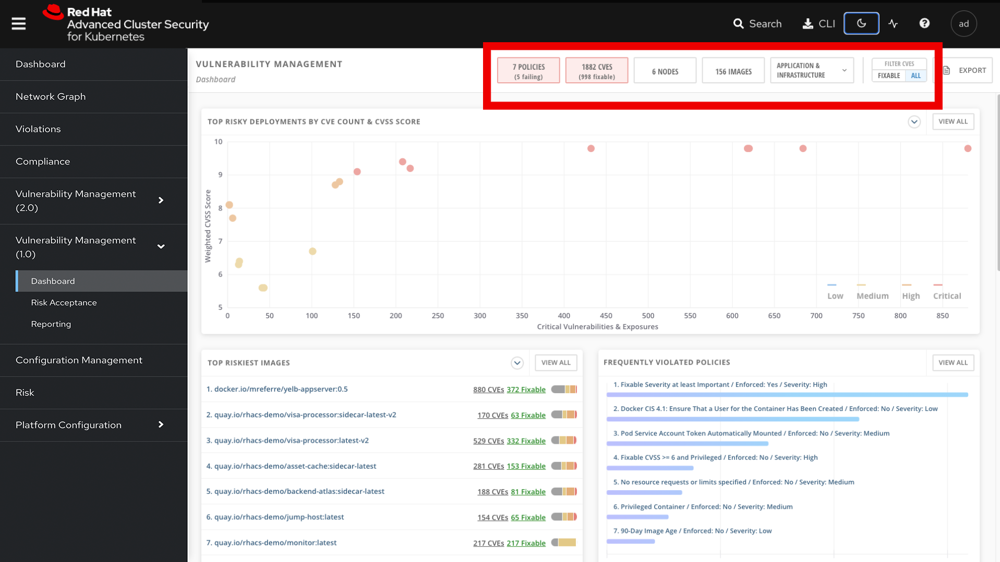

Locate the *Top Riskiest Images* panel. Here you can see the CVEs associated with containers currently running in the cluster. The goal is to find the log4shell exploit in your cluster and block that container from being pushed in the future.

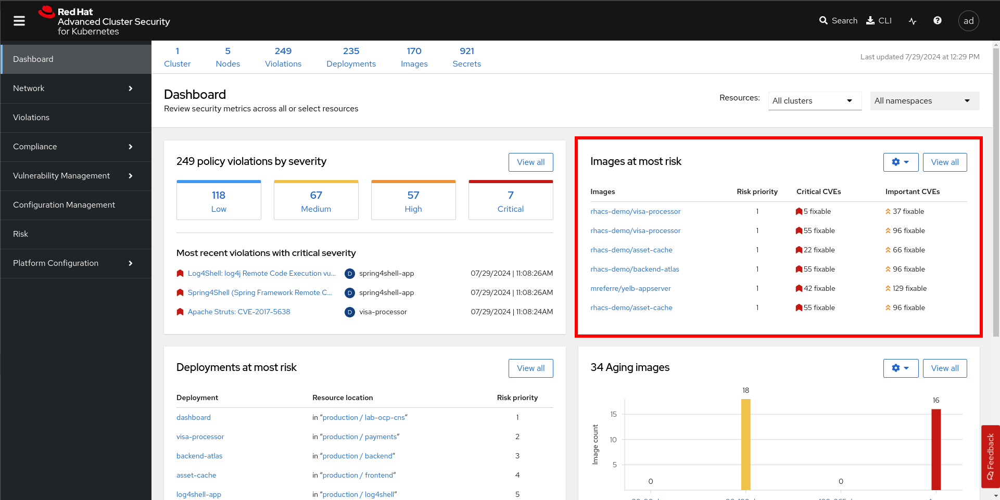

* In the *Top Riskiest Images* panel, click on the *VIEW ALL* button. 

|===
*NOTE:* For the following sections, please note that the order in which the images appear or the number of components affected may vary depending on versions and other applications running in the cluster.
|===

=== Image Overview and Details

Now you will see that the images are listed here in order of risk, based on the number and severity of the vulnerabilities present in the components in the images. 

Take a look:

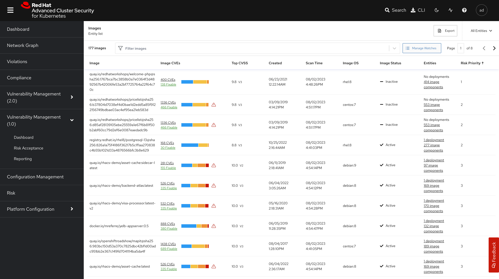

Notice which images are more exposed. Not only can we see the number of CVEs affecting the images, but which of them are fixable? We can also see:

- Creation date
- Scan time 
- Image OS
- Image status
- How many deployments are using the vulnerable image
- The total components in the image

You can click and get information about the CVEs and which are fixable.

* In the Top Riskiest Images, *find and click on* the image *visa-processor:latest-v2*. You will review the images' components and violations. 

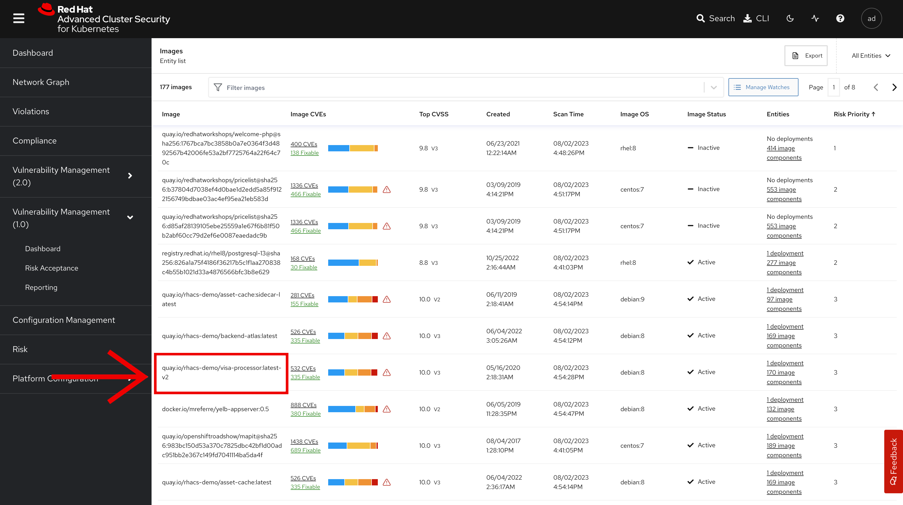

|===
Note: If you cannot find the *visa-processor:latest-v2* image, use the search bar to filter for the specific image you want. 

If you click the search bar, you will be shown the different labels you can search by. Click *Image* and type *quay.io/rhacs-demo/visa-processor:latest-v2* until the correct image comes up. 

You can use this method of searching in all search bars within the ACS dashboard.
|===

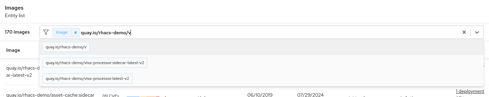

You can move on to the next section only when the dashboard displays the image below.

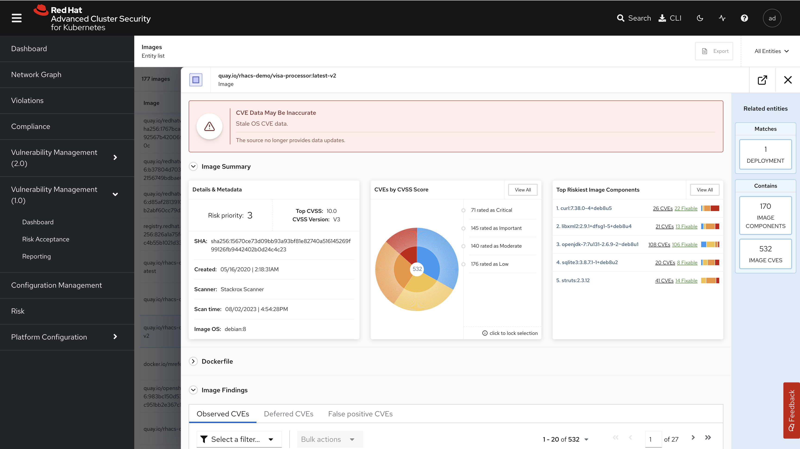

==== ACS Vulnerability Scanner

ACS' built-in vulnerability scanner breaks down images into layers and components - where components can be operating-system installed packages or dependencies installed by programming languages like Python, Javascript, or Java. The *Image Summary* provides the essential security details of the image overall, with links to the components. Below you can see why the image is ranked as a critically vulnerable application:

* In the DETAILS & METADATA → Image OS panel, the information you see there tells you that this image has a severe security problem - the base image was imported several years ago (Debian 8 - 2015).

* At the top of the page is the warning that CVE data is stale - that this image has a base OS version whose distribution has stopped providing security information and likely stopped publishing security fixes.

* Scroll down the page. In the *Image Findings* section, you find the details of the image vulnerabilities. There are 335 fixable vulnerabilities in the cluster (at the time of the creation of this workshop.)

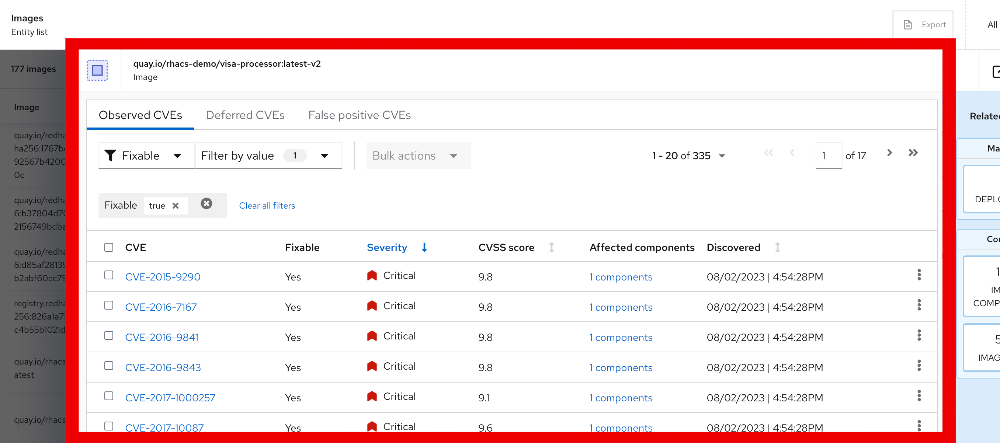

* Below the *Image Findings* section, click on the *Dockerfile* tab:

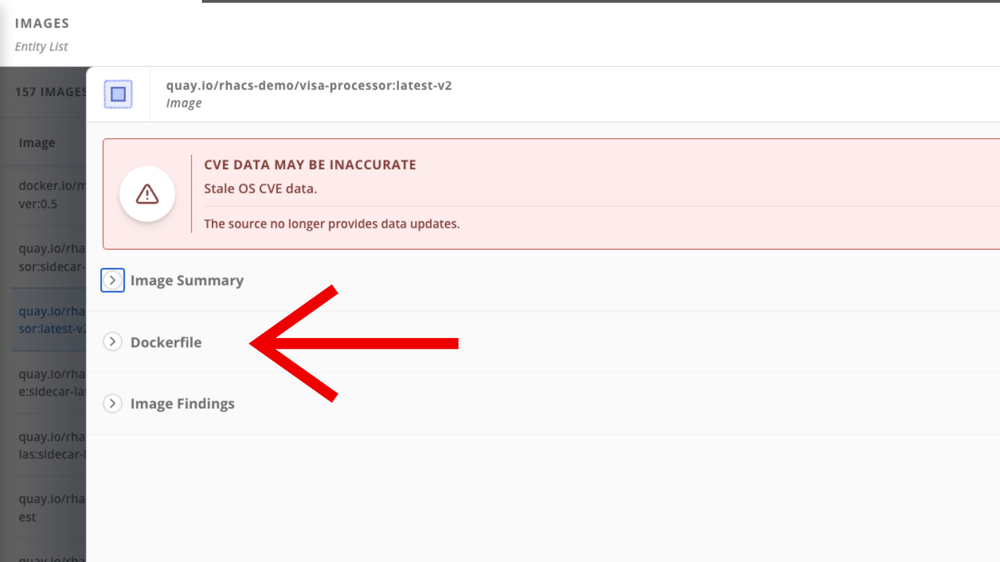

The Dockerfile tab view shows the layer-by-layer view, and, as you can see, the most recent layers are also several years old. Time is not kind to images and components - as vulnerabilities are discovered, ACS will display newly discovered CVEs.

|===
It is not practical to ask your teams to fix Linux or Javascript - but we think it is reasonable to ask them to pick up fixes published by those communities.
|===    

=== log4shell CVE Vulnerability Analysis

It is time to find the components that have the log4shell vulnerability in your cluster.

* Head back to the *Top Riskiest Images* Dashboard

* Search for the log4shell vulnerability using its CVE number (CVE-2021-44228)

image::images/acs-images/risk-7.png[]

* How many images are affected by the vulnerability?
* How many deployments contain the vulnerability?
* Why do you think the risk priority is where it is?
* Should the risk priority be higher? Or lower?

|===
The log4shell CVE is very serious - scoring 10/10 - and is fixable. 
|===

Luckily there is only *ONE* image being affected by this vulnerability, so you could go directly to the source and fix all three deployments in one opportunity. 

== Relating Image CVEs with Kubernetes Configuration Properties

All of this CVE detail is well and good, but it is a bit noisy. How do we judge the genuine risk - which vulnerabilities are likely to be exploited? Which vulnerabilities do we have to fix first?

ACS can use other sources of information in OpenShift to judge the risk that a given vulnerability would be exploited and set priorities for fixes.

The first risk factor - is the vulnerable component in a running deployment.

* Click on the *Risk* panel to continue.

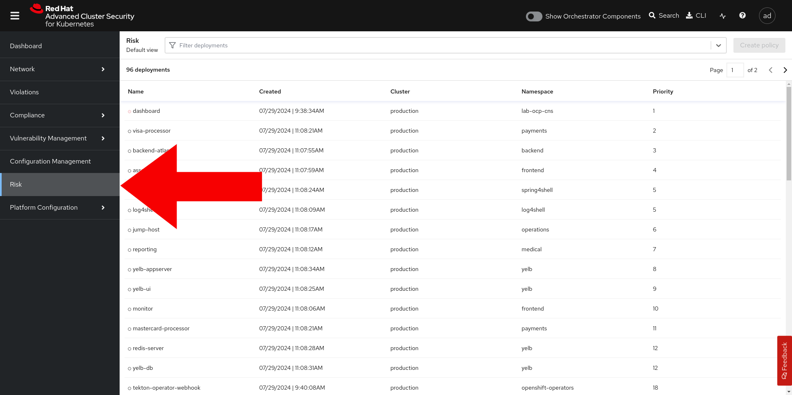

Take a look at the total amount of deployments in the cluster. If you remember, the log4shell image was approximately 10 in terms of risks based on CVSS score and other CVEs.

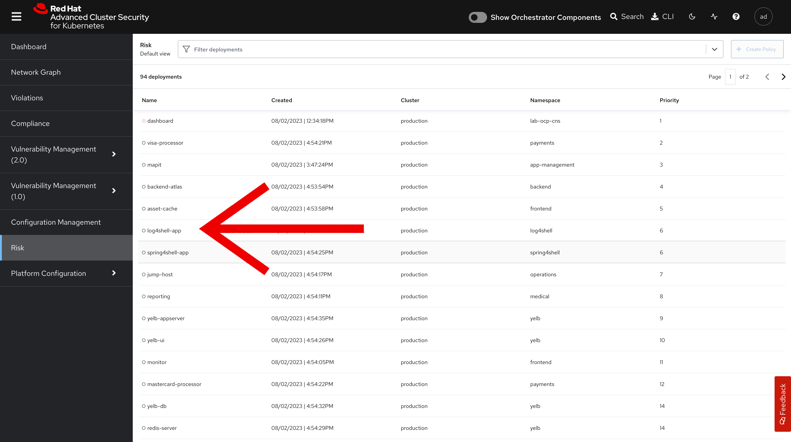

So why is it down to #6 in this example?

* Click on the log4shell deployment and review the risk indicators.

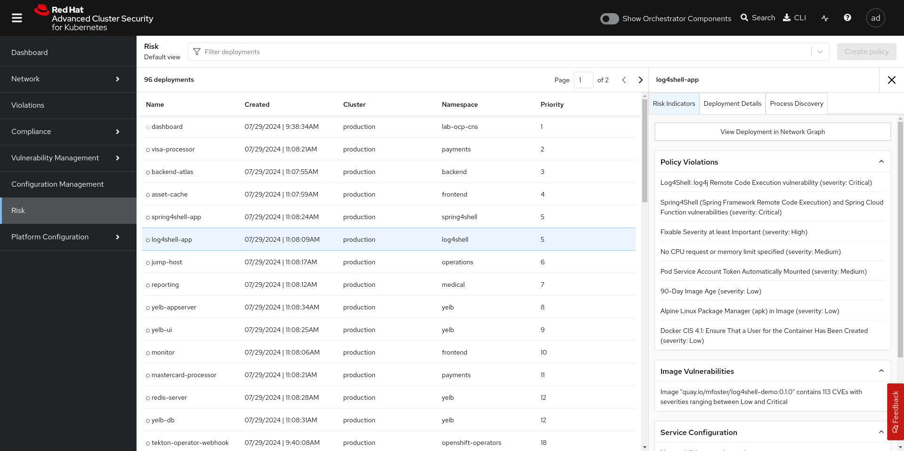

* Next, click on the *visa-processor* deployment and review its risk indicators.

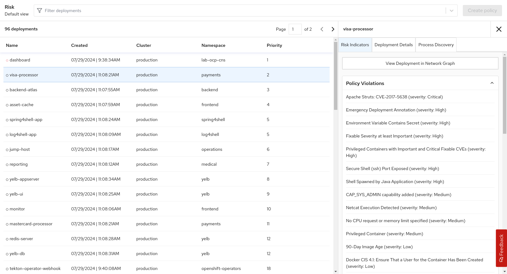

What do you think made the *visa-processor* deployment #1 in this example?

Factors that play into the overall score are in the risk indicators section. These include, but are not limited to:

1. Policy Violations
2. Image Vulnerabilities
3. Service Configuration
4. Service Reachability
5. Components Useful for Attackers
6. Number of Components in an Image
7. Image Freshness
8. RBAC Configuration

A primary reason for the *visa-processor* deployment to be ranked so high is that it is an ancient image (older than the log4shell app). A good indicator of risk is that the older an image is, the more likely it will have a significant exploitable vulnerability.

|===
We will leave it to you to make risk assessments in the future. Let us get to enforcing a log4shell policy and stopping future deployments containing the vulnerability.
|===

== ACS Policies

ACS has many built-in policies to detect activity related to attacker goals: gain a foothold, maintain a presence, move laterally, and exfiltrate data. The continuous runtime monitoring observes all container activity and will automatically respond to events with appropriate enforcement and notification. However, that would be missing out on an opportunity - ACS wants to go one step further, to take advantage of containers' ephemeral, immutable nature to improve security in a measurable way from now on.

We want to use runtime incidents and vulnerabilities as a learning opportunity to improve security going forward by constraining how our containers can act.

We achieve this by creating policies and implementing them early in the CI/CD process.

* On the left-hand side of the application, click the *Platform Configuration* tab and *select* *Policy Management*.

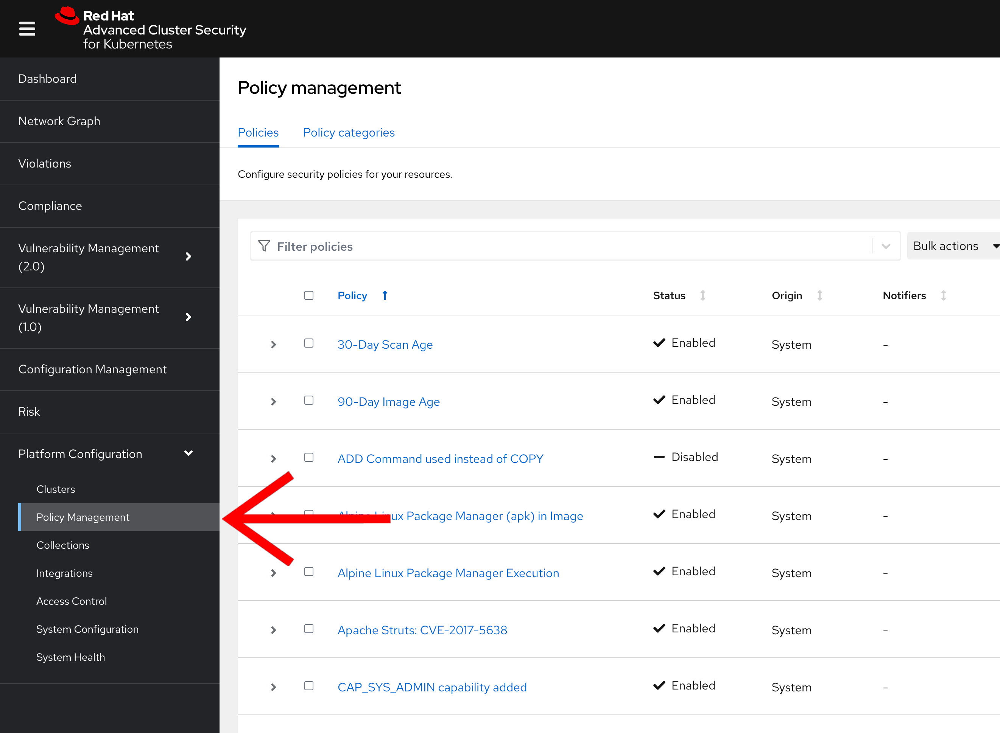

You can create policies based on rules and risks as well. Filter through the policies and find the *log4shell* policy.

image::images/acs-images/policy-2.png[]

Once you have found the vulnerability, *click* on it to learn more.

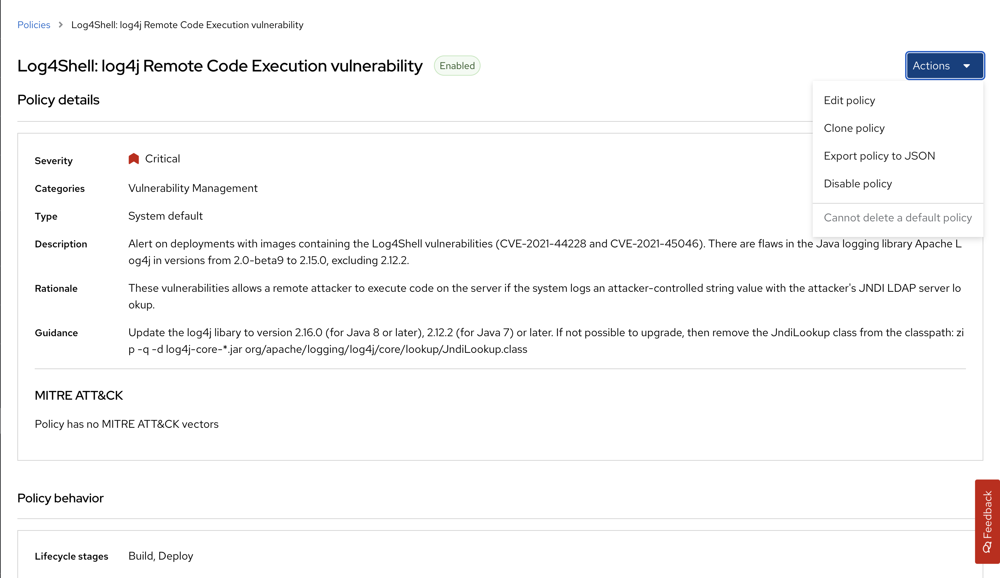

If you click the actions button, you will see how easy it is to edit, clone, export or disable these policies. We also recommended cloning the policies and adding or removing specific filters as you need them. 

== Homework

If you have time, try cloning the log4shell policy and altering it to target a vulnerability of your choice. Go to the violations page and see if vulnerable applications have triggered your new policy.
