= Vulnerability Management in Kubernetes with Red Hat Advanced Cluster Security

== Vulnerability Management in Kubernetes

(INSERT)

== Red Hat Advanced Cluster Security for Kubernetes

Red Hat Advanced Cluster Security for Kubernetes (Red Hat Advanced Cluster Security or ACS) provides the tools and capabilities to address the security needs of a cloud-native development approach on Kubernetes.

The ACS solution offers visibility into the security of your cluster, vulnerability management, and security compliance through auditing, network segmentation awareness and configuration, security risk profiling, security-related configuration management, threat detection, and incident response. In addition, ACS grants an ability to pull the actions from that tooling deep into the application code development process through APIs.

These security features represent any developer or administrator's primary work as they work across various environments, including multiple datacenters, private clouds, or public clouds that run Kubernetes clusters.

=== RHACS Features

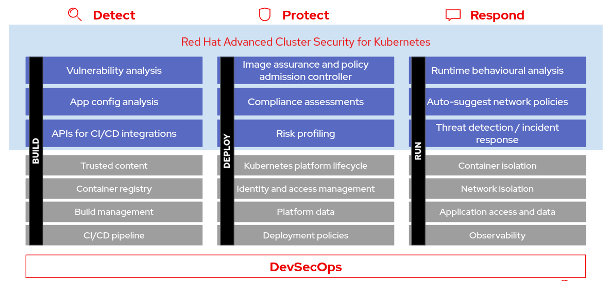

Using Red Hat Advanced Cluster Security for Kubernetes (Red Hat Advanced Cluster Security), you can gain comprehensive Kubernetes security that includes the following use cases:

* Visibility: See your entire landscape of images, registries, containers, deployments, and runtime behavior.
* Vulnerability Management: Identify and remediate vulnerabilities in both container images and Kubernetes across the entire software development life cycle.
* Compliance: Audit your systems against CIS Benchmarks, NIST, PCI, and HIPAA, with interactive dashboards and one-click audit reports.
* Network Segmentation: Visualize existing connections and enforce tighter segmentation using Kubernetes-native controls to reduce your blast radius.
* Risk Profiling: See all your deployments ranked by risk level, using context from Kubernetes’ declarative data, to prioritize remediation.
* Configuration Management: Apply best practices for Docker and Kubernetes to harden your environment for a more secure and stable application.
* Threat Detection: Use rules, automated allow lists, and baselining to accurately identify suspicious activity in your running applications.
Incident Response: Take action, from failing builds and blocking deployments to killing pods and thwarting attacks, using Kubernetes for enforcement.

== Setup
 
=== Prerequisite CLI tools
 
The following CLI tools are optional for running the exercises in this tutorial. Although they are used in the tutorial, you could use others without any problem.

|===
|Tool|macOS|Fedora|windows
 
|https://github.com/mikefarah/yq[yq v2.4.1]|https://github.com/mikefarah/yq/releases/download/2.4.1/yq_darwin_amd64[Download]|https://github.com/mikefarah/yq/releases/download/2.4.1/yq_linux_amd64[Download]|https://github.com/mikefarah/yq/releases/download/2.4.1/yq_windows_amd64.exe[Download]
|https://github.com/stedolan/jq[jq v1.6.0]|https://github.com/stedolan/jq/releases/download/jq-1.6/jq-osx-amd64[Download]|https://github.com/stedolan/jq/releases/download/jq-1.6/jq-linux64[Download]|https://github.com/stedolan/jq/releases/download/jq-1.6/jq-win64.exe[Download]
|watch|+brew install watch+|+dnf install procps-ng+|
|===

=== Deploying Demo Application Sources - MANDITORY

Before we start setting up the environment, let’s clone the tutorial sources and set the +TUTORIAL_HOME+ environment variable to point to the root directory of the tutorial: +

----
git clone git@github.com:stackrox/ansible-demo.git rhacs-demo
kubectl create ns operations
kubectl apply -f rhacs-demo/playbooks/roles/demo/files/demos/ --recursive
----

=== Deploying Apps - OPTIONAL

If you do not plan to follow the remaining sections (which are based on deploying the demo) and prefer to play and make your own findings, simply follow the steps below:

. Create a new project:
. +oc new-project ++test+
. Start some applications with critical vulnerabilities:

----
oc run shell --labels=app=shellshock,team=test-team \
  --image=vulnerables/cve-2014-6271 -n test
oc run samba --labels=app=rce \
  --image=vulnerables/cve-2017-7494 -n test
----

Navigate to the RHACS portal to view the violations. The default username is 'admin'. The generated password can be found by heading to the 'secrets' in the OpenShift Console. It is the 'central-htpasswd' secret.

image::images/secret-acs.png[]

== Overview ACS

In this section we will face the following:

* ACS Architecture
* The ACS Dashboard

=== ACS Architecture

The StackRox Kubernetes Security Platform installs as a set of pods in your Kubernetes or OpenShift cluster and includes the following components:

image::images/architecture_acs.png[]

* https://docs.openshift.com/acs/architecture/acs-architecture.html#centralized-components_acs-architecture[Central]: [Centralized components] Central is the main component of Red Hat Advanced Cluster Security for Kubernetes and it is installed as a Kubernetes deployment. It handles data persistence, API interactions, and user interface (Portal) access. You can use the same Central instance to secure multiple OpenShift Container Platform or Kubernetes clusters.
* https://docs.openshift.com/acs/architecture/acs-architecture.html#centralized-components_acs-architecture[Scanner]: [Centralized component] Red Hat Advanced Cluster Security for Kubernetes includes an image vulnerability scanning component called Scanner. It analyzes all image layers to check for known vulnerabilities from the Common Vulnerabilities and Exposures (CVEs) list. Scanner also identifies vulnerabilities in packages installed by package managers and in dependencies for multiple programming languages.
* https://docs.openshift.com/acs/architecture/acs-architecture.html#per-cluster-components_acs-architecture[Sensor]: [1 x Per Cluster] Red Hat Advanced Cluster Security for Kubernetes uses the Sensor component to monitor Kubernetes and OpenShift Container Platform clusters. It handles interactions with the OpenShift Container Platform or Kubernetes API server for policy detection and enforcement, and it coordinates with Collector.
* https://docs.openshift.com/acs/architecture/acs-architecture.html#per-cluster-components_acs-architecture[Admission controller]: [1 x Cluster] The admission controller prevents users from creating workloads that violate security policies in Red Hat Advanced Cluster Security for Kubernetes. [1 x Admission Controller]
* https://redhat-scholars.github.io/acs-workshop/acs-workshop/03-overview-acs.html#acs_architecture[Collector]: [1 x Node OCP/K8s Nodes] Collector collects and monitors information about container runtime and network activity. It then sends the collected information to Sensor.

|===
Scanner only scans those images that are not already scanned by other integrated vulnerability scanners. It means that if you have integrated Red Hat Advanced Cluster Security for Kubernetes with other vulnerability scanners, Scanner checks and uses the scanning results from the integrated scanner if available.
|===

=== ACS Dashboard

When login in ACS we will get the ACS Dashboard:

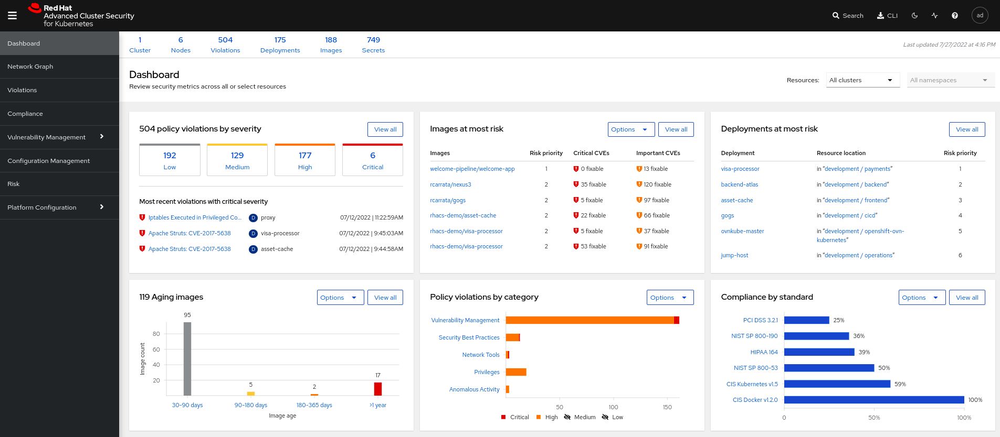

In the ACS Dashboard we have three main sections:

* The header.
* The menu.
* The information.

==== Dashboard Header

image::images/acs_dashboard_header.png[]

==== Dashboard Left Menu

image::images/acs_dashboard_menu.png[]

In the left part of the dashboard we can see the different sections we can access in ACS to gather information about the security in the clusters we have configured in ACS. Later we will go deeper into a few of them. For the time being, we will introduce each of these:

* Dashboard, where we are in this moment. We can get a summarize vision of our environment.
* Network Graph, we can get information about the configured network flows and the real ones. We can use to create Network Policies to implement network segmentation.
* Violations, we can get all the events that do not match the defined security policies.
* Compliance, we can get the compliance of out environment according to several indistry and regulatory security standards such as PCI DSS.
* Vulnerability Management, get information about known vulnerabilities which are affecting your environment. Not only deployed workloads but infrastructure as well.
* Configuration Management, review configuration to prevent possible misconfigurations which can lead to security issues.
* Risk, review risks affecting your environment such as suspicious executions.
* Platform Configuration, ACS configuration and integrations.

Feel free to explore the tabs if you have time between the sessions.

==== Dashboard Information

We can get a summary about the security state of the whole environment. +
You can browse and click in each part to get more information. You can spend a time browsing the information in Dashboard to get familiarized to. In the following sections, we will go deeper in each one of them.

=== Vulnerability Management main panel

Let’s start with Vulnerability Management, a familiar topic for most security teams. +
The overview provides several important reports - where the vulnerabilities are, which are the most widespread or the most recent, where my Docker images are coming from, and important vulnerabilities in OpenShift itself.

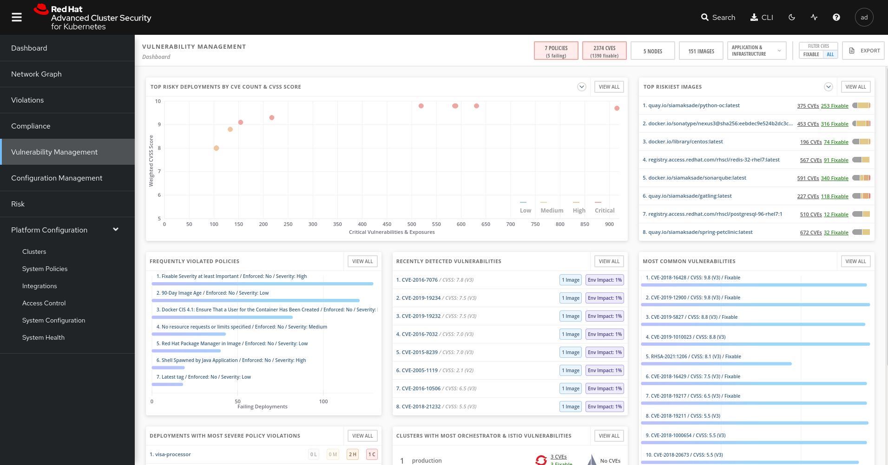

More important than fixing any one vulnerability is establishing a process to keep container images updated and to prevent the promotion through the pipeline for images that have serious, fixable vulnerabilities.

* In the upper right, you’ll see buttons to link you to all policies, CVEs, and images, and a menu to bring you to reports by cluster, namespace, deployment, and component.
* Point out the Top Riskiest Images panel in the upper right

For the following sections, please note that the order in which the images appear or the number of components affected may vary depending on the version of the demo app (changes prone).

=== Image overview and image details

In Top Riskiest Images panel, click on +VIEW ALL+ button. Now you will see that the images are listed here in order of risk, based on the number and severity of the vulnerabilities present in the components in the images.

* Lets see it:

image::images/top-riskiest-images.png[]

* We can see the images which are more exposed. Not only we can see the number of CVEs affecting the images but which of them are fixable. You can click and get information about the CVEs and the fixable ones.
* In the Top Riskiest Images, click on #4, mastercard-processor:latest.

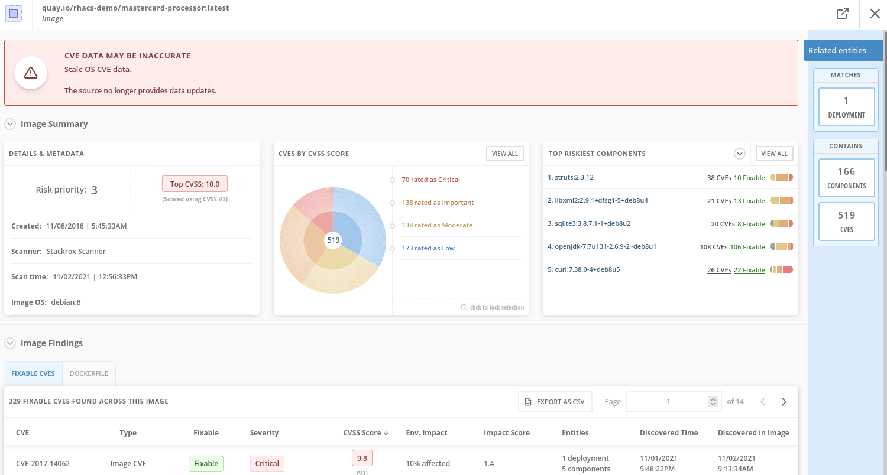

|===
|If you don’t have the exact image in the Top Riskiest Images, go to "View All" button, and filter by the name of Mastercard processor.
|===

* 
ACS’ built-in vulnerability scanner breaks down images into layers and components - where components can be operating-system installed packages, or dependencies installed by programming languages like Python, Javascript, or Java.
The Image Summary provides the important security details of the image overall, with links to the components. For example, in the DETAILS & METADATA → Image OS panel, the information you see there tells you that this image has a serious security problem - the base image was imported several years ago (Debian 8 - 2015).
You can also see, at the top, the warning that CVE data is stale - that this image has a base OS version whose distribution has stopped providing security information on, and has likely stopped publishing security fixes for.
At the bottom, the Image Findings section focuses on Fixable vulnerabilities, sorted by CVSS.
* Under the Image Findings section, Click on Dockerfile tab:

image::images/03-vuln.png[]

The Dockerfile tab view shows the layer-by-layer view and, as you can see, the most recent layers are also several years old.
Time is not kind to images and components - as vulnerabilities are discovered, ACS will display newly discovered CVEs.

=== Image CVE Vulnerability Analysis

* Click back to the Fixable CVEs tab.
The CVE list for each image focuses on the severe - CVSS >7 - and the “fixable,” where the upstream package maintainers have published a fix.
* We don’t think it’s practical to ask your teams to fix Linux or Javascript - but we think it’s reasonable to ask them to pick up fixes published by those communities.

image::images/04-vuln.png[]

* Click on a Fixable CVE in the list, like CVE-2018-14618

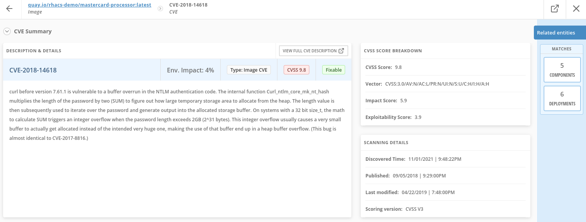

* This CVE for example is very serious - scoring 9.8/10 - and fixable.
It’s a vulnerability in curl and libcurl - and these packages are present either because it was part of a base image, or it was deliberately added by a developer in one of the Dockerfile layers.

|===
||ACS scanner uses to fetch and update the vulnerability definitions from http://definitions.stackrox.io/[http://definitions.stackrox.io/]. On the other hand collector-modules.stackrox.io is the other FQDN that will be used in online mode. These two are used by Central in ACS to fetch vulnerability details and collector modules.
|===

=== Image CVE correlation with Deployments

All of this CVE detail is well and good, but it’s a bit noisy. +
How do we judge the true risk - which vulnerabilities are likely to be exploited? +
In other words. Which vulnerabilities do we really have to fix first? +
ACS can use other sources of information in OpenShift to judge the risk that a given vulnerability would be exploited, and hence to set priorities for fixes. +
The first risk factor - is the vulnerable component actually in a running deployment?

* Click on the 6 Deployments button in the Related Entities column on the right.

image::images/06-vuln.png[]

* These are the five deployments running right now with containers that come from images with this vulnerability present. “Up and running” is a risk factor - vulnerabilities are only going to be exploited if they’re in a running container somewhere in the cluster.
We display the critical information here - so you can see that we have this present in the Production cluster, in Namespaces like Payments, which starts to provide context to the security team.
The last column on the right is the Risk priority - which ACS has already determined from configuration and runtime activity in the deployment. So - of these five deployments, the visa-processor is most likely to be exploited. How is this determined?

Continue to the next section - Risks for find out!

== Risk Management in ACS

=== Risks main dashboard

Let’s take a look at the Risk view, where we go beyond the basics of vulnerabilities to understand how deployment configuration and runtime activity impact the likelihood of an exploit occurring and how successful those exploits will be.

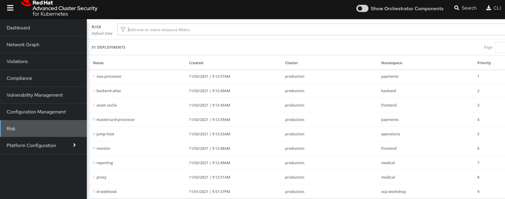

This list view shows all deployments, in all clusters and namespaces, ordered by Risk priority. +
Risk is also influenced by runtime activity - and Deployments that have activity that could indicate a breach in progress have a red dot on the left. Obviously - the first one in the list should be our first focus. +
The reality of security is that it’s just not possible to tackle all sources of Risk, so organizations end up prioritizing their efforts. We want ACS to help inform that prioritization.

=== Single Deployment Details

* Click on the number 1 deployment, visa-processor to bring up the +RISK INDICATORS+

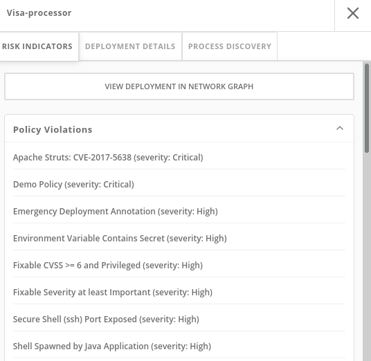

* The details tab shows why this deployment is considered such a high risk.
The deployment has serious, fixable vulnerabilities, but it also has configurations like network ports and service exposure outside the cluster, making it more likely to be attacked.
In addition, other configurations like privileged containers mean that a successful attacker has access to the underlying host network and filesystem, including other containers running on that host.
* Navigate to the bottom of the +RISK INDICATORS+ page to the RBAC configuration section

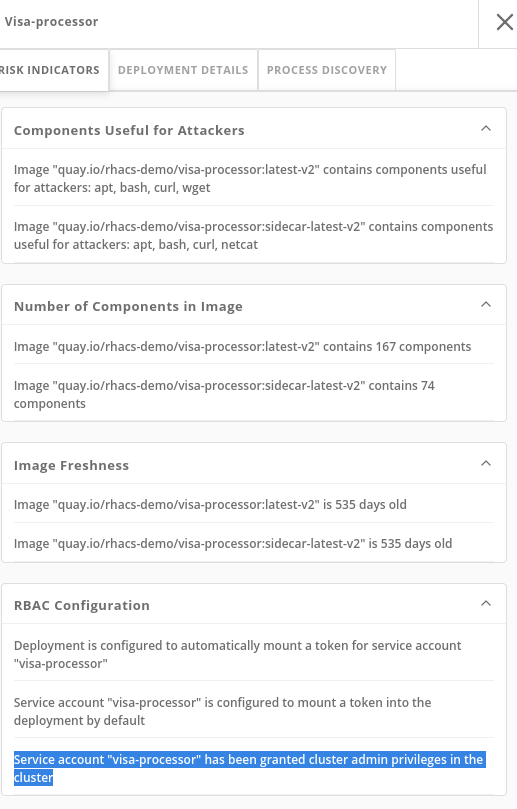

* At the bottom, we see another serious problem: the service account associated with this deployment has been given +cluster admin+ privileges, which means that a successful attacker gains full control over this entire OpenShift cluster which could result in compromise of the entire cluster.
All of these configurations are gleaned automatically by ACS from OpenShift, and the built-in policies assign a risk score to each, meaning that this Risk report is available as soon as you start running ACS.

=== Process Discovery / Runtime

Navigate to the +PROCESS DISCOVERY+ tab of the details page. +
Even a perfectly configured application has the potential for an attacker to gain access and cause havoc. +
Here we show how ACS continuously monitors runtime activity within pods in the deployment, building a baseline of observed behavior, and tracking deviations from that baseline.

* Click on the header bar within the +Event Timeline+ section ( in the picture, at any point on the surface covered by the red rectangle )

image::images/04-risks.png[]

* The event timeline shows us, for each pod, the process activity that has occurred over time.
* Click on the squares / circles for process activity

image::images/05-risks.png[]

* If you click in the _greater than_ symbol (pointed by the red arrow in the above picture) you can expand the activity and see the containers inside the pod.

image::images/06-risks.png[]

We can take advantage of the constrained lifecycle of containers for better runtime incident detection and response.

Containers should be pretty boring - they’re not general-purpose Virtual machines. They typically have a period of startup, with some initialization, and then settle down to a small number of processes running continuously and making or receiving connections.

Deviations from the baseline can be used to take enforcement action and alert team members. Runtime activity rules can be combined with other activity

=== Filtering

Most UI pages have a filters section at the top that allows you to narrow the reporting view to matching or non-matching criteria. +
Almost all of the attributes that ACS gathers are filterable +
It’s really useful here in Risk when you know what you’re looking for - when you want answers to questions like “what applications have CVE-2020-1008 present".

For example, let’s use the following filters: +
----
Filtering
Process Name - Java
CVE - CVE-2017-7376 (libxml2)
----

Translated: "Finding deployments that are running +java+ processes and are affected by the +CVE-2017-7376+ vulnerability".

* Click in the +Filters+ bar (at the top, red rectangle). Start Typing "Process Name" and select the +Process Name+ key ones it appears / autocompletes. Then type +java+, press enter and click away to get the filters dropdown to clear.

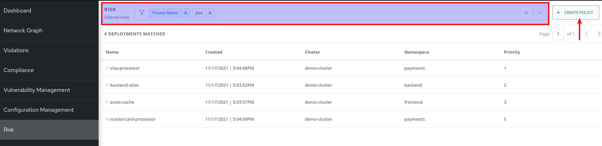

* Do the same to add the +CVE+ filter (is one of the keys shown by default).

|===
||Now that we’ve searched for interesting criteria, we can create a policy from the search filter to automatically identify our criteria going forward. We can do that by clicking the +Create Policy+ button, at the upper right (indicated by the red arrow in the above picture) and following the form steps.

|===

Now let’s review the Network Graph and the Network Policies in RH ACS!

== Violations

Using Red Hat Advanced Cluster Security for Kubernetes you can view policy violations, drill down to the actual cause of the violation, and take corrective actions. +
Red Hat Advanced Cluster Security for Kubernetes built-in policies identify a variety of security findings, including vulnerabilities (CVEs), violations of DevOps best practices, high-risk build and deployment practices, and suspicious runtime behaviors. Whether you use the default out-of-box security policies or use your own custom policies, Red Hat Advanced Cluster Security for Kubernetes reports a violation when an enabled policy fails.

=== Violations Dashboard Overview

Violations record all of the specific times where a policy criteria has been met by any of the objects in your cluster - images and their components, deployments, runtime activity. +
Think of it as the “stream” of events that have occurred, although we don’t want this to just be a “to-do” list for incident response folks.

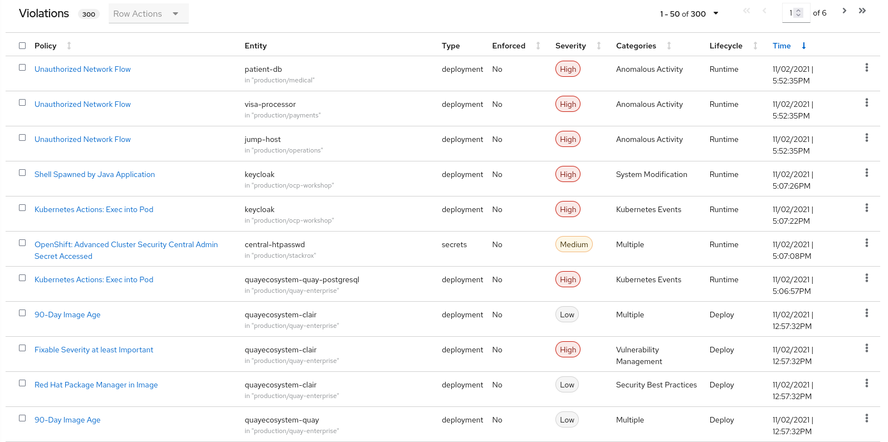

=== Violations Build & Deploy Example

* Click on a Violation of the "Fixable Severity at least Important". You may have to look for one! The violation details appear on the right.

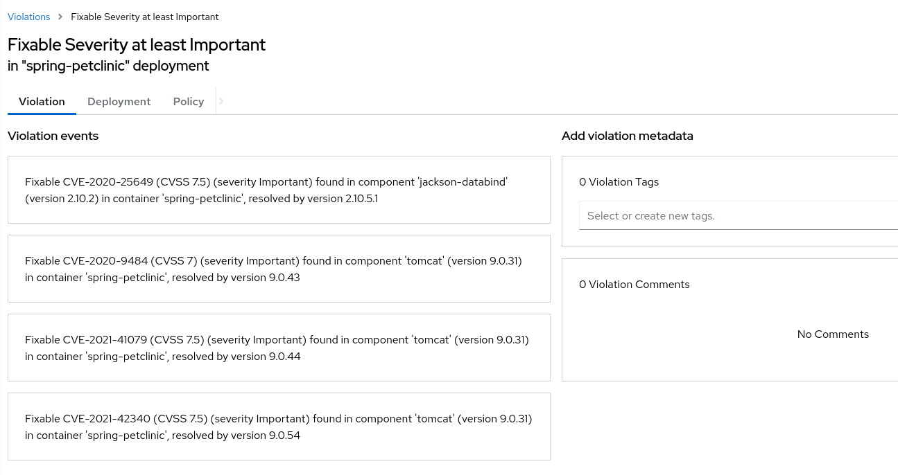

Here’s an example of the details recorded for a policy violated at deployment time. +
You’ll see that it’s the same information presented in a CI/CD tool or developer console when using the build-time integration.

=== Violations Runtime Example

* Click on a Violation of the "Netcat Execution Detected" in Image policy. Again, you may have to look or search (filter) for it. The violation details appear on the right.

image::images/03-violations.png[]

This violation is a runtime incident - so it has a different set of details and actions available. +
The forensic data recorded will be familiar to most incident response team - the “who, what, when, where, and why” of the activity, including process names, arguments, UIDs, container IDs +
In this case, for our demo, there’s been no enforcement of the action, just a notification, and the team has options to resolve or suppress these notifications in the future.
|===
||The violations are per Deployment, not per pod!

|===
=== Violations Behaviour

What happens if you not resolve a Violation in a Deployment, or if the same violation happened again (with the same parameters)? +
A unique violation is not always generated per event, but those events and details are summarized in the violation details itself. +
This behavior is expected. Since it is the same running deployment that you are updating through your pipeline, and this first violation is not resolved. If new CVEs present themselves, those are of course updated based on any changes to the image. +
But a violation will not trigger if we have already analyzed it is currently violating that policy from the original time stamp of when it was detected, and nothing else has changed +
If the change to the deployment represented new violations, then those would appear. Or, if you deleted the deployment and redeployed a new one for example. +
For example, "Ubuntu Package Manager Execution". If I had an outstanding violation present from Time X, when it was first detected, and the same pod executes 24 hours later at time Y, the result would be additive, where I would see the details of those executions (First Occurrence, Last Occurrence and then each individual event execution) under the same violation summary

=== Policy Summary

ACS has a number of built-in policies to detect activity that’s related to attacker goals: gain a foothold, maintain a presence, move laterally, and exfiltrate data. The continuous runtime monitoring observes all container activity and will automatically respond to events with appropriate enforcement and notification

* In the right hand side details of the Violation, click on the Policy tab

image::images/04-violations.png[]

But that would be missing out on an opportunity - ACS wants to go one step further, to take advantage of the ephemeral, immutable nature of containers to improve security in a measurable way going forward.

We are, essentially, using runtime incidents as a learning opportunity to improve security going forward by constraining how our containers can act.
