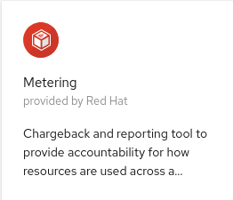
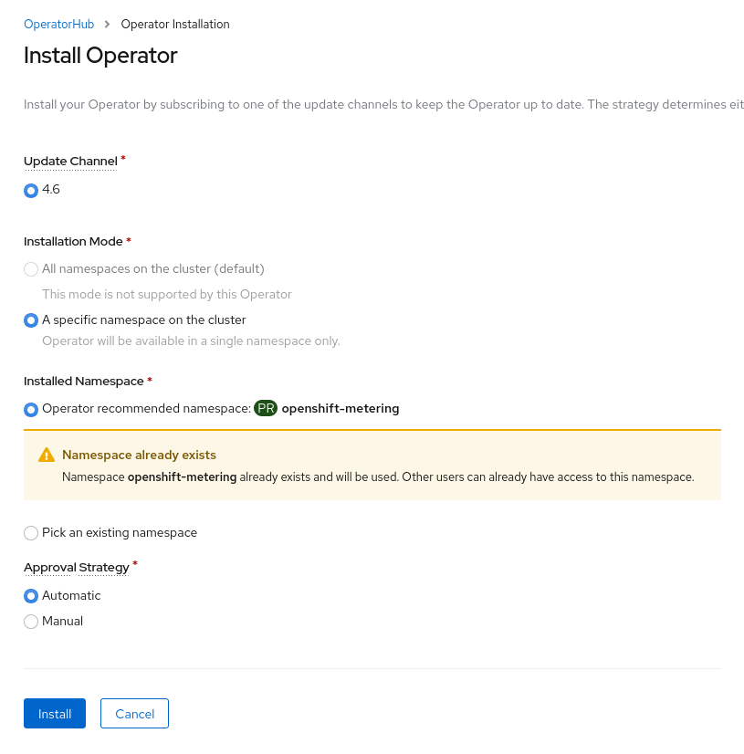
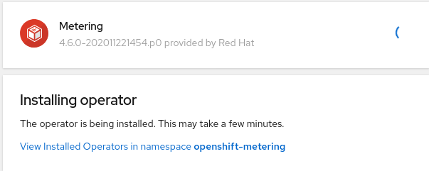
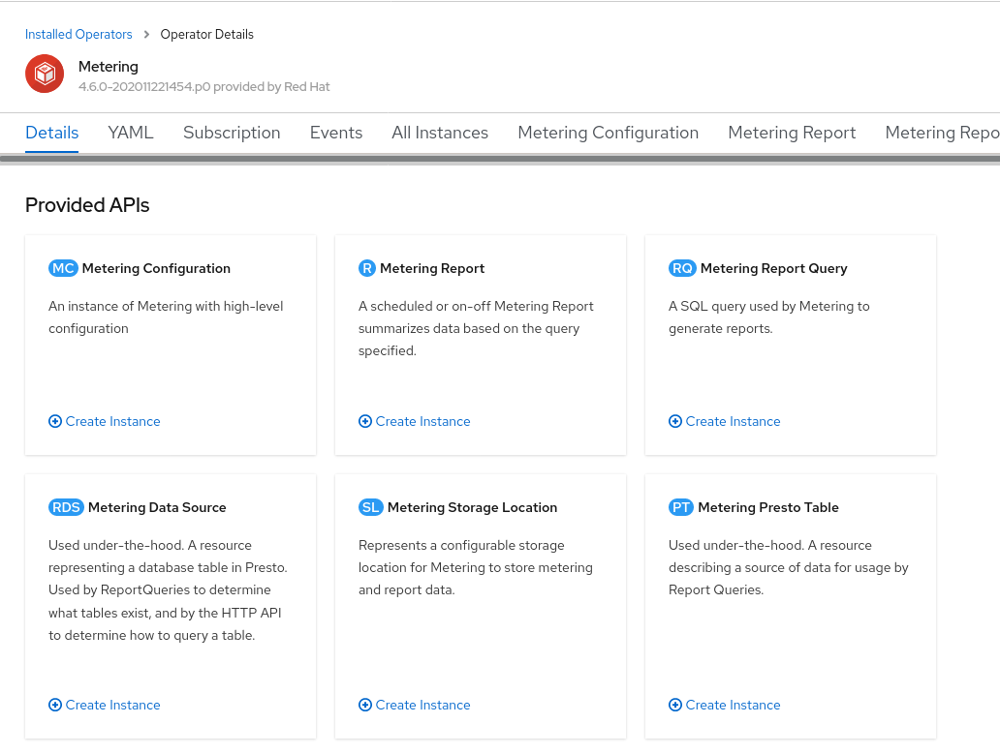
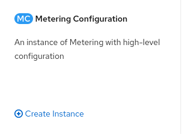
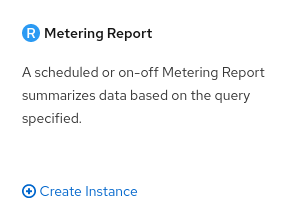
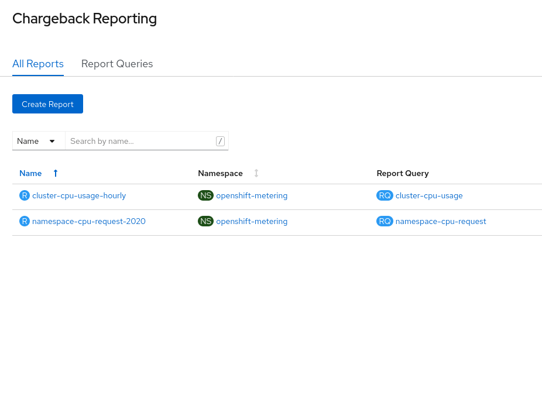
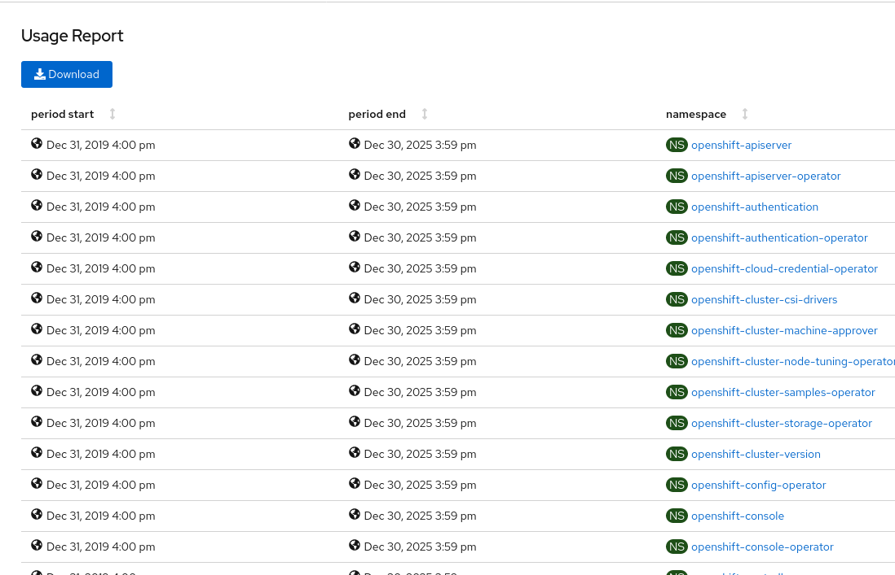

## Cluster Metering

== Lab Overview

This hands-on workshop is for both system administrators and application developers interested in learning how to deploy and manage Metering operator and schedule reports.

=== In this lab you will learn how to

* Deploy Metering Operator from OperatorHub
* Install the Metering stack
* Verify the installation
* Writing Reports
* Reading Reports

### Background

OpenShift Container Platform (OCP) 4.2 made Operator Metering generally available. Operator Metering is a chargeback and reporting tool to provide accountability for how resources are used across a cluster. Cluster admins can schedule reports based on historical usage data by Pod, Namespace, and Cluster wide. Operator Metering is part of the link:https://coreos.com/blog/introducing-operator-framework-metering[Operator Framework].

[Note]
====
This exercise is done with a mix of CLI and the OpenShift web console. All of
the interactions with the web console are effectively creating or
manipulating API objects in the background. It is possible to fully automate
the process and/or do it using the CLI or other tools, but these methods are
not covered in the exercise or documentation at this time.
====

### Installing Operator Metering 

[Note]
====
This lab assumes you have logged into an existing cluster with the `oc login` command
====

#### Examine cluster projects

View the `projects` in the existing cluster by running the `oc projects` command (this is analogous to `kubectl namespaces`). Search for openshift-metering in the output to make sure you're not clobbering an existing installation:

[source,bash,role="execute"]
----
oc projects | grep openshift-metering
----

The output should reflect that no Metering projects currently exist.

#### Login to the OpenShift Web Console

Login to the link:{{ MASTER_URL }}[OpenShift Web Console] with the kubeadmin credentials.

[source,role="copypaste"]
----
kubeadmin
----

[source,role="copypaste"]
----
{{ KUBEADMIN_PASSWORD }}
----

[Warning]
====
You might receive a self-signed certificate error in your browser when you
first visit the OpenShift Web console. When OpenShift is installed, by default, a CA
and SSL certificates are generated for all inter-component communication
within OpenShift, including the web console.
====

#### Add Metering Operator to cluster

To install the Metering Operator using the OpenShift Web Console first create an `openshift-metering` namespace, and then install the Metering Operator from OperatorHub.

1. In the OpenShift Container Platform web console, click *Administration* → *Namespaces* → *Create Namespace*.

2. Set the name to `openshift-metering` and make sure to label the namespace with 
+
[source,role="copypaste"]
----
openshift.io/cluster-monitoring=true
----
+
Then click Create.

3. Next, click *Operators* → *OperatorHub*, and filter for `metering` to find the Metering Operator.
+

4. Click the *Metering* card, review the package description, and then click *Install*.

5. On the *Install Operator* screen, make sure the `4.6` *Update Channel* is selected. Also, verify that `A specific namespace on the cluster` is selected as the *Installation Mode*. The *Installed Namespace* should already be set  to `Operator recommended namespace` with `openshift-metering` selected. Keep the *Approval Strategy* to `Automatic`.
+

+
Once you've verified these options, click "Install".

6. This will take you the the "Installing Operator" progress page.
+

+
Once the page displays *Installed operator - ready for use*, go ahead and click on `View Operator`.

7. This will take you to the *Operator Details* page.
+

[Note]
====
It may take a few minutes for the metering operator to install, be patient.
====

### Install the Metering stack

1. From the web console, ensure you are on the *Operator Details* page for the Metering Operator in the `openshift-metering` project. If you've navigated away from this page, you can get back to this page by clicking *Operators* → *Installed Operators*, then selecting the Metering Operator.

2. Under *Provided APIs*, click *Create Instance* on the **Metering Configuration** card.
+

3. Click on *YAML View* in the *Configure via* section; and replace the default configuration by copying and pasting the following MeteringConfig into the YAML editor and click `Create`:
+
[source,role="copypaste"]
----
apiVersion: metering.openshift.io/v1
kind: MeteringConfig
metadata:
  name: "operator-metering"
spec:
  unsupportedFeatures:
    enableHDFS: true
  storage:
    type: "hive"
    hive:
      type: "hdfs"
      hdfs:
        # Leave this value as-is.
        namenode: "hdfs-namenode-0.hdfs-namenode:9820"
----
+
In order to not create a dependency on OpenShift Container Storage, this lab uses an unsupported storage configuration, HDFS, that the Metering operator deploys by itself.

### Verify the installation

To verify your metering installation, you can check that all the required Pods have been created, and check that your report data sources are beginning to import data.

1. Navigate to *Workloads* → *Pods* in the metering namespace and verify that Pods are being created. This can take several minutes after installing the metering stack.
+
You can run the same check using the `oc` CLI:
+
[source,bash,role="execute"]
----
oc -n openshift-metering get pods
----
+
You should see similiar output:
+
----
NAME                                  READY   STATUS              RESTARTS   AGE
hive-metastore-0                      1/2     Running             0          52s
hive-server-0                         2/3     Running             0          52s
metering-operator-68dd64cfb6-pxh8v    2/2     Running             0          2m49s
presto-coordinator-0                  2/2     Running             0          31s
reporting-operator-56c6c878fb-2zbhp   0/2     ContainerCreating   0          4s
----

2. Continue to check your Pods until they show `Ready`. This can take several minutes. Many Pods rely on other components to function before they themselves can be considered ready. Some Pods may restart if other Pods take too long to start, this is okay and can be expected during installation.
+
You can follow the instantiation of the Pods by waiting for all the `StatefulSet` rollouts:
+
[source,bash,role="execute"]
----
until [[ $(oc get sts -n openshift-metering -o name | wc -l) -gt 4 ]]; do echo "waiting for statefulsets..." ; sleep 2 ; done
oc rollout status sts/hdfs-datanode -n openshift-metering
oc rollout status sts/hdfs-namenode -n openshift-metering
oc rollout status sts/hive-metastore -n openshift-metering
oc rollout status sts/hive-server -n openshift-metering
oc rollout status sts/presto-coordinator -n openshift-metering
oc rollout status sts/presto-worker -n openshift-metering
----
+
Once done, you can use the `oc` CLI, to see them running:
+
[source,bash,role="execute"]
----
oc -n openshift-metering get pods
----
+
----
NAME                                  READY   STATUS    RESTARTS   AGE
hdfs-datanode-0                       1/1     Running   0          6m32s
hdfs-namenode-0                       1/1     Running   0          6m32s
hive-metastore-0                      2/2     Running   0          6m9s
hive-server-0                         3/3     Running   0          6m9s
metering-operator-6f7fb6f6fd-dfk6w    1/1     Running   0          22m
presto-coordinator-0                  2/2     Running   0          5m43s
reporting-operator-57c5b4d577-flsqb   2/2     Running   0          5m13s
----

3. Next, use the `oc` CLI to verify that the ReportDataSources are beginning to import data, indicated by a valid timestamp in the `EARLIEST METRIC` column (this may take a few minutes). We filter out the "-raw" ReportDataSources which do not import data:
+
[source,bash,role="execute"]
----
oc get reportdatasources -n openshift-metering | grep -v raw
----

After all Pods are ready and you have verified that data is being imported, you can begin using metering to collect data and report on your cluster.

### Writing Reports

The Report custom resource is used to manage the execution and status of reports. Metering produces reports derived from usage data sources, which can be used in further analysis and filtering.

A single Report resource represents a job that manages a database table and updates it with new information according to a schedule. The Report exposes the data in that table via the reporting-operator HTTP API. Reports with a `spec.schedule` field set are always running and track what time periods it has collected data for. This ensures that if metering is shutdown or unavailable for an extended period of time, it will backfill the data starting where it left off. If the schedule is unset, then the Report will run once for the time specified by the `reportingStart` and `reportingEnd`.

By default, reports wait for `ReportDataSources` to have fully imported any data covered in the reorting peroid. If the Report has a schedule, it will wait to run until the data in the period currently being processed has finished importing.

Use the `oc` CLI to get ReportQueries to see what reports are available:

[source,bash,role="execute"]
----
oc get reportqueries -n openshift-metering | grep -v raw
----

[Note]
====
ReportQueries with the `-raw` suffix are used by other ReportQueries to build more complex queries, and should not be used directly for reports. Therefore, we omitted them with the `grep -v raw` command.
====

#### Create Report with a Schedule

The following example Report will contain information on every Pod’s CPU requests, and will run every hour, adding the last hours worth of data each time it runs.

1. In the OpenShift Container Platform web console, click *Operators* → *Installed Operators*. On the *Installed Operators* click the Metering operator. This will bring you to the details page again.
+

2. Under the *Metering Report* card, click *Create Instance*.
+

+
This opens the *Create Report* page. Click `YAML View` to get the YAML editor

3. Replace the default configuration by copying and pasting the following MeteringConfig into the YAML editor and click Create:
+
[source,role="copypaste"]
----
apiVersion: metering.openshift.io/v1
kind: Report
metadata:
  name: cluster-cpu-usage-hourly
spec:
  query: "cluster-cpu-usage"
  schedule:
    period: "hourly"
----

4. Next, use the `oc` CLI to verify that the report was created:
+
[source,bash,role="execute"]
----
oc get reports -n openshift-metering
---- 
+
Using the `oc` CLI, it shows output similar to the following:
+
----
NAME                       QUERY               SCHEDULE   RUNNING                  FAILED   LAST REPORT TIME   AGE
cluster-cpu-usage-hourly   cluster-cpu-usage   hourly     ReportingPeriodWaiting                               7s
----

5. The alloted time will pass (one hour) and a report will be run. For the purpose of this workshop, let's keep going.

#### Create One-Time Report

The following example Report will contain information on every Namespace’s CPU requests, and will run one time.

1. In the OpenShift Container Platform web console, click *Operators* → *Installed Operators*. On the *Installed Operators* click the Metering operator. This will, once again, bring you to the details page.
+

2. Under the *Metering Report* card, click *Create Instance*.
+

+
This opens the *Create Report* page. Click `YAML View` to get the YAML editor

3. Replace the default configuration by copying and pasting the following MeteringConfig into the YAML editor and click Create:
+
[source,role="copypaste"]
----
apiVersion: metering.openshift.io/v1
kind: Report
metadata:
  name: namespace-cpu-request-2020
  namespace: openshift-metering
spec:
  query: namespace-cpu-request
  reportingEnd: '2025-12-30T23:59:59Z'
  reportingStart: '2020-01-01T00:00:00Z'
  runImmediately: true
----

4. Next, use the `oc` CLI to verify that the report was created:
+
[source,bash,role="execute"]
----
oc get reports -n openshift-metering
----
+
Using the `oc` CLI, it shows output similar to the following:
+
----
NAME                         QUERY                   SCHEDULE   RUNNING                  FAILED   LAST REPORT TIME       AGE
cluster-cpu-usage-hourly     cluster-cpu-usage       hourly     ReportingPeriodWaiting                                   4m37s
namespace-cpu-request-2020   namespace-cpu-request              Finished                          2020-12-30T23:59:59Z   28s
----

### Reading Reports

To view reports complete the following: 

1. In the OpenShift Container Platform web console, click *Administration* → *Chargeback*. This opens the `Chargeback Reporting` page.
+

2. Select the one-time report created in the previous section titled `namespace-cpu-request-2020`

3. From this screen the report can be downloaded as a CSV file by scolling down, and clicking the Download button. The report is also displayed in the lower part of the screen.
+

+
This file can be imported to any metering application that accepts CSV format.
