## GitOps On OpenShift

As an OpenShift administrator, you can use GitOps to simplify the delivery of applications to Kubernetes. GitOps automates the deployment process to the target environment by relying on Git repositories as the primary means of determining the desired application state. You can easily track updates to branches, tags, or lock them to a specific version of manifests at a Git commit.

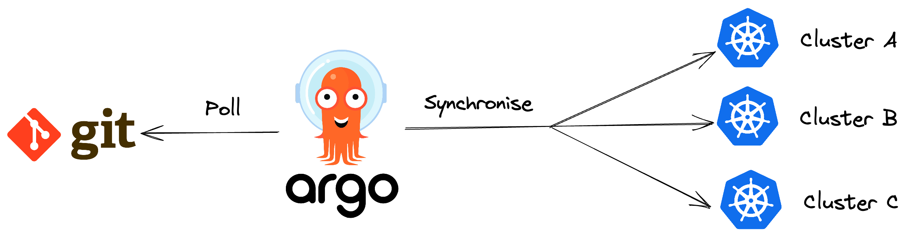

GitOps also provides a method for managing infrastructure and application configurations using Git workflows. By treating infrastructure and application definitions like code, GitOps simplifies the process of propagating changes in configurations across multiple clusters.

### Installing OpenShift GitOps
To get started with OpenShift GitOps, this guide will walk you through the step-by-step process of installing the Red Hat OpenShift GitOps Operator to your OpenShift Container Platform cluster and logging in to the Argo CD instance. With Red Hat OpenShift GitOps, you can manage specific cluster-scoped resources like cluster Operators, optional Operator Lifecycle Manager (OLM) Operators, and user management.

### Installing OpenShift GitOps Operator in web console

----
Please do not install the Community version of the Argo CD Operator, 
if you have already do so please remove the Argo CD Community Operator 
before you install the Red Hat OpenShift GitOps Operator.
----
1.Now switch over to your *Openshift Web Console*:

{{ MASTER_URL }}

2. Open the `Administrator` perspective of the web console.

3. Navigate to `Operators` → `OperatorHub` in the menu on the left.

4. Search for `OpenShift GitOps`, click the `Red Hat OpenShift GitOps` tile, and then click `Install`.
   (Red Hat OpenShift GitOps will be installed in all namespaces of the cluster)

5. Select the `Update channel` as `gitops-1.8`. Leave all defaults selected and click `Install`.
   
image::images/gitops-tile.png[]

After the Red Hat OpenShift GitOps Operator is installed, it 
automatically sets up a ready-to-use Argo CD instance that 
is available in the openshift-gitops namespace, and an Argo CD
icon is displayed in the console toolbar. You can create subsequent 
Argo CD instances for your applications under your projects.

### Logging in to the Argo CD instance by using the Argo CD admin account
   
1. Navigate to the nine tiles at the top of your OpenShift Console. Once you click that you should see the 'OpenShift GitOps Cluster Argo CD'. Select that.
+ 
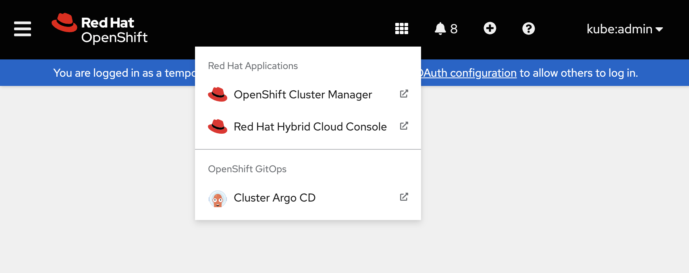
+
2. Please ignore the warning. `Proceed` to the website using the `advanced options` when you see that the connection is not private.
Currently, we're performing a basic installation of Argo that doesn't involve setting up the certificate or kubeadmin for regular users. However, these configurations can be implemented later as needed.
+
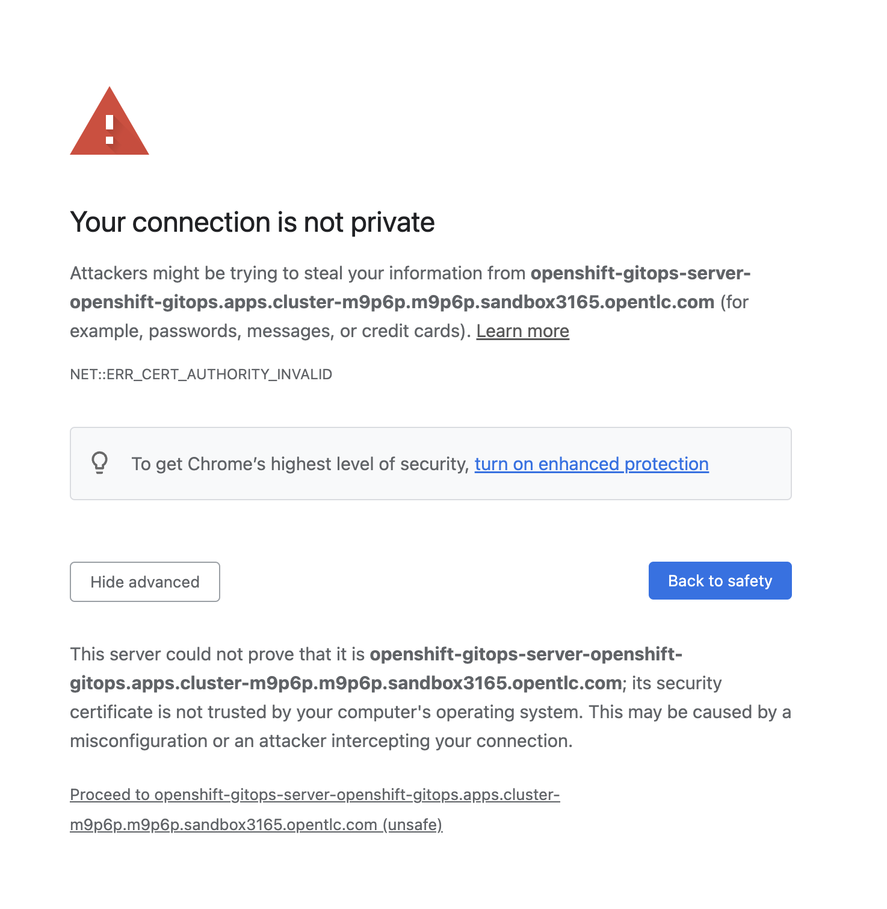
[start=3]
3. You can now `login` into the Argo CD UI by selecting `Log in Via OpenShift`.
+

Please use the kubeadmin login details. 
Remember that the login is `kubeadmin` 
and the password is:

[source,role="copypaste"]
----
{{ KUBEADMIN_PASSWORD }}
----

[start=4]
4. You will enter the Argo CD UI. (Please authorize access)

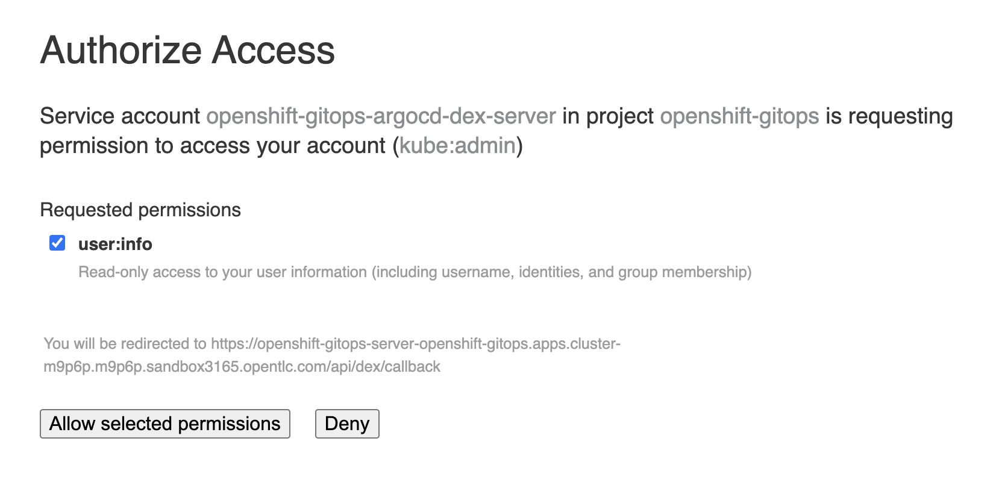

### Deploy a Sample Application

Once inside the the ArgoCD interface we are going to run through the steps to deploy a Pipelines Operator.

1. `Click` the `new app` in the left hand corner.

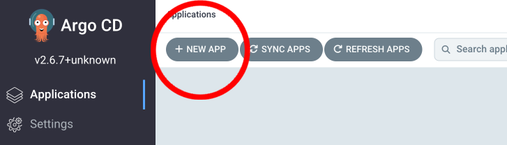

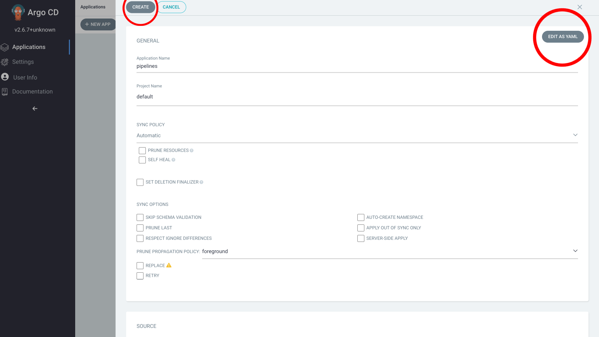

[start=2]
2. Once the new app screen pops up please fill out the information as follows:

----
Application Name: pipelines
Project Name: default
SYNC POLICY: Automatic
Repository URL: https://github.com/OpenShiftDemos/openshift-ops-workshops/
Revision: ocp4-dev
Path: support/gitops-catalog/openshift-pipelines-operator/overlays/latest
Cluster URL: https://kubernetes.default.svc
Namespace: openshift-operators
----

image::images/editasyaml.png[]

If you would rather edit as YAML then please replace/paste this YAML into ArgoCD:

----
apiVersion: argoproj.io/v1alpha1
kind: Application
metadata:
  name: pipelines
spec:
  destination:
    name: ''
    namespace: openshift-operators
    server: 'https://kubernetes.default.svc'
  source:
    path: support/gitops-catalog/openshift-pipelines-operator/overlays/latest
    repoURL: 'https://github.com/OpenShiftDemos/openshift-ops-workshops/'
    targetRevision: ocp4-dev
  sources: []
  project: default
  syncPolicy:
    automated:
      prune: false
      selfHeal: false
----

[start=3]
3. Once you have made those changes click `Create`. You should see 
your brand new app pop up on the ArgoCD dashboard.

image::images/pipelines-gitops2.png[]

Let's examine each of the descriptions of the recently deployed application to gain a better understanding of ArgoCD and the application we just added. The pipelines app has several descriptions that we will review:

|===
|*Project* | The project is the top-level organizational unit within ArgoCD. It is used to group applications and manage their access control. The default project is the default location where applications are placed when created. You can create multiple projects and specify the project where you want to place an application during creation. In this specific application we made the project `default`.
|*Labels*|Labels are key-value pairs that provide metadata about an application. They are used to organize and group applications based on specific criteria. In this case, no labels are specified for the application.*

|*Status*|The status of an application in ArgoCD shows whether it is healthy and synced with its desired state. A healthy application is one that has all its resources up and running, while a synced application is one where the actual state matches the desired state. In this case, the application is healthy and synced.
|*Repository*|The repository is the location where the application's source code is stored. In this case, the source code is stored in the Git repository located at https://github.com/OpenShiftDemos/openshift-ops-workshops/.
|*Target Revision*|The target revision is the Git commit hash or branch name that ArgoCD uses to deploy the application. In this case, the target revision is set to ocp4-dev.
|*Path*|The path is the location within the Git repository where the application manifests are stored. In this case, the application manifests are located in the support/gitops-catalog/openshift-pipelines-operator/overlays/latest directory.
|*Destination*|The destination is the location where the application will be deployed. In this case, the application will be deployed in the openshift-operators namespace within the cluster.
|*Namespace*|The namespace is the Kubernetes namespace where the application will be deployed. In this case, the application will be deployed in the openshift-operators namespace.
|*Created At*|The created at timestamp shows when the application was created in ArgoCD. In this case, the application was created 14 minutes ago.
|===

In addition to these descriptions, ArgoCD also supports pipelines, which can be used to automate the deployment process. Pipelines are a set of steps that define how an application is built, tested, and deployed. ArgoCD supports two types of pipelines: pre-sync and post-sync.

Pre-sync pipelines run before an application is synced with its desired state, while post-sync pipelines run after an application has been synced. Pipelines are defined using Kubernetes manifest files, and ArgoCD uses Kubernetes native tooling to execute them.

===  Adding a Banner to ArgoCD

In this section, we will add a banner to the ArgoCD login screen using GitOps. We will use a repository hosted on GitHub, which contains the necessary configuration files.

1. Similar to the last section `Click` the `new app` in the left hand corner.

2. Once the new app screen pops up please fill out the information as follows:

----
Application Name: banner
Project Name: default
SYNC POLICY: Automatic
Repository URL: https://github.com/OpenShiftDemos/openshift-ops-workshops/
Revision: ocp4-dev
Path: support/cluster-config/components/configs/banner/base/
Cluster URL: https://kubernetes.default.svc
Namespace: argocd
----

If you would rather edit as YAML then please replace/paste this YAML into ArgoCD:

----
apiVersion: argoproj.io/v1alpha1
kind: Application
metadata:
  name: banner
spec:
  destination:
    name: ''
    namespace: argocd
    server: 'https://kubernetes.default.svc'
  source:
    path: support/cluster-config/components/configs/banner/base/
    repoURL: 'https://github.com/OpenShiftDemos/openshift-ops-workshops/'
    targetRevision: ocp4-dev
  sources: []
  project: default
  syncPolicy:
    automated:
      prune: false
      selfHeal: false
----

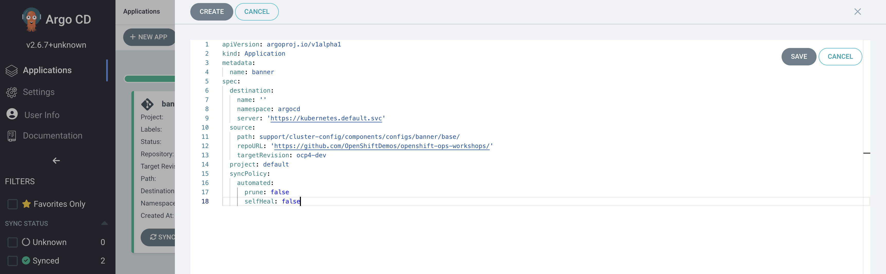

[start=3]
3. Click `Create`

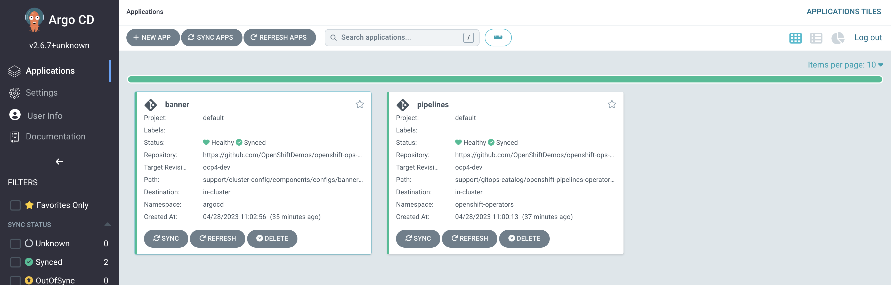

[start=4]
4. If you look back at your OpenShift Console you should now see your new banner on the top of the screen!

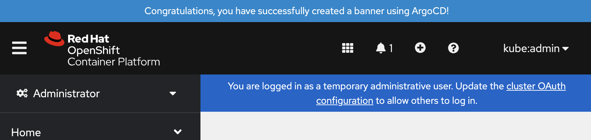

As an OpenShift admin using GitOps, you can use the Banners feature in ArgoCD and OpenShift to show crucial information to users. Banners help you provide alerts, warnings, or other information about the cluster, applications, or other resources. For instance, you can use banners to let users know about scheduled maintenance or downtime, security alerts, or other essential announcements.

=== Examining the banner

[start=1]

1. To examine the `banner`, click on the `banner` on Argo CD.

image::images/home-bannerbox.png[]

In the box to the right, look for `home-banner`.

2. Click on `home-banner` for more information. You should see that its `KIND` is a `ConsoleNotification`.

image::images/consolenotification.png[]

3. To see the home-banner, switch back to the terminal and type in the following command:

[source,bash,role="execute"]
oc get consolenotification

The output will show one console notification resource, which is named home-banner.
----
NAME          TEXT                                                                  LOCATION AGE
home-banner Congratulations, you have successfully created a banner using ArgoCD! BannerTop 5m33s
----

4. To change the text that is being deployed on the banner, type in the following command:

[source,bash,role="execute"]
oc edit consolenotification

5. Change the line where the text is being deployed to the following:

[source,yaml]
...
spec:
backgroundColor: '#0088ce'
color: '#fff'
location: BannerTop
text: oops, somebody changed this!
...

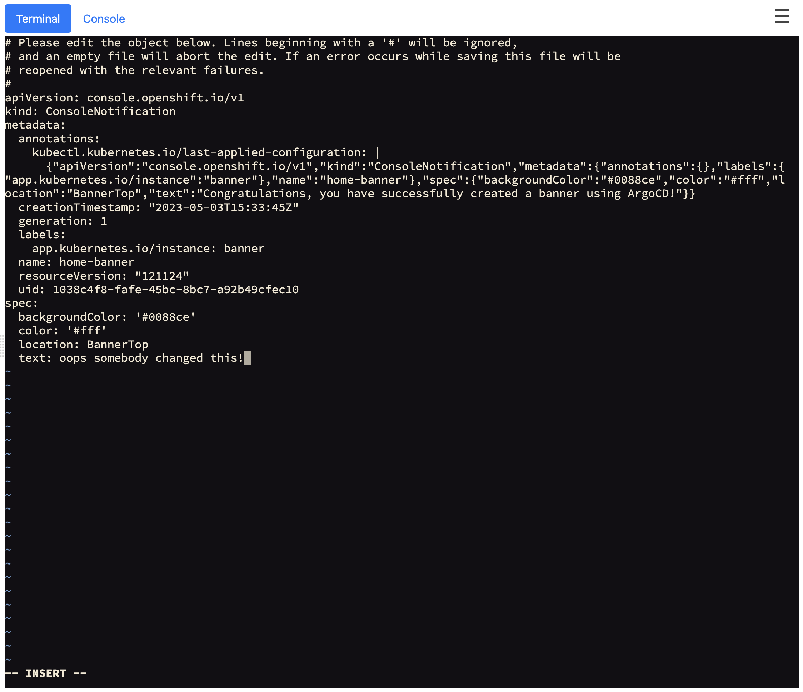

Remember to save the changes.

6. Check back on the console and see that the banner has been updated.

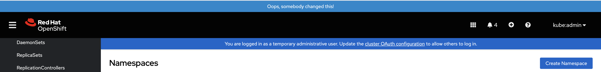

7. Go back to Argo CD and notice that the resource named home-banner is now Out of Sync.

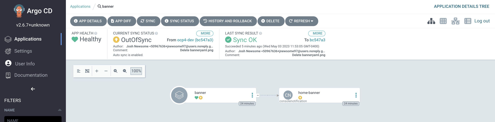

8. Select the home-banner box and select DIFF. Scroll down until you see the changes made earlier. Since self-heal is turned off, the changes won't be reverted automatically.

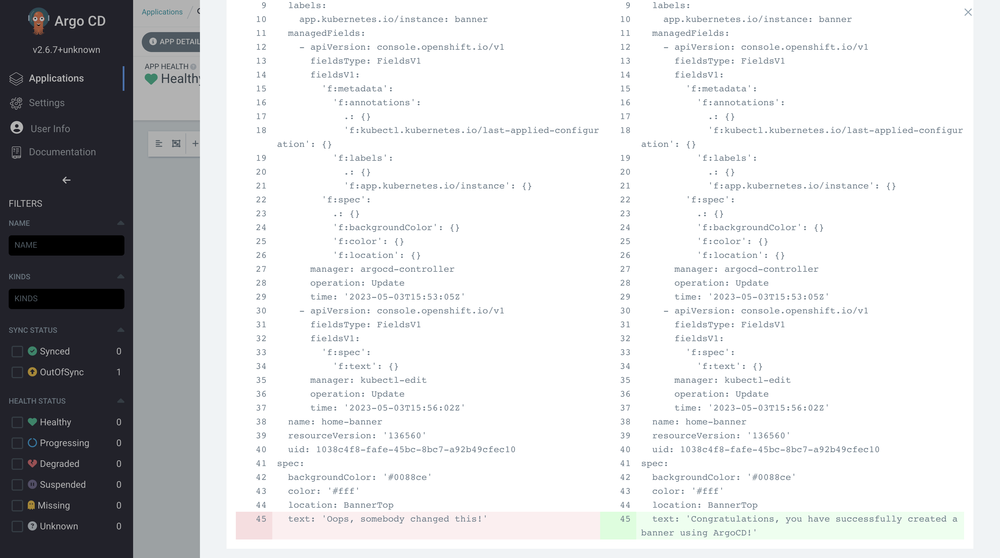

9 .To resync the resource, click on sync.

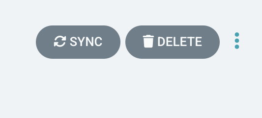

10. Go back to OpenShift and observe that everything is back to normal.

Note: Keep in mind that OpenShift GitOps can automatically revert these changes by enabling self-heal. If you are interested in enabling self-heal, you can find the option under 'app details'.
