## GitOps on OpenShift 

GitOps is a modern approach for managing cloud-based infrastructure and applications through Git. With GitOps, you define the desired system state in Git and utilize tools like ArgoCD to automatically sync it with your cluster or application. As an OpenShift administrator, you can simplify provisioning, configuration, and application delivery to Kubernetes using GitOps. Treating infrastructure and application definitions as code streamlines configuration changes across multiple clusters, allowing easy tracking and management of updates in Git.

image::images/gitops-images/argocd-sync-flow.png[]

### Installing OpenShift GitOps
To get started with OpenShift GitOps, this guide will walk you through the step-by-step process of installing the Red Hat OpenShift GitOps Operator to your OpenShift Container Platform cluster and logging in to the Argo CD instance. 

With Red Hat OpenShift GitOps, you can manage specific cluster-scoped resources like cluster Operators, optional Operator Lifecycle Manager (OLM) Operators, and user management.

### Installing OpenShift GitOps Operator in web console

----
Do not install the Community version of the Argo CD Operator, 
if you have already done so remove the Argo CD Community Operator 
before you install the Red Hat OpenShift GitOps Operator.
----
1. Now switch over to your *Openshift Web Console*:

{{ MASTER_URL }}

2. Open the `Administrator` perspective of the web console.

3. Navigate to `Operators` → `OperatorHub` in the menu on the left.

4. Search for `OpenShift GitOps`, click the `Red Hat OpenShift GitOps` tile, and then click `Install`.
   (Red Hat OpenShift GitOps will be installed in all namespaces of the cluster)

5. Select the `Update channel` as `gitops-1.8`. Leave all defaults selected and click `Install`.
   
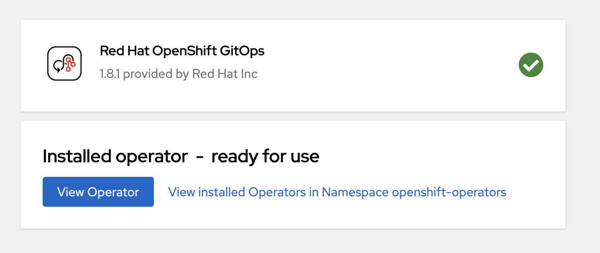

After the Red Hat OpenShift GitOps Operator is installed, it 
automatically sets up a ready-to-use Argo CD instance that 
is available in the openshift-gitops namespace, and an Argo CD
icon is displayed in the console toolbar. You can create subsequent 
Argo CD instances for your applications under your projects.

### Logging in to the Argo CD instance by using the Argo CD admin account
   
1. Navigate to the nine tiles at the top of your OpenShift Console. Once you click that you should see the `OpenShift GitOps Cluster Argo CD`. Select that.
+ 
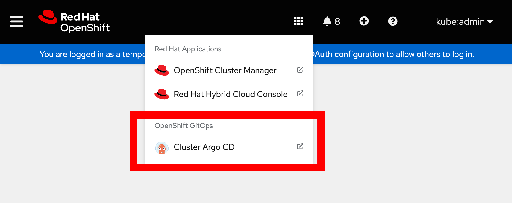
+
2. Ignore the certificate warning as shown below. `Proceed` to the website using the `advanced options` when you see that the connection is not private.
Currently, we're performing a basic installation of Argo that doesn't involve setting up the certificate or kubeadmin for regular users. However, these configurations can be implemented later as needed.
+
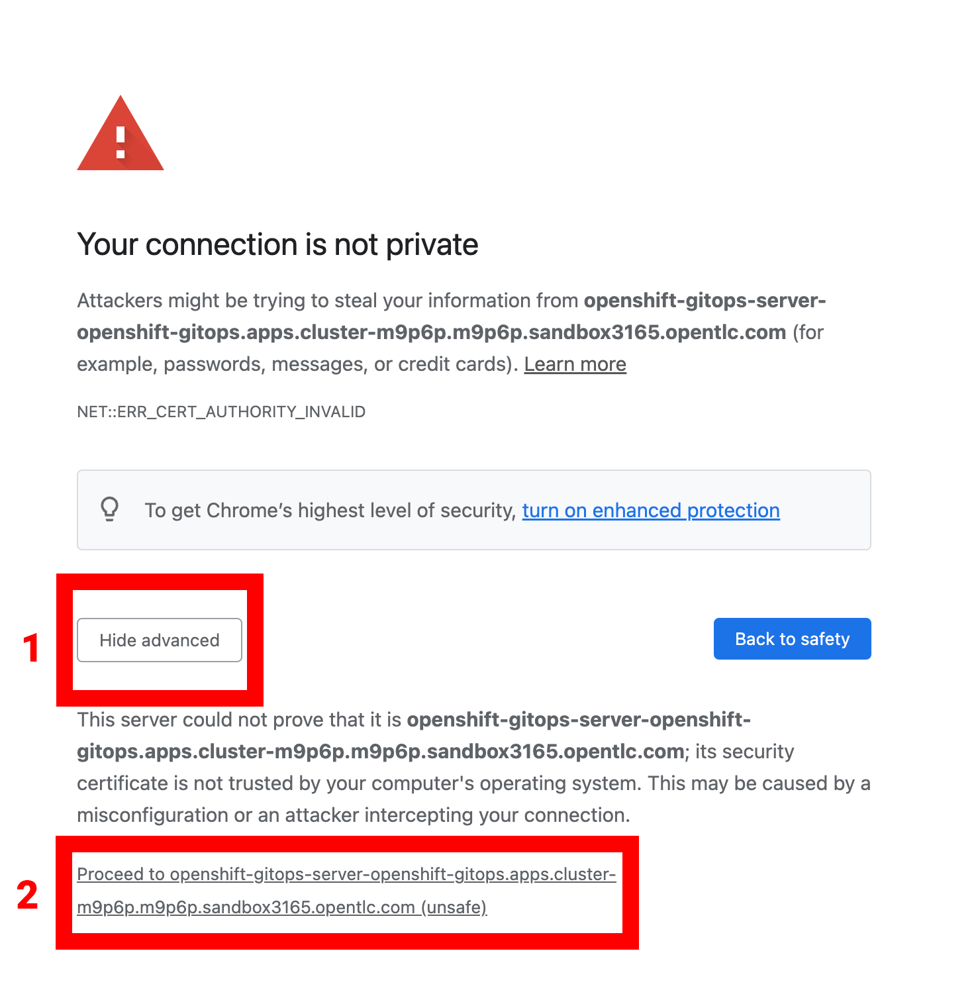
[start=3]
3. You can now `login` into the Argo CD UI by selecting `Log in Via OpenShift`.
+
image::images/gitops-images/login-openshift.png[]

Use the kubeadmin login details. 
Remember that the login is `kubeadmin` 
and the password is:

[source,role="copypaste"]
----
{{ KUBEADMIN_PASSWORD }}
----

[start=4]
4. You will enter the Argo CD UI. (Please authorize access)

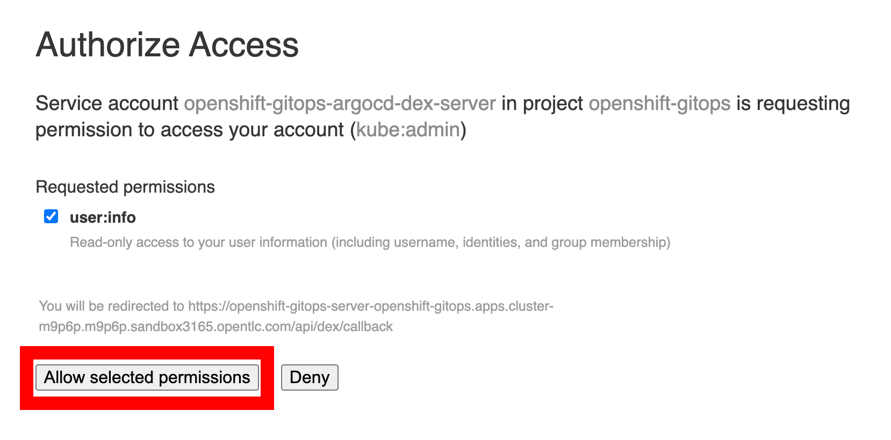

### Deploy a Sample Application

Once inside the ArgoCD interface we are going to run through the steps to deploy a platform component: the Pipelines Operator.

1. Click the `new app` button in the left hand corner.

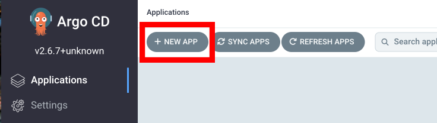

[start=2]
2. Once the new app screen pops up fill out the information as follows:

----
Application Name: pipelines
Project Name: default
SYNC POLICY: Automatic
Repository URL: https://github.com/OpenShiftDemos/openshift-ops-workshops/
Revision: ocp4-dev
Path: support/gitops-catalog/openshift-pipelines-operator/overlays/latest
Cluster URL: https://kubernetes.default.svc
Namespace: openshift-operators
----

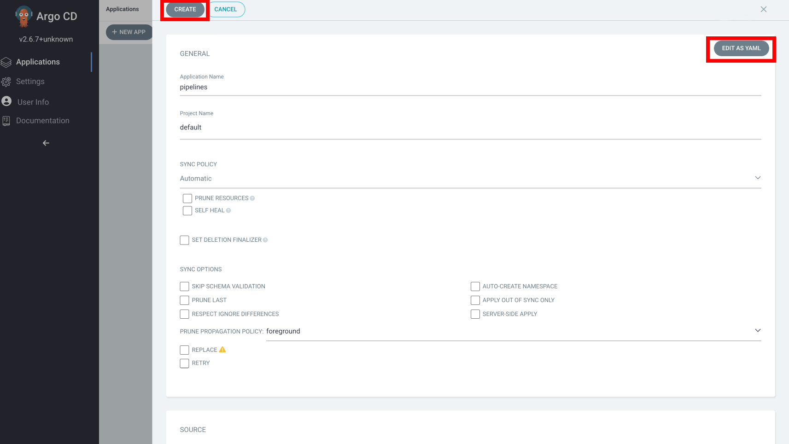

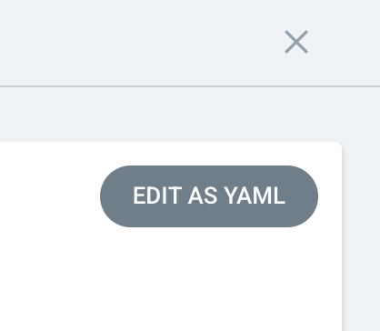

If you would rather edit as YAML then replace/paste this YAML into ArgoCD:

----
apiVersion: argoproj.io/v1alpha1
kind: Application
metadata:
  name: pipelines
spec:
  destination:
    name: ''
    namespace: openshift-operators
    server: 'https://kubernetes.default.svc'
  source:
    path: support/gitops-catalog/openshift-pipelines-operator/overlays/latest
    repoURL: 'https://github.com/OpenShiftDemos/openshift-ops-workshops/'
    targetRevision: ocp4-dev
  sources: []
  project: default
  syncPolicy:
    automated:
      prune: false
      selfHeal: false
----

[start=3]
3. Once you have made those changes click `Create`. You should see 
your brand new app pop up on the ArgoCD dashboard.

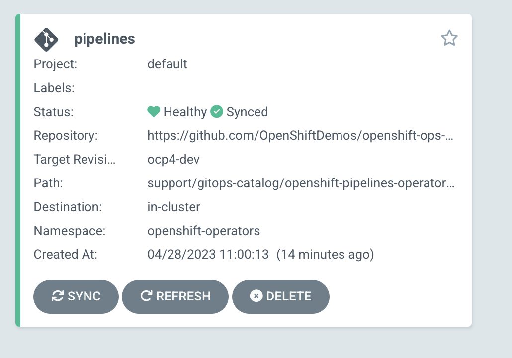

Let's examine each of the descriptions of the recently deployed application to gain a better understanding of ArgoCD and the application we just added. The `pipelines` app has several descriptions that we will review:

|===
|*Project* | The project is the top-level organizational unit within ArgoCD. It is used to group applications and manage their access control. The default project is the default location where applications are placed when created. You can create multiple projects and specify the project where you want to place an application during creation. In this specific application we made the project `default`.
|*Labels*|Labels are key-value pairs that provide metadata about an application. They are used to organize and group applications based on specific criteria. In this case, no labels are specified for the application.*

|*Status*|The status of an application in ArgoCD shows whether it is healthy and synced with its desired state. A healthy application is one that has all its resources up and running, while a synced application is one where the actual state matches the desired state. In this case, the application is healthy and synced.
|*Repository*|The repository is the location where the application's source code is stored. In this case, the source code is stored in the Git repository located at `https://github.com/OpenShiftDemos/openshift-ops-workshops/`.
|*Target Revision*|The target revision is the Git commit hash or branch name that ArgoCD uses to deploy the application. In this case, the target revision is set to `ocp4-dev`.
|*Path*|The path is the location within the Git repository where the application manifests are stored. In this case, the application manifests are located in the  
link:https://github.com/OpenShiftDemos/openshift-ops-workshops/tree/ocp4-dev/support/gitops-catalog/openshift-pipelines-operator/overlays/latest[`support/gitops-catalog/openshift-pipelines-operator/overlays/latest`] directory.
|*Destination*|The destination is the cluster in which the objects will be synced. It is composed of the targetted cluster API server URL and a namespace. In this case, the `server` points to the local cluster API server. "in-cluster" is the "the cluster in which your ArgoCD instance is installed" but other clusters can be configured to allow you to sync to additional clusters.
|*Namespace*|The namespace is the Kubernetes namespace where the application will be deployed. In this case, the application will be deployed in the openshift-operators namespace.
|*Created At*|The created at timestamp shows when the application was created in ArgoCD. In this case, the application was created 14 minutes ago.
|===

Resource hooks, prune, auto sync and the Reconciliation Cycle are some of the additional features that ArgoCD offers. Let's briefly explore them:

link:https://argo-cd.readthedocs.io/en/stable/user-guide/resource_hooks/[Resource hooks] allow you to execute custom actions or integrate with external systems at specific stages of the deployment lifecycle. They are a powerful way to extend and customize your application deployments in ArgoCD.

Prune is a link:https://argo-cd.readthedocs.io/en/stable/user-guide/sync-options/[sync option] that cleans up your cluster by removing outdated resources that are no longer present in your Git repository. It helps you keep your cluster up-to-date and consistent with your Git source of truth. 

link:https://argo-cd.readthedocs.io/en/stable/user-guide/auto_sync/[Auto sync] is a feature that automatically refreshes your application and applies any changes from your Git repository to your cluster every three minutes (by default). This feature enables the Reconciliation Cycle, which is the process of syncing your application state with your Git state.

By navigating to your `OpenShift Console` and accessing the `Operators` tab, you can verify the successful installation of the `Pipelines Operator` under the `Installed Operators` tab.

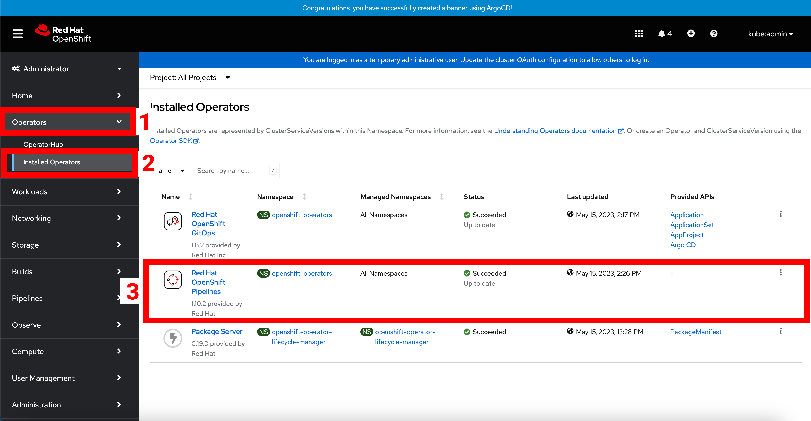

===  Adding a Banner to ArgoCD

In this section, we will add a banner to the top of the OpenShift console using GitOps. We will use a repository hosted on GitHub, which contains the necessary configuration files.

1. To create a new app in Argo, go back to the Argo console and look for the `new app` button in the top left corner.

2. Once the new app screen pops up fill out the information as follows:

----
Application Name: banner
Project Name: default
SYNC POLICY: Automatic
Repository URL: https://github.com/OpenShiftDemos/openshift-ops-workshops/
Revision: ocp4-dev
Path: support/cluster-config/components/configs/banner/base/
Cluster URL: https://kubernetes.default.svc
Namespace: argocd
----

If you would rather edit as YAML then replace/paste this YAML into ArgoCD:

----
apiVersion: argoproj.io/v1alpha1
kind: Application
metadata:
  name: banner
spec:
  destination:
    name: ''
    namespace: argocd
    server: 'https://kubernetes.default.svc'
  source:
    path: support/cluster-config/components/configs/banner/base/
    repoURL: 'https://github.com/OpenShiftDemos/openshift-ops-workshops/'
    targetRevision: ocp4-dev
  sources: []
  project: default
  syncPolicy:
    automated:
      prune: false
      selfHeal: false
----

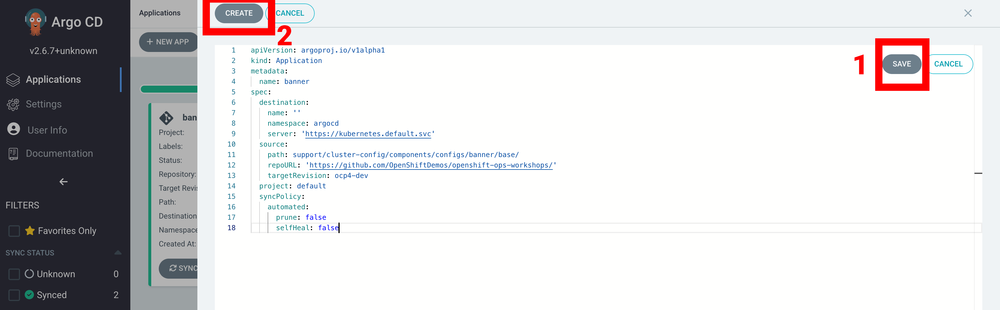

[start=3]
3. Click `Create`

image::images/gitops-images/argo_appsdeployed.png[]

[start=4]
4. If you look back at your OpenShift Console you should now see your new banner on the top of the screen!

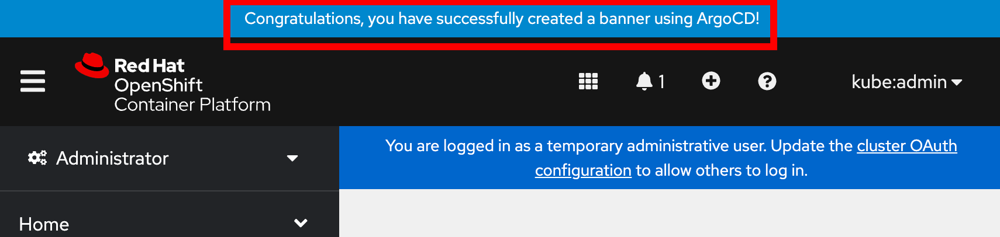

As an OpenShift admin using GitOps, you can use the Banners feature in ArgoCD and OpenShift to show crucial information to users. Banners help you provide alerts, warnings, or other information about the cluster, applications, or other resources. For instance, you can use banners to let users know about scheduled maintenance or downtime, security alerts, or other essential announcements.

=== Examining the banner

[start=1]
1. To examine the `banner`, click on the `banner` on Argo CD.

image::images/gitops-images/argo_appsdeployed.png[]

In the box to the right, look for `home-banner`.

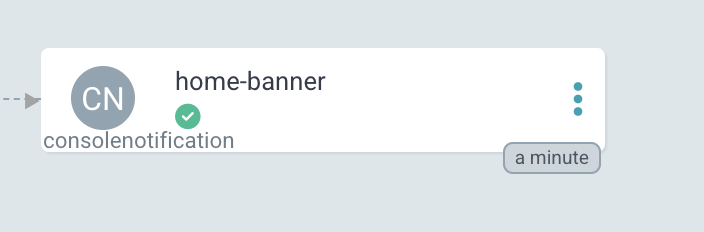

[start=2]
2. Click on `home-banner` for more information. You should see that its `kind` is a `ConsoleNotification`.

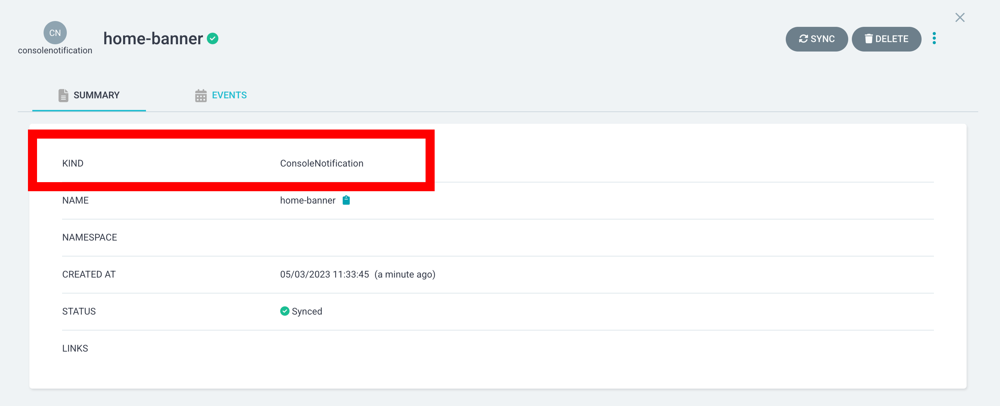

[start=3]
3. To see the `home-banner`, switch back to the `terminal` and click on the following command:

[source,bash,role="execute"]
oc get consolenotification

The output will show one `console notification` resource, which is named `home-banner`.
----
NAME          TEXT                                                                  LOCATION AGE
home-banner Congratulations, you have successfully created a banner using ArgoCD! BannerTop 5m33s
----

[start=4]
4. To change the text that is being deployed on the banner, click on the following command:

[source,bash,role="execute"]
----
oc patch consolenotification home-banner -p '{"spec":{"text":"oops somebody changed this!"}}' --type=merge
----

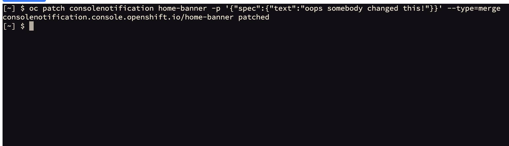

This patch will `change` the line where the text is being deployed to the following:

[source,yaml]
...
spec:
backgroundColor: '#0088ce'
color: '#fff'
location: BannerTop
text: oops, somebody changed this!
...

This is what the file looks after the patch:

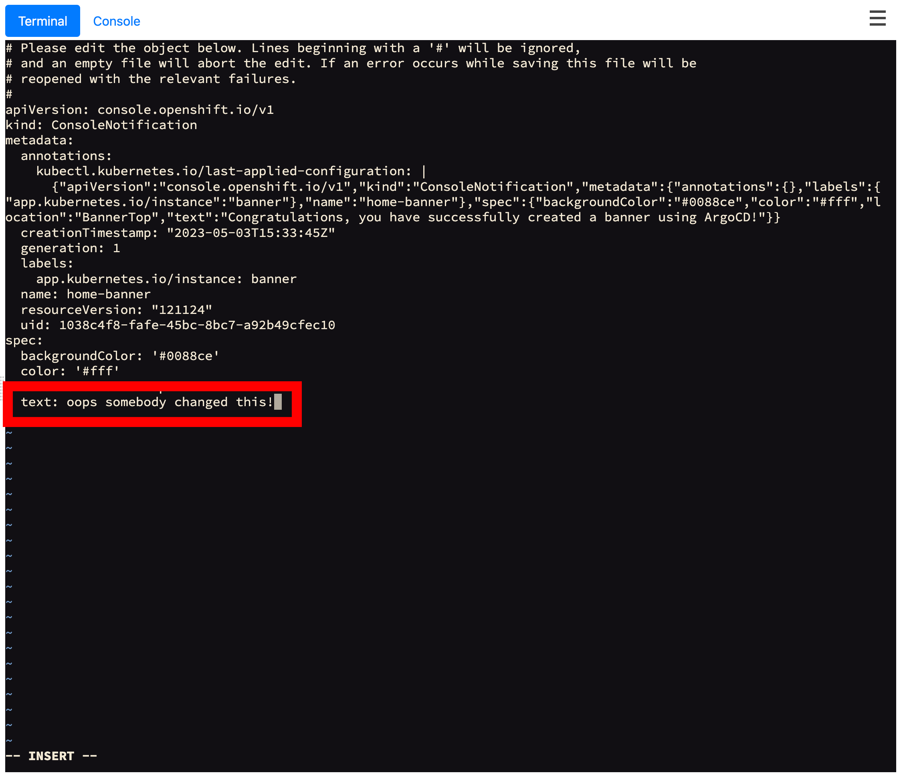

you can also see the change by using this command again:

[source,bash,role="execute"]
----
oc get consolenotification
----

[start=6]
6. Check back on the `console` and see that the `banner` has been updated.

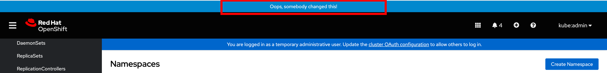

[start=7]
7. Go back to Argo CD and notice that the resource named `home-banner` is now `Out of Sync`. Argo CD considers the application out of sync because the desired state as expressed in Git no longer matches the target state in the cluster after the direct edit was performed.

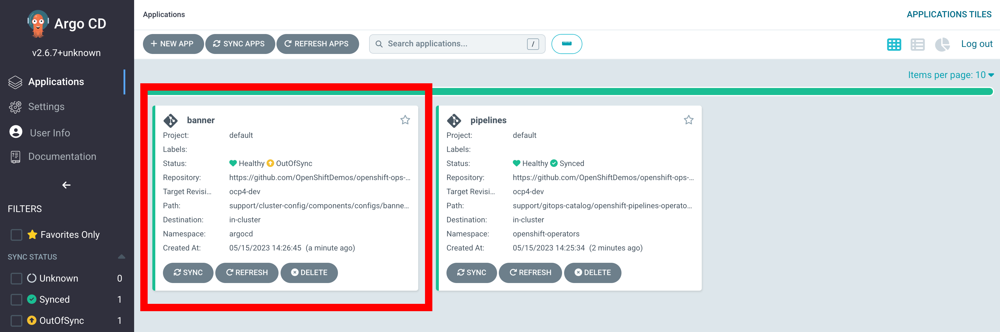

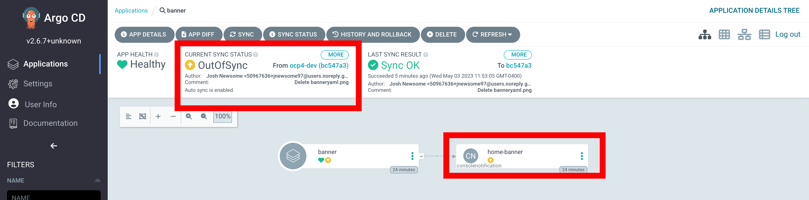

[start=8]
8. Select the `home-banner` box and select `DIFF`. Scroll down until you see the changes made earlier. Since `self-heal` is turned off, the changes won't be reverted automatically.

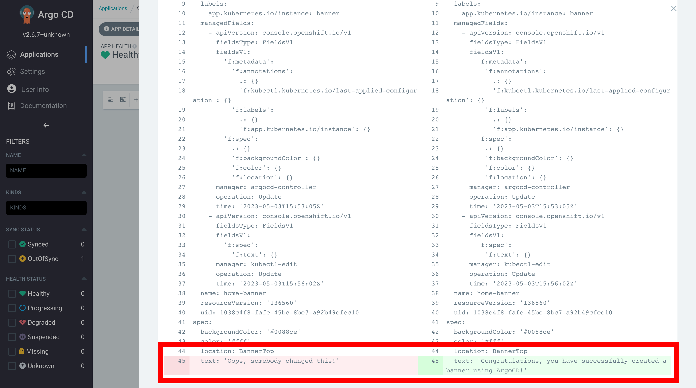

In the diff output, the text from the GitHub repository is displayed in green, indicating that it is the original content. The red text represents the changes you made, highlighting the modified portions.

This helps you easily identify the specific sections of the banner text that have been altered. This visual distinction helps you understand the changes you made and how they differ from the original content stored in the repository.

[start=9]
9. To resync the resource, click on `sync`. You may have to press the `synchronize` button one more time after.

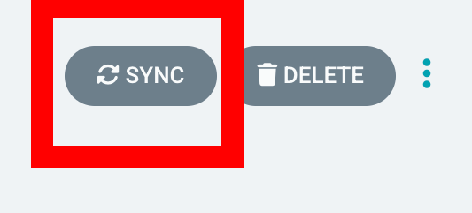

[start=10]
10. Go back to OpenShift and observe that the text in the banner has returned to it's previous state "Congratulations, you have successfully created a banner using ArgoCD!" .

The banner has been restored to its desired state specified in Git by Argo CD.

image::images/gitops-images/argo_appsdeployed.png[]

Note: Keep in mind that OpenShift GitOps can automatically revert these changes by enabling self-heal. If you are interested in enabling self-heal, you can find the option under 'app details'. Self-heal is a feature of OpenShift GitOps that allows you to automatically restore your cluster or application to a desired state if it deviates from the configuration stored in a Git repository. This way, you can ensure consistency and reliability across different environments and avoid manual intervention or errors. 

In this module we used GitOps to configure an operator as well as a banner in our cluster. While these are relatively small changes, GitOps can be used to configure all aspects of a cluster and is an important tool for ensuring consistent and reliable configuration across a fleet of clusters in an organization.
