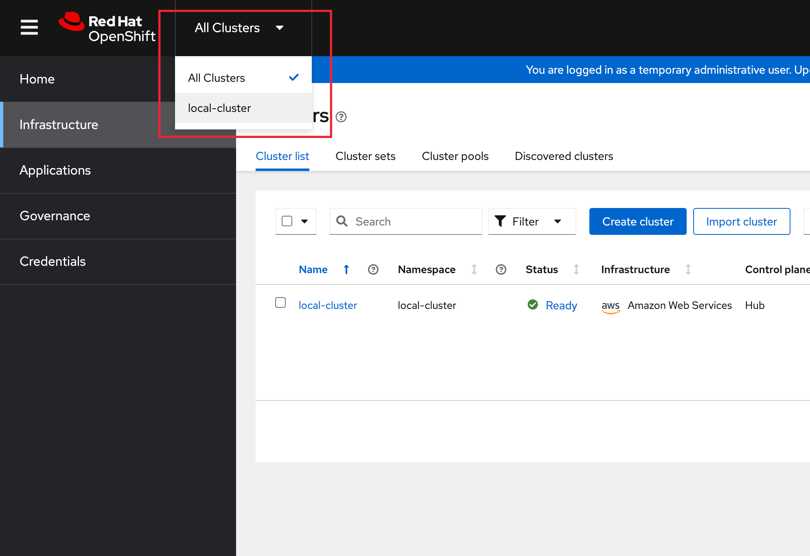
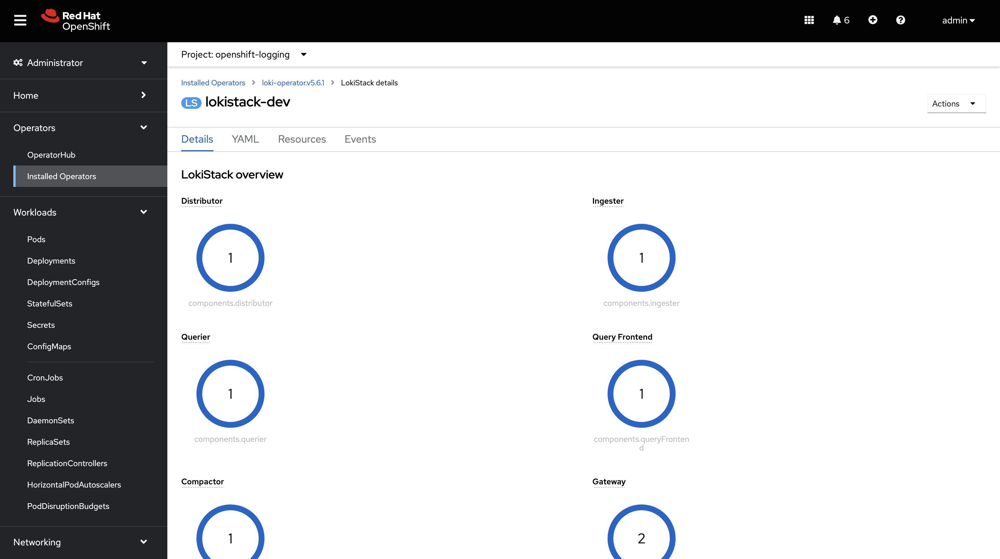
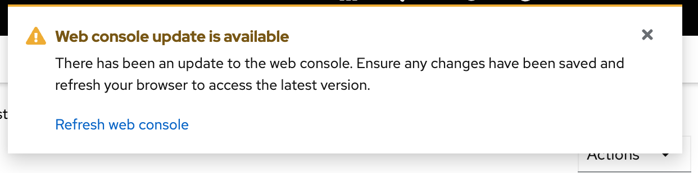
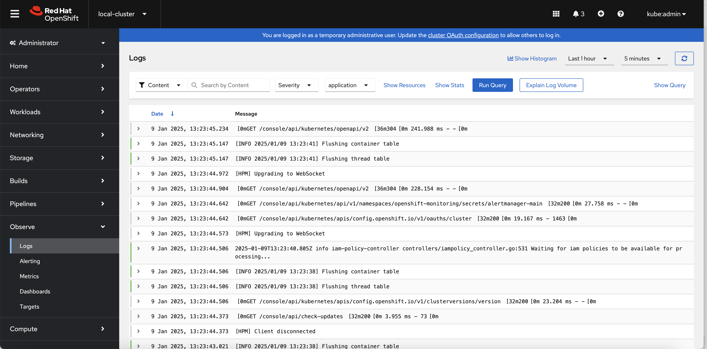
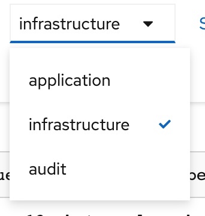
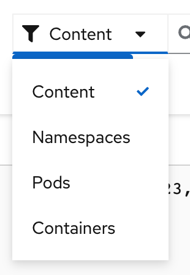
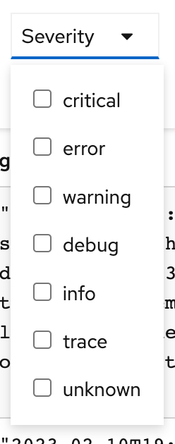
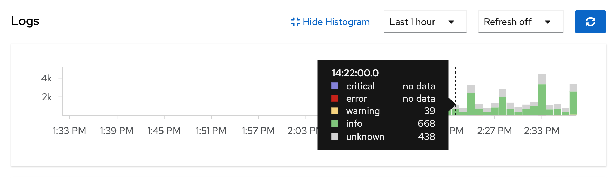

## Summary - OpenShift Logging
In this lab you will explore the logging capabilities of
OpenShift 4.16. This module will break down all the new logging
features within 4.16.

An extremely important function of OpenShift is collecting and aggregating
logs from the environments and the application pods it is running. 

The cluster logging components are based upon Vector and Loki. Vector is a high-performance observability data pipeline that allows users to configure "log forwarders" to direct Openshift logs to different log collectors.  Loki is log storage built around the idea of only indexing metadata about your logs with labels (just like Prometheus labels). Log data itself is then compressed and stored in chunks in object stores, or even locally on the filesystem.

[Note]
====
More information may be found on the official
link:https://docs.openshift.com/container-platform/4.16/logging/cluster-logging.html[OpenShift
documentation site]
====

[Note]
====
This exercise is done almost entirely using the OpenShift web console. All of
the interactions with the web console are effectively creating or
manipulating API objects in the background. It is possible to fully automate
the process and/or achieve the same results using the command line interface (CLI)
or other tools, but these methods are not covered in the exercise or documentation
at this time.
====

#### Install the `Loki`,  `Cluster Logging`, and `Cluster Observability` Operators in the cluster

In order to install and configure the logging stack into the cluster,
additional operators need to be installed. we'll cover below how these can be 
installed from the `Operator Hub` from within the cluster via the GUI.

When using operators in OpenShift, however, it is firstly important to understand 
the basics of some of the underlying principles that make up the Operators.
`CustomResourceDefinion (CRD)` and `CustomResource (CR)` are two Kubernetes
objects. `CRDs` are generic pre-defined
structures of data. The operator understands how to apply the data that is
defined by the `CRD`. In terms of programming, `CRDs` can be thought as being
similar to a class. A `CustomResource (CR)` is an actual implementation of the
`CRD`, where the structured data has actual values. These values are what the
operator will use when configuring its service. Again, in programming terms,
`CRs` would be similar to an instantiated object of the class.

The general pattern for using Operators is to firstly, install the Operator, which
will create the necessary `CRDs`. After the `CRDs` have been created, we can
create the `CR` which will tell the operator how to act, what to install,
and/or what to configure. For installing `openshift-logging`, we will follow
this pattern.

To begin, use the following link to log-in
to the `OpenShift Cluster's GUI`. (note: do not use the built-in 
console for these steps)
`{{ MASTER_URL }}`

You may need to switch from `All-Clusters` to `local-cluster`.





then follow these steps:

[start=1]  
1. **Install the `Cluster Logging Operator`:**  
   + [Note]====
     The `Cluster Logging` operator needs to be installed in the `openshift-logging` namespace. You can check that the `openshift-logging` namespace was created from the previous steps.
     ====  
   a. In the OpenShift console, click `Operators` → `OperatorHub`.  
   b. Type `OpenShift Logging` in the search box and click the `Red Hat OpenShift Logging` card from the list of available Operators (choose 'stable-6.1'), and click `Install`.  
   c. On the `Install Operator` page, *select Update Channel `stable 6.1` and `Version 6.1.0`*. Leave all other defaults unchanged and then click `Install`.  

   image::images/openshiftloggingoperator.png[]

2. **Install the `Loki Operator`:**  
   a. In the OpenShift console, click `Operators` → `OperatorHub`.  
   b. Type `Loki Operator` in the search field and click the `Loki Operator` card from the list of available Operators (choose `stable-6.1` and Version '6.1.0'), and then click `Install`.  
   c. On the `Create Operator Subscription` page, select *Update Channel `stable-6.1`*. You should also select `'Enable Operator recommended cluster monitoring on this Namespace'`. Leave all other defaults and click `Install`. Please manually approve if asked.

   image::images/lokioperator.png[]

3. **Install the `Cluster Observability Operator`:**  
   a. In the OpenShift console, click `Operators` → `OperatorHub`.  
   b. Type `Cluster Observability Operator` in the search field and click the `Cluster Observability Operator` card from the list of available Operators (in this example, we are using '0.4.1'), and then click `Install`.  
   c. On the `Create Operator Subscription` page, select *Update Channel `development`*. Leave all other defaults and click `Install`.  

   image::images/clusterobservabilityoperator.png[]

This now makes the Operator available to all users and projects that use this
OpenShift Container Platform cluster.

3. Verify the operator installations:

  a. Switch to the `Operators` → `Installed Operators` page.

  b. Make sure the `All Projects` project is selected.

  c. In the _Status_ column you should see green checks with either
     `InstallSucceeded` or `Copied` and the text _Up to date_.
+
[Note]
====
During installation an operator might display a `Failed` status. If the
operator then installs with an `InstallSucceeded` message, you can safely
ignore the `Failed` message.
====

4. Troubleshooting (optional/if needed)
+
If either operator does not appear as installed, follow these steps to troubleshoot further:
+
* On the Copied tab of the `Installed Operators page`, if an operator shows a
  Status of Copied, this indicates the installation is in process and is
  expected behavior.
+
* Switch to the `Catalog` → `Operator Management` page and inspect the `Operator
  Subscriptions` and `Install Plans` tabs for any failure or errors under Status.
+
* Switch to the `Workloads` → `Pods` page and check the logs in any Pods in the
  `openshift-logging` and `openshift-operators` projects that are reporting issues.
  
#### Configuring a bucket with AWS
  
     1. You should have received some `AWS credentials`. You can remind yourself of these 
    on the screen from which you orignally accessed this workshop. You will need to use 
    these credentials throughout the next few steps.
    
     2. Firstly use the `'aws configure'` command to set up your `s3 (storage) bucket`. 
+
[source,bash,role="execute"]
----
aws configure
----
Fill out the `AWS Access Key ID` and the `AWS Secret Access Key` 
from the credentials on the original access screen page mentioned above. Use
`us-east-1` as region and `json` as default output.
This is an example below:
+
 AWS Access Key ID [None]: w3EDfSERUiLSAEXAMPLE (PLEASE REPLACE)
 AWS Secret Access Key [None]: mshdyShDTYKWEywajsqpshdREXAMPLE (PLEASE REPLACE)
 Default region name [None]: us-east-1
 Default output format [None]: json
 
3. Check the `contents` of the aws folder:

[source,bash,role="execute"]
----
ls .aws
----
you should see two folders `'config'` and `'credentials'`. This will be the 
location in which we will put the `s3 bucket config`.

[start=4]
4. Check that the instance was successful and that the information is correct:

[source,bash,role="execute"]
----
cat .aws/credentials 
----

You should see that all the information is correct and matches
your config. This is an example output:

----
[default]
aws_access_key_id = w3EDfSERUiLSAEXAMPLE
aws_secret_access_key = mshdyShDTYKWEywajsqpshdNSUWJDA+1+REXAMPLE
----

[start=5]
5. Now it is time to `create` the bucket with the information 
   that you have provided. You can choose whatever bucket name you 
   would like. Pick a name you will be able to recognize later.
   In this case we have named it pg2nw which is the `GUID` of the console.
   
   
If you want to use your `GUID` as your `bucket name` please do the following:

to export we do the following:

[source,bash,role="execute"]
export GUID=`hostname | cut -d. -f2`

to view the GUID we do:

[source,bash,role="execute"]
echo $GUID

The output of this command is your bucket name.

Next, run the following command to `create` the bucket replace <pg2nw> with your own `GUID`
 
[source,bash,role="execute"]
aws --profile default s3api create-bucket --bucket <pg2nw> --region us-east-1 

This is creating an `aws bucket` from the `profile` called 
`default` which we set up earlier. Please remember your 
bucket name as we will be using this later.

You may get an error if you make the bucket name too generic. If you see something like this `error`, try another name:
----
An error occurred (BucketAlreadyExists) when calling 
the CreateBucket operation: The requested bucket name 
is not available. The bucket namespace is shared by 
all users of the system. Please select a different 
name and try again.
----

You will know you have been successful when you see this:
----
{
    "Location": "/pg2nw"
}
----
 
#### Creating a Secret within Openshift
  
Next you need to `configure` your secrets. This `secret` will store the access credentials  
  for the `s3 bucket` we just created. This will later be used by
  the `LokiStack` to store `logging data`.
  
  a. Navigate to the Console and click `Workloads` -> `Secrets`
  
  b. Next, select `Create` and `from YAML`
  
  c. Remove the current YAML and replace it with this YAML (Make sure to change to match your AWS creds):
  
[source,yaml]
----
apiVersion: v1
kind: Secret
metadata:
  name: lokistack-dev-s3
  namespace: openshift-logging
stringData:
  access_key_id: w3EDfSERUiLSAEXAMPLE (Replace with your aws creds)
  access_key_secret: mshdyShDTYKWEywajsqpshdNSUWJDA+1+REXAMPLE (Replace with your aws creds)
  bucketnames: replace with the name of your bucket (we called it pg2nw in our example)
  endpoint: https://s3.us-east-1.amazonaws.com/
  region: us-east-1
----

[start=4]
4. Once you are happy, click `Create`.
  
5. Check that the `lokistack-dev-s3 secret` has been created by running the following command:

[source,bash,role="execute"]
kubectl get secrets -n openshift-logging
 
 You should see something like this:

```
NAME                                       TYPE                      DATA   AGE
builder-dockercfg-vppmj                    kubernetes.io/dockercfg   1      10m
cluster-logging-operator-dockercfg-bc7nd   kubernetes.io/dockercfg   1      4m58s
cluster-logging-operator-dockercfg-rr9kb   kubernetes.io/dockercfg   1      5m2s
default-dockercfg-rtkcq                    kubernetes.io/dockercfg   1      10m
deployer-dockercfg-t6pjc                   kubernetes.io/dockercfg   1      10m
lokistack-dev-s3                           Opaque                    5      5s
```

#### Creating the LokiStack custom resource (CR)

1. Now, head on over to the `console` and go to `Administration` and `CustomResourceDefinitions`. 
  
  a. Select the `Create CustomResourceDefinition`
  
  b. Next you should remove the current YAML and replace it with this YAML:
  
[source,yaml]
----
apiVersion: loki.grafana.com/v1
kind: LokiStack
metadata:
  name: logging-loki
  namespace: openshift-logging
spec:
  managementState: Managed
  size: 1x.extra-small
  storage:
    schemas:
    - effectiveDate: '2024-10-01'
      version: v13
    secret:
      name: lokistack-dev-s3
      type: s3
  storageClassName: gp3-csi
  tenants:
    mode: openshift-logging
----

c. Switch to the `Operators` → `Installed Operators` page.

d. Make sure the `All Projects` project is selected.

e. Select the `Loki Operator`.

d. Navigate to the `LokiStack` tab and click on `lokistack-dev`. 

It may take up to a minute to be up and running but it should eventually look like this:



_Figure 1: LokiStack +

We haven't set a ruler so you should see `No members`

#### Setting up collector’s

In this section, we will configure the 'collector' service account with these commands to enable log collection for applications, audits, and infrastructure within the OpenShift cluster: 

[source,bash,role="execute"]
----
oc create sa collector -n openshift-logging
oc adm policy add-cluster-role-to-user logging-collector-logs-writer -z collector -n openshift-logging
oc project openshift-logging
oc adm policy add-cluster-role-to-user collect-application-logs -z collector
oc adm policy add-cluster-role-to-user collect-audit-logs -z collector
oc adm policy add-cluster-role-to-user collect-infrastructure-logs -z collector
----

This is what each command does:

* Create a service account for the collector
* Allow the collector’s service account to write data to the LokiStack CR
* Allow the collector’s service account to collect logs
* Switch to the openshift-logging project
* The last 3 commands assign the `collector` service account permissions to gather application, audit, and infrastructure logs in the OpenShift cluster.

Now, head on over to the `console` and go to `Administration` and `CustomResourceDefinitions`. 
  
  a. Select the `Create CustomResourceDefinition`
  
  b. Create a UIPlugin CR to enable the Log section in the Observe tab. Remove the current YAML and replace it with this YAML:
  
[source,yaml]
----
apiVersion: observability.openshift.io/v1alpha1
kind: UIPlugin
metadata:
  name: logging
spec:
  type: Logging
  logging:
    lokiStack:
      name: logging-loki
----

  c. Click Create.

#### Verify that the UIPlugin CR is enabled

Now that Logging has been created, let's verify that things are working.

1. Switch to the `Workloads` → `Pods` page.

2. Select the `openshift-logging` project.

You should see a variety of `logging-loki` pods

Alternatively, you can verify from the command line by using the following command:

[source,bash,role="execute"]
----
oc get pods -n openshift-logging
----

Which will eventually show you something like this:

----
cluster-logging-operator-7c8fdf7c6-8r4th        1/1     Running   0          24m
logging-loki-compactor-0                        1/1     Running   0          11m
logging-loki-distributor-56b5698d5b-pkvt7       1/1     Running   0          11m
logging-loki-distributor-56b5698d5b-qrz76       1/1     Running   0          11m
logging-loki-gateway-7d84bc5884-tfpf4           2/2     Running   0          11m
logging-loki-gateway-7d84bc5884-wdn2j           2/2     Running   0          11m
logging-loki-index-gateway-0                    1/1     Running   0          11m
logging-loki-index-gateway-1                    1/1     Running   0          10m
logging-loki-ingester-0                         1/1     Running   0          11m
logging-loki-ingester-1                         1/1     Running   0          9m58s
logging-loki-querier-7b9795965d-2vqzn           1/1     Running   0          11m
logging-loki-querier-7b9795965d-9qqwx           1/1     Running   0          11m
logging-loki-query-frontend-8587b5c8f9-fsgjx    1/1     Running   0          11m
logging-loki-query-frontend-8587b5c8f9-wmfzr    1/1     Running   0          11m
----

You should see a box pop up in the top right corner after about 
30 seconds to a minute. It will say `"Web console update is available"` 
and will prompt you to refresh your browser. Go ahead and do that; 
this change will now allow you to access logs.

If you come across any references to Fluentd status, 
kindly disregard them, as they are not relevant to our current task.



#### ClusterLogForwarder Setup

Now, head on over to the `console` and go to `Administration` and `CustomResourceDefinitions`. 
  
  a. Select the `Create CustomResourceDefinition`
  
  b. Create a ClusterLogForwarder CR to configure log forwarding. Remove the current YAML and replace it with this YAML:
  
[source,yaml]
----
apiVersion: observability.openshift.io/v1
kind: ClusterLogForwarder
metadata:
  name: collector
  namespace: openshift-logging
spec:
  serviceAccount:
    name: collector
  outputs:
  - name: default-lokistack
    type: lokiStack
    lokiStack:
      authentication:
        token:
          from: serviceAccount
      target:
        name: logging-loki
        namespace: openshift-logging
    tls:
      ca:
        key: service-ca.crt
        configMapName: openshift-service-ca.crt
  pipelines:
  - name: default-logstore
    inputRefs:
    - application
    - infrastructure
    - audit
    outputRefs:
    - default-lokistack
----

  c. Click Create.

#### Observing The Logs

1. At this Point you can go to `Observe` -> `Logs` on the left hand menu. 



2. Once you are inside you will notice a menu which is currently 
set to `Applications`. change this instead to `infrastructure`

You should now see all the `logs` for `Infrastructure`. The logs are split 
into 3 sections: `application`, `infrastructure` and `audits`. We will set 
up audits and the `log forwarder` in the next part, but lets have a 
look through the different parts of this.



As we can see in the graphic below, you can filter by `Content`, `Namespaces`, `Pods`, and `Containers`. 
This can be useful to narrow down searches when looking for something more specific.



You can further specify the logs you are looking for by using the other 
drop down menu for `Severity`. This menu breaks the logs down into `critical`, 
`error`, `warning`, `debug`, `info`, `trace`, and `unknown` logging categories.



The final piece of this is the `histogram`. This gives the user a more visual look into the logs. (This may take a little bit of time to populate)



#### Congratulations, you have now completed the logging section!


