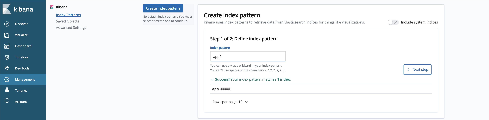
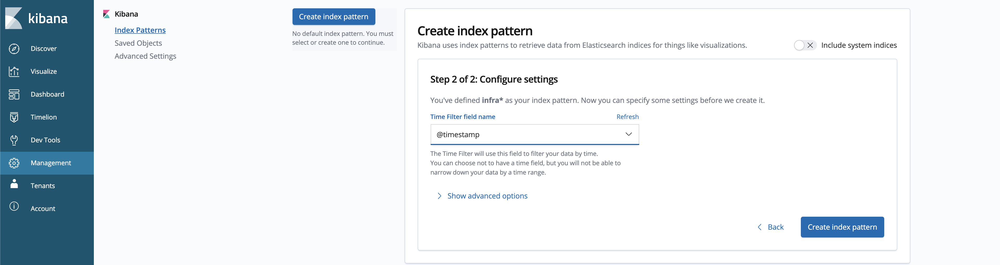
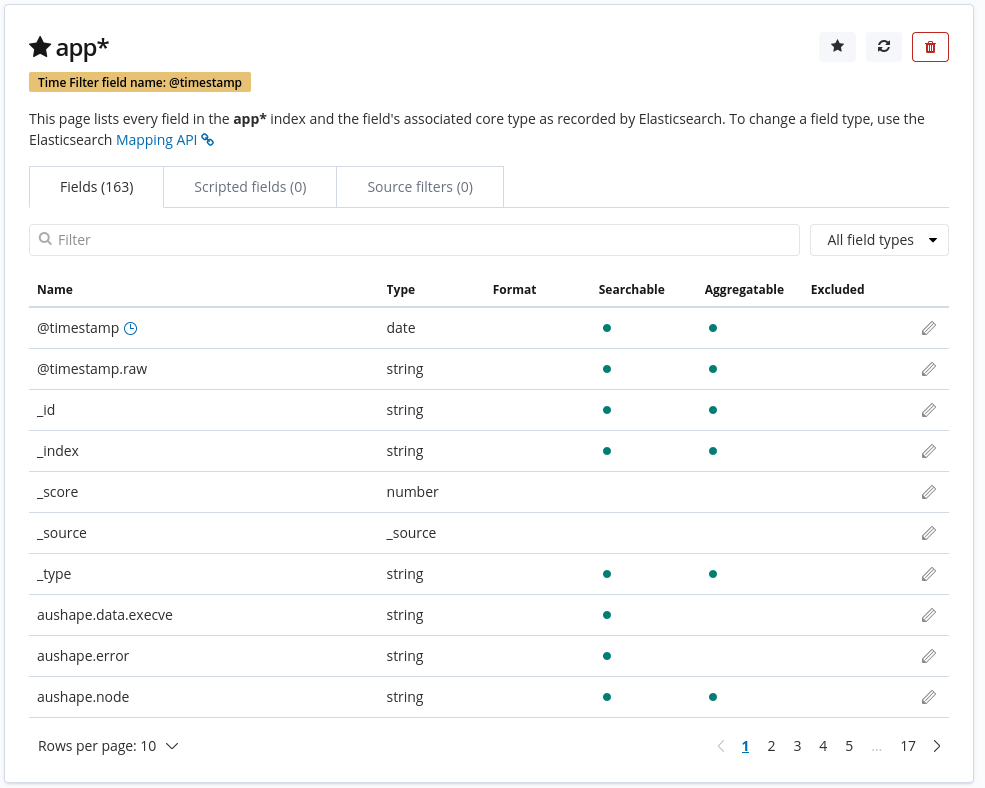
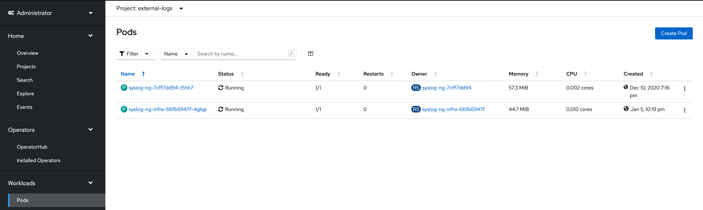
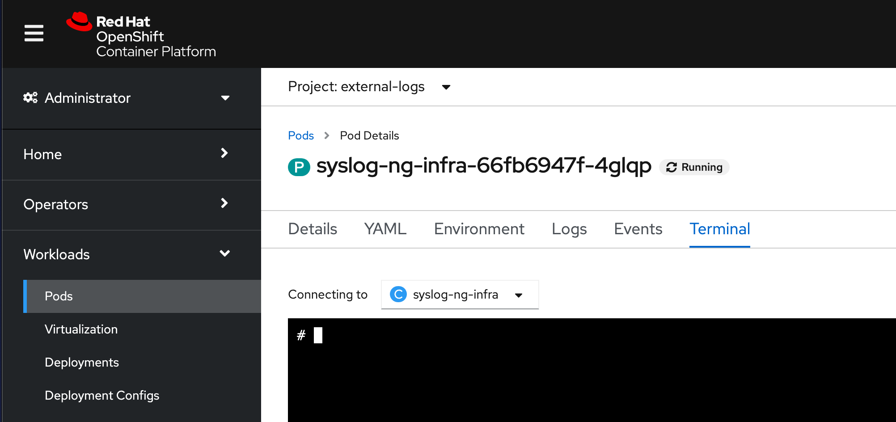
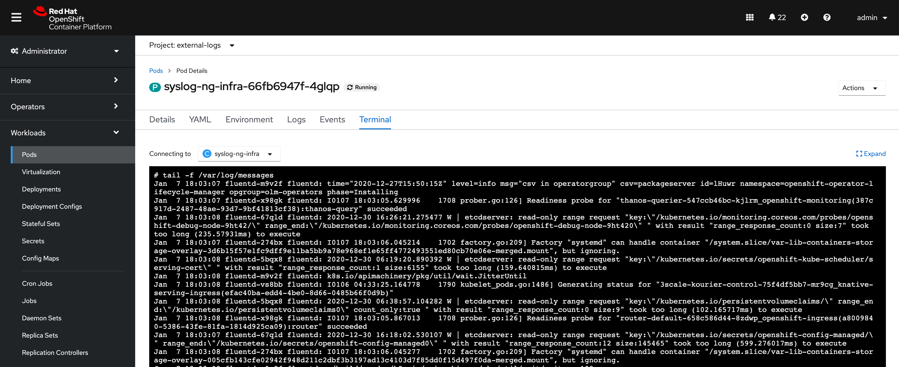

## OpenShift Log Aggregation
In this lab you will explore the logging aggregation capabilities of
OpenShift.

An extremely important function of OpenShift is collecting and aggregating
logs from the environments and the application pods it is running. OpenShift
ships with an elastic log aggregation solution: *EFK*. (**E**lasticSearch,
**F**luentd and **K**ibana)

The cluster logging components are based upon Elasticsearch, Fluentd, and
Kibana (EFK). The collector, Fluentd, is deployed to each node in the
OpenShift cluster. It collects all node and container logs and writes them to
Elasticsearch (ES). Kibana is the centralized, web UI where users and
administrators can create rich visualizations and dashboards with the
aggregated data. Administrators can see and search through all logs.
Application owners and developers can allow access to logs that belong to
their projects. The EFK stack runs on top of OpenShift.

[Warning]
====
This lab requires that you have completed the infra-nodes lab. The logging
stack will be installed on the `infra` nodes that were created in that lab.
====

[Note]
====
More information may be found on the official
link:https://docs.openshift.com/container-platform/4.9/logging/cluster-logging.html[OpenShift
documentation site]
====

[Note]
====
This exercise is done almost entirely using the OpenShift web console. All of
the interactions with the web console are effectively creating or
manipulating API objects in the background. It is possible to fully automate
the process and/or do it using the CLI or other tools, but these methods are
not covered in the exercise or documentation at this time.
====

### Deploying OpenShift Logging

OpenShift Container Platform cluster logging is designed to be used with the
default configuration, which is tuned for small to medium sized OpenShift
Container Platform clusters. The installation instructions that follow
include a sample Cluster Logging Custom Resource (CR), which you can use to
create a cluster logging instance and configure your cluster logging
deployment.

If you want to use the default cluster logging install, you can use the
sample CR directly.

If you want to customize your deployment, make changes to the sample CR as
needed. The following describes the configurations you can make when
installing your cluster logging instance or modify after installtion. See the
Configuring sections for more information on working with each component,
including modifications you can make outside of the Cluster Logging Custom
Resource.

#### Create the `openshift-logging` namespace

OpenShift Logging will be run from within its own namespace
`openshift-logging`. This namespace does not exist by default, and needs to
be created before logging may be installed. The namespace is represented in
yaml format as:

[source,yaml]
.openshift_logging_namespace.yaml
----
apiVersion: v1
kind: Namespace
metadata:
  name: openshift-logging
  annotations:
    openshift.io/node-selector: ""
  labels:
    openshift.io/cluster-logging: "true"
    openshift.io/cluster-monitoring: "true"
----

To create the namespace, run the following command:

[source,bash,role="execute"]
----
oc create -f {{ HOME_PATH }}/support/openshift_logging_namespace.yaml
----

Verify that it has been created:

[source,bash,role="execute"]
----
oc get ns openshift-logging
----

You should see the following output:

```
NAME                STATUS   AGE
openshift-logging   Active   11s
```

#### Install the `Elasticsearch` and  `Cluster Logging` Operators in the cluster

In order to install and configure the `EFK` stack into the cluster,
additional operators need to be installed. These can be installed from the
`Operator Hub` from within the cluster via the GUI.

When using operators in OpenShift, it is important to understand the basics
of some of the underlying principles that make up the Operators.
`CustomResourceDefinion (CRD)` and `CustomResource (CR)` are two Kubernetes
objects that we will briefly describe.`CRDs` are generic pre-defined
structures of data. The operator understands how to apply the data that is
defined by the `CRD`. In terms of programming, `CRDs` can be thought as being
similar to a class. `CustomResource (CR)` is an actual implementations of the
`CRD`, where the structured data has actual values. These values are what the
operator will use when configuring it's service. Again, in programming terms,
`CRs` would be similar to an instantiated object of the class.

The general pattern for using Operators is first, install the Operator, which
will create the necessary `CRDs`. After the `CRDs` have been created, we can
create the `CR` which will tell the operator how to act, what to install,
and/or what to configure. For installing `openshift-logging`, we will follow
this pattern.

To begin, Please use the following link below to log-in
to the OpenShift Cluster's GUI. (Please do not use built-in console)
`{{ MASTER_URL }}`

Then follow the following steps:

1. Install the Elasticsearch Operator:
  a. In the OpenShift console, click `Operators` → `OperatorHub`.
  b. Type `Elasticsearch Operator` in the search field and click the `OpenShift Elasticsearch Operator` card from the list of available Operators (please choose the newest version you can see which should be '5.5.1'), and then click `Install`.
  c. On the `Create Operator Subscription` page, select *Update Channel `stable`*, leave all other defaults
     and then click `Install`.
+
This makes the Operator available to all users and projects that use this
OpenShift Container Platform cluster.

2. Install the Cluster Logging Operator:
+
[Note]
====
The `Cluster Logging` operator needs to be installed in the
`openshift-logging` namespace. Please ensure that the `openshift-logging`
namespace was created from the previous steps
====

  a. In the OpenShift console, click `Operators` → `OperatorHub`.
  b. Type `OpenShift Logging` in the search box and click the  `Red Hat OpenShift Logging` card from the list of available Operators (please choose the newest version you can see which should be '5.5.1'), and click `Install`.
  c. On the `Install Operator` page, *select Update Channel `stable`*. Under `Installation Mode` ensure that `A specific namespace on the cluster` is selected, and choose
     `Operator recommended Namespace: openshift-logging` under `Installed Namespace`. Leave all other defaults
     and then click `Install`.

3. Verify the operator installations:

  a. Switch to the `Operators` → `Installed Operators` page.

  b. Make sure the `openshift-logging` project is selected.

  c. In the _Status_ column you should see green checks with either
     `InstallSucceeded` or `Copied` and the text _Up to date_.
+
[Note]
====
During installation an operator might display a `Failed` status. If the
operator then installs with an `InstallSucceeded` message, you can safely
ignore the `Failed` message. Also, if you're using the `Console` tab, you may
or maynot see the `Status` column. When in doubt, visit the console via the
link.
====

4. Troubleshooting (optional/if needed)
+
If either operator does not appear as installed, to troubleshoot further:
+
* On the Copied tab of the Installed Operators page, if an operator show a
  Status of Copied, this indicates the installation is in process and is
  expected behavior.
+
* Switch to the Catalog → Operator Management page and inspect the Operator
  Subscriptions and Install Plans tabs for any failure or errors under Status.
+
* Switch to the Workloads → Pods page and check the logs in any Pods in the
  openshift-logging and openshift-operators projects that are reporting issues.


#### Create the Loggging `CustomResource (CR)` instance

Now that we have the operators installed, along with the `CRDs`, we can now
kick off the logging install by creating a Logging `CR`. This will define how
we want to install and configure logging.


1. In the OpenShift Console, switch to the the `Administration` → `Custom Resource Definitions` page.

2. On the `Custom Resource Definitions` page, search for `Logging` in the search field and click `ClusterLogging`.

3. On the `Custom Resource Definition Overview` page, select `Instances` from the `Actions` menu.
+
[Note]
====
If you see a `404` error, don't panic. While the operator installation
succeeded, the operator itself has not finished installing and the
`CustomResourceDefinition` may not have been created yet. Wait a few moments
and then refresh the page.
====
+
4. On the `Cluster Loggings` page, click `Create Cluster Logging`.
+
[Warning]
====
This step requires that you have completed the `Deploying and Managing OpenShift Container Storage` Module. If you have not completed the `OCS` module, you will need to substitute `storageClassName: ocs-storagecluster-ceph-rbd` with `storageClassName: gp2` in the `YAML` below before copying to the editor. 
====

Please see above warning and change YAML file if you are part of the App Mod Roadshow - Ops Track

5. In the `YAML` editor, replace the code with the following:

[source,yaml]
.openshift_logging_cr.yaml
----
apiVersion: "logging.openshift.io/v1"
kind: "ClusterLogging"
metadata:
  name: "instance"
  namespace: "openshift-logging"
spec:
  managementState: "Managed"
  logStore:
    type: "elasticsearch"
    elasticsearch:
      nodeCount: 3
      storage:
         storageClassName: ocs-storagecluster-ceph-rbd
         size: 100Gi
      redundancyPolicy: "SingleRedundancy"
      nodeSelector:
        node-role.kubernetes.io/infra: ""
      resources:
        request:
          memory: 4G
  visualization:
    type: "kibana"
    kibana:
      replicas: 1
      nodeSelector:
        node-role.kubernetes.io/infra: ""
  curation:
    type: "curator"
    curator:
      schedule: "30 3 * * *"
      nodeSelector:
        node-role.kubernetes.io/infra: ""
  collection:
    logs:
      type: "fluentd"
      fluentd: {}
      nodeSelector:
        node-role.kubernetes.io/infra: ""
----

Then click `Create`.

#### Verify the Loggging install

Now that Logging has been created, let's verify that things are working.

1. Switch to the `Workloads` → `Pods` page.

2. Select the `openshift-logging` project.

You should see pods for cluster logging (the operator itself), Elasticsearch,
and Fluentd, and Kibana.

Alternatively, you can verify from the command line by using the following command:

[source,bash,role="execute"]
----
oc get pods -n openshift-logging
----

You should eventually see something like:

----
NAME                                            READY   STATUS    RESTARTS   AGE
cluster-logging-operator-5d4b6f7b99-ksr5s       1/1     Running   0          113s
collector-2p5fx                                 2/2     Running   0          26s
collector-7lw5r                                 2/2     Running   0          42s
collector-8stvf                                 2/2     Running   0          32s
collector-b7qs8                                 2/2     Running   0          27s
collector-clfsc                                 2/2     Running   0          16s
collector-f2tzf                                 2/2     Running   0          31s
collector-j6hxp                                 2/2     Running   0          10s
collector-kdvj8                                 2/2     Running   0          30s
collector-q6wck                                 2/2     Running   0          21s
collector-sgndk                                 2/2     Running   0          17s
collector-w5ds9                                 2/2     Running   0          29s
collector-zswpb                                 2/2     Running   0          34s
elasticsearch-cdm-mnc985r3-1-5c45b9bd9f-4nx56   2/2     Running   0          70s
elasticsearch-cdm-mnc985r3-2-779989b7bb-z9dpp   1/2     Running   0          69s
elasticsearch-cdm-mnc985r3-3-6d754c8cbf-fx8wd   1/2     Running   0          68s
kibana-655877db88-njsqq                         2/2     Running   0          70s
----

The _Collector_ *Pods* are deployed as part of a *DaemonSet*, which is a mechanism
to ensure that specific *Pods* run on specific *Nodes* in the cluster at all
times:

[source,bash,role="execute"]
----
oc get daemonset -n openshift-logging
----

You will see something like:

----
NAME        DESIRED   CURRENT   READY   UP-TO-DATE   AVAILABLE   NODE SELECTOR            AGE
collector   12        12        0       12           0           kubernetes.io/os=linux   1s
----

You should expect 1 `collector` *Pod* for every *Node* in your cluster.
Remember that *Masters* are still *Nodes* and `collector` will run there, too,
to slurp the various logs.

You will also see the storage for ElasticSearch has been automatically
provisioned. If you query the *PersistentVolumeClaim* objects in this project you will see the new storage.

[source,bash,role="execute"]
----
oc get pvc -n openshift-logging
----

You will see something like:

----
NAME                                         STATUS   VOLUME                                     CAPACITY   ACCESS
MODES   STORAGECLASS                  AGE
elasticsearch-elasticsearch-cdm-ggzilasv-1   Bound    pvc-f3239564-389c-11ea-bab2-06ca7918708a   100Gi      RWO
        ocs-storagecluster-ceph-rbd   15m
elasticsearch-elasticsearch-cdm-ggzilasv-2   Bound    pvc-f324a252-389c-11ea-bab2-06ca7918708a   100Gi      RWO
        ocs-storagecluster-ceph-rbd   15m
elasticsearch-elasticsearch-cdm-ggzilasv-3   Bound    pvc-f326aa7d-389c-11ea-bab2-06ca7918708a   100Gi      RWO
        ocs-storagecluster-ceph-rbd   15m
----		

[Note]
====
Much like with the Metrics solution, we defined the appropriate
`NodeSelector` in the Logging configuration (`CR`) to ensure that the Logging
components only landed on the infra nodes. That being said, the `DaemonSet`
ensures FluentD runs on *all* nodes. Otherwise we would not capture all of
the container logs.
====

#### Accessing _Kibana_

As mentioned before, _Kibana_ is the front end and the way that users and
admins may access the OpenShift Logging stack. To reach the _Kibana_ user
interface, first determine its public access URL by querying the *Route* that
got set up to expose Kibana's *Service*:

To find and access the _Kibana_ route:

1. In the OpenShift console, click on the `Networking` → `Routes` page.

2. Select the `openshift-logging` project.

3. Click on the `Kibana` route.

4. In the `Location` field, click on the URL presented.

5. Click through and accept the SSL certificates (if needed)

Alternatively, this can be obtained from the command line:

[source,bash,role="execute"]
----
oc get route -n openshift-logging
----

You will see something like:

----
NAME     HOST/PORT                                                           PATH   SERVICES   PORT    TERMINATION          WILDCARD
kibana   kibana-openshift-logging.{{ ROUTE_SUBDOMAIN }}          kibana     <all>   reencrypt/Redirect   None
----

Or, you can control+click the link:

https://kibana-openshift-logging.{{ ROUTE_SUBDOMAIN }}

There is a special authentication proxy that is configured as part of the EFK
installation that results in Kibana requiring OpenShift credentials for
access.

Because you've already authenticated to the OpenShift Console as a
cluster-admin user, you will see an administrative view of what Kibana has to
show you (which you authorized by clicking the button).

#### Setting up Index Patterns

Once you open Kibana, before being able to view logs, we need to define an `index pattern` that will be used by Kibana to query ElasticSearch.

1. On the following screen, input `app*` as the index pattern, as shown below and click `Next Step`.
+

+

2. On the next screen, select `@timestamp` in the drop-down box, as shown below:
+

+

3. Click `Create Index Pattern`

4. You should see the following summary screen.
+

+

5. Click on "Discover" on the upper left side of the screen.

#### Queries with _Kibana_

Once the _Kibana_ web interface is up, we are now able to do queries.
_Kibana_ offers the user a powerful interface to query all logs that come
from the cluster.

By default, _Kibana_ will show all logs that have been received within the
the last 15 minutes. This time interval may be changed in the upper right
hand corner. The log messages are shown in the middle of the page. All log
messages that are received are indexed based on the log message content. Each
message will have fields that are associated with that log message.
To see the fields that make up an individual message, click on the arrow on
the side of each message located in the center of the page. This will show
the message fields that are contained.

To select fields to show for messages, look on left hand side for the
`Available Fields` label. Below this are fields that can be selected and
shown in the middle of the screen. Find the `hostname` field below the
`Available Fields` and click `add`. Notice now, in the message pain, each
message's hostname is displayed. More fields may be added. Click the `add`
button for `kubernetes.pod_name` and also for `message`.

To create a query for logs, the `Add a filter +` link right below the search
box may be used. This will allow us to build queries using the fields of the
messages. For example, if we wanted to see all log messages from the
`lab-ocp-cns` namespace, we can do the following:

1. Click on `Add a filter +`.

2. In the `Fields` input box, start typing `kubernetes.namespace_name`.
Notice all of the available fields that we can use to build the query

3. Next, select `is`.

4. In the `Value` field, type in `lab-ocp-cns`

5. Click the "Save" button

Now, in the center of the screen you will see all of the logs from all the
pods in the `lab-ocp-cns` namespace.

Of course, you may add more filters to refine the query.

One other neat option that Kibana allows you to do is save queries to use for
later. To save a query do the following:

1. click on `Save` at the top of the screen.

2. Type in the name you would like to save it as. In this case, let's type in
`lab-ocp-cns namespace`

Once this has been saved, it can be used at a later time by hitting the
`Open` button and selecting this query.

Please take time to explore the _Kibana_ page and get experience by adding
and doing more queries. This will be helpful when using a production cluster,
you will be able to get the exact logs that you are looking for in a single
place.

### Forwarding logs to external systems
In this section we will show you how to forward logs to external log systems.

A new CustomResourceDefinition (CRD) named `ClusterLogForwarder` is used by the `Cluster Logging Operator` to create or modify internal Fluentd configmaps to forward logs to external (or internal) systems.
Only one `ClusterLogForwarder` can exist in a cluster, and it combines all of the log forwarding rules.

Forwarding cluster logs to external third-party systems requires a combination of `outputs` and `pipelines` specified in a `ClusterLogForwarder` custom resource (CR) to send logs to specific endpoints inside and outside of your OpenShift Container Platform cluster. You can also use `inputs` to forward the application logs associated with a specific project to an endpoint. Let's learn more about these concepts.

* An `output` is the destination for log data that you define, or where you want the logs sent. An output can be one of the following types:

** `elasticsearch`: An external Elasticsearch v5.x or v6.x instance. The elasticsearch output can use a TLS connection.

** `fluentdForward`: An external log aggregation solution that supports Fluentd. This option uses the Fluentd forward protocols. The `fluentForward` output can use a TCP or TLS connection and supports *shared-key* authentication by providing a shared_key field in a secret. Shared-key authentication can be used with or without TLS.

** `syslog`: An external log aggregation solution that supports the syslog RFC3164 or RFC5424 protocols. The syslog output can use a UDP, TCP, or TLS connection.

** `kafka`: A Kafka broker. The kafka output can use a TCP or TLS connection.

** `default`: The internal OpenShift Container Platform Elasticsearch instance. You are not required to configure the default output. If you do configure a default output, you receive an error message because the default output is reserved for the Cluster Logging Operator.

If the output URL scheme requires TLS (HTTPS, TLS, or UDPS), then TLS server-side authentication is enabled. To also enable client authentication, the output must name a secret in the `openshift-logging` project. The secret must have keys of: *tls.crt*, *tls.key*, and *ca-bundle.crt* that point to the respective certificates that they represent.

* A `pipeline` defines simple routing from one log type to one or more outputs, or which logs you want to send. The log types are one of the following:

** `application`: Container logs generated by user applications running in the cluster, except infrastructure container applications.

** `infrastructure`: Container logs from pods that run in the openshift*, kube*, or default projects and journal logs sourced from node file system.

** `audit`: Logs generated by the node audit system (auditd) and the audit logs from the Kubernetes API server and the OpenShift API server.

You can add labels to outbound log messages by using key:value pairs in the pipeline. For example, you might add a label to messages that are forwarded to others data centers or label the logs by type. Labels that are added to objects are also forwarded with the log message.

* An input forwards the application logs associated with a specific project to a pipeline.


[Note]
====
More information may be found on the official
link:https://docs.openshift.com/container-platform/4.9/logging/cluster-logging-external.html[OpenShift
documentation site]
====


#### Sending logs to an external Syslog server
For the sake of simplification, we will emulate an external Syslog server by deploying a containerized Syslog server in a namespace called `external-logs`.

Since we also want to show how to separate application logs from infrastructure logs, we will deploy 2 'external' (containerized) Syslogs, one to receive forwarded application logs, and one to receive forwarded infrastructure logs.

First, let's create a namespace called `external-logs` where we will deploy the Syslog server.

[source,bash,role="execute"]
----
oc new-project external-logs
----

Now, let's deploy the `Syslog` servers on that namespace. For that, we'll be using a YAML file containing all the required resources:
[source,bash,role="execute"]
----
oc create -f /opt/app-root/src/support/extlogs-syslog.yaml -n external-logs
----

Let's check that everything is working fine, which can take a minute until the image is pulled for an external registry. When everything is OK, we should get an output similar to this:

[source,bash,role="execute"]
----
oc get pods -n external-logs
----

You should see the following output.

```
NAME                               READY   STATUS    RESTARTS   AGE
syslog-ng-84c59fdc8-mdwrs          1/1     Running   0          81s
syslog-ng-infra-697fc7597f-gwrxd   1/1     Running   0          81s
```

[Note]
====
If one of your pods is in a `CrashLoopBackOff` state, recycle the pods
by running: `oc delete pods --all -n external-logs`
====

Now that our external Syslog server is available, let's setup a log forwarding rule by creating a `ClusterLogForwarder`.
First let's look at the YAML file:

```YAML
apiVersion: logging.openshift.io/v1
kind: ClusterLogForwarder
metadata:
  name: instance
  namespace: openshift-logging
spec:
  outputs: <1>
  - name: rsyslog-app
    syslog:
      facility: user
      payloadKey: message
      rfc: RFC3164
      severity: informational
    type: syslog <2>
    url: udp://syslog-ng.external-logs.svc:514 <3>
  - name: rsyslog-infra
    syslog:
      facility: user
      payloadKey: message
      rfc: RFC3164
      severity: informational
    type: syslog
    url: udp://syslog-ng-infra.external-logs.svc:514 <4>
  pipelines: <5>
  - inputRefs: <6>
    - application <7>
    labels:
      syslog: app
    name: syslog-app
    outputRefs:
    - rsyslog-app <8>
    - default
  - inputRefs:
    - infrastructure <8>
    labels:
      syslog: infra
    name: syslog-infra
    outputRefs:
    - rsyslog-infra <9>
    - default
```

In this YAML file, there are some notable fields:

** The `outputs` (1) section defines all the remote log systems, in our case we have 2 Syslog servers:
** (2) This defines the type of log aggragator that is being used.
** (3) This is the url for the one to store application-related logs. It is pointing to the service that is in the `external-logs` namespace.
** (4) This is the url one for infrastructure-related logs. It is pointing to the service that is in the `external-logs` namespace.
** The `pipelines` (5) section defines the sources and nature of logs that should be sent to the outputs defined before.
** The `inputRefs` (6) are used to describe the nature of the log to be sent, and as a reminder they can be either `application`, `infrastructure`, or `audit` for OpenShift audit logs (API access, etc).

** We have 2 inputsRefs, (7) is for application logs and (8) is for infrastructure logs.

Each `inputRefs` section contains an `outRefs` to tell where the logs should be sent, referring the outputs (1) defined in the beginning of the spec section.

Now let's create the ClusterLogForwarder resource using the YAML file:

[source,bash,role="execute"]
----
oc create -f /opt/app-root/src/support/extlogs-clusterlogforwarder.yaml
----

Once the CR is created, the Cluster Logging Operator deploys the `collector` pods. Wait for the deploy to happen.

[source,bash,role="execute"]
----
oc rollout status ds/collector -n openshift-logging
----

If the pods do not redeploy, you can delete the `collector` pods manually to force them to redeploy.

[source,bash,role="execute"]
----
oc delete pod --selector logging-infra=collector -n openshift-logging
----

Let's check that all the `collector` pods are now in Running state:

[source,bash,role="execute"]
----
oc get pod --selector logging-infra=collector -n openshift-logging
----

You should see something like this in the output:
```
NAME              READY   STATUS    RESTARTS   AGE
collector-2mk4h   2/2     Running   0          37s
collector-4dfnc   2/2     Running   0          38s
collector-99rh4   2/2     Running   0          37s
collector-c7msc   2/2     Running   0          38s
collector-gb7nh   2/2     Running   0          38s
collector-k8khn   2/2     Running   0          37s
collector-lt8j4   2/2     Running   0          38s
collector-pzqxw   2/2     Running   0          37s
collector-w54c5   2/2     Running   0          37s
```

Now let's check that the logs are being forwarded to the 2 Syslog servers. 
The Syslog server stores it's logs in the `/var/log/messages` file within the container, so we need to check it's content by doing an `oc exec` into the container via the Web Console.

We will be using the OpenShift Console Terminal to access the pod and check the `/var/log/messages` content.

1. Open the Administrator View and go to `workloads->Pods`. Make sure you're on the `external-logs` Project.
+

+

2. Click on the syslog infrastructure pod, which name looks like `syslog-ng-infra-xyz`, and go the the `Terminal` tab (you may have to hit enter a few times to see the `#` prompt)
+

+

3. In the Terminal box, enter this command: `tail -f /var/log/messages`. The forwarded logs should then appear in the terminal.
+

+

And voilà! You can repeat this procedure with the other pod to check that the application logs are correctly forwarded too. 

