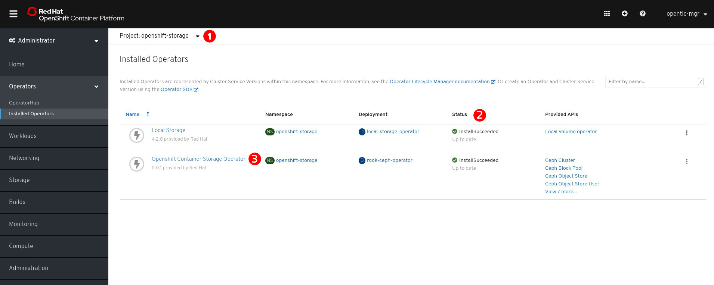
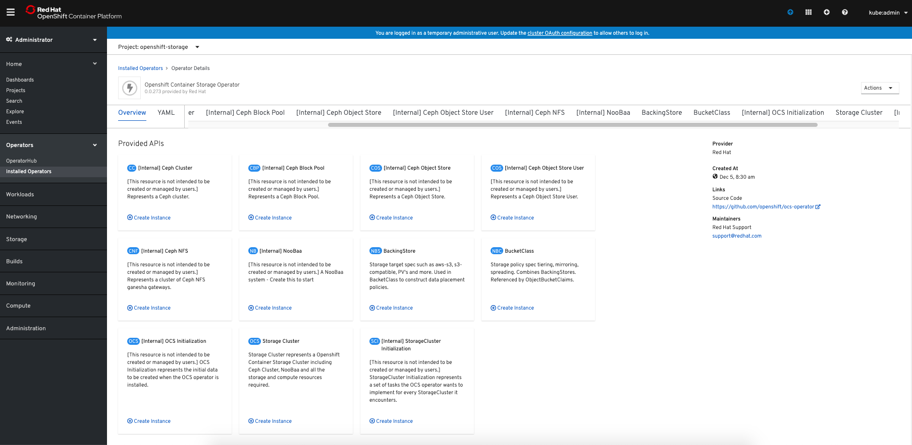
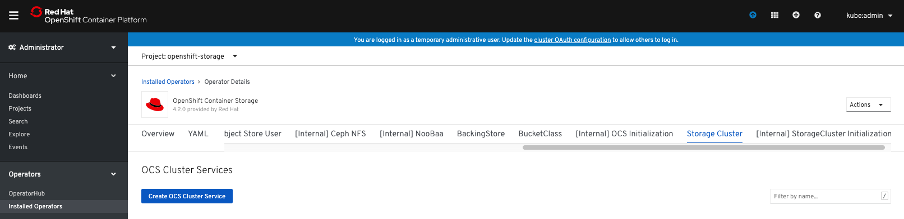
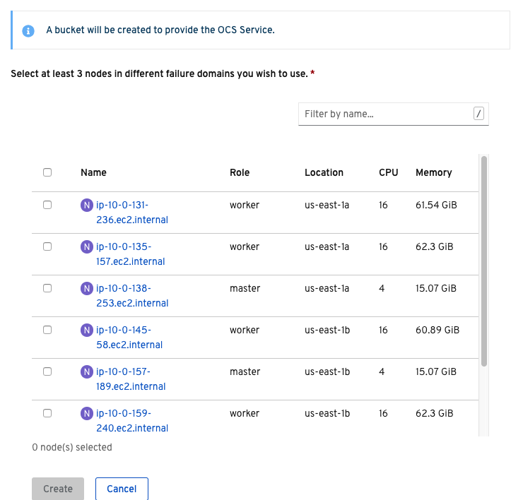
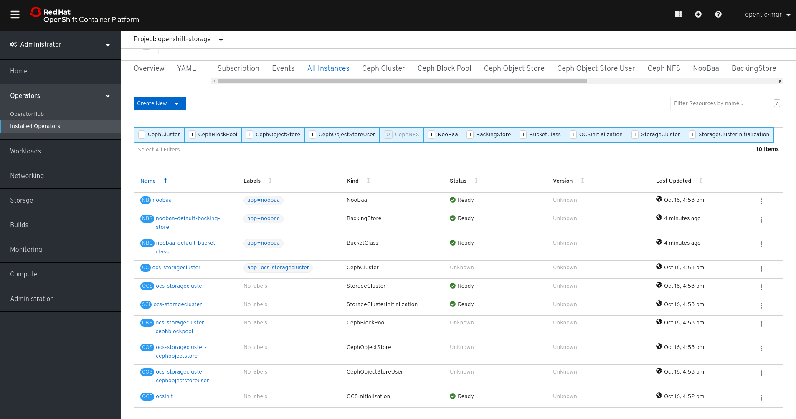
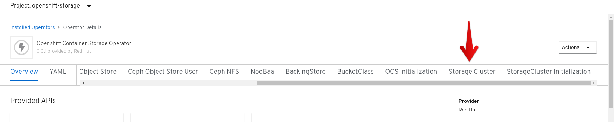
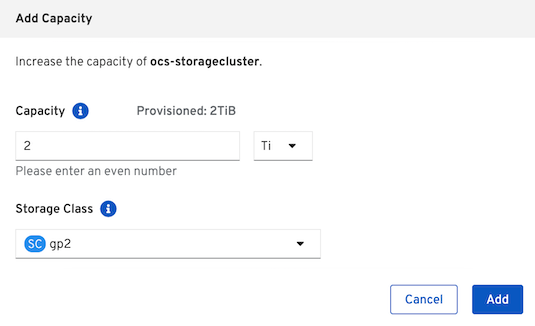
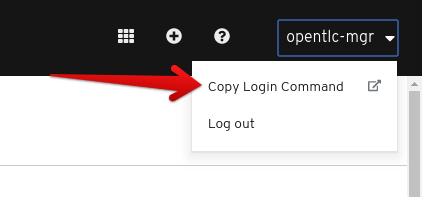

= Lab: Deploying and Managing OpenShift Container Storage
:toc: right
:toclevels: 2
:icons: font
:source-highlighter: pygments
:source-language: shell
:numbered:
// Activate experimental attribute for Keyboard Shortcut keys
:experimental:

== Lab Overview

This hands-on workshop is for both system administrators and application developers interested in learning how to deploy and manage OpenShift Container Storage (OCS). In this lab you will be using OpenShift Container Platform (OCP) 4.x and the OCS operator to deploy Ceph and the Multi-Cloud-Gateway (MCG) as a persistent storage solution for OCP workloads. This instruction was developed using the RHPDS `OpenShift 4.2 Workshop`.

=== In this lab you will learn how to

* Configure and deploy containerized Ceph and NooBaa
* Validate deployment of containerized Ceph Nautilus and NooBaa
* Deploy the Rook toolbox to run Ceph and RADOS commands
* Creating a Read-Write-Once (RWO) PVC that is based on Ceph RBDs
* Creating a Read-Write-Many (RWX) PVC that is based on CephFS
* Using the MCG to create a bucket
* Add more storage to the Ceph cluster
* Use must-gather to collect support information

.OpenShift Container Storage components
image::images/ocs/OCS-Pods-Diagram.png[Showing OCS4 pods]

[[labexercises]]

== Deploy your storage backend using the OCS operator

=== Scale OCP cluster and add 3 new nodes

In this section, you will first validate the OCP environment has 3 master and 2 worker nodes (or 3 worker nodes) before increasing the cluster size by additional 3 worker nodes for OCS resources. The `NAME` of your OCP nodes will be different than shown below.

[source,role="execute"]
----
oc get nodes
----
.Example output:
----
NAME                           STATUS   ROLES    AGE   VERSION
ip-10-0-135-157.ec2.internal   Ready    worker   38m   v1.14.6+c07e432da
ip-10-0-138-253.ec2.internal   Ready    master   42m   v1.14.6+c07e432da
ip-10-0-157-189.ec2.internal   Ready    master   42m   v1.14.6+c07e432da
ip-10-0-159-240.ec2.internal   Ready    worker   38m   v1.14.6+c07e432da
ip-10-0-164-70.ec2.internal    Ready    master   42m   v1.14.6+c07e432da
----

Now you are going to add 3 more OCP compute nodes to cluster using *machinesets*.

[source,role="execute"]
----
oc get machinesets -n openshift-machine-api
----

This will show you the existing *machinesets* used to create the 3 worker nodes in the cluster already. There is a *machineset* for each AWS AZ (us-east-1a, us-east-1b, us-east-1c). Your *machinesets* `NAME` will be different than below.

----
NAME                                       DESIRED   CURRENT   READY   AVAILABLE   AGE
cluster-ocs-79cf-lj8wq-worker-us-east-1a   1         1         1       1           43m
cluster-ocs-79cf-lj8wq-worker-us-east-1b   1         1         1       1           43m
cluster-ocs-79cf-lj8wq-worker-us-east-1c   0         0                             43m
cluster-ocs-79cf-lj8wq-worker-us-east-1d   0         0                             43m
cluster-ocs-79cf-lj8wq-worker-us-east-1e   0         0                             43m
cluster-ocs-79cf-lj8wq-worker-us-east-1f   0         0                             43m
----

WARNING: *Make sure you do the next step for finding your CLUSTERID*

[source,role="execute"]
----
CLUSTERID=$(oc get machineset -n openshift-machine-api -o jsonpath='{.items[0].metadata.labels.machine\.openshift\.io/cluster-api-cluster}')
echo $CLUSTERID
----

[source,role="execute"]
----
curl -s https://raw.githubusercontent.com/red-hat-storage/ocs-training/master/ocp4ocs4/cluster-workerocs.yaml | sed "s/CLUSTERID/$CLUSTERID/g" | oc apply -f -
----

Check that you have new *machines* created.

[source,role="execute"]
----
oc get machines -n openshift-machine-api
----

They may be in `pending` for sometime so repeat command above until they are in a `running` STATE. The `NAME` of your machines will be different than shown below.

----
NAME                                                STATE     TYPE         REGION      ZONE         AGE
cluster-ocs-79cf-lj8wq-master-0                     running   m4.xlarge    us-east-1   us-east-1a   54m
cluster-ocs-79cf-lj8wq-master-1                     running   m4.xlarge    us-east-1   us-east-1b   54m
cluster-ocs-79cf-lj8wq-master-2                     running   m4.xlarge    us-east-1   us-east-1c   54m
cluster-ocs-79cf-lj8wq-worker-us-east-1a-xscbs      running   m4.4xlarge   us-east-1   us-east-1a   54m
cluster-ocs-79cf-lj8wq-worker-us-east-1b-qcmrl      running   m4.4xlarge   us-east-1   us-east-1b   54m
cluster-ocs-79cf-lj8wq-workerocs-us-east-1a-xmd9q   running   m4.4xlarge   us-east-1   us-east-1a   46s
cluster-ocs-79cf-lj8wq-workerocs-us-east-1b-jh6k4   running   m4.4xlarge   us-east-1   us-east-1b   46s
cluster-ocs-79cf-lj8wq-workerocs-us-east-1c-649kq   running   m4.4xlarge   us-east-1   us-east-1c   45s
----

You can see that the workerocs *machines* are using are also using the AWS EC2 instance type `m4.4xlarge`. The `m4.4xlarge` instance type follows our recommended instance sizing for OCS, 16 cpu and 64 GB mem.

Now you want to see if our new *machines* are added to the OCP cluster.

[source,role="execute"]
----
watch oc get machinesets -n openshift-machine-api
----

This step could take more than 5 minutes. The result of this command needs to look like below before you proceed. All new workerocs *machinesets* should have an integer, in this case `1`, filled out for all rows and under columns `READY` and `AVAILABLE`. The `NAME` of your *machinesets* will be different than shown below.

----
NAME                                          DESIRED   CURRENT   READY   AVAILABLE   AGE
cluster-ocs-79cf-lj8wq-worker-us-east-1a      1         1         1	      1           62m
cluster-ocs-79cf-lj8wq-worker-us-east-1b      1         1         1	      1           62m
cluster-ocs-79cf-lj8wq-worker-us-east-1c      0         0                             62m
cluster-ocs-79cf-lj8wq-worker-us-east-1d      0         0                             62m
cluster-ocs-79cf-lj8wq-worker-us-east-1e      0         0                             62m
cluster-ocs-79cf-lj8wq-worker-us-east-1f      0         0                             62m
cluster-ocs-79cf-lj8wq-workerocs-us-east-1a   1         1         1       1           8m26s
cluster-ocs-79cf-lj8wq-workerocs-us-east-1b   1         1         1       1           8m26s
cluster-ocs-79cf-lj8wq-workerocs-us-east-1c   1         1         1       1           8m25s
----

You can exit by pressing kbd:[Ctrl+C]

Now check to see that you have 3 new OCP worker nodes. The `NAME` of your OCP nodes will be different than shown below.

[source,role="execute"]
----
oc get nodes -l node-role.kubernetes.io/worker
----
.Example output:
----
NAME                           STATUS   ROLES    AGE     VERSION
ip-10-0-131-236.ec2.internal   Ready    worker   4m32s   v1.14.6+c07e432da
ip-10-0-135-157.ec2.internal   Ready    worker   60m     v1.14.6+c07e432da
ip-10-0-145-58.ec2.internal    Ready    worker   4m28s   v1.14.6+c07e432da
ip-10-0-159-240.ec2.internal   Ready    worker   60m     v1.14.6+c07e432da
ip-10-0-164-216.ec2.internal   Ready    worker   4m35s   v1.14.6+c07e432da
----

=== Installing the OCS operator

In this section you will be using three of the worker OCP nodes to deploy OCS 4. For this you will be using a manifest file, which adds multiple items to your OCP cluster as shown below. Using the manifest for deployment is temporary until OCS 4.2 is generally available (GA). At that time OCS 4 will be installed from OperatorHub in OCP 4 instead of using this manifest for installation of the following:

- The `openshift-storage` namespace
- The `local-storage` namespace
- Operator groups and sources for the OCS and local-storage operators
- An OCS subscription

To apply this manifest, execute the following:

[source,role="execute"]
----
oc apply -f http://pkgs.devel.redhat.com/cgit/containers/ocs-registry/plain/deploy-with-olm.yaml?h=ocs-4.2-rhel-8
----

This will fetch the manifest from the `release-4.2` tag. After applying this, you should be able to watch your new operators being installed.

[source,role="execute"]
----
watch oc -n openshift-storage get csv
----
.Example output:
----
NAME                            DISPLAY                                VERSION   REPLACES   PHASE
local-storage-operator.v4.2.0   Local Storage                          4.2.0                Installing
ocs-operator.v0.0.1             Openshift Container Storage Operator   0.0.1                InstallReady
----

You can exit by pressing kbd:[Ctrl+C]

The resource `csv` is a shortened word for `clusterserviceversions.operators.coreos.com`.

.Please wait until the operator `PHASE` changes to `Succeeded`
CAUTION: This will mark that the installation of your operators was successful. Reaching this state can take several minutes.

You will now also see some new operator pods in the new `openshift-storage` namespace:

[source,role="execute"]
----
oc -n openshift-storage get pods
----
.Example output:
----
NAME                                     READY   STATUS    RESTARTS   AGE
local-storage-operator-bcfd5765f-7bd86   1/1     Running   0          3m33s
noobaa-operator-7c55776bf9-kbcjp         1/1     Running   0          3m16s
ocs-operator-967957d84-9lc76             1/1     Running   0          3m16s
rook-ceph-operator-8444cfdc4c-9jm8p      1/1     Running   0          3m16s
----

Now switch over to your *Openshift Web Console* for the remainder of the installation for OCS 4. You can get your URL by issuing command below to get the OCP 4 `console` route. Put this URL in a browser tab. You will use the same Admin username and password you used to login and use the `oc client` to login to the OCP 4 `console`.

[source,role="execute"]
----
oc get -n openshift-console route console
----

Once you are logged in, navigate to the `Operators` menu on the left and select `Installed Operators`. Make sure the selected project is set to `openshift-storage`.
What you see, should be similar to the following example picture:

.Installed operators:  1) Make sure you are in the right project; 2) Check Operator status; 3) Click on Openshift Container Storage Operator

Click on `Openshift Container Storage Operator` to get to the OCS configuration screen.

.OCS configuration screen

On the top of the OCS configuration screen, scroll over to `Storage cluster` and click on `Create OCS Cluster Service`.

.OCS Create Storage Cluster

A dialog box will come up next.

.OCS create a new storage cluster

CAUTION: *Make sure to select three workers in different availability zones using instructions below*

To select the appropriate worker nodes of your OCP 4 cluster you can find them by searching for the node label `role=storage-node`.

[source,role="execute"]
----
oc get nodes --show-labels | grep storage-node |cut -d' ' -f1
----

Select the three nodes that resulted from the command above. Then click on the button `Create` below the dialog box where you selected the 3 workers with a `checkmark`.

NOTE: It would be a good practice to add a unique label to OCP nodes that are to be used for creating the `Storage Cluster` prior to this step so they are easy to find in list of OCP nodes. In this case it was done by adding this label, `role=storage-node`, in the machineset YAML files that you used earlier to create the new OCS worker nodes.

In the background this will start initiating a lot of new pods in the `openshift-storage` namespace, as can be seen on the CLI:

[source,role="execute"]
----
oc -n openshift-storage get pods
----
.Example of a in process installation of the OCS storage cluster:
----
NAME                                            READY   STATUS                  RESTARTS   AGE
csi-cephfsplugin-2frxn                          3/3     Running                 0          57s
csi-cephfsplugin-6ghk7                          3/3     Running                 0          58s
csi-cephfsplugin-ds6zl                          3/3     Running                 0          58s
csi-cephfsplugin-j5ddw                          3/3     Running                 0          58s
csi-cephfsplugin-provisioner-57f65684f4-4sf4p   4/4     Running                 0          58s
csi-cephfsplugin-provisioner-57f65684f4-rl65b   4/4     Running                 0          58s
csi-rbdplugin-6z7qm                             3/3     Running                 0          58s
csi-rbdplugin-kxq99                             3/3     Running                 0          58s
csi-rbdplugin-provisioner-54985c744b-66fvc      5/5     Running                 0          58s
csi-rbdplugin-provisioner-54985c744b-pqwqp      5/5     Running                 0          58s
csi-rbdplugin-sdb56                             3/3     Running                 0          58s
csi-rbdplugin-t876t                             3/3     Running                 0          58s
local-storage-operator-bcfd5765f-7bd86          1/1     Running                 0          91m
noobaa-core-0                                   0/2     Pending                 0          57s
noobaa-operator-7c55776bf9-kbcjp                1/1     Running                 0          91m
ocs-operator-967957d84-9lc76                    0/1     Running                 0          91m
rook-ceph-detect-version-lh6jx                  0/1     Pending                 0          52s
rook-ceph-operator-8444cfdc4c-9jm8p             1/1     Running                 0          91m
----

You can also watch the deployment using the *Openshift Web Console* by going back to the `Openshift Container Storage Operator` screen and selecting `All instances`.

Please wait until all *Pods* are marked as `Running` in the CLI or until you see all instances shown below as `Ready` Status in the Web Console. Some instances may stay in `Unknown` Status which is not a concern if your `Ready` status matches the following diagram:

.OCS instance overview after cluster install is finished

[source,role="execute"]
----
oc -n openshift-storage get pods
----
.Output when the cluster installation is finished
----
NAME                                                              READY   STATUS      RESTARTS   AGE
csi-cephfsplugin-6975g                                            3/3     Running     0          24m
csi-cephfsplugin-ckpk4                                            3/3     Running     0          24m
csi-cephfsplugin-h6j7j                                            3/3     Running     0          24m
csi-cephfsplugin-provisioner-57f65684f4-dk5bv                     4/4     Running     0          24m
csi-cephfsplugin-provisioner-57f65684f4-nwsws                     4/4     Running     0          24m
csi-cephfsplugin-t9rvk                                            3/3     Running     0          24m
csi-rbdplugin-jhj8v                                               3/3     Running     0          24m
csi-rbdplugin-k6bs2                                               3/3     Running     0          24m
csi-rbdplugin-nqmbl                                               3/3     Running     0          24m
csi-rbdplugin-provisioner-54985c744b-4sxvv                        5/5     Running     0          24m
csi-rbdplugin-provisioner-54985c744b-xtlv9                        5/5     Running     0          24m
csi-rbdplugin-wwdkb                                               3/3     Running     0          24m
local-storage-operator-bcfd5765f-j6x7m                            1/1     Running     0          26m
noobaa-core-0                                                     2/2     Running     0          24m
noobaa-operator-7c55776bf9-89cxn                                  1/1     Running     0          26m
ocs-operator-967957d84-cmksd                                      1/1     Running     0          26m
rook-ceph-drain-canary-ip-10-0-131-104-5b49b94554-8wwjl           1/1     Running     0          21m
rook-ceph-drain-canary-ip-10-0-150-178-54f44b45fd-zxrhp           1/1     Running     0          21m
rook-ceph-drain-canary-ip-10-0-175-125-7bf8fc5d79-bg8lq           1/1     Running     0          21m
rook-ceph-mds-ocs-storagecluster-cephfilesystem-a-577b9f85xzlvj   1/1     Running     0          21m
rook-ceph-mds-ocs-storagecluster-cephfilesystem-b-55768bc8r6wsd   1/1     Running     0          20m
rook-ceph-mgr-a-6b9b8d4bf6-vhr9h                                  1/1     Running     0          22m
rook-ceph-mon-a-5846c784b-jzr6l                                   1/1     Running     0          24m
rook-ceph-mon-b-c8858957-4xcbq                                    1/1     Running     0          23m
rook-ceph-mon-c-54979d9856-llbsk                                  1/1     Running     0          22m
rook-ceph-operator-8444cfdc4c-nmr2q                               1/1     Running     0          26m
rook-ceph-osd-0-77d8884557-jwslr                                  1/1     Running     0          21m
rook-ceph-osd-1-54d6d78694-47ghl                                  1/1     Running     0          21m
rook-ceph-osd-2-796d848bd7-jb825                                  1/1     Running     0          21m
rook-ceph-osd-prepare-ocs-deviceset-0-0-8fls2-p7pd5               0/1     Completed   0          22m
rook-ceph-osd-prepare-ocs-deviceset-1-0-lbrls-ztgfs               0/1     Completed   0          22m
rook-ceph-osd-prepare-ocs-deviceset-2-0-4ktq4-zhgcr               0/1     Completed   0          22m
rook-ceph-rgw-ocs-storagecluster-cephobjectstore-a-66499c5gt8q4   1/1     Running     0          4m23s
----

### Getting to know the Storage Dashboards

You can now also check the status of your storage cluster with the OCS specific *Dashboards* that are included in your *Openshift Web Console*. You can reach this by clicking on `Home` on your left navigation bar, then selecting `Dashboards` and finally clicking on `Persistent Storage` on the top navigation bar of the content page.

.OCS Dashboard after successful backing storage installation
image::images/ocs/OCS-dashboard-healthy.png[OCS Dashboard after successful backing storage installation]

[cols="0,1,10a"]
|===
|<1> | Health | Quick overview of the general health of the storage cluster
|<2> | Details | Overview of the deployed storage cluster version and backend provider
|<3> | Inventory | List of all the resources that are used and offered by the storage system
|<4> | Events | Live overview of all the changes that are being done affecting the storage cluster
|<5> | Utilization | Overview of the storage cluster usage and performance
|===

OCS ships with a *Dashboard* for the Object Store service as well. From within the *Dashboard* menu click on the `Object Service` on the top navigation bar of the content page.

.OCS Multi-Cloud-Gateway Dashboard after successful installation
image::images/ocs/OCS-noobaa-dashboard-healthy.png[OCS Multi-Cloud-Gateway Dashboard after successful installation]

[cols="0,1,10a"]
|===
|<1> | Health | Quick overview of the general health of the Multi-Cloud-Gateway
|<2> | Details | Overview of the deployed MCG version and backend provider including a link to the MCG Dashboard
|<3> | Buckets | List of all the ObjectBucket with are offered and ObjectBucketClaims which are connected to them
|<4> | Resource Providers | Shows the list of configured Resource Providers that are available as backing storage in the MCG
|===

// On the left side of this *Dashboard* you see a blue link labelled `noobaa`, which will get you to the NooBaa Management Console. We will discuss this Management Console later in more detail.

Once this is all healthy, you will be able to use the three new `StorageClasses` created during the OCS 4 Install:

- ocs-storagecluster-ceph-rbd
- ocs-storagecluster-cephfs
- openshift-storage.noobaa.io

You can see these three `StorageClasses` from the Openshift Web Console by expanding the `Storage` menu in the left navigation bar and selecting `Storage Classes`. You can also run the command below:

[source,role="execute"]
----
oc -n openshift-storage get sc
----

Please make sure the three storage classes are available in your cluster before proceeding.

NOTE: The NooBaa pod used the `ocs-storagecluster-ceph-rbd` storage class for creating a PVC for mounting to it's `db` container.

=== Using the Rook-Ceph toolbox to check on the Ceph backing storage

Since the Rook-Ceph *toolbox* is not shipped with OCS, we need to deploy it manually. For this, we can leverage the upstream `toolbox.yaml` file, but we need to modify the namespace as shown below.

[source,role="execute"]
----
curl -s https://raw.githubusercontent.com/rook/rook/release-1.1/cluster/examples/kubernetes/ceph/toolbox.yaml | sed 's/namespace: rook-ceph/namespace: openshift-storage/g'| oc apply -f -
----

After the `rook-ceph-tools` *Pod* is `Running` you can access the toolbox like this:

[source,role="execute"]
----
TOOLS_POD=$(oc get pods -n openshift-storage -l app=rook-ceph-tools -o name)
oc rsh -n openshift-storage $TOOLS_POD
----

Once inside the toolbox, try out the following Ceph commands:

[source,role="execute"]
----
ceph status
ceph osd status
ceph osd tree
ceph df
rados df
ceph versions
----
.Example output:
[source]
----
sh-4.2# ceph status
  cluster:
    id:     ce04255f-ca4c-499f-8819-58fb38095105
    health: HEALTH_OK

  services:
    mon: 3 daemons, quorum a,b,c (age 43m)
    mgr: a(active, since 42m)
    mds: ocs-storagecluster-cephfilesystem:1 {0=ocs-storagecluster-cephfilesystem-a=up:active} 1 up:standby-replay
    osd: 3 osds: 3 up (since 41m), 3 in (since 41m)
    rgw: 1 daemon active (ocs.storagecluster.cephobjectstore.a)

  task status:
    scrub status:
        mds.0: idle

  data:
    pools:   10 pools, 80 pgs
    objects: 326 objects, 80 MiB
    usage:   3.1 GiB used, 3.0 TiB / 3.0 TiB avail
    pgs:     80 active+clean

  io:
    client:   938 B/s rd, 6.8 KiB/s wr, 1 op/s rd, 0 op/s wr
----

You can exit the toolbox by either pressing kbd:[Ctrl+D] or by executing `exit`.

== Create a new OCP application deployment using Ceph RBD volume

In this section the `ocs-storagecluster-ceph-rbd` *storage class* will be used by an OCP application + database *deployment* to create RWO (ReadWriteOnce) persistent storage. The persistent storage will be a Ceph RBD (RADOS Block Device) volume (object) in the Ceph pool `ocs-storagecluster-cephblockpool`.

To do so we have created a template file, based on the OpenShift rails-pgsql-persistent template, that includes an extra parameter STORAGE_CLASS that enables the end user to specify the storage class the PVC should use.
Feel free to download `https://raw.githubusercontent.com/red-hat-storage/ocs-training/master/ocp4ocs4/configurable-rails-app.yaml` to check on the format of this template. Search for `STORAGE_CLASS` in the downloaded content.

Make sure that you completed all previous sections so that you are ready to start the Rails + PostgreSQL deployment.

[source,role="execute"]
----
oc new-project my-database-app
curl https://raw.githubusercontent.com/red-hat-storage/ocs-training/master/ocp4ocs4/configurable-rails-app.yaml | oc new-app -p STORAGE_CLASS=ocs-storagecluster-ceph-rbd -p VOLUME_CAPACITY=5Gi -f -
----

After the deployment is started you can monitor with these commands.

[source,role="execute"]
----
oc status
oc get pvc -n my-database-app
----

This step could take 5 or more minutes. Wait until there are 2 *Pods* in `Running` STATUS and 4 *Pods* in `Completed` STATUS as shown below.

[source,role="execute"]
----
watch oc get pods -n my-database-app
----
.Example output:
----
NAME                                READY   STATUS      RESTARTS   AGE
postgresql-1-deploy                 0/1     Completed   0          5m48s
postgresql-1-lf7qt                  1/1     Running     0          5m40s
rails-pgsql-persistent-1-build      0/1     Completed   0          5m49s
rails-pgsql-persistent-1-deploy     0/1     Completed   0          3m36s
rails-pgsql-persistent-1-hook-pre   0/1     Completed   0          3m28s
rails-pgsql-persistent-1-pjh6q      1/1     Running     0          3m14s
----

You can exit by pressing kbd:[Ctrl+C]

Once the deployment is complete you can now test the application and the persistent storage on Ceph. Your `HOST/PORT` will be different.

[source,role="execute"]
----
oc get route -n my-database-app
----
.Example output:
----
NAME                     HOST/PORT                                                                         PATH   SERVICES                 PORT    TERMINATION   WILDCARD
rails-pgsql-persistent   rails-pgsql-persistent-my-database-app.apps.cluster-a26e.sandbox449.opentlc.com          rails-pgsql-persistent
----

Copy your `rails-pgsql-persistent` route (different than above) to a browser window to create articles. You will need to append `/articles` to the end.

*Example*  http://<your_route>/articles

Enter the `username` and `password` below to create articles and comments. The articles and comments are saved in a PostgreSQL database which stores its table spaces on the Ceph RBD volume provisioned using the `ocs-storagecluster-ceph-rbd` *storageclass* during the application deployment.

[source,ini]
----
username: openshift
password: secret
----

Lets now take another look at the Ceph `ocs-storagecluster-cephblockpool` created by the `ocs-storagecluster-ceph-rbd` *Storage Class*. Log into the *toolbox* pod again.

[source,role="execute"]
----
TOOLS_POD=$(oc get pods -n openshift-storage -l app=rook-ceph-tools -o name)
oc rsh -n openshift-storage $TOOLS_POD
----

Run the same Ceph commands as before the application deployment and compare to results in prior section. Notice the number of objects in `ocs-storagecluster-cephblockpool` has increased. The third command lists RBDs and we should now have two RBDs.

[source,role="execute"]
----
ceph df
rados df
rbd -p ocs-storagecluster-cephblockpool ls | grep vol
----

You can exit the toolbox by either pressing kbd:[Ctrl+D] or by executing `exit`.

=== Matching PVs to RBDs

A handy way to match persistent volumes to Ceph RBDs is to execute:

[source,role="execute"]
----
oc get pv -o 'custom-columns=NAME:.spec.claimRef.name,PVNAME:.metadata.name,STORAGECLASS:.spec.storageClassName,VOLUMEHANDLE:.spec.csi.volumeHandle'
----
.Example output:
----
NAME                      PVNAME                                     STORAGECLASS                  VOLUMEHANDLE
ocs-deviceset-0-0-z2xzg   pvc-1b636a3f-f978-11e9-9bdd-005056818b15   thin                          <none>
ocs-deviceset-1-0-wcrql   pvc-1b64c8e5-f978-11e9-9bdd-005056818b15   thin                          <none>
ocs-deviceset-2-0-b82nr   pvc-1b6618fa-f978-11e9-9bdd-005056818b15   thin                          <none>
postgresql                pvc-3967abba-fbcd-11e9-9bdd-005056818b15   ocs-storagecluster-ceph-rbd   0001-0011-openshift-storage-0000000000000001-39787034-fbcd-11e9-8be1-0a580a810213
my-shared-storage         pvc-ab06ddc4-fbc0-11e9-9d0a-00505681bc30   ocs-storagecluster-cephfs     0001-0011-openshift-storage-0000000000000001-ab869bbf-fbc0-11e9-92f8-0a580a800411
db-noobaa-core-0          pvc-b8490616-f977-11e9-9bdd-005056818b15   ocs-storagecluster-ceph-rbd   0001-0011-openshift-storage-0000000000000001-5c29f1e6-f978-11e9-8be1-0a580a810213
rook-ceph-mon-a           pvc-c434ab90-f977-11e9-9bdd-005056818b15   thin                          <none>
rook-ceph-mon-b           pvc-c74f9f10-f977-11e9-9bdd-005056818b15   thin                          <none>
rook-ceph-mon-c           pvc-ca4eea2e-f977-11e9-9bdd-005056818b15   thin                          <none>
----

The second half of the `VOLUMEHANDLE` column mostly matches what your RBD is named inside of Ceph. All you have to do is append `csi-vol-` to the front like this:

.Get the full RBD name of our postgreSQL PV in one command
[source,role="execute"]
----
oc get pv pvc-3967abba-fbcd-11e9-9bdd-005056818b15 -o jsonpath='{.spec.csi.volumeHandle}' | cut -d '-' -f 6- | awk '{print "csi-vol-"$1}'
----
.Example output:
----
csi-vol-39787034-fbcd-11e9-8be1-0a580a810213
----

[NOTE]
====
It is important to use the `PVNAME` in the above command
====

Now we can check on the details of our RBD from inside of the tools pod:

[source,role="execute"]
----
TOOLS_POD=$(oc get pods -n openshift-storage -l app=rook-ceph-tools -o name)

oc rsh -n openshift-storage $TOOLS_POD rbd -p ocs-storagecluster-cephblockpool info csi-vol-39787034-fbcd-11e9-8be1-0a580a810213
----
.Example output:
----
rbd image 'csi-vol-39787034-fbcd-11e9-8be1-0a580a810213':
        size 5 GiB in 1280 objects
        order 22 (4 MiB objects)
        snapshot_count: 0
        id: 75a68ab19dfcb
        block_name_prefix: rbd_data.75a68ab19dfcb
        format: 2
        features: layering
        op_features:
        flags:
        create_timestamp: Thu Oct 31 10:57:27 2019
        access_timestamp: Thu Oct 31 10:57:27 2019
        modify_timestamp: Thu Oct 31 10:57:27 2019
----

[NOTE]
====
You will need to adjust the command to fit to your RBD name
====

== Create a new OCP application deployment using CephFS volume

In this section the `ocs-storagecluster-cephfs` *Storage Class* will be used to create a RWX (ReadWriteMany) PVC that can be used by multiple pods at the same time. The application we will use is called `File Uploader`.

Create a new project:

[source,role="execute"]
----
oc new-project my-shared-storage
----

Next deploy the example PHP application called `file-uploader`:

[source,role="execute"]
----
oc new-app openshift/php:7.1~https://github.com/christianh814/openshift-php-upload-demo --name=file-uploader
----

.Sample Output
----
--> Found image 665111f (6 days old) in image stream "openshift/php" under tag "7.1" for "openshift/php:7.1"

    Apache 2.4 with PHP 7.1 
    ----------------------- 
    PHP 7.1 available as container is a base platform for building and running various PHP 7.1 applications and frameworks. PHP is an HTML-embedded scripting language. PHP attempts to make it easy for developers to write dynamically generated web pages. PHP also offers built-in database integration for several commercial and non-commercial database management systems, so writing a database-enabled webpage with PHP is fairly simple. The most common use of PHP coding is probably as a replacement for CGI scripts.

    Tags: builder, php, php71, rh-php71

    * A source build using source code from https://github.com/christianh814/openshift-php-upload-demo will be created
      * The resulting image will be pushed to image stream tag "file-uploader:latest"
      * Use 'oc start-build' to trigger a new build
    * This image will be deployed in deployment config "file-uploader"
    * Ports 8080/tcp, 8443/tcp will be load balanced by service "file-uploader"
      * Other containers can access this service through the hostname "file-uploader"

--> Creating resources ...
    imagestream.image.openshift.io "file-uploader" created
    buildconfig.build.openshift.io "file-uploader" created
    deploymentconfig.apps.openshift.io "file-uploader" created
    service "file-uploader" created
--> Success
    Build scheduled, use 'oc logs -f bc/file-uploader' to track its progress.
    Application is not exposed. You can expose services to the outside world by executing one or more of the commands below:
     'oc expose svc/file-uploader' 
    Run 'oc status' to view your app.
----

Watch and wait for the application to be deployed:

[source,role="execute"]
----
oc logs -f bc/file-uploader -n my-shared-storage
----

.Sample Output
----
Cloning "https://github.com/christianh814/openshift-php-upload-demo" ...

[...]

Generating dockerfile with builder image image-registry.openshift-image-registry.svc:5000/openshift/php@sha256:a06311381a15078be4d67cf844ba808e688dfe25305c6a696a19aee9b93c72d5
STEP 1: FROM image-registry.openshift-image-registry.svc:5000/openshift/php@sha256:a06311381a15078be4d67cf844ba808e688dfe25305c6a696a19aee9b93c72d5
STEP 2: LABEL "io.openshift.build.source-location"="https://github.com/christianh814/openshift-php-upload-demo" "io.openshift.build.image"="image-registry.openshift-image-registry.svc:5000/openshift/php@sha256:a06311381a15078be4d67cf844ba808e688dfe25305c6a696a19aee9b93c72d5" "io.openshift.build.commit.author"="Christian Hernandez <christian.hernandez@yahoo.com>" "io.openshift.build.commit.date"="Sun Oct 1 17:15:09 2017 -0700" "io.openshift.build.commit.id"="288eda3dff43b02f7f7b6b6b6f93396ffdf34cb2" "io.openshift.build.commit.ref"="master" "io.openshift.build.commit.message"="trying to modularize"
STEP 3: ENV OPENSHIFT_BUILD_NAME="file-uploader-1" OPENSHIFT_BUILD_NAMESPACE="my-shared-storage" OPENSHIFT_BUILD_SOURCE="https://github.com/christianh814/openshift-php-upload-demo" OPENSHIFT_BUILD_COMMIT="288eda3dff43b02f7f7b6b6b6f93396ffdf34cb2"
STEP 4: USER root
STEP 5: COPY upload/src /tmp/src
STEP 6: RUN chown -R 1001:0 /tmp/src
time="2019-11-20T18:53:16Z" level=warning msg="pkg/chroot: error unmounting \"/tmp/buildah873160532/mnt/rootfs\": error checking if \"/tmp/buildah873160532/mnt/rootfs/sys/fs/cgroup/memory\" is mounted: no such file or directory"
time="2019-11-20T18:53:16Z" level=warning msg="pkg/bind: error unmounting \"/tmp/buildah873160532/mnt/rootfs\": error checking if \"/tmp/buildah873160532/mnt/rootfs/sys/fs/cgroup/memory\" is mounted: no such file or directory"
STEP 7: USER 1001
STEP 8: RUN /usr/libexec/s2i/assemble
---> Installing application source...
=> sourcing 20-copy-config.sh ...
---> 18:53:16     Processing additional arbitrary httpd configuration provided by s2i ...
=> sourcing 00-documentroot.conf ...
=> sourcing 50-mpm-tuning.conf ...
=> sourcing 40-ssl-certs.sh ...
time="2019-11-20T18:53:17Z" level=warning msg="pkg/chroot: error unmounting \"/tmp/buildah357283409/mnt/rootfs\": error checking if \"/tmp/buildah357283409/mnt/rootfs/sys/fs/cgroup/memory\" is mounted: no such file or directory"
time="2019-11-20T18:53:17Z" level=warning msg="pkg/bind: error unmounting \"/tmp/buildah357283409/mnt/rootfs\": error checking if \"/tmp/buildah357283409/mnt/rootfs/sys/fs/cgroup/memory\" is mounted: no such file or directory"
STEP 9: CMD /usr/libexec/s2i/run
STEP 10: COMMIT temp.builder.openshift.io/my-shared-storage/file-uploader-1:562d8fb3
Getting image source signatures

[...]

Writing manifest to image destination
Storing signatures
Successfully pushed image-registry.openshift-image-registry.svc:5000/my-shared-storage/file-uploader@sha256:74029bb63e4b7cb33602eb037d45d3d27245ffbfc105fd2a4587037c6b063183
Push successful
----

The command prompt returns out of the tail mode once you see _Push successful_.

[NOTE]
====
This use of the `new-app` command directly asked for application code to be
built and did not involve a template. That's why it only created a *single
Pod* deployment with a *Service* and no *Route*.
====

Let's make our application production ready by exposing it via a `Route` and scale to 3 instances for high availability:

[source,role="execute"]
----
oc expose svc/file-uploader -n my-shared-storage
oc scale --replicas=3 dc/file-uploader -n my-shared-storage
oc get pods -n my-shared-storage
----

You should have 3 `file-uploader` *Pods* in a few minutes.

[CAUTION]
====
Never attempt to store persistent data in a *Pod* that has no persistent
volume associated with it. *Pods* and their containers are ephemeral by
definition, and any stored data will be lost as soon as the *Pod* terminates
for whatever reason.
====

The app is of course not useful like this. We can fix this by providing shared
storage to this app.

You can create a *PersistentVolumeClaim* and attach it into an application with
the `oc set volume` command. Execute the following

[source,role="execute"]
----
oc set volume dc/file-uploader --add --name=my-shared-storage \
-t pvc --claim-mode=ReadWriteMany --claim-size=1Gi \
--claim-name=my-shared-storage --claim-class=ocs-storagecluster-cephfs \
--mount-path=/opt/app-root/src/uploaded \
-n my-shared-storage
----

This command will:

* create a *PersistentVolumeClaim*
* update the *DeploymentConfig* to include a `volume` definition
* update the *DeploymentConfig* to attach a `volumemount` into the specified
  `mount-path`
* cause a new deployment of the 3 application *Pods*

For more information on what `oc set volume` is capable of, look at its help output
with `oc set volume -h`. Now, let's look at the result of adding the volume:

[source,role="execute"]
----
oc get pvc -n my-shared-storage
----

.Sample Output
----
NAME                STATUS   VOLUME                                     CAPACITY   ACCESS MODES   STORAGECLASS                AGE
my-shared-storage   Bound    pvc-371c2184-fb73-11e9-b901-0aad1a53052d   1Gi        RWX            ocs-storagecluster-cephfs   47s
----

Notice the `ACCESSMODE` being set to *RWX* (short for `ReadWriteMany`).

All 3 `file-uploader`*Pods* are using the sane *RWX* volume. Without this `ACCESSMODE`, OpenShift will not attempt to attach multiple *Pods* to the same *PersistentVolume*
reliably. If you attempt to scale up deployments that are using *RWO* or `ReadWriteOnce` storage, the *Pods* will actually all become co-located on the same
node.

Try it out in your file uploader web application using your browser. Upload
new files.

Now, check the *Route* that has been created:

[source,role="execute"]
----
oc get route file-uploader -n my-shared-storage -o jsonpath --template="{.spec.host}"
----

This will return a route similar to this one (careful: there is no line break at the end so your shell prompt appears right after the output).

.Sample Output
----
file-uploader-my-shared-storage.apps.cluster-ocs-9b06.ocs-9b06.example.opentlc.com
----

Point your browser to the web application using the URL advertised by your route. *Your `route` will be different*

The web app simply lists all uploaded files and offers the ability to upload new ones as well as download the existing data. Right now there is
nothing.

Select an arbitrary file from your local machine and upload it to the app.

.A simple PHP-based file upload tool
image::images/ocs/uploader_screen_upload.png[]

Once done click *_List uploaded files_* to see the list of all currently
uploaded files.

== Create a new OCP registry using CephFS (Optional)

In this section the `ocs-storagecluster-cephfs` *Storage Class* will be used to create a RWX (ReadWriteMany) PVC that can be used by multiple pods at the same time. As an example we will be running a highly-available container image registry. The persistent storage will be based on a CephFS volume in the Ceph pool `ocs-storagecluster-cephfilesystem-data0`.

Deploy the registry like this:

[source,role="execute"]
----
curl -s https://raw.githubusercontent.com/rook/rook/master/cluster/examples/kubernetes/ceph/csi/cephfs/kube-registry.yaml | sed 's/storageClassName: csi-cephfs/storageClassName: ocs-storagecluster-cephfs/g'| oc apply -f -
----

This will create a PVC in the `kube-system` namespace:

[source,role="execute"]
----
oc get -n kube-system pvc
----
.Example output:
----
NAME         STATUS   VOLUME                                     CAPACITY   ACCESS MODES   STORAGECLASS                AGE
cephfs-pvc   Bound    pvc-a7015af1-f0dd-11e9-8812-06aa2fd1035a   1Gi        RWX            ocs-storagecluster-cephfs   55s
----

As well as a deployment for our registry:

[source,role="execute"]
----
oc get -n kube-system deployment
----
.Example output:
----
NAME            READY   UP-TO-DATE   AVAILABLE   AGE
kube-registry   3/3     3            3           100s
----

.The `kube-registry` *deployment* consists of more than one replica
NOTE: Since our deployment consists of three containers, we need a RWX PVC, so that all replicas can access the persistent volume in parallel.

There are also 3 *Pods* sharing the same Ceph FS PVC for read/write operations.

[source,role="execute"]
----
oc get -n kube-system pods
----
.Example output:
----
$ oc get pods -n kube-system
NAME                             READY   STATUS    RESTARTS   AGE
kube-registry-5b9c9854c5-45w9m   1/1     Running   0          9m47s
kube-registry-5b9c9854c5-cjtqc   1/1     Running   0          9m47s
kube-registry-5b9c9854c5-jfpkl   1/1     Running   0          9m47s
----

Let's make our *deployment* accessible. First we create a service with an internal Cluster IP:

[source,role="execute"]
----
oc expose -n kube-system deployment kube-registry
----

Then we create a route with a edge termination so that it serves our registry with tls:

[source,role="execute"]
----
oc create route edge -n kube-system --service=kube-registry
----

There is now a route to get the URL for our new registry:

[source,role="execute"]
----
oc get -n kube-system route
----
.Example output:
----
NAME            HOST/PORT                                                                            PATH   SERVICES        PORT    TERMINATION   WILDCARD
kube-registry   kube-registry-kube-system.apps.cluster-berlin-fc41.berlin-fc41.example.opentlc.com          kube-registry   <all>   edge          None
----

To use the new registry, we will connect to one of our worker hosts via `oc debug` and use the already installed podman binary

.Connect to one of the workers shell
[source,role="execute"]
----
oc debug $(oc get nodes -l node-role.kubernetes.io/worker -o name | head -n1)
----

.Enable the host binaries
[source,role="execute"]
----
chroot /host
----

Now that we have access to podman, we can download the alpine container image as an example and upload it to our new registry:

[source,role="execute"]
----
podman pull docker.io/library/alpine
----

[source,role="edit"]
----
podman push docker.io/library/alpine --tls-verify=false <KUBE_REGISTRY_ROUTE>/alpine
----
.Example command:
----
podman push docker.io/library/alpine --tls-verify=false kube-registry-kube-system.apps.cluster-ocs-3ed9.ocs-3ed9.example.opentlc.com/alpine
----

CAUTION: Make sure to replace the URL in the push command with the URL of your route

Now exit the debug session on the host by either pressing kbd:[Ctrl+D] twice or executing `exit` twice to get back to your workstation shell.

Next we use the `toolbox` *Pod* to check on our underlying CephFS volume:

[source,role="execute"]
----
TOOLS_POD=$(oc get pods -n openshift-storage -l app=rook-ceph-tools -o name)
oc rsh -n openshift-storage $TOOLS_POD
----

These steps should be done in the `toolbox` pod.

----
# Create the directory
mkdir /tmp/registry

# Detect the mon endpoints and the user secret for the connection
mon_endpoints=$(grep mon_host /etc/ceph/ceph.conf | awk '{print $3}')
my_secret=$(grep key /etc/ceph/keyring | awk '{print $3}')

# Mount the file system
mount -t ceph -o mds_namespace=ocs-storagecluster-cephfilesystem,name=admin,secret=$my_secret $mon_endpoints:/ /tmp/registry

# See your mounted file system
df -h /tmp/registry

# Find our uploaded container image
ls /tmp/registry/volumes/csi/csi-vol-*/docker/registry/v2/repositories/alpine/
----

Once you finished these steps, you can see that we successfully mounted the *RWX PVC* inside of our toolbox *Pod*, while it is also still mounted on the registry *Pods*. The `ls` shows the content of the alpine folder, which should now show our uploaded alpine container image.
Changes to this filesystem is immediately affecting the registry *Pods* and this procedure is great to debug issues that your *Pods* have with persistent files.

== Using the Multi-Cloud-Gateway

This section discusses the usage of the Multi-Cloud-Gateway (MCG). It is expected that the installation of MCG has been finished successfully and the local `oc` client is configured correctly to connect to the Openshift cluster.
Currently the best way to configure the MCG is to use the CLI.

To install the CLI follow the <<Install the NooBaa CLI client>> section.

NOTE: While the NooBaa Web Management Console is accessible, it should not be used to create any resources, since they are currently not syncronised back to the Openshift cluster.

=== Checking on the MCG status

The MCG status can be checked with the NooBaa CLI. Make sure you are in the `openshift-storage` project when you execute this command.

[source,role="execute"]
----
noobaa status -n openshift-storage
----
.Example output:
----
INFO[0000] CLI version: 2.0.3
INFO[0000] noobaa-image: noobaa/noobaa-core:5
INFO[0000] operator-image: noobaa/noobaa-operator:2.0.3
INFO[0000] Namespace: openshift-storage
INFO[0000]
INFO[0000] CRD Status:
INFO[0001] ✅ Exists: CustomResourceDefinition "noobaas.noobaa.io"
INFO[0001] ✅ Exists: CustomResourceDefinition "backingstores.noobaa.io"
INFO[0001] ✅ Exists: CustomResourceDefinition "bucketclasses.noobaa.io"
INFO[0001] ✅ Exists: CustomResourceDefinition "objectbucketclaims.objectbucket.io"
INFO[0001] ✅ Exists: CustomResourceDefinition "objectbuckets.objectbucket.io"
INFO[0001]
INFO[0001] Operator Status:
INFO[0001] ✅ Exists: Namespace "openshift-storage"
INFO[0001] ✅ Exists: ServiceAccount "noobaa"
INFO[0002] ❌ Not Found: Role "noobaa"
INFO[0002] ❌ Not Found: RoleBinding "noobaa"
INFO[0002] ❌ Not Found: ClusterRole "openshift-storage.noobaa.io"
INFO[0002] ❌ Not Found: ClusterRoleBinding "openshift-storage.noobaa.io"
INFO[0002] ✅ Exists: Deployment "noobaa-operator"
INFO[0002]
INFO[0002] System Status:
INFO[0002] ✅ Exists: NooBaa "noobaa"
INFO[0002] ✅ Exists: StatefulSet "noobaa-core"
INFO[0002] ✅ Exists: Service "noobaa-mgmt"
INFO[0002] ✅ Exists: Service "s3"
INFO[0003] ✅ Exists: Secret "noobaa-server"
INFO[0003] ✅ Exists: Secret "noobaa-operator"
INFO[0003] ✅ Exists: Secret "noobaa-admin"
INFO[0003] ✅ Exists: StorageClass "openshift-storage.noobaa.io"
INFO[0003] ✅ Exists: BucketClass "noobaa-default-bucket-class"
INFO[0003] ✅ (Optional) Exists: BackingStore "noobaa-default-backing-store"
INFO[0003] ✅ (Optional) Exists: CredentialsRequest "noobaa-cloud-creds"
INFO[0003] ✅ (Optional) Exists: PrometheusRule "noobaa-prometheus-rules"
INFO[0003] ✅ (Optional) Exists: ServiceMonitor "noobaa-service-monitor"
INFO[0004] ✅ Exists: PersistentVolumeClaim "db-noobaa-core-0"
INFO[0004] ✅ System Phase is "Ready"
INFO[0004] ✅ Exists: Secret "noobaa-admin"

#------------------#
#- Mgmt Addresses -#
#------------------#

ExternalDNS : [https://a2cda7307f66011e990940a5305de57b-1618762379.us-east-1.elb.amazonaws.com:443]
ExternalIP  : []
NodePorts   : [https://10.0.171.35:32253]
InternalDNS : [https://noobaa-mgmt.openshift-storage:443]
InternalIP  : [https://172.30.50.123:443]
PodPorts    : [https://10.129.2.26:8443]

#--------------------#
#- Mgmt Credentials -#
#--------------------#

system: noobaa
email: admin@noobaa.io
password: O9qBQf8eJZy6cN5yqaughA==

#----------------#
#- S3 Addresses -#
#----------------#

ExternalDNS : [https://a2cdff448f66011e990940a5305de57b-1965616628.us-east-1.elb.amazonaws.com:443]
ExternalIP  : []
NodePorts   : [https://10.0.171.35:31242]
InternalDNS : [https://s3.openshift-storage:443]
InternalIP  : [https://172.30.145.183:443]
PodPorts    : [https://10.129.2.26:6443]

#------------------#
#- S3 Credentials -#
#------------------#

AWS_ACCESS_KEY_ID: <NooBaa_ACCESS_KEY_ID>
AWS_SECRET_ACCESS_KEY:<NooBaa_SECRET_ACCESS_KEY_ID>

#------------------#
#- Backing Stores -#
#------------------#

NAME                           TYPE     TARGET-BUCKET                                               PHASE   AGE
noobaa-default-backing-store   aws-s3   noobaa-backing-store-8a7f9c1b-2616-41fa-bd9e-dbf7334f4768   Ready   2m24s

#------------------#
#- Bucket Classes -#
#------------------#

NAME                          PLACEMENT                                                             PHASE   AGE
noobaa-default-bucket-class   {Tiers:[{Placement: BackingStores:[noobaa-default-backing-store]}]}   Ready   2m24s

#-----------------#
#- Bucket Claims -#
#-----------------#

No OBC's found.
----

As you can see - the NooBaa CLI will first check on the environment and will then print all the information about the environment.
Besides the status of the MCG, the second most intersting information for us are the available S3 addresses that we can use to connect to our MCG buckets. We can chose between using the external DNS which incurs DNS traffic cost, or route internally inside of our Openshift cluster.

You can get a more basic overview of the MCG status using the Object Storage *Dashboard*. To reach this, log into the *Openshift Web Console*, click on `Home` and select the `Dashboards` item. In the main view, select `Object Service` in the top navigation bar.
This dashboard does not give you connection information for your S3 endpoint, but offers Graphs and runtime information about the usage of your S3 backend.

=== Creating an Object Bucket Claim

An Object Bucket Claim (OBC) can be used to request a S3 compatible bucket backend for your workloads. When creating an OBC you get a ConfigMap (CM) and a Secret that together contain all the information your application needs to use the object storage service.

Creating an OBC is as simple as using the NooBaa CLI:

[source,role="execute"]
----
noobaa obc create test21obc -n openshift-storage
----
.Example output:
----
INFO[0001] ✅ Created: ObjectBucketClaim "test21obc"
----

The NooBaa CLI has created the necessary configuration inside of NooBaa and has informed Openshift about the new OBC:

[source,role="execute"]
----
oc get obc -n openshift-storage
----
.Example output:
----
NAME        STORAGE-CLASS                 PHASE   AGE
test21obc   openshift-storage.noobaa.io   Bound   38s
----

[source,role="execute"]
----
oc get obc test21obc -o yaml -n openshift-storage
----
.Example output:
[source,yaml,linenums]
----
apiVersion: objectbucket.io/v1alpha1
kind: ObjectBucketClaim
metadata:
  creationTimestamp: "2019-10-24T13:30:07Z"
  finalizers:
  - objectbucket.io/finalizer
  generation: 2
  labels:
    app: noobaa
    bucket-provisioner: openshift-storage.noobaa.io-obc
    noobaa-domain: openshift-storage.noobaa.io
  name: test21obc
  namespace: openshift-storage
  resourceVersion: "40756"
  selfLink: /apis/objectbucket.io/v1alpha1/namespaces/openshift-storage/objectbucketclaims/test21obc
  uid: 64f04cba-f662-11e9-bc3c-0295250841af
spec:
  ObjectBucketName: obc-openshift-storage-test21obc
  bucketName: test21obc-933348a6-e267-4f82-82f1-e59bf4fe3bb4
  generateBucketName: test21obc
  storageClassName: openshift-storage.noobaa.io
status:
  phase: Bound
----

Inside of your `openshift-storage` namespace, you will now find the CM and the secret to use this OBC. The CM and the secret have the same name as the OBC:

[source,role="execute"]
----
oc get -n openshift-storage secret test21obc -o yaml
----
.Example output:
[source,yaml]
----
apiVersion: v1
data:
  AWS_ACCESS_KEY_ID: c0M0R2xVanF3ODR3bHBkVW94cmY=
  AWS_SECRET_ACCESS_KEY: Wi9kcFluSWxHRzlWaFlzNk1hc0xma2JXcjM1MVhqa051SlBleXpmOQ==
kind: Secret
metadata:
  creationTimestamp: "2019-10-24T13:30:07Z"
  finalizers:
  - objectbucket.io/finalizer
  labels:
    app: noobaa
    bucket-provisioner: openshift-storage.noobaa.io-obc
    noobaa-domain: openshift-storage.noobaa.io
  name: test21obc
  namespace: openshift-storage
  ownerReferences:
  - apiVersion: objectbucket.io/v1alpha1
    blockOwnerDeletion: true
    controller: true
    kind: ObjectBucketClaim
    name: test21obc
    uid: 64f04cba-f662-11e9-bc3c-0295250841af
  resourceVersion: "40751"
  selfLink: /api/v1/namespaces/openshift-storage/secrets/test21obc
  uid: 65117c1c-f662-11e9-9094-0a5305de57bb
type: Opaque
----

[source,role="execute"]
----
oc get -n openshift-storage cm test21obc -o yaml
----
.Example output:
[source,yaml]
----
apiVersion: v1
data:
  BUCKET_HOST: 10.0.171.35
  BUCKET_NAME: test21obc-933348a6-e267-4f82-82f1-e59bf4fe3bb4
  BUCKET_PORT: "31242"
  BUCKET_REGION: ""
  BUCKET_SUBREGION: ""
kind: ConfigMap
metadata:
  creationTimestamp: "2019-10-24T13:30:07Z"
  finalizers:
  - objectbucket.io/finalizer
  labels:
    app: noobaa
    bucket-provisioner: openshift-storage.noobaa.io-obc
    noobaa-domain: openshift-storage.noobaa.io
  name: test21obc
  namespace: openshift-storage
  ownerReferences:
  - apiVersion: objectbucket.io/v1alpha1
    blockOwnerDeletion: true
    controller: true
    kind: ObjectBucketClaim
    name: test21obc
    uid: 64f04cba-f662-11e9-bc3c-0295250841af
  resourceVersion: "40752"
  selfLink: /api/v1/namespaces/openshift-storage/configmaps/test21obc
  uid: 651c6501-f662-11e9-9094-0a5305de57bb
----

As you can see, the secret gives us the S3 access credentials, while the CM contains the S3 endpoint information for our application.

=== Using an OBC inside a container

In this section we will see how one can create an OBC using a YAML file and use the provided S3 configuration in an example application.

To deploy the OBC and the example application we apply this YAML file:

[source,yaml]
----
apiVersion: objectbucket.io/v1alpha1
kind: ObjectBucketClaim
metadata:
  name: obc-test
spec:
  generateBucketName: "obc-test-noobaa"
  storageClassName: openshift-storage.noobaa.io
---
apiVersion: batch/v1
kind: Job
metadata:
  name: obc-test
  labels:
    app: obc-test
spec:
  template:
    metadata:
      labels:
        app: obc-test
    spec:
      restartPolicy: OnFailure
      containers:
        - image: mesosphere/aws-cli:latest
          command: ["sh"]
          args: 
            - '-c'
            - 'set -x && s3cmd --no-check-certificate --host $BUCKET_HOST:$BUCKET_PORT --host-bucket $BUCKET_HOST:$BUCKET_PORT du'
          name: obc-test
          env:
            - name: BUCKET_NAME
              valueFrom:
                configMapKeyRef:
                  name: obc-test
                  key: BUCKET_NAME
            - name: BUCKET_HOST
              valueFrom:
                configMapKeyRef:
                  name: obc-test
                  key: BUCKET_HOST
            - name: BUCKET_PORT
              valueFrom:
                configMapKeyRef:
                  name: obc-test
                  key: BUCKET_PORT
            - name: AWS_DEFAULT_REGION
              valueFrom:
                configMapKeyRef:
                  name: obc-test
                  key: BUCKET_REGION
            - name: AWS_ACCESS_KEY_ID
              valueFrom:
                secretKeyRef:
                  name: obc-test
                  key: AWS_ACCESS_KEY_ID
            - name: AWS_SECRET_ACCESS_KEY
              valueFrom:
                secretKeyRef:
                  name: obc-test
                  key: AWS_SECRET_ACCESS_KEY
----

The first part creates an OBC that will create a ConfigMap and a secret that have the same name as the OBC (`obc-test`). The second part of the file (after the `---`), creates a Job that deploys a container with the s3cmd pre-installed. It will execute s3cmd with the appropriate command line arguments and exit. S3cmd will in this case report the current disk usage of our S3 endpoint and exit, which will mark our *Pod* as `Completed`.

Let's try this out:

.Deploy the Manifest
[source,role="execute"]
----
curl -s https://raw.githubusercontent.com/red-hat-storage/ocs-training/master/ocp4ocs4/obc_app_example.yaml | oc apply -f -
----
.Example output
----
namespace/obc-test created
objectbucketclaim.objectbucket.io/obc-test created
job.batch/obc-test created
----

Afterwards watch the *Pod* be Created, Run and finally be marked `Completed` like below - be aware that your Pod name will differ:

[source,role="execute"]
----
oc get po -n obc-test -l app=obc-test
----
.Example output
----
NAME             READY   STATUS      RESTARTS   AGE
obc-test-wmt9q   0/1     Completed   0          10m
----

Then you can fetch the output of s3cmd via kubectl:

NOTE: Fetching the obc-test log via the `oc` command does not work correctly. It does work using the `kubectl` command.

[source,role="execute"]
----
kubectl logs -n obc-test -l app=obc-test
----
.Example output
----
+ s3cmd --no-check-certificate --host 10.0.140.19:30052 --host-bucket 10.0.140.19:30052 du
0        0 objects s3://obc-test-noobaa-784461cb-1e77-4ccf-b62d-007a6ae3ef15/
--------
0        Total
----

As we can see above, we can access one bucket, which is currently empty. This proves that the access credentials from the OBC work and are set up correctly inside of the container. +
Most applications support reading out the `AWS_ACCESS_KEY_ID` and `AWS_SECRET_ACCESS_KEY` environment variables natively, but you will have to figure out how to set the host and bucket name for each application. In our example we used CLI flags of s3cmd for this.

== Adding storage to the Ceph Cluster

Adding storage to OCS adds capacity and performance to your already present cluster.

[NOTE]
====
For this you can select to either add more storage worker nodes, or leverage the already present nodes to add more storage capacity.
The reason for adding more OCP worker nodes for storage is because the existing nodes do not have adequate CPU and/or Memory available.
====

=== Add storage worker nodes

This section will explain how one can add more worker nodes to the present storage cluster. Afterwards follow the next sub-section on how to extend the OCS cluster to provision storage on these new nodes.

To add more nodes, we could either add more machinesets like we did before, or scale the already present OCS machinesets. For this training, we will spawn more workers by scaling the already present OCS worker instances up:

.Check on our present machinesets
[source,role="execute"]
----
oc get machinesets -n openshift-machine-api
----
Example output:
----
NAME                                          DESIRED   CURRENT   READY   AVAILABLE   AGE
cluster-ocs-89db-brbwq-worker-us-east-1a      1         1         1       1           7h19m
cluster-ocs-89db-brbwq-worker-us-east-1b      1         1         1       1           7h19m
cluster-ocs-89db-brbwq-worker-us-east-1c      1         1         1       1           7h19m
cluster-ocs-89db-brbwq-worker-us-east-1d      0         0                             7h19m
cluster-ocs-89db-brbwq-worker-us-east-1e      0         0                             7h19m
cluster-ocs-89db-brbwq-worker-us-east-1f      0         0                             7h19m
cluster-ocs-89db-brbwq-workerocs-us-east-1a   1         1         1       1           6h50m
cluster-ocs-89db-brbwq-workerocs-us-east-1b   1         1         1       1           6h50m
cluster-ocs-89db-brbwq-workerocs-us-east-1c   1         1         1       1           6h50m
----

Let's scale the workerocs machinesets up with this command:

[source,role="execute"]
----
oc get machinesets -n openshift-machine-api -o name | grep workerocs | xargs -n1 -t oc scale -n openshift-machine-api --replicas=2
----
.Example output:
----
oc scale -n openshift-machine-api --replicas=2 machineset.machine.openshift.io/cluster-ocs-89db-brbwq-workerocs-us-east-1a
machineset.machine.openshift.io/cluster-ocs-89db-brbwq-workerocs-us-east-1a scaled
oc scale -n openshift-machine-api --replicas=2 machineset.machine.openshift.io/cluster-ocs-89db-brbwq-workerocs-us-east-1b
machineset.machine.openshift.io/cluster-ocs-89db-brbwq-workerocs-us-east-1b scaled
oc scale -n openshift-machine-api --replicas=2 machineset.machine.openshift.io/cluster-ocs-89db-brbwq-workerocs-us-east-1c
machineset.machine.openshift.io/cluster-ocs-89db-brbwq-workerocs-us-east-1c scaled
----

Wait until the new workers are available.
[source,role="execute"]
----
watch oc get machinesets -n openshift-machine-api
----

Once they are available, we can check on their labels like this:

[source,role="execute"]
----
oc get nodes -o json | jq '.items[] | select(.metadata.labels.role == "storage-node") | .metadata.name,.metadata.labels'
----
.Example output:
[source,json]
----
"ip-10-0-132-94.ec2.internal"
{
  "beta.kubernetes.io/arch": "amd64",
  "beta.kubernetes.io/instance-type": "m4.4xlarge",
  "beta.kubernetes.io/os": "linux",
  "failure-domain.beta.kubernetes.io/region": "us-east-1",
  "failure-domain.beta.kubernetes.io/zone": "us-east-1a",
  "kubernetes.io/arch": "amd64",
  "kubernetes.io/hostname": "ip-10-0-132-94",
  "kubernetes.io/os": "linux",
  "node-role.kubernetes.io/worker": "",
  "node.openshift.io/os_id": "rhcos",
  "role": "storage-node"
}
"ip-10-0-141-58.ec2.internal"
{
  "beta.kubernetes.io/arch": "amd64",
  "beta.kubernetes.io/instance-type": "m4.4xlarge",
  "beta.kubernetes.io/os": "linux",
  "cluster.ocs.openshift.io/openshift-storage": "",
  "failure-domain.beta.kubernetes.io/region": "us-east-1",
  "failure-domain.beta.kubernetes.io/zone": "us-east-1a",
  "kubernetes.io/arch": "amd64",
  "kubernetes.io/hostname": "ip-10-0-141-58",
  "kubernetes.io/os": "linux",
  "node-role.kubernetes.io/worker": "",
  "node.openshift.io/os_id": "rhcos",
  "role": "storage-node"
}
[...]
----

We can see that there are three new nodes, which do not yet have the `cluster.ocs.openshift.io/openshift-storage` label applied yet. We will apply this now:

[source,role="execute"]
----
oc get nodes -o json | jq '.items[] | select(.metadata.labels.role == "storage-node") | .metadata.name' | xargs -n1 -t -I {} oc label nodes {} cluster.ocs.openshift.io/openshift-storage=""
----
.Example output:
----
oc label nodes ip-10-0-132-94.ec2.internal cluster.ocs.openshift.io/openshift-storage=
node/ip-10-0-132-94.ec2.internal labeled
oc label nodes ip-10-0-141-58.ec2.internal cluster.ocs.openshift.io/openshift-storage=
error: 'cluster.ocs.openshift.io/openshift-storage' already has a value (), and --overwrite is false
oc label nodes ip-10-0-146-221.ec2.internal cluster.ocs.openshift.io/openshift-storage=
error: 'cluster.ocs.openshift.io/openshift-storage' already has a value (), and --overwrite is false
oc label nodes ip-10-0-148-151.ec2.internal cluster.ocs.openshift.io/openshift-storage=
node/ip-10-0-148-151.ec2.internal labeled
oc label nodes ip-10-0-165-118.ec2.internal cluster.ocs.openshift.io/openshift-storage=
node/ip-10-0-165-118.ec2.internal labeled
oc label nodes ip-10-0-171-221.ec2.internal cluster.ocs.openshift.io/openshift-storage=
error: 'cluster.ocs.openshift.io/openshift-storage' already has a value (), and --overwrite is false
----

We get errors for the nodes which already had the label applied, which is fine.
Now we have the new instances prepared for extending the cluster, proceed to the next chapter to provision storage on these empty instances, the OCS operator will pick prefer the empty instances for new storage.

=== Add storage capacity

In this section we will add storage capacity and performance to the configured OCS worker nodes. If you have followed the previous section you should now have 6 OCS nodes, otherwise you have three worker nodes, which is fine too.

To add storage, go to the Openshift Web Console and follow the steps to reach the OCS storage cluster overview:

 - Click on `Operators` on the left navigation bar
 - Select `Installed Operators`
 - Click on `Openshift Container Storage Operator`
 - In the top navigation bar, scroll right to find the item `Storage Cluster` and click on it

 - The visible list should list only one item - click on the three dots on the far right to extend the options menu
 - Select `Add Capacity` from the options menu

.Add capacity dialog

In the new dialog you can set the requested additional (usable) capacity and the storage class. On AWS, the storage class should be set to `gp2`.

NOTE: The effectivly provisioned capacity will be three times as much as you put into the `Requested Capacity` field, because OCS uses a replica count of 3.

Once you are done with your setting, proceed by clicking on `Add`. You will see the Status of the Storage Cluster change until it reaches `Ready` again.

NOTE: Due to a bug in the current version, a new storage capacity won't be added. will be fixed soon

You can now see that there are new OSD pods and if you previously added new ndoes that they use the new OCS worker nodes:

[source,role="execute"]
----
oc get pod -o=custom-columns=NAME:.metadata.name,STATUS:.status.phase,NODE:.spec.nodeName -n openshift-storage
----
.Example output:
----
NAME                                                              STATUS      NODE
csi-cephfsplugin-27cvk                                            Running     ip-10-0-137-169.ec2.internal
csi-cephfsplugin-2f97f                                            Running     ip-10-0-148-151.ec2.internal
csi-cephfsplugin-9mkx7                                            Running     ip-10-0-161-77.ec2.internal
csi-cephfsplugin-cm62v                                            Running     ip-10-0-132-94.ec2.internal
csi-cephfsplugin-jkbms                                            Running     ip-10-0-165-118.ec2.internal
csi-cephfsplugin-nshzq                                            Running     ip-10-0-141-58.ec2.internal
csi-cephfsplugin-provisioner-57f65684f4-rrjml                     Running     ip-10-0-141-58.ec2.internal
csi-cephfsplugin-provisioner-57f65684f4-x825t                     Running     ip-10-0-171-221.ec2.internal
csi-cephfsplugin-rhclm                                            Running     ip-10-0-171-221.ec2.internal
csi-cephfsplugin-wdgvj                                            Running     ip-10-0-146-221.ec2.internal
csi-cephfsplugin-zqzxj                                            Running     ip-10-0-150-114.ec2.internal
csi-rbdplugin-624xz                                               Running     ip-10-0-132-94.ec2.internal
csi-rbdplugin-6g8xw                                               Running     ip-10-0-141-58.ec2.internal
csi-rbdplugin-fkxrn                                               Running     ip-10-0-161-77.ec2.internal
csi-rbdplugin-jb56g                                               Running     ip-10-0-148-151.ec2.internal
csi-rbdplugin-lmcrj                                               Running     ip-10-0-150-114.ec2.internal
csi-rbdplugin-m6fpm                                               Running     ip-10-0-165-118.ec2.internal
csi-rbdplugin-provisioner-54985c744b-9rlfk                        Running     ip-10-0-146-221.ec2.internal
csi-rbdplugin-provisioner-54985c744b-bkqj7                        Running     ip-10-0-171-221.ec2.internal
csi-rbdplugin-q7585                                               Running     ip-10-0-146-221.ec2.internal
csi-rbdplugin-rfhqs                                               Running     ip-10-0-137-169.ec2.internal
csi-rbdplugin-zpzx7                                               Running     ip-10-0-171-221.ec2.internal
local-storage-operator-bcfd5765f-9nbjc                            Running     ip-10-0-161-77.ec2.internal
noobaa-core-0                                                     Running     ip-10-0-137-169.ec2.internal
noobaa-operator-7c55776bf9-h8lpx                                  Running     ip-10-0-161-77.ec2.internal
ocs-operator-967957d84-hq5fg                                      Running     ip-10-0-161-77.ec2.internal
rook-ceph-drain-canary-ip-10-0-132-94-6f784866c8-9qjm9            Running     ip-10-0-132-94.ec2.internal
rook-ceph-drain-canary-ip-10-0-141-58-7f96db6f5b-hjkcr            Running     ip-10-0-141-58.ec2.internal
rook-ceph-drain-canary-ip-10-0-146-221-754bbd5779-gmw4b           Running     ip-10-0-146-221.ec2.internal
rook-ceph-drain-canary-ip-10-0-148-151-5f86d55f67-4drxf           Running     ip-10-0-148-151.ec2.internal
rook-ceph-drain-canary-ip-10-0-165-118-6b97f754fc-dz4s5           Running     ip-10-0-165-118.ec2.internal
rook-ceph-drain-canary-ip-10-0-171-221-7648cfd899-9p2xr           Running     ip-10-0-171-221.ec2.internal
rook-ceph-mds-ocs-storagecluster-cephfilesystem-a-d9dc486cdwgml   Running     ip-10-0-146-221.ec2.internal
rook-ceph-mds-ocs-storagecluster-cephfilesystem-b-64d7dcd6gq2g5   Running     ip-10-0-141-58.ec2.internal
rook-ceph-mgr-a-6586d7b847-fb8h5                                  Running     ip-10-0-141-58.ec2.internal
rook-ceph-mon-a-764f55d988-r42fj                                  Running     ip-10-0-146-221.ec2.internal
rook-ceph-mon-b-55c685f8f9-fnw72                                  Running     ip-10-0-171-221.ec2.internal
rook-ceph-mon-c-6885798786-4l87g                                  Running     ip-10-0-141-58.ec2.internal
rook-ceph-operator-8444cfdc4c-6854h                               Running     ip-10-0-161-77.ec2.internal
rook-ceph-osd-0-6b844f6854-xvljm                                  Running     ip-10-0-141-58.ec2.internal
rook-ceph-osd-1-7c6965fd8-qrk87                                   Running     ip-10-0-146-221.ec2.internal
rook-ceph-osd-2-676499557-fzv9p                                   Running     ip-10-0-171-221.ec2.internal
rook-ceph-osd-3-7bc65566fc-m9qgn                                  Running     ip-10-0-165-118.ec2.internal
rook-ceph-osd-4-6999f4f67f-t9mss                                  Running     ip-10-0-148-151.ec2.internal
rook-ceph-osd-5-5f8f6484f8-mm9hs                                  Running     ip-10-0-132-94.ec2.internal
rook-ceph-osd-prepare-ocs-deviceset-0-0-2wdvc-m4ghk               Succeeded   ip-10-0-146-221.ec2.internal
rook-ceph-osd-prepare-ocs-deviceset-0-1-qwvxs-ccvq2               Succeeded   ip-10-0-148-151.ec2.internal
rook-ceph-osd-prepare-ocs-deviceset-1-0-fzl92-wksmh               Succeeded   ip-10-0-141-58.ec2.internal
rook-ceph-osd-prepare-ocs-deviceset-1-1-c8htt-nrxkv               Succeeded   ip-10-0-132-94.ec2.internal
rook-ceph-osd-prepare-ocs-deviceset-2-0-m56kt-qmlbm               Succeeded   ip-10-0-171-221.ec2.internal
rook-ceph-osd-prepare-ocs-deviceset-2-1-hmhmv-j4nwk               Succeeded   ip-10-0-165-118.ec2.internal
rook-ceph-rgw-ocs-storagecluster-cephobjectstore-a-84cbdcfgl82z   Running     ip-10-0-171-221.ec2.internal
rook-ceph-tools-56db68cc99-bhzv7                                  Running     ip-10-0-137-169.ec2.internal
----

This is everything that you need to do to extend the OCS storage.

=== Verify new storage

Once you added the capacity and made sure that the OSD pods are present, you can also optionally check the additional storage capacity using the Ceph tools. To do this, follow these steps:

.Enter the tools pod that you created in <<Using the Rook-Ceph toolbox to check on the Ceph backing storage,the previous section>>
[source,role="execute"]
----
TOOLS_POD=$(oc get pods -n openshift-storage -l app=rook-ceph-tools -o name)
oc rsh -n openshift-storage $TOOLS_POD
----

.Check the status of the Ceph cluster
[source,role="execute"]
----
ceph status
----
.Example output:
----
cluster:
id: aa6f29a9-8de3-4e41-963a-8adb0c5d8bee
health: HEALTH_OK

services:
mon: 3 daemons, quorum a,b,c (age 2h)
mgr: a(active, since 2h)
mds: ocs-storagecluster-cephfilesystem:1 {0=ocs-storagecluster-cephfilesystem-a=up:active} 1 up:standby-replay
osd: 6 osds: 6 up (since 73s), 6 in (since 73s) <1>
rgw: 1 daemon active (ocs.storagecluster.cephobjectstore.a)

data:
pools: 10 pools, 80 pgs
objects: 392 objects, 388 MiB
usage: 6.9 GiB used, 6.0 TiB / 6.0 TiB avail <2>
pgs: 80 active+clean

io:
client: 1.2 KiB/s rd, 46 KiB/s wr, 2 op/s rd, 4 op/s wr
----

In the Ceph status output, we can already see that:

<1> We now use 6 osds in total and they are `up` and `in` (meaning the deamons are running and being used to store data)
<2> The available raw capacity has increased from 3 TiB to 6 TiB

Besides that, nothing has changed in the output.

.Check the topology of your cluster
[source,role="execute"]
----
ceph osd crush tree
----
.Example output:
----
ID  CLASS WEIGHT  TYPE NAME
 -1       5.99396 root default
 -5       5.99396     region us-east-1
 -4       1.99799         zone us-east-1a
 -3       0.99899             host ocs-deviceset-2-0-cx2vg
  0   ssd 0.99899                 osd.0
-19       0.99899             host ocs-deviceset-2-1-4j7fb <1>
  5   ssd 0.99899                 osd.5
-10       1.99799         zone us-east-1b
 -9       0.99899             host ocs-deviceset-1-0-s87kw
  1   ssd 0.99899                 osd.1
-21       0.99899             host ocs-deviceset-1-1-2rjn6 <1>
  4   ssd 0.99899                 osd.4
-14       1.99799         zone us-east-1c
-13       0.99899             host ocs-deviceset-0-0-chvdn
  2   ssd 0.99899                 osd.2
-17       0.99899             host ocs-deviceset-0-1-pt9ts <1>
  3   ssd 0.99899                 osd.3
----

<1> We now have additional hosts, which are extending the hosts in the respective zone

Since our Ceph cluster's CRUSH rules are set up to replicate data between the zones, this is an effective way to relax the load on the previous nodes.

If you did not add more nodes and skipped the <<Add storage worker nodes>> section, then your output will be similar to this:

.Example output:
----
ID  CLASS WEIGHT  TYPE NAME
 -1       5.99396 root default
 -5       5.99396     region us-east-1
 -4       1.99799         zone us-east-1a
 -3       0.99899             host ocs-deviceset-2-0-cx2vg
  0   ssd 0.99899                 osd.0
  5   ssd 0.99899                 osd.5 <1>
-10       1.99799         zone us-east-1b
 -9       0.99899             host ocs-deviceset-1-0-s87kw
  1   ssd 0.99899                 osd.1
  4   ssd 0.99899                 osd.4 <1>
-14       1.99799         zone us-east-1c
-13       0.99899             host ocs-deviceset-0-0-chvdn
  2   ssd 0.99899                 osd.2
  3   ssd 0.99899                 osd.3 <1>
----

<1> These are the new OSDs that we added to the existing hosts

This is an effective way to scale out capacity and performance if you observe that your hosts are not exhausted, but you are running out of either capacity or IOPs.

In both scale-out cases, existing data on the old OSDs will be balanced out automatically, so that the old and the new OSDs share the load.

== Using must-gather

Must-gather is a tool for collecting data about the current'y running Openshift cluster. It loads a predefined set of containers that execute multiple programs and dump it on the local workstations filesystem.
The local files can then be used by a remote support engineer to debug a problem more easily without needing direct cluster access. This is similar to sosreports for RHEL hosts.

The OCS team has released its own image for the must-gather tool that runs storage specific commands.

You can run this diagnostic tool like this for generic Openshift debugging:

----
oc adm must-gather
----

Or like this for OCS specific insights:

----
oc adm must-gather --image=quay.io/ocs-dev/ocs-must-gather
----

The output will then be saved in the current directory inside of a new folder called `must-gather.local.(random)`

More runtime options can be displayed with

----
oc adm must-gather -h
----
.Example output:
----
Launch a pod to gather debugging information

 This command will launch a pod in a temporary namespace on your cluster that gathers debugging information and then
downloads the gathered information.

 Experimental: This command is under active development and may change without notice.

Usage:
  oc adm must-gather [flags]

Examples:
  # gather information using the default plug-in image and command, writing into ./must-gather.local.<rand>
  oc adm must-gather

  # gather information with a specific local folder to copy to
  oc adm must-gather --dest-dir=/local/directory

  # gather information using multiple plug-in images
  oc adm must-gather --image=quay.io/kubevirt/must-gather --image=quay.io/openshift/origin-must-gather

  # gather information using a specific image stream plug-in
  oc adm must-gather --image-stream=openshift/must-gather:latest

  # gather information using a specific image, command, and pod-dir
  oc adm must-gather --image=my/image:tag --source-dir=/pod/directory -- myspecial-command.sh

Options:
      --dest-dir='': Set a specific directory on the local machine to write gathered data to.
      --image=[]: Specify a must-gather plugin image to run. If not specified, OpenShift's default must-gather image
will be used.
      --image-stream=[]: Specify an image stream (namespace/name:tag) containing a must-gather plugin image to run.
      --node-name='': Set a specific node to use - by default a random master will be used
      --source-dir='/must-gather/': Set the specific directory on the pod copy the gathered data from.

Use "oc adm options" for a list of global command-line options (applies to all commands).
----

// On the Openshift side must-gather has nowadays been replaced by `oc adm inspect`.

[appendix]
== Configuring the local oc client

This section will explain how you set up your workstation with the Openshift CLI.

To get the latest OpenShift CLI client run the following commands:

.Mac steps
[source]
----
wget https://mirror.openshift.com/pub/openshift-v4/clients/ocp/latest/ --no-directories --accept="*client-mac*" --quiet --recursive --level=1
ls -1 openshift-client-mac-*.tar.gz | tail -n1 | xargs -I {} tar xzvf {} oc
sudo mv oc /usr/local/bin
----

In addition install the watch command to use with the `oc client` on your Mac using Homebrew.

----
brew install watch
----
Alternatively, add the following lines to your $HOME/.profile.

----
function watch {
while :; do clear; date; echo; $@; sleep 2; done
}
----

Then reload your profile with `source $HOME/.profile`.

.Linux steps
[source]
----
wget https://mirror.openshift.com/pub/openshift-v4/clients/ocp/latest/ --no-directories --accept="*client-linux*" --quiet --recursive --level=1
ls -1 openshift-client-linux-*.tar.gz | tail -n1 | xargs -I {} tar xzvf {} oc
sudo mv oc /usr/bin
----

Afterwards, go to your Openshift Web Console, log in and click on the username in the top right corner. There you will find the menu item `Copy Login Command`.

.Copy Login command menu entry

Clicking on `Copy Login Command` will open a new window and you might be required to login to your Openshift cluster again.
After successfully login in, you see blue text `Display token` - click this and you will be shown your login command.

The login command will look similar to this

`oc login --token=zoNoANLOOoJzXV3sb-TE1xIcg2aLBssdN0bTNIuV29w --server=https://api.cluster-ocs-89db.ocs-89db.example.opentlc.com:6443`

execute this login command on your terminal. If you did not provision your RHPDS environment with Let's Encrypt certificates, it will ask if you want to connect without certificate checks, accept this.

Check if you are successfully connected by issuing a command against the cluster:

[source,role="execute"]
----
oc version
----
.Example output:
----
Client Version: openshift-clients-4.2.0-201910041700
Server Version: 4.2.0
Kubernetes Version: v1.14.6+2e5ed54
----

[NOTE]
====
The above commands will always pull the latest oc version, so your version might be higher than the version in the example output.
====

[appendix]
== Install the NooBaa CLI client

To install the CLI, follow these steps on your workstation:

.Mac steps
[source]
----
brew install noobaa/noobaa/noobaa
----
.Mac steps without Homebrew
[source]
----
curl -s https://api.github.com/repos/noobaa/noobaa-operator/releases/latest | grep "mac" | cut -d : -f 2,3 | tr -d \" | wget -qi - ; mv noobaa-mac-* noobaa ; chmod +x noobaa; sudo mv noobaa /usr/local/bin/
----

.Linux steps
[source]
----
curl -s https://api.github.com/repos/noobaa/noobaa-operator/releases/latest | grep "linux" | cut -d : -f 2,3 | tr -d \" | wget -qi - ; mv noobaa-linux-* noobaa ; chmod +x noobaa; sudo mv noobaa /usr/bin/
----

Check that your noobaa CLI installation was successful with this command:

[source,role="execute"]
----
noobaa version
----
.Example output:
----
noobaa version
INFO[0000] CLI version: 2.0.4
INFO[0000] noobaa-image: noobaa/noobaa-core:5
INFO[0000] operator-image: noobaa/noobaa-operator:2.0.4
----

[NOTE]
====
The above commands will always pull the latest noobaa version, so your version might be higher than the version in the example output.
====

[appendix]
== Introduction to Ceph

This section will go through Ceph fundamental knowledge for a better understanding of the underlying storage solution
used by OCS 4.

[NOTE]
====
The content in this Appendix is relevant to learning about the critical components of Ceph and how Ceph works. OCS 4 uses Ceph in a prescribed manner for providing storage to OpenShift applications. Using *Operators* and *CustomResourceDefinitions* (CRDs) for deploying and managing OCS 4 may restrict some of Ceph's advanced features when compared to general use outside of OCP 4.
====

[.lead]
*Timeline*

The Ceph project has a long history as you can see in the timeline below.

.Ceph Project History
image::images/ocs/ceph101-timeline.png[Ceph Project Timeline]

[.lead]
It is a battle-tested software defined storage (SDS) solution that has been available as a storage backend for OpenStack and Kubernetes for quite some time.

[.lead]
*Architecture*

The Ceph cluster provides a scalable storage solution while providing multiple access methods to enable the different types of
clients present within the IT infrastructure to get access to the data.

.Ceph Architecture
image::images/ocs/ceph101-overview.png[Ceph From Above]

[.lead]
The entire Ceph architecture is resilient and does not present any single point of failure (SPOF).

[.lead]
*RADOS*

The heart of Ceph is an object store known as RADOS (Reliable Autonomic Distributed Object Store) bottom layer on the screen. This
layer provides the Ceph software defined storage with the ability to store data (serve IO requests, to protect the data, to check
the consistency and the integrity of the data through built-in mechanisms. The RADOS layer is composed of the following daemons:

<1> MONs or Monitors
<2> OSDs or Object Storage Devices
<3> MGRs or Managers
<4> MDSs or Meta Data Servers

.*_Monitors_*
The Monitors maintain the cluster map and state and provide distributed decision-making while configured in an odd number, 3 or 5 depending
on the size and the topology of the cluster, to prevent split-brain situations. The Monitors are not in the data-path and do not serve IO
requests to and from the clients.

.*_OSDs_*
One OSD is typically deployed for each local block devices and the native scalable nature of Ceph allows for thousands of OSDs to be part of the cluster.
The OSDs are serving IO requests from the clients while guaranteeing the protection of the data (replication or erasure coding), the rebalancing of the data
in case of an OSD or a node failure, the coherence of the data (scrubbing and deep-scrubbing of the existing data).

.*_MGRs_*
The Managers are tightly integrated with the Monitors and collect the statistics within the cluster. Additionally they provide an extensible framework for the
cluster through a pluggable Python interface aimed at expanding the Ceph existing capabilities. The current list of modules developed around the Manager framework
are:

* Balancer module
* Placement Group auto-scaler module
* Dashboard module
* RESTful module
* Prometheus module
* Zabbix module
* Rook module

.*_MDSs_*
The Meta Data Servers manage the metadata for the POSIX compliant shared filesystem such as the directory hierarchy and the file metadata (ownership, timestamps, mode, ...).
All the metadata is stored with RADOS and they do not server any data to the clients. MDSs are only deployed when a shared filesystem is configured in the Ceph cluster.

If we look at the Ceph cluster foundation layer, the full picture with the different types of daemons or containers looks like this.

.RADOS as it stands
image::images/ocs/ceph101-rados.png[RADOS Overview]

The circle represent the MONs, the 'M' represent the MGRs and the squares with the bars represent the OSDs. In the diagram above, the cluster operates with
3 Monitors, 2 Managers and 23 OSDs.

[.lead]
*Access Methods*

Ceph was designed to provides the IT environment with all the necessary access methods so that any application can use what is the best solution for its use-case.

.Different Storage Types Supported
image::images/ocs/ceph101-differentstoragetypes.png[Ceph Access Modes]

Ceph supports block storage through the RADOS Block Device (aka RBD) access method, file storage through the Ceph Filesystem (aka CephFS) access method and
object storage through its native `librados` API or through the RADOS Gateway (aka RADOSGW or RGW) for compatibility with the S3 and Swift protocols.

[.lead]
*Librados*

Librados allows developers to code natively against the native Ceph cluster API for maximum efficiency combined with a small footprint.

.Application Native Object API
image::images/ocs/ceph101-librados.png[librados]

The Ceph native API offers different wrappers such as C, C++, Python, Java, Ruby, Erlang, Go and Rust.

[.lead]
*RADOS Block Device (RBD)*

This access method is used in Red Hat Enterprise Linux or OpenShift version 3.x or 4.x. RBDs can be accessed either through a kernel module (RHEL, OCS4)
or through the `librbd` API (RHOSP). In the OCP world, RBDs are designed to address the need for RWO PVCs.

[.lead]
*_Kernel Module (kRBD)_*

The kernel RBD driver offers superior performance compared to the userspace `librbd` method. However, kRBD is currently limited and does
not provide the same level of functionality. e.g., no RBD Mirroring support.

.kRBD Diagram
image::images/ocs/ceph101-krbd.png[Kernel based RADOS Block Device]

[.lead]
*_Userspace RBD (librbd)_*

This access method is used in Red Hat OpenStack Environment or OpenShift through the RBD-NBD driver when available starting in the RHEL 8.1 kernel.
This mode allows us to leverage all existing RBD features such as RBD Mirroring.

.librbd Diagram
image::images/ocs/ceph101-librbd.png[Userspace RADOS Block Device]

[.lead]
*_Shared Filesystem (CephFS)_*

This method allows clients to jointly access a shared POSIX compliant filesystem. The client initially contacts the Meta Data Server to obtain
the location of the object(s) for a given inode and then communicates directly with an OSD to perform the final IO request.

.File Access (Ceph Filesystem or CephFS)
image::images/ocs/ceph101-cephfs.png[Kernel Based CephFS Client]

CephFS is typically used for RWX claims but can also be used to support RWO claims.

[.lead]
*_Object Storage, S3 and Swift (Ceph RADOS Gateway)_*

This access method offers support for the Amazon S3 and OpenStack Swift support on top of a Ceph cluster. The Openshift Container Storage Multi Cloud
Gateway can leverage the RADOS Gateway to support Object Bucket Claims. From the Multi Cloud Gateway perspective the RADOS Gateway will be tagged
as a compatible S3 endpoint.

.Amazone S3 or OpenStack Swift (Ceph RADOS Gateway)
image::images/ocs/ceph101-rgw.png[S3 and Swift Support]

[.lead]
*CRUSH*

The Ceph cluster being a distributed architecture some solution had to be designed to provide an efficient way to distribute the data across the multiple
OSDs in the cluster. The technique used is called CRUSH or Controlled Replication Under Scalable Hashing. With CRUSH, every object is assigned to one
and only one hash bucket known as a Placement Group (PG).

image::images/ocs/ceph101-crushfromobjecttoosd.png[From Object to OSD]

CRUSH is the central point of configuration for the topology of the cluster. It offers a pseudo-random placement algorithm to distribute the objects across
the PGs and uses rules to determine the mapping of the PGs to the OSDs. In essence, the PGs are an abstraction layer between the objects (application layer)
and the OSDs (physical layer). In case of failure, the PGs will be remapped to different physical devices (OSDs) and eventually see their content resynchronized
to match the protection rules  selected by the storage administrator.

[.lead]
*Cluster Partitioning*

The Ceph OSDs will be in charge of the protection of the data as well as the constant checking of the integrity of the data stored in the entire cluster.
The cluster will be separated into logical partitions, known as pools. Each pool has the following properties that can be adjusted:

* An ID (immutable)
* A name
* A number of PGs to distribute the objects across the OSDs
* A CRUSH rule to determine the mapping of the PGs for this pool
* A type of protection (Replication or Erasure Coding)
* Parameters associated with the type of protection
** Number of copies for replicated pools
** K and M chunks for Erasure Coding
* Various flags to influence the behavior of the cluster

[.lead]
*Pools and PGs*

.Pools and PGs
image::images/ocs/ceph101-thefullpicture.png[From Object to OSD]

The diagram above shows the relationship end to end between the object at the access method level down to the OSDs at the physical layer.

[NOTE]
====
A Ceph pool has no size and is able to consume the space available any OSD where its PGs are created. A Placement Group or PG belongs to only one pool.
====

[.lead]
*Data Protection*

Ceph supports two types of data protection presented in the diagram below.

.Ceph Data Protection
image::images/ocs/ceph101-dataprotection.png[Replicated Pools vs Erasure Coded Pools]

Replicated pools provide better performance in almost all cases at the cost of a lower usable to raw storage ratio (1 usable byte is stored using 3 bytes of raw storage)
while `Erasure Coding` provides a cost efficient way to store data with less performance. Red Hat supports the following `Erasure Coding` profiles with their corresponding usable to raw ratio:

* 4+2 (1:2 ratio)
* 8+3 (1:1.375 ratio)
* 8+4 (1:2 ratio)

Another advantage of `Erasure Coding` (EC) is its ability to offer extreme resilience and durability as we can configure the number of parities being used.
EC can be used for the RADOS Gateway access method and for the RBD access method (performance impact).

[.lead]
*Data Distribution*

To leverage the Ceph architecture at its best, all access methods but librados, will access the data in the cluster through a collection of objects. Hence a 1GB
block device will be a collection of objects, each supporting a set of device sectors. Therefore, a 1GB file is stored in a CephFS directory will be split into multiple objects. Also a 5GB S3 object stored through the RADOS Gateway via the Multi Cloud Gateway will be divided in multiple objects.

.Data Distribution
image::images/ocs/ceph101-rbdlayout.png[RADOS Block Device Layout]

[NOTE]
====
By default, each access method uses an object size of 4MB. The above diagram details how a 32MB RBD (Block Device) supporting a RWO PVC will be scattered throughout the cluster.
====
