= Deploying and Managing OpenShift Container Storage
// Activate experimental attribute for Keyboard Shortcut keys
:experimental:

== Lab Overview

This module is for both system administrators and application developers
interested in learning how to deploy and manage OpenShift Container Storage
(OCS). In this module you will be using OpenShift Container Platform (OCP)
4.x and the OCS operator to deploy Ceph and the Multi-Cloud-Gateway (MCG) as
a persistent storage solution for OCP workloads.

=== In this lab you will learn how to

* Configure and deploy containerized Ceph and NooBaa
* Validate deployment of containerized Ceph and NooBaa
* Deploy the Rook toolbox to run Ceph and RADOS commands
* Create an application using Read-Write-Once (RWO) PVC that is based on CephRBD
* Create an application using Read-Write-Many (RWX) PVC that is based on CephFS
* Use OCS for Prometheus and AlertManager storage
* Use the MCG to create a bucket and use in an application
* Add more storage to the Ceph cluster
* Review OCS metrics and alerts
* Use must-gather to collect support information

.OpenShift Container Storage components
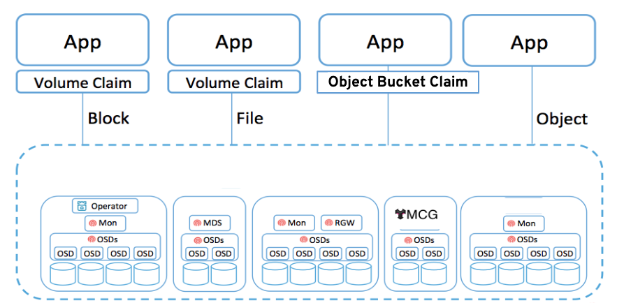

NOTE: If you want more information about how Ceph works please review
<<Introduction to Ceph>> section before starting the exercises in this
module.

[[labexercises]]

== Deploy your storage backend using the OCS operator

=== Scale OCP cluster and add new worker nodes

In this section, you will first validate the OCP environment has 2 or 3 worker
nodes before increasing the cluster size by additional 3 worker nodes for OCS
resources. The `NAME` of your OCP nodes will be different than shown below.

[source,role="execute"]
----
oc get nodes -l node-role.kubernetes.io/worker -l '!node-role.kubernetes.io/infra','!node-role.kubernetes.io/master'
----
.Example output:
----
NAME                                        STATUS   ROLES    AGE    VERSION
ip-10-0-153-37.us-east-2.compute.internal   Ready    worker   4d4h   v1.19.0+9f84db3
ip-10-0-170-25.us-east-2.compute.internal   Ready    worker   4d4h   v1.19.0+9f84db3
----

Now you are going to add 3 more OCP compute nodes to cluster using *machinesets*.

[source,role="execute"]
----
oc get machinesets -n openshift-machine-api | grep -v infra
----

This will show you the existing *machinesets* used to create the 2 or 3 worker
nodes in the cluster already. There is a *machineset* for each AWS AZ
(us-east-1a, us-east-1b, us-east-1c). Your *machinesets* `NAME` will be
different than below.

----
NAME                                        DESIRED   CURRENT   READY   AVAILABLE   AGE
cluster-ocs4-8613-bc282-worker-us-east-2a   1         1         1       1           4d4h
cluster-ocs4-8613-bc282-worker-us-east-2b   1         1         1       1           4d4h
cluster-ocs4-8613-bc282-worker-us-east-2c   0         0                             4d4h
----

Similar to the infrastructure nodes lab, create new *MachineSets* that will
run storage-specific nodes for your OCP cluster:

[source,role="execute"]
----
bash {{ HOME_PATH }}/support/machineset-generator.sh 3 workerocs 0 | oc create -f -
oc get machineset -n openshift-machine-api -l machine.openshift.io/cluster-api-machine-role=workerocs -o name | xargs oc patch -n openshift-machine-api --type='json' -p '[{"op": "add", "path": "/spec/template/spec/metadata/labels", "value":{"node-role.kubernetes.io/worker":"", "role":"storage-node", "cluster.ocs.openshift.io/openshift-storage":""} }]'
oc get machineset -n openshift-machine-api -l machine.openshift.io/cluster-api-machine-role=workerocs -o name | xargs oc scale -n openshift-machine-api --replicas=1
----

Check that you have new *machines* created.

[source,role="execute"]
----
oc get machines -n openshift-machine-api | egrep 'NAME|workerocs'
----

They will be in `Provisioning` for sometime and eventually in a `Running`
STATE. The `NAME` of your machines will be different than shown below.

----
NAME                                                 PHASE     TYPE          REGION      ZONE
         AGE
cluster-ocs4-8613-bc282-workerocs-us-east-2a-g6cfz   Running   m5.4xlarge    us-east-2   us-e
ast-2a   3m48s
cluster-ocs4-8613-bc282-workerocs-us-east-2b-2zdgx   Running   m5.4xlarge    us-east-2   us-e
ast-2b   3m48s
cluster-ocs4-8613-bc282-workerocs-us-east-2c-gg7br   Running   m5.4xlarge    us-east-2   us-e
ast-2c   3m48s
----

You can see that the workerocs *machines* are using are also using the AWS
EC2 instance type `m5.4xlarge`. The `m5.4xlarge` instance type follows our
recommended instance sizing for OCS, 16 cpu and 64 GB mem.

Now you want to see if our new *machines* are added to the OCP cluster.

[source,role="execute"]
----
watch "oc get machinesets -n openshift-machine-api | egrep 'NAME|workerocs'"
----

This step could take more than 5 minutes. The result of this command needs to
look like below before you proceed. All new workerocs *machinesets* should
have an integer, in this case `1`, filled out for all rows and under columns
`READY` and `AVAILABLE`. The `NAME` of your *machinesets* will be different
than shown below.

----
NAME                                           DESIRED   CURRENT   READY   AVAILABLE   AGE
cluster-ocs4-8613-bc282-workerocs-us-east-2a   1         1         1       1           16m
cluster-ocs4-8613-bc282-workerocs-us-east-2b   1         1         1       1           16m
cluster-ocs4-8613-bc282-workerocs-us-east-2c   1         1         1       1           16m
----

You can exit by pressing kbd:[Ctrl+C].

Now check to see that you have 3 new OCP worker nodes. The `NAME` of your OCP
nodes will be different than shown below.

[source,role="execute"]
----
oc get nodes -l node-role.kubernetes.io/worker -l '!node-role.kubernetes.io/infra','!node-role.kubernetes.io/master'
----
.Example output:
----
NAME                                         STATUS   ROLES    AGE    VERSION
ip-10-0-147-230.us-east-2.compute.internal   Ready    worker   14m    v1.19.0+9f84db3
ip-10-0-153-37.us-east-2.compute.internal    Ready    worker   4d4h   v1.19.0+9f84db3
ip-10-0-170-25.us-east-2.compute.internal    Ready    worker   4d4h   v1.19.0+9f84db3
ip-10-0-175-8.us-east-2.compute.internal     Ready    worker   14m    v1.19.0+9f84db3
ip-10-0-209-53.us-east-2.compute.internal    Ready    worker   14m    v1.19.0+9f84db3
----

Let's check to make sure the new OCP nodes have the new OCS label.

[source,role="execute"]
----
oc get nodes -l cluster.ocs.openshift.io/openshift-storage=
----
.Example output:
----
NAME                                         STATUS   ROLES    AGE   VERSION
ip-10-0-147-230.us-east-2.compute.internal   Ready    worker   15m   v1.19.0+9f84db3
ip-10-0-175-8.us-east-2.compute.internal     Ready    worker   15m   v1.19.0+9f84db3
ip-10-0-209-53.us-east-2.compute.internal    Ready    worker   15m   v1.19.0+9f84db3
----
=== Installing the OCS operator

In this section you will be using three of the worker OCP 4 nodes to deploy
OCS 4 using the OCS Operator in OperatorHub. The following will be installed:

- An OCS *OperatorGroup*
- An OCS *Subscription*
- All OCS other resources (Operators, Ceph Pods, Noobaa Pods, StorageClasses)

Start with creating the `openshift-storage` namespace.

[source,role="execute"]
----
oc create namespace openshift-storage
----

You must add the monitoring label to this namespace. This is required to get
prometheus metrics and alerts for the OCP storage dashboards. To label the
`openshift-storage` namespace use the following command:

[source,role="execute"]
----
oc label namespace openshift-storage "openshift.io/cluster-monitoring=true"
----

Now switch over to your *Openshift Web Console*:

{{ MASTER_URL }}

Remember that the login is `kubeadmin` and the password is:

[source,role="copypaste"]
----
{{ KUBEADMIN_PASSWORD }}
----

Once you are logged in, navigate to the *Operators* -> *OperatorHub* menu.

.OCP OperatorHub
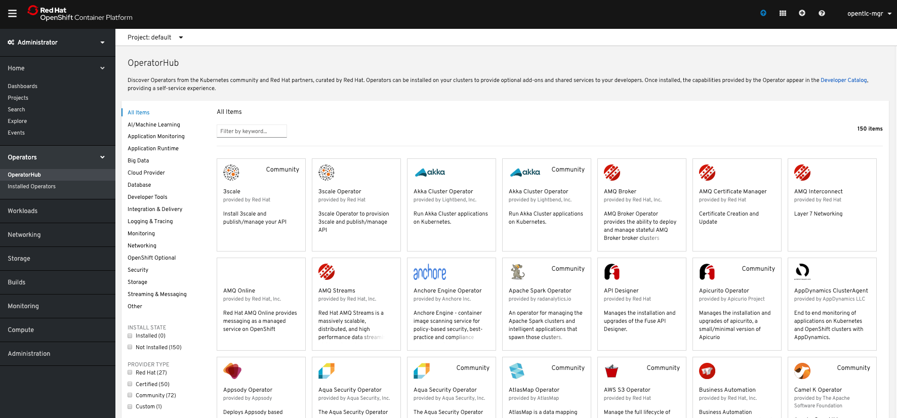

Now type `container storage` in the *Filter by _keyword..._* box.

.OCP OperatorHub filter on OpenShift Container Storage Operator
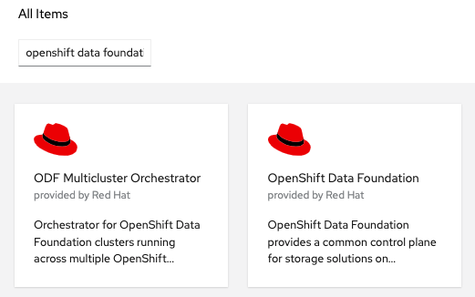

Select `OpenShift Container Storage Operator` and then select *Install*.

.OCP OperatorHub Install OpenShift Container Storage
image::images/ocs/OCS4-OCP4-OperatorHub-Install.png[OCP OperatorHub Install]

On the next screen make sure the settings are as shown in this figure.  

.OCP Subscribe to OpenShift Container Storage
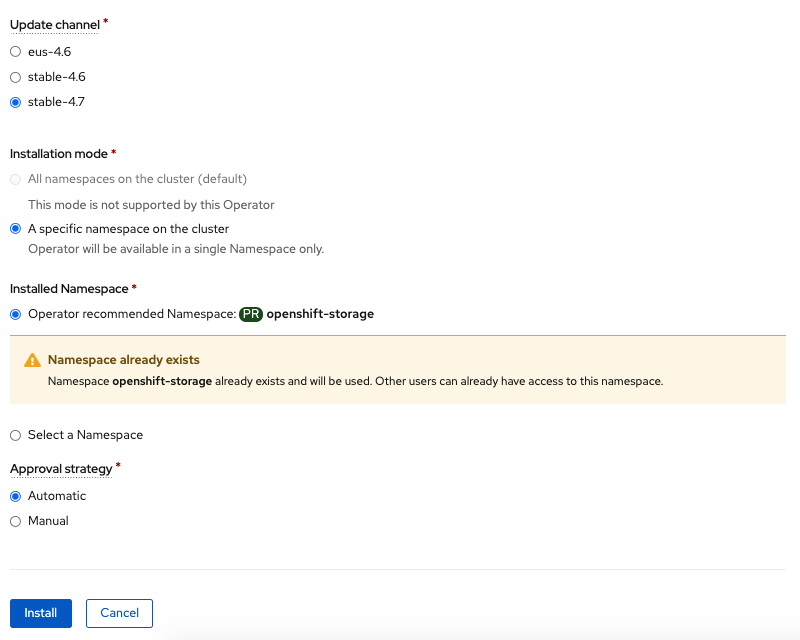

Click `Install`.

Now you can go back to your terminal window to check the progress of the
installation.

[source,role="execute"]
----
watch oc -n openshift-storage get csv
----
.Example output:
----
NAME                  DISPLAY                       VERSION   REPLACES   PHASE
ocs-operator.v4.6.0   OpenShift Container Storage   4.6.0                Succeeded
----

You can exit by pressing kbd:[Ctrl+C].

The resource `csv` is a shortened word for
`clusterserviceversions.operators.coreos.com`.

.Please wait until the operator `PHASE` changes to `Succeeded`
CAUTION: This will mark that the installation of your operator was
successful. Reaching this state can take several minutes.

You will now also see new operator pods in `openshift-storage`
namespace:

[source,role="execute"]
----
oc -n openshift-storage get pods
----
.Example output:
----
NAME                                   READY   STATUS    RESTARTS   AGE
noobaa-operator-698746cd47-sp6w9       1/1     Running   0          108s
ocs-metrics-exporter-78bc44687-pg4hk   1/1     Running   0          107s
ocs-operator-6d99bc6787-d7m9d          1/1     Running   0          108s
rook-ceph-operator-59f7fb95d6-sdjd8    1/1     Running   0          108s
----

Now switch back to your *Openshift Web Console* for the remainder of the
installation for OCS 4.

Select `View Operator` in figure below to get to the OCS configuration screen.

.View Operator in openshift-storage namespace
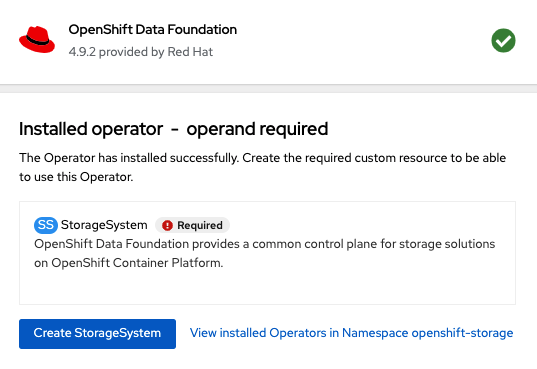

.OCS configuration screen
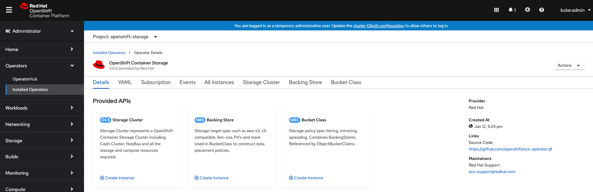

On the top of the OCS configuration screen, scroll over to the right and
click on `Storage Cluster` and then click on `Create OCS Cluster Service`. If
you do not see `Create OCS Cluster Service` refresh your browser window.

.Create Storage Cluster
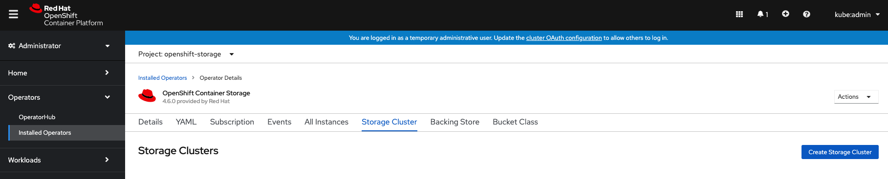

The `Create Storage Cluster` screen will display.

.Create Storage Cluster default settings
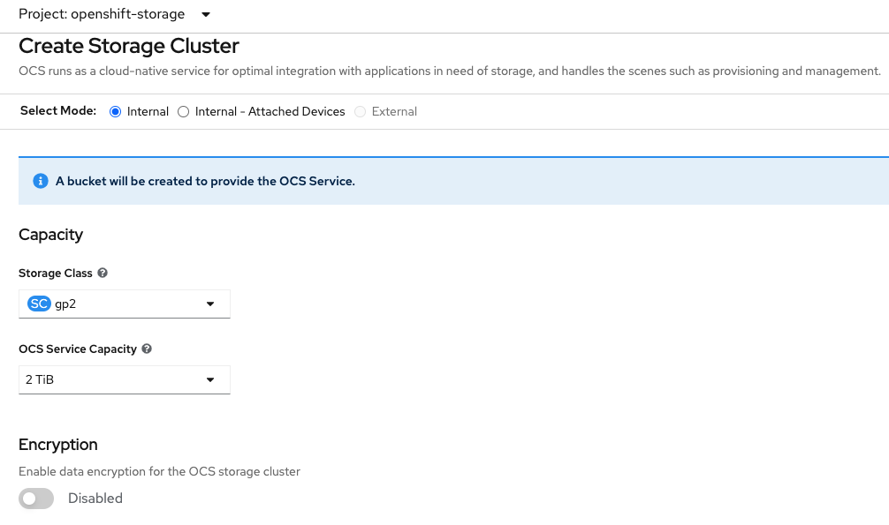

Leave the default selection of `Internal`, `gp2`, `2 TiB` and Encryption `Disabled`.

.Create a new storage cluster
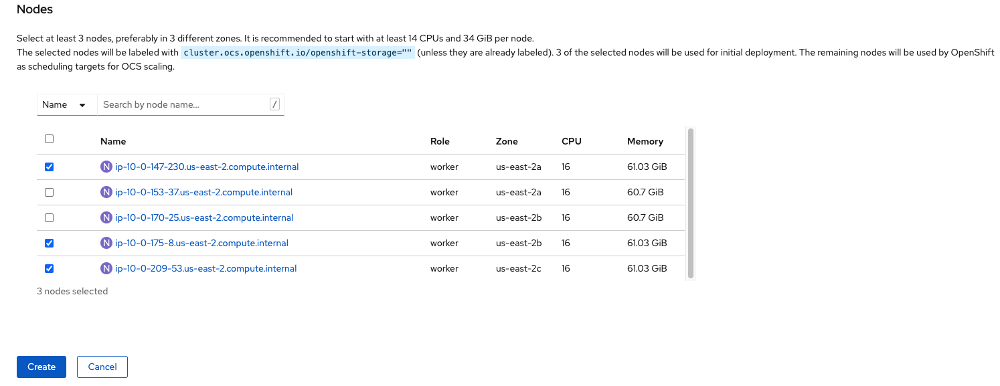

There should be 3 worker nodes already selected that had the OCS label
applied in the last section. Execute command below and make sure they are all
selected.

[source,role="execute"]
----
oc get nodes --show-labels | grep ocs |cut -d' ' -f1
----

Then click on the button `Create` below the dialog box with the 3 workers
selected with a `checkmark`.

You can watch the deployment using the *Openshift Web Console* by going
back to the `Openshift Container Storage Operator` screen and selecting `All
instances`.

Please wait until all *Pods* are marked as `Running` in the CLI or until you
see all instances shown below as `Ready` Status in the Web Console as shown in the following diagram:

.OCS instance overview after cluster install is finished
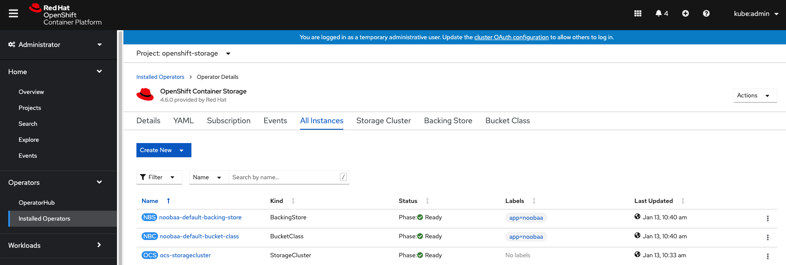

[source,role="execute"]
----
oc -n openshift-storage get pods
----
.Output when the cluster installation is finished
----
NAME                                                              READY   STATUS      RESTART
S   AGE
csi-cephfsplugin-875xd                                            3/3     Running     0
    23m
csi-cephfsplugin-bncsj                                            3/3     Running     0
    23m
csi-cephfsplugin-hjv77                                            3/3     Running     0
    23m
csi-cephfsplugin-lch4m                                            3/3     Running     0
    23m
csi-cephfsplugin-provisioner-6cfdc4bfbb-cklxs                     6/6     Running     0
    23m
csi-cephfsplugin-provisioner-6cfdc4bfbb-krkq5                     6/6     Running     0
    23m
csi-cephfsplugin-wtp4v                                            3/3     Running     0
    23m
csi-rbdplugin-7clqf                                               3/3     Running     0
    23m
csi-rbdplugin-8nllt                                               3/3     Running     0
    23m
csi-rbdplugin-d267h                                               3/3     Running     0
    23m
csi-rbdplugin-provisioner-b46dd5c7-vd58q                          6/6     Running     0
    23m
csi-rbdplugin-provisioner-b46dd5c7-z8mx6                          6/6     Running     0
    23m
csi-rbdplugin-tdj8f                                               3/3     Running     0
    23m
csi-rbdplugin-wp65b                                               3/3     Running     0
    23m
noobaa-core-0                                                     1/1     Running     0
    19m
noobaa-db-0                                                       1/1     Running     0
    19m
noobaa-endpoint-86cc5df669-ffqj2                                  1/1     Running     0
    16m
noobaa-operator-698746cd47-sp6w9                                  1/1     Running     0
    17h
ocs-metrics-exporter-78bc44687-pg4hk                              1/1     Running     0
    17h
ocs-operator-6d99bc6787-d7m9d                                     1/1     Running     0
    17h
rook-ceph-crashcollector-ip-10-0-147-230-7cbf854757-chlgs         1/1     Running     0
    20m
rook-ceph-crashcollector-ip-10-0-175-8-5779d5d5df-p6hkl           1/1     Running     0
    21m
rook-ceph-crashcollector-ip-10-0-209-53-7ccc4cc785-wjxzd          1/1     Running     0
    21m
rook-ceph-drain-canary-128c383c26627b938ab0fd7f47f58d33-665pbsg   1/1     Running     0
    19m
rook-ceph-drain-canary-84c954eec459013180f78efd0a35792c-7b6qdnj   1/1     Running     0
    19m
rook-ceph-drain-canary-ip-10-0-175-8.us-east-2.compute.intrh526   1/1     Running     0
    19m
rook-ceph-mds-ocs-storagecluster-cephfilesystem-a-756df8b4kp9kr   1/1     Running     0
    18m
rook-ceph-mds-ocs-storagecluster-cephfilesystem-b-64585764bbg6b   1/1     Running     0
    18m
rook-ceph-mgr-a-5c74bb4b85-5x26g                                  1/1     Running     0
    20m
rook-ceph-mon-a-746b5457c-hlh7n                                   1/1     Running     0
    21m
rook-ceph-mon-b-754b99cfd-xs9g4                                   1/1     Running     0
    21m
rook-ceph-mon-c-7474d96f55-qhhb6                                  1/1     Running     0
    20m
rook-ceph-operator-59f7fb95d6-sdjd8                               1/1     Running     0
    17h
rook-ceph-osd-0-7d45696497-jwgb7                                  1/1     Running     0
    19m
rook-ceph-osd-1-6f49b665c7-gxq75                                  1/1     Running     0
    19m
rook-ceph-osd-2-76ffc64cd-9zg65                                   1/1     Running     0
    19m
rook-ceph-osd-prepare-ocs-deviceset-gp2-0-data-0-9977n-49ngd      0/1     Completed   0
    20m
rook-ceph-osd-prepare-ocs-deviceset-gp2-1-data-0-nnmpv-z8vq6      0/1     Completed   0
    20m
rook-ceph-osd-prepare-ocs-deviceset-gp2-2-data-0-mtbtj-xrj2n      0/1     Completed   0
    20m
----

The great thing about operators and OpenShift is that the operator has the
intelligence about the deployed components built-in. And, because of the
relationship between the `CustomResource` and the operator, you can check the
status by looking at the `CustomResource` itself. When you went therough the UI
dialogs, ultimately in the back-end an instance of a `StorageCluster` was
created:

[source,role="execute"]
----
oc get storagecluster -n openshift-storage
----

You can check the status of the storage cluster with the following:

[source,role="execute"]
----
oc get storagecluster -n openshift-storage ocs-storagecluster -o jsonpath='{.status.phase}{"\n"}'
----

If it says `Ready`, you can continue.

### Getting to know the Storage Dashboards

You can now also check the status of your storage cluster with the OCS specific
*Dashboards* that are included in your *Openshift Web Console*. You can reach
this by clicking on `Overview` on your left navigation bar, then selecting
`Persistent Storage` on the top navigation bar of the content page.

.Location of OCS Dashboards
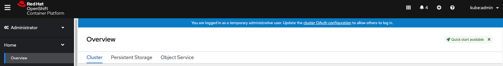

NOTE: If you just finished your OCS 4 deployment it could take 5-10 minutes
for your *Dashboards* to fully populate. Different versions of OCP 4 may have minor differences in *Dashboard* sections and naming of *Dashboards*.

.Storage Dashboard after successful storage installation
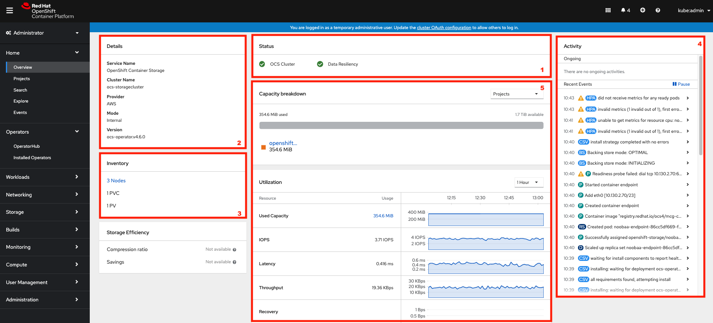

[cols="0,1,10a"]
|===
|<1> | Health | Quick overview of the general health of the storage cluster
|<2> | Details | Overview of the deployed storage cluster version and backend provider
|<3> | Inventory | List of all the resources that are used and offered by the storage system
|<4> | Events | Live overview of all the changes that are being done affecting the storage cluster
|<5> | Utilization | Overview of the storage cluster usage and performance
|===

OCS ships with a *Dashboard* for the Object Store service as well. From the *Overview* click on the `Object Service` on the top
navigation bar of the content page.

.OCS Multi-Cloud-Gateway Dashboard after successful installation
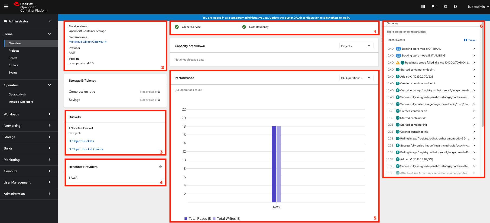

[cols="0,1,10a"]
|===
|<1> | Health | Quick overview of the general health of the Multi-Cloud-Gateway
|<2> | Details | Overview of the deployed MCG version and backend provider including a link to the MCG Dashboard
|<3> | Buckets | List of all the ObjectBucket with are offered and ObjectBucketClaims which are connected to them
|<4> | Resource Providers | Shows the list of configured Resource Providers that are available as backing storage in the MCG
|===

// On the left side of this *Dashboard* you see a blue link labelled `noobaa`, which will get you to the NooBaa Management Console. We will discuss this Management Console later in more detail.

Once this is all healthy, you will be able to use the three new
*StorageClasses* created during the OCS 4 Install:

- ocs-storagecluster-ceph-rbd
- ocs-storagecluster-cephfs
- openshift-storage.noobaa.io

You can see these three *StorageClasses* from the Openshift Web Console by
expanding the `Storage` menu in the left navigation bar and selecting
`Storage Classes`. You can also run the command below:

[source,role="execute"]
----
oc -n openshift-storage get sc
----

Please make sure the three storage classes are available in your cluster
before proceeding.

NOTE: The NooBaa pod used the `ocs-storagecluster-ceph-rbd` storage class for
creating a PVC for mounting to it's `db` container.

=== Using the Rook-Ceph toolbox to check on the Ceph backing storage

Since the Rook-Ceph *toolbox* is not shipped with OCS, we need to deploy it
manually. 

You can patch the `OCSInitialization ocsinit` using the following command line:

[source,role="execute"]
----
oc patch OCSInitialization ocsinit -n openshift-storage --type json --patch  '[{ "op": "replace", "path": "/spec/enableCephTools", "value": true }]'
----

After the `rook-ceph-tools` *Pod* is `Running` you can access the toolbox
like this:

[source,role="execute"]
----
TOOLS_POD=$(oc get pods -n openshift-storage -l app=rook-ceph-tools -o name)
oc rsh -n openshift-storage $TOOLS_POD
----

Once inside the toolbox, try out the following Ceph commands:

[source,role="execute"]
----
ceph status
----

[source,role="execute"]
----
ceph osd status
----

[source,role="execute"]
----
ceph osd tree
----

[source,role="execute"]
----
ceph df
----

[source,role="execute"]
----
rados df
----

[source,role="execute"]
----
ceph versions
----

.Example output:
----
sh-4.2# ceph status
  cluster:
    id:     e3398039-f8c6-4937-ba9d-655f5c01e0ae
    health: HEALTH_OK

  services:
    mon: 3 daemons, quorum a,b,c (age 6h)
    mgr: a(active, since 6h)
    mds: ocs-storagecluster-cephfilesystem:1 {0=ocs-storagecluster-cephfilesystem-a=up:active} 1 up:standby-replay
    osd: 3 osds: 3 up (since 6h), 3 in (since 6h)

  task status:
    scrub status:
        mds.ocs-storagecluster-cephfilesystem-a: idle
        mds.ocs-storagecluster-cephfilesystem-b: idle

  data:
    pools:   3 pools, 96 pgs
    objects: 120 objects, 245 MiB
    usage:   3.5 GiB used, 6.0 TiB / 6 TiB avail
    pgs:     96 active+clean

  io:
    client:   853 B/s rd, 16 KiB/s wr, 1 op/s rd, 1 op/s wr
----

You can exit the toolbox by either pressing kbd:[Ctrl+D] or by executing exit.

[source,role="execute"]
----
exit
----

== Create a new OCP application deployment using Ceph RBD volume

In this section the `ocs-storagecluster-ceph-rbd` *storage class* will be
used by an OCP application + database *deployment* to create RWO
(ReadWriteOnce) persistent storage. The persistent storage will be a Ceph RBD
(RADOS Block Device) volume (object) in the Ceph pool
`ocs-storagecluster-cephblockpool`.

To do so we have created a template file, based on the OpenShift
rails-pgsql-persistent template, that includes an extra parameter
STORAGE_CLASS that enables the end user to specify the storage class the PVC
should use. Feel free to download
`https://github.com/red-hat-storage/ocs-training/blob/master/training/modules/ocs4/attachments/configurable-rails-app.yaml`
to check on the format of this template. Search for `STORAGE_CLASS` in the
downloaded content.

Make sure that you completed all previous sections so that you are ready to
start the Rails + PostgreSQL deployment.

[source,role="execute"]
----
oc new-project my-database-app
oc new-app -f {{ HOME_PATH }}/support/ocslab_rails-app.yaml -p STORAGE_CLASS=ocs-storagecluster-ceph-rbd -p VOLUME_CAPACITY=5Gi
----

After the deployment is started you can monitor with these commands.

[source,role="execute"]
----
oc status
----

Check the PVC that were created.

[source,role="execute"]
----
oc get pvc -n my-database-app
----

This step could take 5 or more minutes. Wait until there are 2 *Pods* in
`Running` STATUS and 4 *Pods* in `Completed` STATUS as shown below.

[source,role="execute"]
----
watch oc get pods -n my-database-app
----
.Example output:
----
NAME                                READY   STATUS      RESTARTS   AGE
postgresql-1-deploy                 0/1     Completed   0          5m48s
postgresql-1-lf7qt                  1/1     Running     0          5m40s
rails-pgsql-persistent-1-build      0/1     Completed   0          5m49s
rails-pgsql-persistent-1-deploy     0/1     Completed   0          3m36s
rails-pgsql-persistent-1-hook-pre   0/1     Completed   0          3m28s
rails-pgsql-persistent-1-pjh6q      1/1     Running     0          3m14s
----

You can exit by pressing kbd:[Ctrl+C].

Once the deployment is complete you can now test the application and the
persistent storage on Ceph.

[source,role="execute"]
----
oc get route rails-pgsql-persistent -n my-database-app -o jsonp
ath --template="{.spec.host}"
----

This will return a route similar to this one (careful: there is no line break
at the end so your shell prompt appears right after the output).

.Example output:
----
rails-pgsql-persistent-my-database-app.apps.cluster-ocs4-8613.ocs4-8613.sandb
ox944.opentlc.com
----

Copy your route (different than above) to a browser window to create articles.
You will need to append `/articles` to the end.

*Example*  http://<your_route>/articles

Enter the `username` and `password` below to create articles and comments.
The articles and comments are saved in a PostgreSQL database which stores its
table spaces on the Ceph RBD volume provisioned using the
`ocs-storagecluster-ceph-rbd` *storageclass* during the application
deployment.

[source]
----
username: openshift
password: secret
----

Lets now take another look at the Ceph `ocs-storagecluster-cephblockpool`
created by the `ocs-storagecluster-ceph-rbd` *Storage Class*. Log into the
*toolbox* pod again.

[source,role="execute"]
----
TOOLS_POD=$(oc get pods -n openshift-storage -l app=rook-ceph-tools -o name)
oc rsh -n openshift-storage $TOOLS_POD
----

Run the same Ceph commands as before the application deployment and compare
to results in prior section. Notice the number of objects in
`ocs-storagecluster-cephblockpool` has increased. The third command lists
RBDs and we should now have two RBDs.

[source,role="execute"]
----
ceph df
----
[source,role="execute"]
----
rados df
----
[source,role="execute"]
----
rbd -p ocs-storagecluster-cephblockpool ls | grep vol
----

You can exit the toolbox by either pressing kbd:[Ctrl+D] or by executing exit.

[source,role="execute"]
----
exit
----

=== Matching PVs to RBDs

A handy way to match persistent volumes to Ceph RBDs is to execute:

[source,role="execute"]
----
oc get pv -o 'custom-columns=NAME:.spec.claimRef.name,PVNAME:.metadata.name,STORAGECLASS:.spec.storageClassName,VOLUMEHANDLE:.spec.csi.volumeHandle'
----
.Example output:
----
NAME                      PVNAME                                     STORAGECLASS                  VOLUMEHANDLE
ocs-deviceset-0-0-d2ppm   pvc-2c08bd9c-332d-11ea-a32f-061f7a67362c   gp2                           <none>
ocs-deviceset-1-0-9tmc6   pvc-2c0a0ed5-332d-11ea-a32f-061f7a67362c   gp2                           <none>
ocs-deviceset-2-0-qtbfv   pvc-2c0babb3-332d-11ea-a32f-061f7a67362c   gp2                           <none>
db-noobaa-core-0          pvc-4610a3ce-332d-11ea-a32f-061f7a67362c   ocs-storagecluster-ceph-rbd   0001-0011-openshift-storage-0000000000000001-4a74e248-332d-11ea-9a7c-0a580a820205
postgresql                pvc-874f93cb-3330-11ea-90b1-0a10d22e734a   ocs-storagecluster-ceph-rbd   0001-0011-openshift-storage-0000000000000001-8765a21d-3330-11ea-9a7c-0a580a820205
rook-ceph-mon-a           pvc-d462ecb0-332c-11ea-a32f-061f7a67362c   gp2                           <none>
rook-ceph-mon-b           pvc-d79d0db4-332c-11ea-a32f-061f7a67362c   gp2                           <none>
rook-ceph-mon-c           pvc-da9cc0e3-332c-11ea-a32f-061f7a67362c   gp2                           <none>
----

The second half of the `VOLUMEHANDLE` column mostly matches what your RBD is
named inside of Ceph. All you have to do is append `csi-vol-` to the front
like this:

.Get the full RBD name and the associated information for our postgreSQL PV

[source,role="execute"]
----
CSIVOL=$(oc get pv $(oc get pv | grep my-database-app | awk '{ print $1 }') -o jsonpath='{.spec.csi.volumeHandle}' | cut -d '-' -f 6- | awk '{print "csi-vol-"$1}')
echo $CSIVOL
----
[source,role="execute"]
----
TOOLS_POD=$(oc get pods -n openshift-storage -l app=rook-ceph-tools -o name)
oc rsh -n openshift-storage $TOOLS_POD rbd -p ocs-storagecluster-cephblockpool info $CSIVOL
----

.Example output:
----
rbd image 'csi-vol-8765a21d-3330-11ea-9a7c-0a580a820205':
        size 5 GiB in 1280 objects
        order 22 (4 MiB objects)
        snapshot_count: 0
        id: 17e811c7f287
        block_name_prefix: rbd_data.17e811c7f287
        format: 2
        features: layering
        op_features:
        flags:
        create_timestamp: Thu Jan  9 22:36:51 2020
        access_timestamp: Thu Jan  9 22:36:51 2020
        modify_timestamp: Thu Jan  9 22:36:51 2020
----

=== Expand RBD based PVCs

OpenShift Container 4.5 and later versions let you expand an existing PVC based
on the `ocs-storagecluster-ceph-rbd` storage class. This chapter walks you
through the steps to perform a PVC expansion.

We will first artificially fill up the PVC used by the application you have
just created. Your `postgresql` pod will have a slightly different name.

[source,role="execute"]
----
oc rsh -n my-database-app postgresql-1-p62vw
df
----
.Example output
----
Filesystem                           1K-blocks     Used Available Use% Mounted on
overlay                              125277164 12004092 113273072  10% /
tmpfs                                    65536        0     65536   0% /dev
tmpfs                                 32571336        0  32571336   0% /sys/fs/cgroup
shm                                      65536        8     65528   1% /dev/shm
tmpfs                                 32571336    10444  32560892   1% /etc/passwd
/dev/mapper/coreos-luks-root-nocrypt 125277164 12004092 113273072  10% /etc/hosts
/dev/rbd1                              5095040    66968   5011688   2% /var/lib/pgsql/data
tmpfs                                 32571336       28  32571308   1% /run/secrets/kubernetes.io/serviceaccount
tmpfs                                 32571336        0  32571336   0% /proc/acpi
tmpfs                                 32571336        0  32571336   0% /proc/scsi
tmpfs                                 32571336        0  32571336   0% /sys/firmware
----

As observed in the output above the RBD backed PVC, the device named `/dev/rbd`
is mounted as `/var/lib/pgsql/data`. This is the directory we will artificially
fill up.

[source,role="execute"]
----
dd if=/dev/zero of=/var/lib/pgsql/data/fill.up bs=1M count=3850
----
.Example output
----
3850+0 records in
3850+0 records out
4037017600 bytes (4.0 GB) copied, 13.6446 s, 296 MB/s
----

Let's verify the volume mounted has increased.
[source,role="execute"]
----
df
----
.Example output
----
Filesystem                           1K-blocks     Used Available Use% Mounted on
overlay                              125277164 12028616 113248548  10% /
tmpfs                                    65536        0     65536   0% /dev
tmpfs                                 32571336        0  32571336   0% /sys/fs/cgroup
shm                                      65536        8     65528   1% /dev/shm
tmpfs                                 32571336    10444  32560892   1% /etc/passwd
/dev/mapper/coreos-luks-root-nocrypt 125277164 12028616 113248548  10% /etc/hosts
/dev/rbd1                              5095040  4009372   1069284  79% /var/lib/pgsql/data
tmpfs                                 32571336       28  32571308   1% /run/secrets/kubernetes.io/serviceaccount
tmpfs                                 32571336        0  32571336   0% /proc/acpi
tmpfs                                 32571336        0  32571336   0% /proc/scsi
tmpfs                                 32571336        0  32571336   0% /sys/firmware
----

As observed in the output above the filesystem usage for `/var/lib/pgsql/data`
has increased up to 79%. By default OCP will generate an alert when a PVC
crosses the 75% full threshold.

Now exit the pod.

[source,role="execute"]
----
exit
----

Let's verify an alert has appeared in the OCP event log.

.OpenShift Container Platform Events
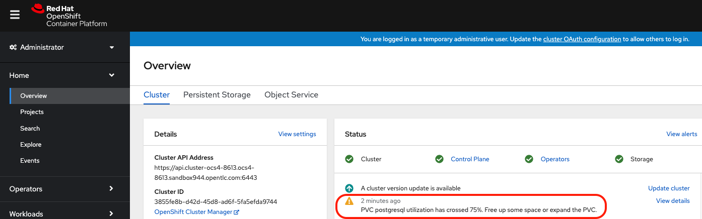

==== Expand applying a modified PVC YAML file

To expand a PVC we simply need to change the actual amount of storage that is
requested. This can easily be performed by exporting the PVC specfications with
the following command:

[source,role="execute"]
----
oc get pvc postgresql -n my-database-app --export -o yaml >pvc.yaml
----

In the file `pvc.yaml` that was created, search for the following section using
your favorite editor.

.Example output
----
[truncated]
spec:
  accessModes:
  - ReadWriteOnce
  resources:
    requests:
      storage: 5Gi
  storageClassName: ocs-storagecluster-ceph-rbd
  volumeMode: Filesystem
  volumeName: pvc-4d6838df-b4cd-4bb1-9969-1af93c1dc5e6
status: {}
----

Edit `storage: 5Gi` and replace it with `storage: 10Gi`. The resulting section
in your file should look like the output below.

.Example output
----
[truncated]
spec:
  accessModes:
  - ReadWriteOnce
  resources:
    requests:
      storage: 10Gi
  storageClassName: ocs-storagecluster-ceph-rbd
  volumeMode: Filesystem
  volumeName: pvc-4d6838df-b4cd-4bb1-9969-1af93c1dc5e6
status: {}
----

Now you can apply your updated PVC specifications using the following command:

[source,role="execute"]
----
oc apply -f pvc.yaml -n my-database-app
----
.Example output
----
Warning: oc apply should be used on resource created by either oc create --save-config or oc apply
persistentvolumeclaim/postgresql configured
----

You can visualize the progress of the expansion of the PVC using the following
command:

[source,role="execute"]
----
oc describe persistentvolumeclaim postgresql -n my-database-app
----
.Example output
----
[truncated]
Finalizers:    [kubernetes.io/pvc-protection]
Capacity:      10Gi
Access Modes:  RWO
VolumeMode:    Filesystem
Mounted By:    postgresql-1-p62vw
Events:
  Type     Reason                      Age   From                                                                                                                Message
  ----     ------                      ----  ----                                                                                                                -------
  Normal   ExternalProvisioning        120m  persistentvolume-controller                                                                                         waiting for a volume to be created, either by external provisioner "openshift-storage.rbd.csi.ceph.com" or manually created by system administrator
  Normal   Provisioning                120m  openshift-storage.rbd.csi.ceph.com_csi-rbdplugin-provisioner-66f66699c8-gcm7t_3ce4b8bc-0894-4824-b23e-ed9bd46e7b41  External provisioner is provisioning volume for claim "my-database-app/postgresql"
  Normal   ProvisioningSucceeded       120m  openshift-storage.rbd.csi.ceph.com_csi-rbdplugin-provisioner-66f66699c8-gcm7t_3ce4b8bc-0894-4824-b23e-ed9bd46e7b41  Successfully provisioned volume pvc-4d6838df-b4cd-4bb1-9969-1af93c1dc5e6
  Warning  ExternalExpanding           65s   volume_expand                                                                                                       Ignoring the PVC: didn't find a plugin capable of expanding the volume; waiting for an external controller to process this PVC.
  Normal   Resizing                    65s   external-resizer openshift-storage.rbd.csi.ceph.com                                                                 External resizer is resizing volume pvc-4d6838df-b4cd-4bb1-9969-1af93c1dc5e6
  Normal   FileSystemResizeRequired    65s   external-resizer openshift-storage.rbd.csi.ceph.com                                                                 Require file system resize of volume on node
  Normal   FileSystemResizeSuccessful  23s   kubelet, ip-10-0-199-224.us-east-2.compute.internal                                                                 MountVolume.NodeExpandVolume succeeded for volume "pvc-4d6838df-b4cd-4bb1-9969-1af93c1dc5e6"
----

NOTE: The expansion process commonly takes over 30 seconds to complete and is
based on the workload of your pod. This is due to the fact that the expansion
requires the resizing of the underlying RBD image (pretty fast) while also
requiring the resize of the filesystem that sits on top of the block device. To
perform the latter the filesystem must be quiesced to be safely expanded. In
the example above you can see that the filesystem expansion took
approximatively 40 seconds while the RBD resizing took less than a second.

WARNING: Repeat the command above until the `FileSystemResizeSuccessful`
message is displayed.

CAUTION: Reducing the size of a PVC is NOT supported.

Another way to check on the expansion of the PVC is to simply display the PVC
information using the following command:

[source,role="execute"]
----
oc get pvc -n my-database-app
----
.Example output
----
NAME         STATUS   VOLUME                                     CAPACITY   ACCESS MODES   STORAGECLASS                  AGE
postgresql   Bound    pvc-4d6838df-b4cd-4bb1-9969-1af93c1dc5e6   10Gi       RWO            ocs-storagecluster-ceph-rbd   121m
----

NOTE: The capacity column will reflect the new requested size when the
expansion process is complete.

Another method to check on the expansion of the PVC is to go through two
specific fields of the PVC object via the CLI.

The current allocated size for the PVC can be checked this way:
[source,role="execute"]
----
echo $(oc get pvc postgresql -n my-database-app -o jsonpath='{.status.capacity.storage}')
----
.Example output
----
10Gi
----

The requested size for the PVC can be checked this way:
[source,role="execute"]
----
echo $(oc get pvc postgresql -n my-database-app -o jsonpath='{.spec.resources.requests.storage}')
----
.Example output
----
10Gi
----

NOTE: When both fields report the same value, the expansion was successful.

==== Expand via oc patch command

Another method to expand a PVC through the CLI is to use the following command:

[source,role="execute"]
----
oc patch pvc postgresql -n my-database-app --type json --patch  '[{ "op": "replace", "path": "/spec/resources/requests/storage", "value": "nnGi" }]'
----

NOTE: Simply adapt the size of the command above (`nnGi`) to reflect the new
size needed.

==== Expand via the UI

The last method available to expand a PVC is to do so through the UI. Proceed
as follow:

Fierst step is to select the project to which the PVC belongs to.

.Select the appropriate project
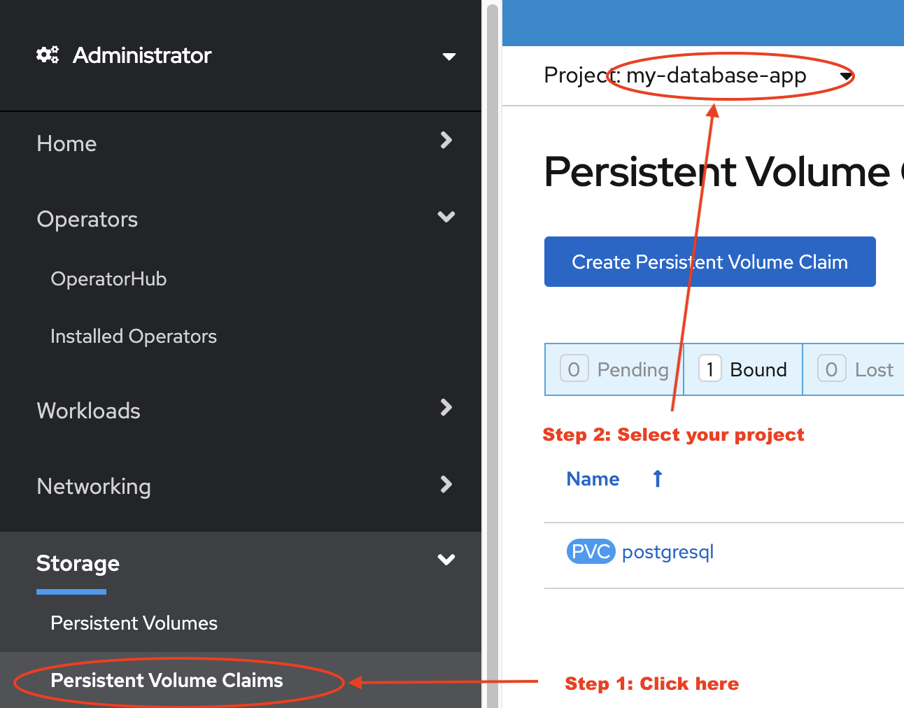

Choose `Expand PVC` from the contextual menu.

.Choose Expand from menu
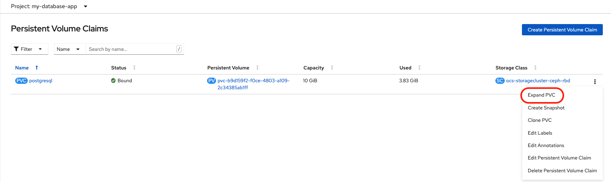

In the dialog box that appears enter the new capacity for the PVC.

CAUTION: You can NOT reduce the size of a PVC.

.Enter the new size for the PVC
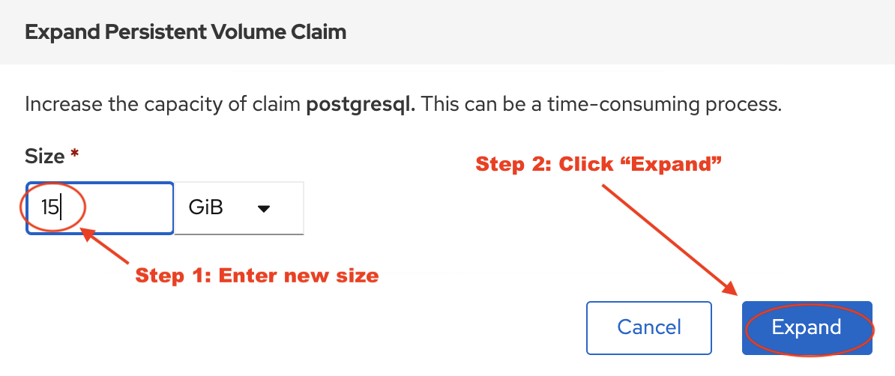

Navigate back to the list of PVC for your project.

.Navigate back to the list of PVCs
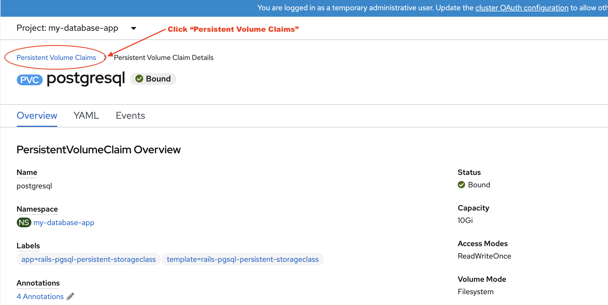

You now simply have to wait for the expansion to complete and for the new size
to be reflected in the UI.

.Wait for the expansion to complete
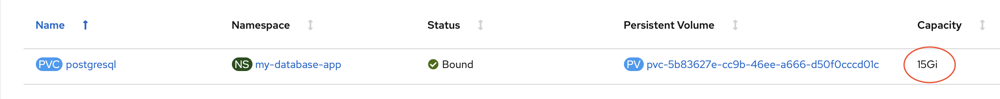

== Create a new OCP application deployment using CephFS volume

In this section the `ocs-storagecluster-cephfs` *Storage Class* will be used
to create a RWX (ReadWriteMany) PVC that can be used by multiple pods at the
same time. The application we will use is called `File Uploader`.

Create a new project:

[source,role="execute"]
----
oc new-project my-shared-storage
----

Next deploy the example PHP application called `file-uploader`:

[source,role="execute"]
----
oc new-app openshift/php:7.2-ubi8~https://github.com/christianh814/openshift-php-upload-demo --name=file-uploader
----

.Sample Output:
----
--> Found image cf452e9 (4 weeks old) in image stream "openshift/php" under t
ag "7.2-ubi8" for "openshift/php:7.2-ubi8"

    Apache 2.4 with PHP 7.2
    -----------------------
    PHP 7.2 available as container is a base platform for building and runnin
g various PHP 7.2 applications and frameworks. PHP is an HTML-embedded script
ing language. PHP attempts to make it easy for developers to write dynamicall
y generated web pages. PHP also offers built-in database integration for seve
ral commercial and non-commercial database management systems, so writing a d
atabase-enabled webpage with PHP is fairly simple. The most common use of PHP
 coding is probably as a replacement for CGI scripts.

    Tags: builder, php, php72, php-72

    * A source build using source code from https://github.com/christianh814/
openshift-php-upload-demo will be created
      * The resulting image will be pushed to image stream tag "file-uploader
:latest"
      * Use 'oc start-build' to trigger a new build

--> Creating resources ...
    imagestream.image.openshift.io "file-uploader" created
    buildconfig.build.openshift.io "file-uploader" created
    deployment.apps "file-uploader" created
    service "file-uploader" created
--> Success
    Build scheduled, use 'oc logs -f buildconfig/file-uploader' to track its
progress.
    Application is not exposed. You can expose services to the outside world
by executing one or more of the commands below:
     'oc expose service/file-uploader'
    Run 'oc status' to view your app.
----

Watch and wait for the application to be deployed:

[source,role="execute"]
----
oc logs -f bc/file-uploader -n my-shared-storage
----

.Sample Output:
----
Cloning "https://github.com/christianh814/openshift-php-upload-demo" ...

[...]

Generating dockerfile with builder image image-registry.openshift-image-regis
try.svc:5000/openshift/php@sha256:d97466f33999951739a76bce922ab17088885db610c
0e05b593844b41d5494ea
STEP 1: FROM image-registry.openshift-image-registry.svc:5000/openshift/php@s
ha256:d97466f33999951739a76bce922ab17088885db610c0e05b593844b41d5494ea
STEP 2: LABEL "io.openshift.build.commit.author"="Christian Hernandez <christ
ian.hernandez@yahoo.com>"       "io.openshift.build.commit.date"="Sun Oct 1 1
7:15:09 2017 -0700"       "io.openshift.build.commit.id"="288eda3dff43b02f7f7
b6b6b6f93396ffdf34cb2"       "io.openshift.build.commit.ref"="master"       "
io.openshift.build.commit.message"="trying to modularize"       "io.openshift
.build.source-location"="https://github.com/christianh814/openshift-php-uploa
d-demo"       "io.openshift.build.image"="image-registry.openshift-image-regi
stry.svc:5000/openshift/php@sha256:d97466f33999951739a76bce922ab17088885db610
c0e05b593844b41d5494ea"
STEP 3: ENV OPENSHIFT_BUILD_NAME="file-uploader-1"     OPENSHIFT_BUILD_NAMESP
ACE="my-shared-storage"     OPENSHIFT_BUILD_SOURCE="https://github.com/christ
ianh814/openshift-php-upload-demo"     OPENSHIFT_BUILD_COMMIT="288eda3dff43b0
2f7f7b6b6b6f93396ffdf34cb2"
STEP 4: USER root
STEP 5: COPY upload/src /tmp/src
STEP 6: RUN chown -R 1001:0 /tmp/src
STEP 7: USER 1001
STEP 8: RUN /usr/libexec/s2i/assemble
---> Installing application source...
=> sourcing 20-copy-config.sh ...
---> 17:24:39     Processing additional arbitrary httpd configuration provide
d by s2i ...
=> sourcing 00-documentroot.conf ...
=> sourcing 50-mpm-tuning.conf ...
=> sourcing 40-ssl-certs.sh ...
STEP 9: CMD /usr/libexec/s2i/run
STEP 10: COMMIT temp.builder.openshift.io/my-shared-storage/file-uploader-1:3
b83e447
Getting image source signatures

[...]

Writing manifest to image destination
Storing signatures
Successfully pushed image-registry.openshift-image-registry.svc:5000/my-share
d-storage/file-uploader@sha256:929c0ce3dcc65a6f6e8bd44069862858db651358b88065
fb483d51f5d704e501
Push successful
----

The command prompt returns out of the tail mode once you see _Push successful_.

NOTE: This use of the `new-app` command directly asked for application code to
be built and did not involve a template. That's why it only created a *single
Pod* deployment with a *Service* and no *Route*.

Let's make our application production ready by exposing it via a `Route` and
scale to 3 instances for high availability:

[source,role="execute"]
----
oc expose svc/file-uploader -n my-shared-storage
----
[source,role="execute"]
----
oc scale --replicas=3 deploy/file-uploader -n my-shared-storage
----
[source,role="execute"]
----
oc get pods -n my-shared-storage
----

You should have 3 `file-uploader` *Pods* in a few minutes.

[CAUTION]
====
Never attempt to store persistent data in a *Pod* that has no persistent
volume associated with it. *Pods* and their containers are ephemeral by
definition, and any stored data will be lost as soon as the *Pod* terminates
for whatever reason.
====

The app is of course not useful like this. We can fix this by providing shared
storage to this app.

You can create a *PersistentVolumeClaim* and attach it into an application with
the `oc set volume` command. Execute the following

[source,role="execute"]
----
oc set volume deploy/file-uploader --add --name=my-shared-storage \
-t pvc --claim-mode=ReadWriteMany --claim-size=1Gi \
--claim-name=my-shared-storage --claim-class=ocs-storagecluster-cephfs \
--mount-path=/opt/app-root/src/uploaded \
-n my-shared-storage
----

This command will:

* create a *PersistentVolumeClaim*
* update the *Deployment* to include a `volume` definition
* update the *Deployment* to attach a `volumemount` into the specified
  `mount-path`
* cause a new deployment of the 3 application *Pods*

For more information on what `oc set volume` is capable of, look at its help output
with `oc set volume -h`. Now, let's look at the result of adding the volume:

[source,role="execute"]
----
oc get pvc -n my-shared-storage
----

.Sample Output:
----
NAME                STATUS   VOLUME                                     CAPACITY   ACCESS MODES   STORAGECLASS                AGE
my-shared-storage   Bound    pvc-c34bb9db-43a7-4eca-bc94-0251d7128721   1Gi        RWX            ocs-storagecluster-cephfs   47s
----

Notice the `ACCESSMODE` being set to *RWX* (short for `ReadWriteMany`).

All 3 `file-uploader`*Pods* are using the same *RWX* volume. Without this
`ACCESSMODE`, OpenShift will not attempt to attach multiple *Pods* to the
same *PersistentVolume* reliably. If you attempt to scale up deployments that
are using *RWO* or `ReadWriteOnce` storage, the *Pods* will actually all
become co-located on the same node.

Try it out in your file uploader web application using your browser. Upload
new files.

Now, check the *Route* that has been created:

[source,role="execute"]
----
oc get route file-uploader -n my-shared-storage -o jsonpath --template="{.spec.host}"
----

This will return a route similar to this one (careful: there is no line break
at the end so your shell prompt appears right after the output).

.Sample Output:
----
file-uploader-my-shared-storage.apps.cluster-ocs4-8613.ocs4-8613.sandbox944.o
pentlc.com
----

Point your browser to the web application using the URL advertised by your
route. *Your `route` will be different*

The web app simply lists all uploaded files and offers the ability to upload
new ones as well as download the existing data. Right now there is
nothing.

Select an arbitrary file from your local machine and upload it to the app.

.A simple PHP-based file upload tool
image::images/ocs/uploader_screen_upload.png[]

Once done click *_List uploaded files_* to see the list of all currently
uploaded files.

=== Expand CephFS based PVCs

OpenShift Container 4.5 and later versions let you expand an existing PVC based
on the `ocs-storagecluster-cephfs` storage class. This chapter walks you
through the steps to perform a PVC expansion through the CLI.

NOTE: All the other methods described for expanding a RBD based PVC are also
available.

[source,role="execute"]
----
oc patch pvc my-shared-storage -n my-shared-storage --type json --patch  '[{ "op": "replace", "path": "/spec/resources/requests/storage", "value": "5Gi" }]'
----
.Example output
----
persistentvolumeclaim/my-shared-storage patched
----

Now let's verify the RWX PVC has been expanded.

[source,role="execute"]
----
echo $(oc get pvc my-shared-storage -n my-shared-storage -o jsonpath='{.status.capacity.storage}')
----
.Example output
----
5Gi
----

[source,role="execute"]
----
echo $(oc get pvc my-shared-storage -n my-shared-storage -o jsonpath='{.spec.resources.requests.storage}')
----
.Example output
----
5Gi
----

NOTE: Repeat both commands until output values are identical.

NOTE: CephFS based RWX PVC resizing, as opposed to RBD based ones, is almost
instantaneous. This is due to the fact that resizing such PVC does not involved
resizing a filesystem but simply involves updating a quota for the mounted
filesystem.

CAUTION: Reducing the size of a PVC is NOT supported.

== Using OCS for Prometheus Metrics

OpenShift ships with a pre-configured and self-updating monitoring stack that
is based on the Prometheus open source project and its wider eco-system. It
provides monitoring of cluster components and ships with a set of alerts to
immediately notify the cluster administrator about any occurring problems.
For production environments, it is highly recommended to configure persistent
storage using block storage technology. OCS 4 provide block storage using
Ceph RBD volumes. Running cluster monitoring with persistent storage means
that your metrics are stored to a persistent volume and can survive a pod
being restarted or recreated. This section will detail how to migrate
Prometheus and AlertManager storage to Ceph RBD volumes for persistence.

First, let's discover what *Pods* and *PVCs* are installed in the
`openshift-monitoring` namespace. In the prior module, OpenShift
Infrastructure Nodes, the Prometheus and AlertManager resources were moved to
the OCP infra nodes.

[source,role="execute"]
----
oc get pods,pvc -n openshift-monitoring
----
.Example output:
----
NAME                                               READY   STATUS         RESTARTS   AGE
pod/alertmanager-main-0                            5/5     Running        0          6d21h
pod/alertmanager-main-1                            5/5     Running        0          6d21h
pod/alertmanager-main-2                            5/5     Running        0          6d21h
pod/cluster-monitoring-operator-595888fddd-mcgnl   2/2     Running        0          4h49m
pod/grafana-65454464fd-5spx2                       2/2     Running        0          26h
pod/kube-state-metrics-7cb89d65d4-p9hbd            3/3     Running        0          6d21h
pod/node-exporter-96zjb                            2/2     Running        0          6d21h
pod/node-exporter-9jjdk                            2/2     Running        0          2d17h
pod/node-exporter-dhnt4                            2/2     Running        0          6d21h
pod/node-exporter-kg2fb                            2/2     Running        0          2d17h
pod/node-exporter-l27n2                            2/2     Running        0          16h
pod/node-exporter-qq4g7                            2/2     Running        0          16h
pod/node-exporter-rfnxb                            2/2     Running        0          16h
pod/node-exporter-v8kpq                            2/2     Running        0          2d17h
pod/node-exporter-wvm8n                            2/2     Running        0          6d21h
pod/node-exporter-wwcr9                            2/2     Running        0          6d21h
pod/node-exporter-z8r98                            2/2     Running        0          6d21h
pod/openshift-state-metrics-57969c7f87-h8fm4       3/3     Running        0          6d21h
pod/prometheus-adapter-cb658c44-zmcww              1/1     Running        0          2d22h
pod/prometheus-adapter-cb658c44-zsn85              1/1     Running        0          2d22h
pod/prometheus-k8s-0                               6/6     Running        0          6d21h
pod/prometheus-k8s-1                               6/6     Running        0          6d21h
pod/prometheus-operator-8594bd77df-ftwvl           2/2     Running        0          26h
pod/telemeter-client-79d7ddbf84-ft97l              3/3     Running        0          42h
pod/thanos-querier-787547fbd6-qw9tr                5/5     Running        0          6d21h
pod/thanos-querier-787547fbd6-xdsmm                5/5     Running        0          6d21h
----

At this point there are no *PVC* resources because Prometheus and
AlertManager are both using ephemeral (EmptyDir) storage. This is the way
OpenShift is initially installed. The Prometheus stack consists of the
Prometheus database and the alertmanager data. Persisting both is
best-practice since data loss on either of these will cause you to lose your
collected metrics and alerting data.

### Modifying your Prometheus environment

For Prometheus every supported configuration change is controlled through a
central *ConfigMap*, which needs to exist before we can make changes. When
you start off with a clean installation of Openshift, the ConfigMap to
configure the Prometheus environment may not be present. To check if your
ConfigMap is present, execute this:

[source,role="execute"]
----
oc -n openshift-monitoring get configmap cluster-monitoring-config
----
.Output if the ConfigMap is not yet created:
----
Error from server (NotFound): configmaps "cluster-monitoring-config" not found
----

.Output if the ConfigMap is created:
----
NAME                        DATA   AGE
cluster-monitoring-config   1      116m
----

If you are missing the *ConfigMap*, create it using this command:

[source,role="execute"]
----
oc apply -f {{ HOME_PATH }}/support/ocslab_cluster-monitoring-noinfra.yaml
----
.Sample output:
----
configmap/cluster-monitoring-config created
----

[Note]
====
If the *ConfigMap* already exists because of completing prior module
`OpenShift Infrastructure Nodes`, you will apply changes to the existing
*ConfigMap*.

[source,role="execute"]
----
oc apply -f {{ HOME_PATH }}/support/ocslab_cluster-monitoring-withinfra.yaml
----
.Sample output:
----
configmap/cluster-monitoring-config updated
----
====

You can view the *ConfigMap* with the following command:

NOTE: The size of the Ceph RBD volumes, `40Gi`, can be modified to be larger or
smaller depending on requirements.

[source,role="execute"]
----
oc -n openshift-monitoring get configmap cluster-monitoring-config -o yaml | more
----

.ConfigMap sample output:
[source,yaml]
----
[...]
      volumeClaimTemplate:
        metadata:
          name: prometheusdb
        spec:
          storageClassName: ocs-storagecluster-ceph-rbd
          resources:
            requests:
              storage: 40Gi
[...]
      volumeClaimTemplate:
        metadata:
          name: alertmanager
        spec:
          storageClassName: ocs-storagecluster-ceph-rbd
          resources:
            requests:
              storage: 40Gi
[...]
----

Once you create this new *ConfigMap* `cluster-monitoring-config`, the
affected *Pods* will automatically be restarted and the new storage will be
mounted in the Pods.

NOTE: It is not possible to retain data that was written on the default
EmptyDir-based or ephemeral installation. Thus you will start with an empty
DB after changing the backend storage thereby starting over with metric
collection and reporting.

After a couple of minutes, the AlertManager and Prometheus *Pods* will have
restarted and you will see new *PVCs* in the `openshift-monitoring` namespace
that they are now providing persistent storage.

[source,role="execute"]
----
oc get pods,pvc -n openshift-monitoring
----
.Example output:
[source]
----
NAME                               STATUS   VOLUME                                     CAPACITY   ACCESS MODES   STORAGECLASS                  AGE
[...]
alertmanager-alertmanager-main-0   Bound    pvc-733be285-aaf9-4334-9662-44b63bb4efdf   40Gi       RWO            ocs-storagecluster-ceph-rbd   3m37s
alertmanager-alertmanager-main-1   Bound    pvc-e07ebe61-de5d-404c-9a25-bb3a677281c5   40Gi       RWO            ocs-storagecluster-ceph-rbd   3m37s
alertmanager-alertmanager-main-2   Bound    pvc-9de2edf2-9f5e-4f62-8aa7-ecfd01957748   40Gi       RWO            ocs-storagecluster-ceph-rbd   3m37s
prometheusdb-prometheus-k8s-0      Bound    pvc-5b845908-d929-4326-976e-0659901468e9   40Gi       RWO            ocs-storagecluster-ceph-rbd   3m31s
prometheusdb-prometheus-k8s-1      Bound    pvc-f2d22176-6348-451f-9ede-c00b303339af   40Gi       RWO            ocs-storagecluster-ceph-rbd   3m31s
----

You can validate that Prometheus and AlertManager are working correctly after
moving to persistent storage <<Monitoring the OCS environment>> in a later
section of this lab guide.

== Using the Multi-Cloud-Gateway

This section discusses the usage of the Multi-Cloud-Gateway (MCG). Currently
the best way to configure the MCG is to use the CLI.

NOTE: While the NooBaa Web Management Console is accessible, it should not be
used to create any resources, since they are currently not synchronized back
to the Openshift cluster.

=== Checking on the MCG status

The MCG status can be checked with the NooBaa CLI. Make sure you are in the
`openshift-storage` project when you execute this command.

[source,role="execute"]
----
noobaa status -n openshift-storage
----
.Example output:
----
INFO[0000] CLI version: 5.6.0
INFO[0000] noobaa-image: noobaa/noobaa-core:5.6.0
INFO[0000] operator-image: noobaa/noobaa-operator:5.6.0
INFO[0000] Namespace: openshift-storage
INFO[0000]
INFO[0000] CRD Status:
INFO[0000] ✅ Exists: CustomResourceDefinition "noobaas.noobaa.io"
INFO[0000] ✅ Exists: CustomResourceDefinition "backingstores.noobaa.io"
INFO[0000] ✅ Exists: CustomResourceDefinition "bucketclasses.noobaa.io"
INFO[0000] ✅ Exists: CustomResourceDefinition "objectbucketclaims.objectbucket.io"
INFO[0000] ✅ Exists: CustomResourceDefinition "objectbuckets.objectbucket.io"
INFO[0000]
INFO[0000] Operator Status:
INFO[0000] ✅ Exists: Namespace "openshift-storage"
INFO[0000] ✅ Exists: ServiceAccount "noobaa"
INFO[0000] ✅ Exists: Role "ocs-operator.v4.6.0-noobaa-6649766bf4"
INFO[0000] ✅ Exists: RoleBinding "ocs-operator.v4.6.0-noobaa-6649766bf4"
INFO[0000] ✅ Exists: ClusterRole "ocs-operator.v4.6.0-65577bfbc"
INFO[0000] ✅ Exists: ClusterRoleBinding "ocs-operator.v4.6.0-65577bfbc"
INFO[0000] ✅ Exists: Deployment "noobaa-operator"
INFO[0000]
INFO[0000] System Status:
INFO[0000] ✅ Exists: NooBaa "noobaa"
INFO[0000] ✅ Exists: StatefulSet "noobaa-core"
INFO[0000] ✅ Exists: Service "noobaa-mgmt"
INFO[0000] ✅ Exists: Service "s3"
INFO[0000] ✅ Exists: StatefulSet "noobaa-db"
INFO[0000] ✅ Exists: Service "noobaa-db"
INFO[0000] ✅ Exists: Secret "noobaa-server"
INFO[0000] ✅ Exists: Secret "noobaa-operator"
INFO[0000] ✅ Exists: Secret "noobaa-endpoints"
INFO[0000] ✅ Exists: Secret "noobaa-admin"
INFO[0000] ✅ Exists: StorageClass "openshift-storage.noobaa.io"
INFO[0000] ✅ Exists: BucketClass "noobaa-default-bucket-class"
INFO[0000] ✅ Exists: Deployment "noobaa-endpoint"
INFO[0000] ✅ Exists: HorizontalPodAutoscaler "noobaa-endpoint"
INFO[0000] ✅ (Optional) Exists: BackingStore "noobaa-default-backing-store"
INFO[0000] ✅ (Optional) Exists: CredentialsRequest "noobaa-aws-cloud-creds"
INFO[0000] ⬛ (Optional) Not Found: CredentialsRequest "noobaa-azure-cloud-creds"
INFO[0000] ⬛ (Optional) Not Found: Secret "noobaa-azure-container-creds"
INFO[0000] ⬛ (Optional) Not Found: Secret "noobaa-gcp-bucket-creds"
INFO[0000] ⬛ (Optional) Not Found: CredentialsRequest "noobaa-gcp-cloud-creds"
INFO[0000] ✅ (Optional) Exists: PrometheusRule "noobaa-prometheus-rules"
INFO[0000] ✅ (Optional) Exists: ServiceMonitor "noobaa-service-monitor"
INFO[0000] ✅ (Optional) Exists: Route "noobaa-mgmt"
INFO[0000] ✅ (Optional) Exists: Route "s3"
INFO[0000] ✅ Exists: PersistentVolumeClaim "db-noobaa-db-0"
INFO[0000] ✅ System Phase is "Ready"
INFO[0000] ✅ Exists:  "noobaa-admin"

#------------------#
#- Mgmt Addresses -#
#------------------#

ExternalDNS : [https://noobaa-mgmt-openshift-storage.apps.cluster-ocs4-8613.ocs4-8613.sandbox944.opentlc.com https://af3f0dd25ab0f4c7ba70f101f112ef0c-11
5712529.us-east-2.elb.amazonaws.com:443]
ExternalIP  : []
NodePorts   : [https://10.0.209.53:31759]
InternalDNS : [https://noobaa-mgmt.openshift-storage.svc:443]
InternalIP  : [https://172.30.22.156:443]
PodPorts    : [https://10.131.2.11:8443]

#--------------------#
#- Mgmt Credentials -#
#--------------------#

email    : admin@noobaa.io
password : Mph5Mhg/r2lCWj99O4jWjw==

#----------------#
#- S3 Addresses -#
#----------------#

ExternalDNS : [https://s3-openshift-storage.apps.cluster-ocs4-8613.ocs4-8613.sandbox944.opentlc.com https://a2087e1ee6e754d70bb96dd8922435b3-1451584877.
us-east-2.elb.amazonaws.com:443]
ExternalIP  : []
NodePorts   : [https://10.0.147.230:32297]
InternalDNS : [https://s3.openshift-storage.svc:443]
InternalIP  : [https://172.30.54.94:443]
PodPorts    : [https://10.130.2.70:6443]

#------------------#
#- S3 Credentials -#
#------------------#

AWS_ACCESS_KEY_ID     : SBC4HsLagqAy7IrGK2A3
AWS_SECRET_ACCESS_KEY : anilMy0atqj/QlVXMwNwbGasUpRJTXDM7/Mmt/AN

#------------------#
#- Backing Stores -#
#------------------#

NAME                           TYPE     TARGET-BUCKET                                       PHASE   AGE
noobaa-default-backing-store   aws-s3   nb.1610563076824.ocs4-8613.sandbox944.opentlc.com   Ready   7h9m5s

#------------------#
#- Bucket Classes -#
#------------------#

NAME                          PLACEMENT                                                             PHASE   AGE
noobaa-default-bucket-class   {Tiers:[{Placement: BackingStores:[noobaa-default-backing-store]}]}   Ready   7h9m5s

#-----------------#
#- Bucket Claims -#
#-----------------#

No OBCs found.
----

As you can see - the NooBaa CLI will first check on the environment and will
then print all the information about the environment. Besides the status of
the MCG, the second most intersting information for us are the available S3
addresses that we can use to connect to our MCG buckets. We can chose between
using the external DNS which incurs DNS traffic cost, or route internally
inside of our Openshift cluster.

You can get a more basic overview of the MCG status using the Object Storage
*Dashboard*. To reach this, log into the *Openshift Web Console*, click on
`Home` and select the `Dashboards` item. In the main view, select `Object
Service` in the top navigation bar. This dashboard does not give you
connection information for your S3 endpoint, but offers Graphs and runtime
information about the usage of your S3 backend.

=== Creating an Object Bucket Claim

An Object Bucket Claim (OBC) can be used to request a S3 compatible bucket
backend for your workloads. When creating an OBC you get a ConfigMap (CM) and
a Secret that together contain all the information your application needs to
use the object storage service.

Creating an OBC is as simple as using the NooBaa CLI:

[source,role="execute"]
----
noobaa obc create test21obc -n openshift-storage
----
.Example output:
----
INFO[0000] ✅ Exists: StorageClass "openshift-storage.noobaa.io"
INFO[0000] ✅ Created: ObjectBucketClaim "test21obc"
[...]
----

The NooBaa CLI has created the necessary configuration inside of NooBaa and
has informed Openshift about the new OBC:

[source,role="execute"]
----
oc get obc -n openshift-storage
----
.Example output:
----
NAME        STORAGE-CLASS                 PHASE   AGE
test21obc   openshift-storage.noobaa.io   Bound   38s
----

[source,role="execute"]
----
oc get obc test21obc -o yaml -n openshift-storage
----
.Example output:
[source,yaml,linenums]
----
apiVersion: objectbucket.io/v1alpha1
kind: ObjectBucketClaim
metadata:
  creationTimestamp: "2021-01-14T01:53:15Z"
  finalizers:
  - objectbucket.io/finalizer
  generation: 2
  labels:
    app: noobaa
    bucket-provisioner: openshift-storage.noobaa.io-obc
    noobaa-domain: openshift-storage.noobaa.io
  managedFields:

[...]

  name: test21obc
  namespace: openshift-storage
  resourceVersion: "879458"
  selfLink: /apis/objectbucket.io/v1alpha1/namespaces/openshift-storage/objectbucketclaims/test21obc
  uid: 0c8e288a-047a-4e9a-83d2-5dddf8e4af2a
spec:
  ObjectBucketName: obc-openshift-storage-test21obc
  bucketName: test21obc-d87b9eec-3842-43ed-abd9-18aa4a3a9e48
  generateBucketName: test21obc
  storageClassName: openshift-storage.noobaa.io
status:
  phase: Bound
----

Inside of your `openshift-storage` namespace, you will now find the
*ConfigMap* and the *Secret* to use this OBC. The CM and the secret have the
same name as the OBC:

[source,role="execute"]
----
oc get secret test21obc -o yaml -n openshift-storage
----
.Example output:
[source,yaml]
----
apiVersion: v1
data:
  AWS_ACCESS_KEY_ID: TTZybEVOY01qR3FnaXZpdk1rQXo=
  AWS_SECRET_ACCESS_KEY: aHNNdVJxSGFDV0hZdUpOOXZEbFpkc2tZaklKL21MKzN4WTRRKzc3YQ==
kind: Secret
metadata:
  creationTimestamp: "2021-01-14T01:53:16Z"
  finalizers:
  - objectbucket.io/finalizer
  labels:
    app: noobaa
    bucket-provisioner: openshift-storage.noobaa.io-obc
    noobaa-domain: openshift-storage.noobaa.io
  managedFields:

[...]

  name: test21obc
  namespace: openshift-storage
  ownerReferences:
  - apiVersion: objectbucket.io/v1alpha1
    blockOwnerDeletion: true
    controller: true
    kind: ObjectBucketClaim
    name: test21obc
    uid: 0c8e288a-047a-4e9a-83d2-5dddf8e4af2a
  resourceVersion: "879450"
  selfLink: /api/v1/namespaces/openshift-storage/secrets/test21obc
  uid: 1c7cdcdd-f449-4dec-b2e6-32a2e9ea03e3
----

[source,role="execute"]
----
oc get cm test21obc -o yaml -n openshift-storage
----
.Example output:
[source,yaml]
----
apiVersion: v1
data:
  BUCKET_HOST: s3.openshift-storage.svc
  BUCKET_NAME: test21obc-d87b9eec-3842-43ed-abd9-18aa4a3a9e48
  BUCKET_PORT: "443"
  BUCKET_REGION: ""
  BUCKET_SUBREGION: ""
kind: ConfigMap
metadata:
  creationTimestamp: "2021-01-14T01:53:16Z"
  finalizers:
  - objectbucket.io/finalizer
  labels:
    app: noobaa
    bucket-provisioner: openshift-storage.noobaa.io-obc
    noobaa-domain: openshift-storage.noobaa.io
  managedFields:

[...]

  name: test21obc
  namespace: openshift-storage
  ownerReferences:
  - apiVersion: objectbucket.io/v1alpha1
    blockOwnerDeletion: true
    controller: true
    kind: ObjectBucketClaim
    name: test21obc
    uid: 0c8e288a-047a-4e9a-83d2-5dddf8e4af2a
  resourceVersion: "879453"
  selfLink: /api/v1/namespaces/openshift-storage/configmaps/test21obc
  uid: 9c29e56c-03fd-4ae8-9260-370fcfe46547
----

As you can see, the secret gives us the S3 access credentials, while the CM
contains the S3 endpoint information for our application.

=== Using an OBC inside a container

In this section we will see how one can create an OBC using a YAML file and
use the provided S3 configuration in an example application.

To deploy the OBC and the example application we apply this YAML file:

[source,yaml]
----
apiVersion: v1
kind: Namespace
metadata:
  name: obc-test
---
apiVersion: objectbucket.io/v1alpha1
kind: ObjectBucketClaim
metadata:
  name: obc-test
  namespace: obc-test
spec:
  generateBucketName: "obc-test-noobaa"
  storageClassName: openshift-storage.noobaa.io
---
apiVersion: batch/v1
kind: Job
metadata:
  name: obc-test
  namespace: obc-test
  labels:
    app: obc-test
spec:
  template:
    metadata:
      labels:
        app: obc-test
    spec:
      restartPolicy: OnFailure
      containers:
        - image: mesosphere/aws-cli:latest
          command: ["sh"]
          args: 
            - '-c'
            - 'set -x && s3cmd --no-check-certificate --signature-v2 --host $BUCKET_HOST:$BUCKET_PORT --host-bucket $BUCKET_HOST:$BUCKET_PORT du'
          name: obc-test
          env:
            - name: BUCKET_NAME
              valueFrom:
                configMapKeyRef:
                  name: obc-test
                  key: BUCKET_NAME
            - name: BUCKET_HOST
              valueFrom:
                configMapKeyRef:
                  name: obc-test
                  key: BUCKET_HOST
            - name: BUCKET_PORT
              valueFrom:
                configMapKeyRef:
                  name: obc-test
                  key: BUCKET_PORT
            - name: AWS_DEFAULT_REGION
              valueFrom:
                configMapKeyRef:
                  name: obc-test
                  key: BUCKET_REGION
            - name: AWS_ACCESS_KEY_ID
              valueFrom:
                secretKeyRef:
                  name: obc-test
                  key: AWS_ACCESS_KEY_ID
            - name: AWS_SECRET_ACCESS_KEY
              valueFrom:
                secretKeyRef:
                  name: obc-test
                  key: AWS_SECRET_ACCESS_KEY
----

The first part creates an OBC that will create a ConfigMap and a secret that
have the same name as the OBC (`obc-test`). The second part of the file
(after the `---`), creates a Job that deploys a container with the s3cmd
pre-installed. It will execute s3cmd with the appropriate command line
arguments and exit. S3cmd will in this case report the current disk usage of
our S3 endpoint and exit, which will mark our *Pod* as `Completed`.

Let's try this out:

.Deploy the Manifest:
[source,role="execute"]
----
oc apply -f {{ HOME_PATH }}/support/ocslab_obc-app-example.yaml
----
.Example output:
----
namespace/obc-test created
objectbucketclaim.objectbucket.io/obc-test created
job.batch/obc-test created
----

Afterwards watch the *Pod* be Created, Run and finally be marked `Completed`
like below - be aware that your Pod name will differ:

[source,role="execute"]
----
oc get pods -n obc-test -l app=obc-test
----
.Example output:
----
NAME             READY   STATUS      RESTARTS   AGE
obc-test-bvg8h   0/1     Completed   0          22s
----

Then you can check the `obc-test` *Pod* logs for the contents of the S3
bucket using the command below (in this case there are zero objects in the
bucket).

[source,role="execute"]
----
oc logs -n obc-test $(oc get pods -n obc-test -l app=obc-test -o jsonpath='{.items[0].metadata.name}')
----
.Example output
----
+ s3cmd --no-check-certificate --signature-v2 --host s3.openshift-storage.svc:443 --host-bucket s3.openshift-storage.svc:443 du
0        0 objects s3://obc-test-noobaa-1ec979bc-c53f-42e0-b551-ffaa895c06a6/
--------
0        Total
----

This proves that the access credentials from the OBC work and are set up
correctly inside of the container. Most applications support reading out the
`AWS_ACCESS_KEY_ID` and `AWS_SECRET_ACCESS_KEY` environment variables
natively, but you will have to figure out how to set the host and bucket name
for each application. In our example we used CLI flags of s3cmd for this.

== Adding storage to the Ceph Cluster

Adding storage to OCS adds capacity and performance to your already present
cluster.

NOTE: The reason for adding more OCP worker nodes for storage is because the
existing nodes do not have adequate CPU and/or Memory available.

=== Add storage worker nodes

This section will explain how one can add more worker nodes to the present
storage cluster. Afterwards follow the next sub-section on how to extend the
OCS cluster to provision storage on these new nodes.

To add more nodes, we could either add more *machinesets* like we did before,
or scale the already present OCS *machinesets*. For this training, we will
spawn more workers by scaling the already present OCS worker instances up from 1 to 2 *machines*.

.Check on our current machinesets:
[source,role="execute"]
----
oc get machinesets -n openshift-machine-api | egrep 'NAME|workerocs'
----
Example output:
----
NAME                                           DESIRED   CURRENT   READY   AVAILABLE   AGE
cluster-ocs4-8613-bc282-workerocs-us-east-2a   1         1         1       1           2d
cluster-ocs4-8613-bc282-workerocs-us-east-2b   1         1         1       1           2d
cluster-ocs4-8613-bc282-workerocs-us-east-2c   1         1         1       1           2d
----

Let's scale the workerocs machinesets up with this command:

[source,role="execute"]
----
oc get machinesets -n openshift-machine-api -o name | grep workerocs | xargs -n1 -t oc scale -n openshift-machine-api --replicas=2
----
.Example output:
----
oc scale -n openshift-machine-api --replicas=2 machineset.machine.openshift.io/cluster-ocs4-8613-bc282-workerocs-us-east-2a

machineset.machine.openshift.io/cluster-ocs4-8613-bc282-workerocs-us-east-2a scaled
oc scale -n openshift-machine-api --replicas=2 machineset.machine.openshift.io/cluster-ocs4-8613-bc282-workerocs-us-east-2b

machineset.machine.openshift.io/cluster-ocs4-8613-bc282-workerocs-us-east-2b scaled
oc scale -n openshift-machine-api --replicas=2 machineset.machine.openshift.io/cluster-ocs4-8613-bc282-workerocs-us-east-2c

machineset.machine.openshift.io/cluster-ocs4-8613-bc282-workerocs-us-east-2c scaled
----

Wait until the new OCP workers are available. This could take 5 minutes or more
so be patient. You will know the new OCP worker nodes are available when you
have the number `2` in all columns.

[source,role="execute"]
----
watch "oc get machinesets -n openshift-machine-api | egrep 'NAME|workerocs'"
----

You can exit by pressing kbd:[Ctrl+C].

Once they are available, you can check to see if the new OCP worker nodes have
the OCS label applied. The total of OCP nodes with the OCS label should now be
six.

NOTE: The OCS label `cluster.ocs.openshift.io/openshift-storage=` is already
applied because it is configured in the workerocs *machinesets* that you used to
create the new worker nodes. 

[source,role="execute"]
----
oc get nodes -l cluster.ocs.openshift.io/openshift-storage -o jsonpath='{range .items[*]}{.metadata.name}{"\n"}'
----
.Example output:
----
ip-10-0-147-230.us-east-2.compute.internal
ip-10-0-157-22.us-east-2.compute.internal
ip-10-0-175-8.us-east-2.compute.internal
ip-10-0-183-84.us-east-2.compute.internal
ip-10-0-209-53.us-east-2.compute.internal
ip-10-0-214-36.us-east-2.compute.internal
----

Now that you have the new instances created with the OCS label, the next step is
to add more storage to the Ceph cluster. The OCS operator will prefer the new
OCP nodes with the OCS label because they have no OCS *Pods* scheduled yet.

=== Add storage capacity

In this section we will add storage capacity and performance to the
configured OCS worker nodes and the Ceph cluster. If you have followed the
previous section you should now have 6 OCS nodes.

To add storage, go to the *Openshift Web Console* and follow these steps to
reach the OCS storage cluster overview:

 - Click on `Operators` on the left navigation bar
 - Select `Installed Operators` and select `openshift-storage` project
 - Click on `Openshift Container Storage Operator`
 - In the top navigation bar, scroll right to find the item `Storage Cluster` and click on it

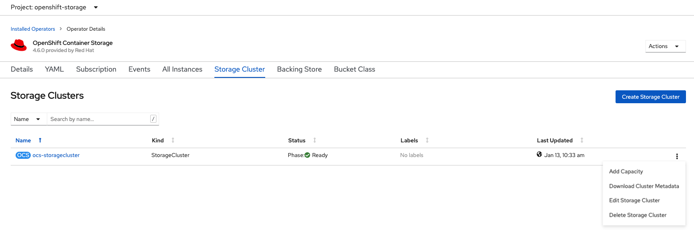

 - The visible list should list only one item - click on the three dots on the far right to extend the options menu
 - Select `Add Capacity` from the options menu

.Add Capacity dialog
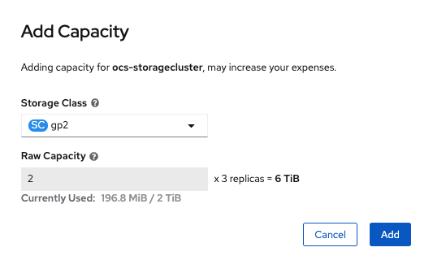

The storage class should be set to `gp2`. The added provisioned capacity will be three times as much as you see in the `Raw Capacity` field, because OCS uses a replica count of
3.

NOTE: *The size chosen for OCS Service Capacity during the initial deployment of OCS is greyed out and cannot be changed.*

Once you are done with your setting, proceed by clicking on `Add`. You will
see the Status of the Storage Cluster in `Progressing` until it reaches `Ready` again. 

CAUTION: It may take more than 5 minutes for new OSD pods to be in a `Running` state. 

Use this command to see the new OSD pods:

[source,role="execute"]
----
oc get pod -o=custom-columns=NAME:.metadata.name,STATUS:.status.phase,NODE:.spec.nodeName -n openshift-storage | grep osd | grep -v prepare
----
.Example output:
----
rook-ceph-osd-0-7d45696497-jwgb7            Running     ip-10-0-147-230.us-east-
2.compute.internal
rook-ceph-osd-1-6f49b665c7-gxq75            Running     ip-10-0-209-53.us-east-2
.compute.internal
rook-ceph-osd-2-76ffc64cd-9zg65             Running     ip-10-0-175-8.us-east-2.
compute.internal
rook-ceph-osd-3-97b5d9844-jpwgm             Running     ip-10-0-157-22.us-east-2
.compute.internal
rook-ceph-osd-4-9cb667b76-mftt9             Running     ip-10-0-214-36.us-east-2
.compute.internal
rook-ceph-osd-5-55b8d97855-2bp85            Running     ip-10-0-157-22.us-east-2
.compute.internal
----

This is everything that you need to do to extend the OCS storage.

=== Verify new storage

Once you added the capacity and made sure that the OSD pods are present, you
can also optionally check the additional storage capacity using the Ceph toolbox created earlier. Follow these steps:

[source,role="execute"]
----
TOOLS_POD=$(oc get pods -n openshift-storage -l app=rook-ceph-tools -o name)
oc rsh -n openshift-storage $TOOLS_POD
----

.Check the status of the Ceph cluster:
[source,role="execute"]
----
ceph status
----
.Example output:
----
sh-4.2# ceph status
  cluster:
    id:     e3398039-f8c6-4937-ba9d-655f5c01e0ae
    health: HEALTH_OK
 
  services:
    mon: 3 daemons, quorum a,b,c (age 25m)
    mgr: a(active, since 24m)
    mds: ocs-storagecluster-cephfilesystem:1 {0=ocs-storagecluster-cephfilesystem-a=up:active} 1 up:standby-replay
    osd: 6 osds: 6 up (since 38s), 6 in (since 38s)

  task status:
      scrub status:
          mds.ocs-storagecluster-cephfilesystem-a: idle
          mds.ocs-storagecluster-cephfilesystem-b: idle

  data:
    pools:   3 pools, 192 pgs
    objects: 92 objects, 81 MiB
    usage:   6.1 GiB used, 12 TiB / 12 TiB avail
    pgs:     192 active+clean
 
  io:
    client:   1.2 KiB/s rd, 1.7 KiB/s wr, 2 op/s rd, 0 op/s wr
----

In the Ceph status output, we can already see that:

<1> We now use 6 osds in total and they are `up` and `in` (meaning the daemons are running and being used to store data)
<2> The available raw capacity has increased from 6 TiB to 12 TiB

Besides that, nothing has changed in the output.

.Check the topology of your cluster:
[source,role="execute"]
----
ceph osd crush tree
----
.Example output:
----
ID  CLASS WEIGHT   TYPE NAME
 -1       12.00000 root default
 -5       12.00000     region us-east-2
 -4        4.00000         zone us-east-2a
 -3        2.00000             host ocs-deviceset-gp2-0-data-0-9977n
  0   ssd  2.00000                 osd.0
-21        2.00000             host ocs-deviceset-gp2-2-data-1-nclgr
  4   ssd  2.00000                 osd.4
-14        4.00000         zone us-east-2b
-13        2.00000             host ocs-deviceset-gp2-1-data-0-nnmpv
  2   ssd  2.00000                 osd.2
-19        2.00000             host ocs-deviceset-gp2-0-data-1-mg987
  3   ssd  2.00000                 osd.3
-10        4.00000         zone us-east-2c
 -9        2.00000             host ocs-deviceset-gp2-2-data-0-mtbtj
  1   ssd  2.00000                 osd.1
-17        2.00000             host ocs-deviceset-gp2-0-data-2-l8tmb
  5   ssd  2.00000                 osd.5
----

<1> We now have additional hosts, which are extending the hosts in the respective zone

Since our Ceph cluster's CRUSH rules are set up to replicate data between the
zones, this is an effective way to relax the load on the previous nodes.

Existing data on the original OSDs will be balanced out automatically, so
that the old and the new OSDs share the load.

You can exit the toolbox by either pressing kbd:[Ctrl+D] or by executing exit.

[source,role="execute"]
----
exit
----

== Monitoring the OCS environment

This section covers the different tools available with OCS 4.2 when it comes
to monitoring the environment. This section relies on the existing UI.

Individuals already familiar with OCP will feel comfortable with this section
but for those who are not, it will be a good bootstrap.

The tools are accessible through the main UI window left pane. Click the
*Monitoring* menu item to expand and have access to the following 3 choices:

* Alerting
* Metrics
* Dashboards

=== Alerting

Click on the *Alerting* item to open the Alert window as illustrated in the
screen capture below.

.OCP Monitoring Menu
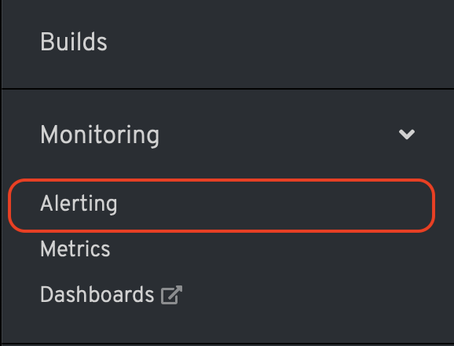

This will take you to the *Alerting* homepage as illustrated below.

.OCP Alerting Homepage
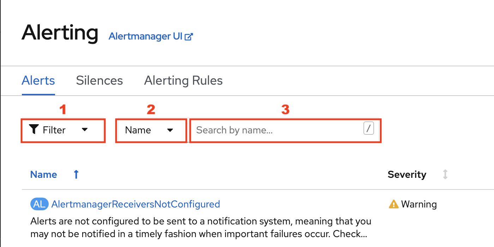

You can display the alerts in the main window by state. To do so you must
highlight the states you want to display. The states are:

* `Firing` - Alert has been confirmed
* `Silenced` - Alerts that have been silenced while they were in `Pending` or `Firing` state
* `Pending` - Alerts that have been triggered but not confirmed
* `Not Firing` - Alerts that have not been triggered

NOTE: An alert transitions from `Pending` to `Firing` state if it persists
for more than the amount of time configured in the alert definition (e.g. 10
minutes for the `CephClusterWarningState` alert).

As illustrated below, you can filter the alerts being displayed based on
their state. Just click on the states to display to toggle the filter. The
states highlighted in blue will be displayed.

NOTE: You need at least one state highlighted.

.OCP Alerting Status Filtering
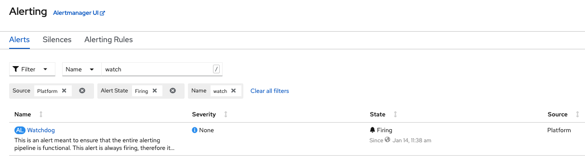

As illustrated below, you can also filter alerts by name using the *Filter*
area on the top right of the window to search for a particular alert or set
of alerts.

.OCP Alerting Name Filtering
image::images/ocs/metrics-alertingnamefilter.png[OCP Alert Name Filtering]

Through the 3 dot icon on the right hand side of each alert line you have
access to a contextual menu to either view the alert definition or to silence
the alert.

.OCP Alert Contextual Menu
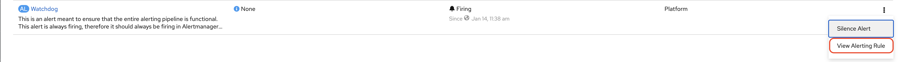

If you select `View Alerting Rule` you will get access to the details of the
rule that triggered the alert. The details include the Prometheus query used
by the alert to perform the detection of the condition.

.OCP Alert Detail Display
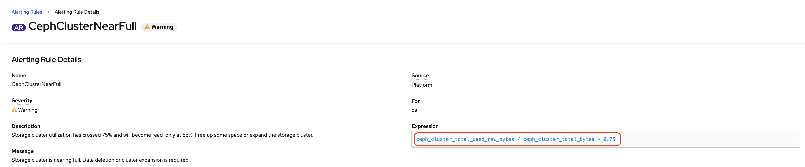

NOTE: If desired, you can click the Prometheus query embedded in the alert.
Doing so will take you to the *Metrics* page where you will be able to
execute the alert and to test updates to the alert.

=== Metrics

Click on the *Metrics* item as illustrated below.

.OCP Metrics Menu
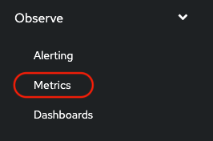

This will take you to the *Metrics* homepage as illustrated below.

.OCP UI Metrics Homepage
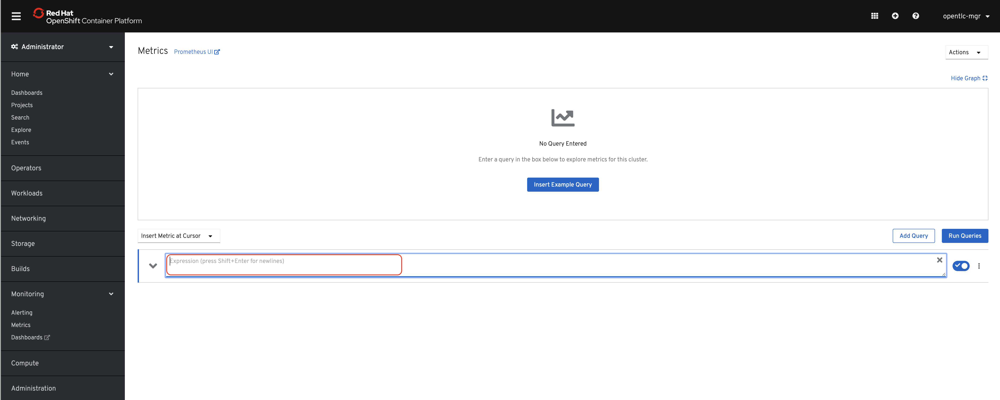

Use the query field to either enter the formula of your choice or to search
for metrics by name. The metrics available will let you query both OCP
related information or OCS related information. The queries can be simple or
complex using the Prometheus query syntax and all its available functions.

Let's start testing a simple query example and enter the following text
`ceph_osd_op` in the query field. When you are done typing, simply hit
`[Enter]`.

.Simple Ceph Query

The window should refresh with a graph similar to the one below.

.Simple Ceph Graph
image::images/ocs/metrics-simplecephgraph.png[Ceph Simple Graph]

Then let's try a more relevant query example and enter the following text
`rate(ceph_osd_op[5m])` or `irate(ceph_osd_op[5m])` in the query field. When
you are done typing, simply hit `[Enter]`.

.Complex Ceph Query
image::images/ocs/metrics-complexcephquery.png[Ceph Complex Query]

The window should refresh with a graph similar to the one below.

.Complex Ceph Graph
image::images/ocs/metrics-complexcephgraph.png[Ceph Complex Graph]

All OCP metrics are also available through the integrated *Metrics* window.
Feel free to try with any of the OCP related metrics such as
`irate(process_cpu_seconds_total[5m])` for example.

.Complex OCP Graph
image::images/ocs/metrics-complexocpgraph.png[OCP Complex Graph]

Have a look at the difference between `sum(irate(process_cpu_seconds_total[5m]))` and the last query `irate(process_cpu_seconds_total[5m])`.

NOTE: For more information on the Prometheus query language visit the
link:https://prometheus.io/docs/prometheus/latest/querying/basics/[Prometheus
Query Documentation].

== Using must-gather

Must-gather is a tool for collecting data about the current'y running
Openshift cluster. It loads a predefined set of containers that execute
multiple programs and dump it on the local workstations filesystem. The local
files can then be used by a remote support engineer to debug a problem more
easily without needing direct cluster access. This is similar to sosreports
for RHEL hosts.

The OCS team has released its own image for the must-gather tool that runs
storage specific commands.

You can run this diagnostic tool like this for generic Openshift debugging:

[source,role="execute"]
----
oc adm must-gather
----

Or like this for OCS specific insights:

[source,role="execute"]
----
oc adm must-gather --image=registry.redhat.io/ocs4/ocs-must-gather-rhel8:v4.6
----

The output will then be saved in the current directory inside of a new folder
called `must-gather.local.(random)`

More runtime options can be displayed with this command:

[source,role="execute"]
----
oc adm must-gather -h
----
.Example output:
----
Launch a pod to gather debugging information

 This command will launch a pod in a temporary namespace on your cluster that gathers debugging information and then
downloads the gathered information.

 Experimental: This command is under active development and may change without notice.

Usage:
  oc adm must-gather [flags]

Examples:
  # gather information using the default plug-in image and command, writing into ./must-gather.local.<rand>
  oc adm must-gather

  # gather information with a specific local folder to copy to
  oc adm must-gather --dest-dir=/local/directory

  # gather information using multiple plug-in images
  oc adm must-gather --image=quay.io/kubevirt/must-gather --image=quay.io/openshift/origin-must-gather

  # gather information using a specific image stream plug-in
  oc adm must-gather --image-stream=openshift/must-gather:latest

  # gather information using a specific image, command, and pod-dir
  oc adm must-gather --image=my/image:tag --source-dir=/pod/directory -- myspecial-command.sh

Options:
      --dest-dir='': Set a specific directory on the local machine to write gathered data to.
      --image=[]: Specify a must-gather plugin image to run. If not specified, OpenShift's default must-gather image
will be used.
      --image-stream=[]: Specify an image stream (namespace/name:tag) containing a must-gather plugin image to run.
      --node-name='': Set a specific node to use - by default a random master will be used
      --source-dir='/must-gather/': Set the specific directory on the pod copy the gathered data from.

Use "oc adm options" for a list of global command-line options (applies to all commands).
----

// On the Openshift side must-gather has nowadays been replaced by `oc adm inspect`.

[appendix]
== Introduction to Ceph

This section will go through Ceph fundamental knowledge for a better
understanding of the underlying storage solution
used by OCS 4.

NOTE: The content in this Appendix is relevant to learning about the critical
components of Ceph and how Ceph works. OCS 4 uses Ceph in a prescribed manner
for providing storage to OpenShift applications. Using *Operators* and
*CustomResourceDefinitions* (CRDs) for deploying and managing OCS 4 may
restrict some of Ceph's advanced features when compared to general use
outside of OCP 4.

[.lead]
*Timeline*

The Ceph project has a long history as you can see in the timeline below.

.Ceph Project History
image::images/ocs/ceph101-timeline.png[Ceph Project Timeline]

[.lead]
It is a battle-tested software defined storage (SDS) solution that has been
available as a storage backend for OpenStack and Kubernetes for quite some
time.

[.lead]
*Architecture*

The Ceph cluster provides a scalable storage solution while providing
multiple access methods to enable the different types of
clients present within the IT infrastructure to get access to the data.

.Ceph Architecture
image::images/ocs/ceph101-overview.png[Ceph From Above]

[.lead]
The entire Ceph architecture is resilient and does not present any single point
of failure (SPOF).

[.lead]
*RADOS*

The heart of Ceph is an object store known as RADOS (Reliable Autonomic
Distributed Object Store) bottom layer on the screen. This layer provides the
Ceph software defined storage with the ability to store data (serve IO
requests, to protect the data, to check the consistency and the integrity of
the data through built-in mechanisms. The RADOS layer is composed of the
following daemons:

<1> MONs or Monitors
<2> OSDs or Object Storage Devices
<3> MGRs or Managers
<4> MDSs or Meta Data Servers

.*_Monitors_*
The Monitors maintain the cluster map and state and provide distributed
decision-making while configured in an odd number, 3 or 5 depending on the
size and the topology of the cluster, to prevent split-brain situations. The
Monitors are not in the data-path and do not serve IO requests to and from
the clients.

.*_OSDs_*
One OSD is typically deployed for each local block devices and the native
scalable nature of Ceph allows for thousands of OSDs to be part of the
cluster. The OSDs are serving IO requests from the clients while guaranteeing
the protection of the data (replication or erasure coding), the rebalancing
of the data in case of an OSD or a node failure, the coherence of the data
(scrubbing and deep-scrubbing of the existing data).

.*_MGRs_*
The Managers are tightly integrated with the Monitors and collect the
statistics within the cluster. Additionally they provide an extensible
framework for the cluster through a pluggable Python interface aimed at
expanding the Ceph existing capabilities. The current list of modules
developed around the Manager framework are:

* Balancer module
* Placement Group auto-scaler module
* Dashboard module
* RESTful module
* Prometheus module
* Zabbix module
* Rook module

.*_MDSs_*
The Meta Data Servers manage the metadata for the POSIX compliant shared
filesystem such as the directory hierarchy and the file metadata (ownership,
timestamps, mode, ...). All the metadata is stored with RADOS and they do not
server any data to the clients. MDSs are only deployed when a shared
filesystem is configured in the Ceph cluster.

If we look at the Ceph cluster foundation layer, the full picture with the
different types of daemons or containers looks like this.

.RADOS as it stands
image::images/ocs/ceph101-rados.png[RADOS Overview]

The circle represent the MONs, the 'M' represent the MGRs and the squares
with the bars represent the OSDs. In the diagram above, the cluster operates
with 3 Monitors, 2 Managers and 23 OSDs.

[.lead]
*Access Methods*

Ceph was designed to provides the IT environment with all the necessary
access methods so that any application can use what is the best solution for
its use-case.

.Different Storage Types Supported
image::images/ocs/ceph101-differentstoragetypes.png[Ceph Access Modes]

Ceph supports block storage through the RADOS Block Device (aka RBD) access
method, file storage through the Ceph Filesystem (aka CephFS) access method
and object storage through its native `librados` API or through the RADOS
Gateway (aka RADOSGW or RGW) for compatibility with the S3 and Swift
protocols.

[.lead]
*Librados*

Librados allows developers to code natively against the native Ceph cluster
API for maximum efficiency combined with a small footprint.

.Application Native Object API
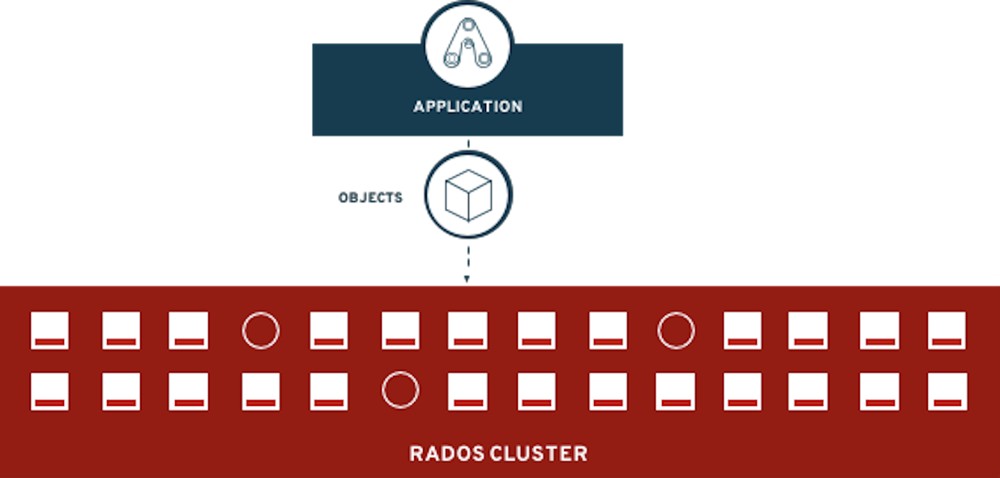

The Ceph native API offers different wrappers such as C, C++, Python, Java,
Ruby, Erlang, Go and Rust.

[.lead]
*RADOS Block Device (RBD)*

This access method is used in Red Hat Enterprise Linux or OpenShift version
3.x or 4.x. RBDs can be accessed either through a kernel module (RHEL, OCS4)
or through the `librbd` API (RHOSP). In the OCP world, RBDs are designed to
address the need for RWO PVCs.

[.lead]
*_Kernel Module (kRBD)_*

The kernel RBD driver offers superior performance compared to the userspace
`librbd` method. However, kRBD is currently limited and does not provide the
same level of functionality. e.g., no RBD Mirroring support.

.kRBD Diagram
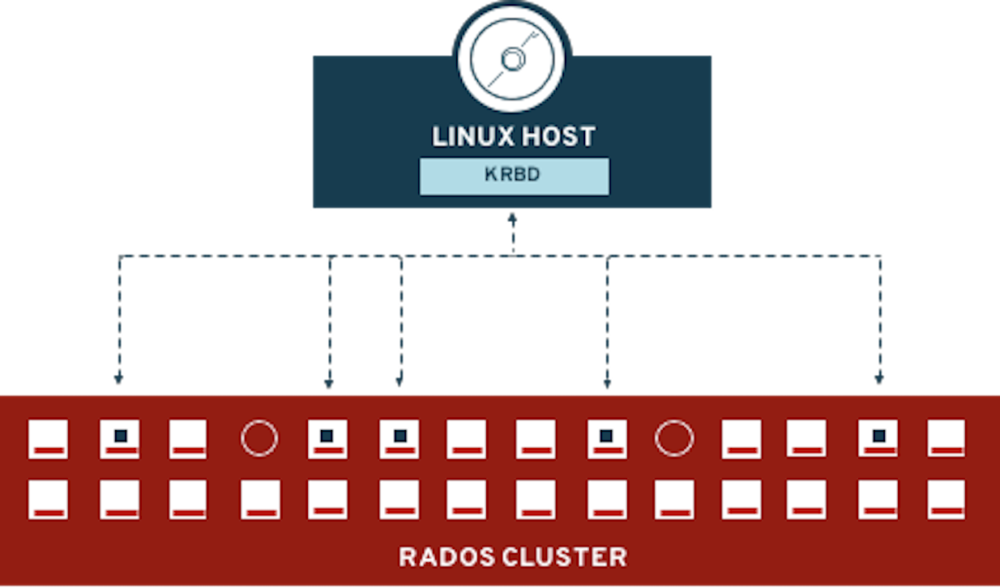

[.lead]
*_Userspace RBD (librbd)_*

This access method is used in Red Hat OpenStack Environment or OpenShift
through the RBD-NBD driver when available starting in the RHEL 8.1 kernel.
This mode allows us to leverage all existing RBD features such as RBD
Mirroring.

.librbd Diagram
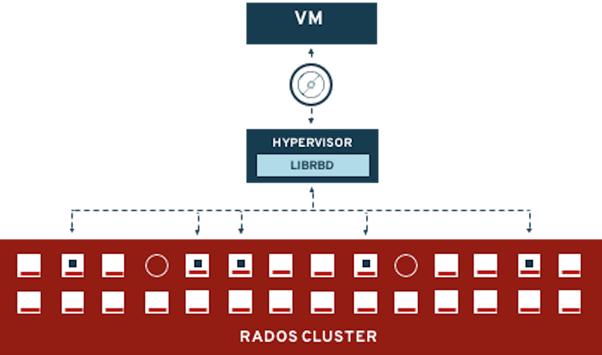

[.lead]
*_Shared Filesystem (CephFS)_*

This method allows clients to jointly access a shared POSIX compliant
filesystem. The client initially contacts the Meta Data Server to obtain the
location of the object(s) for a given inode and then communicates directly
with an OSD to perform the final IO request.

.File Access (Ceph Filesystem or CephFS)
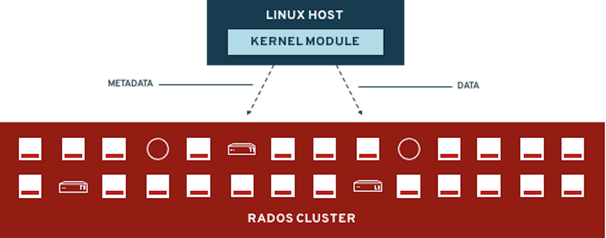

CephFS is typically used for RWX claims but can also be used to support RWO claims.

[.lead]
*_Object Storage, S3 and Swift (Ceph RADOS Gateway)_*

This access method offers support for the Amazon S3 and OpenStack Swift
support on top of a Ceph cluster. The Openshift Container Storage Multi Cloud
Gateway can leverage the RADOS Gateway to support Object Bucket Claims. From
the Multi Cloud Gateway perspective the RADOS Gateway will be tagged as a
compatible S3 endpoint.

.Amazone S3 or OpenStack Swift (Ceph RADOS Gateway)
image::images/ocs/ceph101-rgw.png[S3 and Swift Support]

[.lead]
*CRUSH*

The Ceph cluster being a distributed architecture some solution had to be
designed to provide an efficient way to distribute the data across the
multiple OSDs in the cluster. The technique used is called CRUSH or
Controlled Replication Under Scalable Hashing. With CRUSH, every object is
assigned to one and only one hash bucket known as a Placement Group (PG).

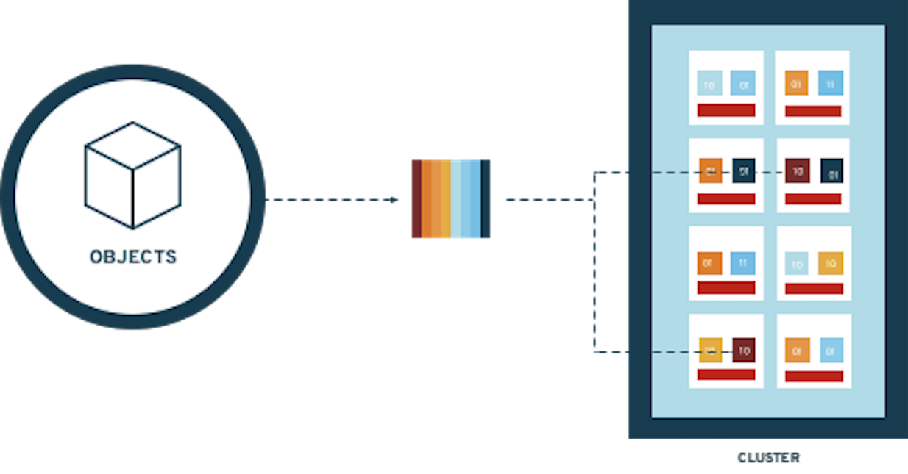

CRUSH is the central point of configuration for the topology of the cluster.
It offers a pseudo-random placement algorithm to distribute the objects
across the PGs and uses rules to determine the mapping of the PGs to the
OSDs. In essence, the PGs are an abstraction layer between the objects
(application layer) and the OSDs (physical layer). In case of failure, the
PGs will be remapped to different physical devices (OSDs) and eventually see
their content resynchronized to match the protection rules selected by the
storage administrator.

[.lead]
*Cluster Partitioning*

The Ceph OSDs will be in charge of the protection of the data as well as the
constant checking of the integrity of the data stored in the entire cluster.
The cluster will be separated into logical partitions, known as pools. Each
pool has the following properties that can be adjusted:

* An ID (immutable)
* A name
* A number of PGs to distribute the objects across the OSDs
* A CRUSH rule to determine the mapping of the PGs for this pool
* A type of protection (Replication or Erasure Coding)
* Parameters associated with the type of protection
** Number of copies for replicated pools
** K and M chunks for Erasure Coding
* Various flags to influence the behavior of the cluster

[.lead]
*Pools and PGs*

.Pools and PGs
image::images/ocs/ceph101-thefullpicture.png[From Object to OSD]

The diagram above shows the relationship end to end between the object at the
access method level down to the OSDs at the physical layer.

NOTE: A Ceph pool has no size and is able to consume the space available any
OSD where its PGs are created. A Placement Group or PG belongs to only one pool.

[.lead]
*Data Protection*

Ceph supports two types of data protection presented in the diagram below.

.Ceph Data Protection
image::images/ocs/ceph101-dataprotection.png[Replicated Pools vs Erasure Coded Pools]

Replicated pools provide better performance in almost all cases at the cost
of a lower usable to raw storage ratio (1 usable byte is stored using 3 bytes
of raw storage) while `Erasure Coding` provides a cost efficient way to store
data with less performance. Red Hat supports the following `Erasure Coding`
profiles with their corresponding usable to raw ratio:

* 4+2 (1:2 ratio)
* 8+3 (1:1.375 ratio)
* 8+4 (1:2 ratio)

Another advantage of `Erasure Coding` (EC) is its ability to offer extreme
resilience and durability as we can configure the number of parities being
used. EC can be used for the RADOS Gateway access method and for the RBD
access method (performance impact).

[.lead]
*Data Distribution*

To leverage the Ceph architecture at its best, all access methods but
librados, will access the data in the cluster through a collection of
objects. Hence a 1GB block device will be a collection of objects, each
supporting a set of device sectors. Therefore, a 1GB file is stored in a
CephFS directory will be split into multiple objects. Also a 5GB S3 object
stored through the RADOS Gateway via the Multi Cloud Gateway will be divided
in multiple objects.

.Data Distribution
image::images/ocs/ceph101-rbdlayout.png[RADOS Block Device Layout]

NOTE: By default, each access method uses an object size of 4MB. The above
diagram details how a 32MB RBD (Block Device) supporting a RWO PVC will be
scattered throughout the cluster.
