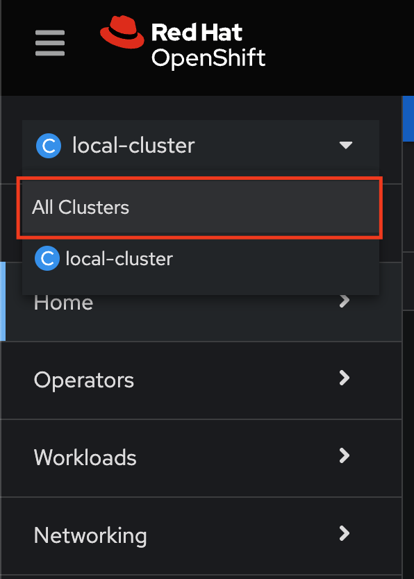
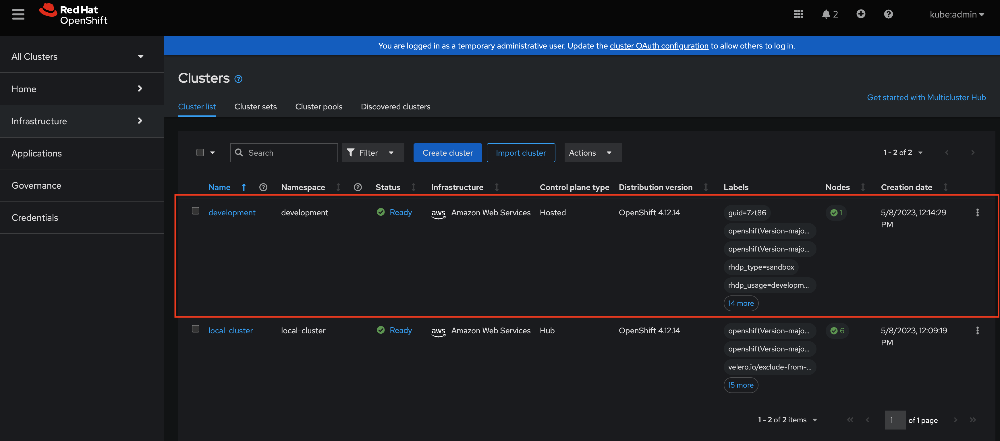
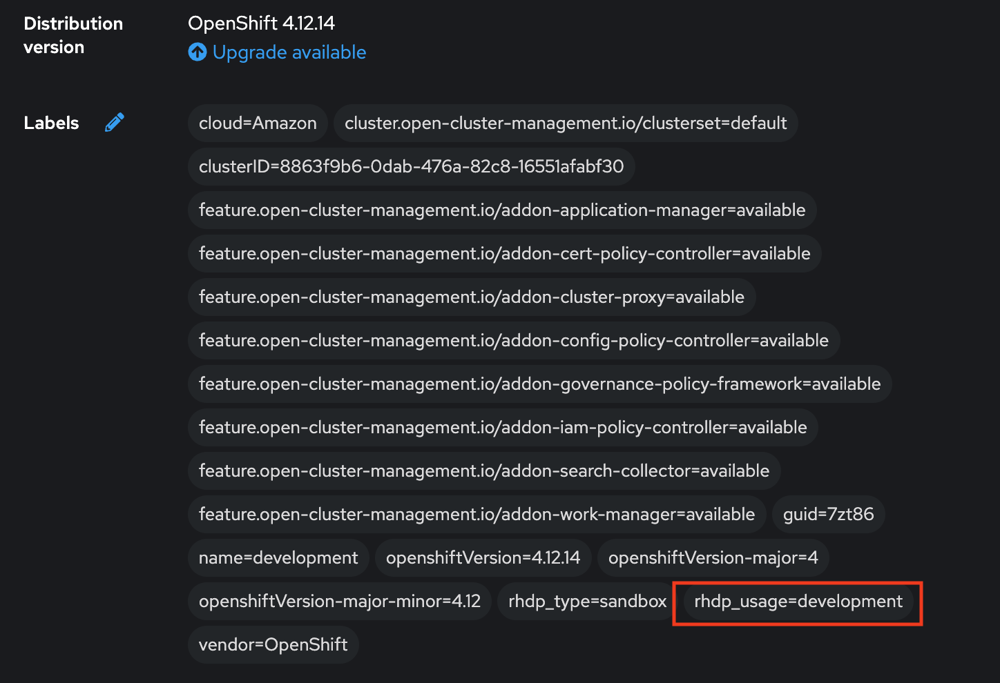
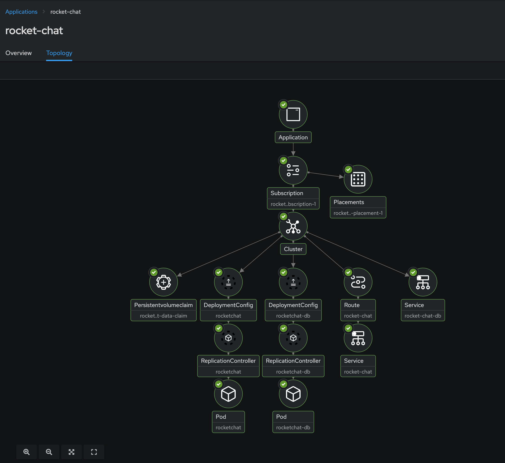
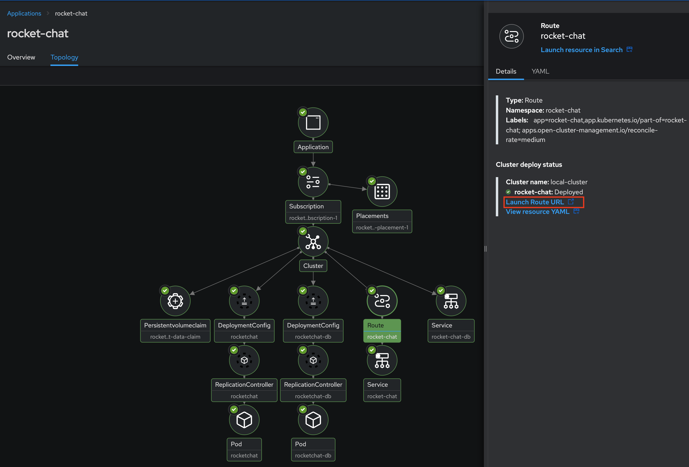
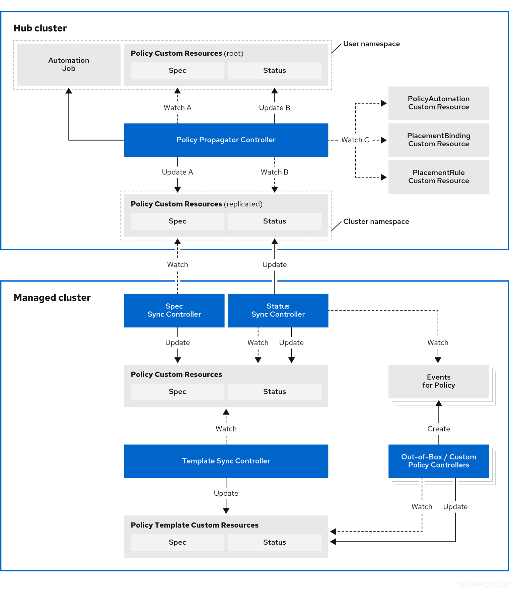
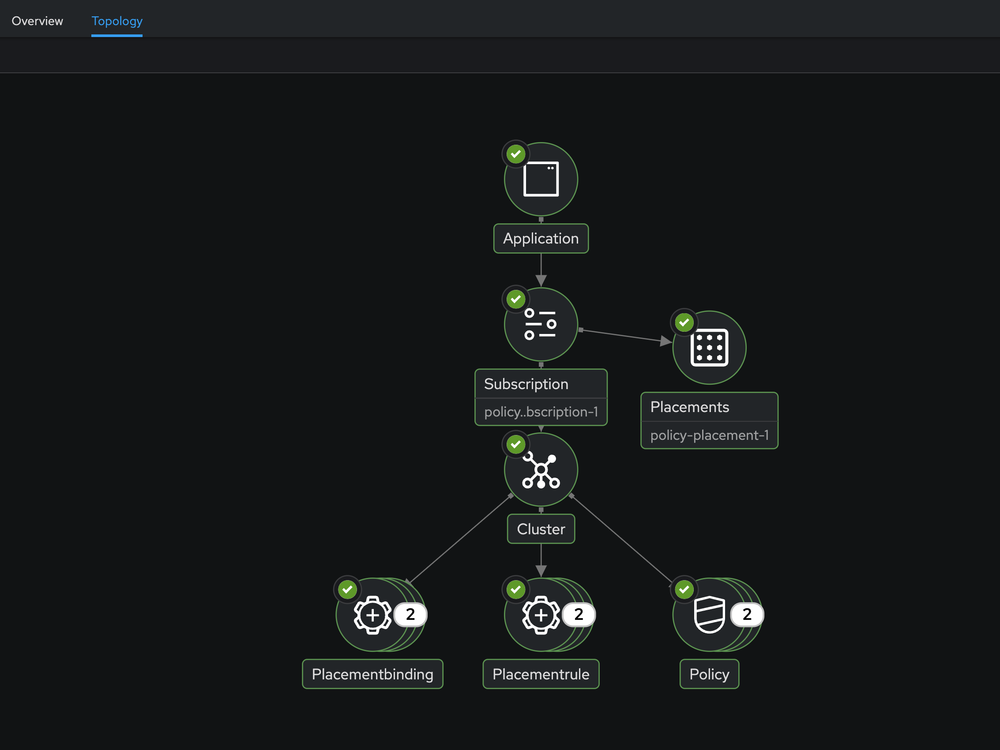
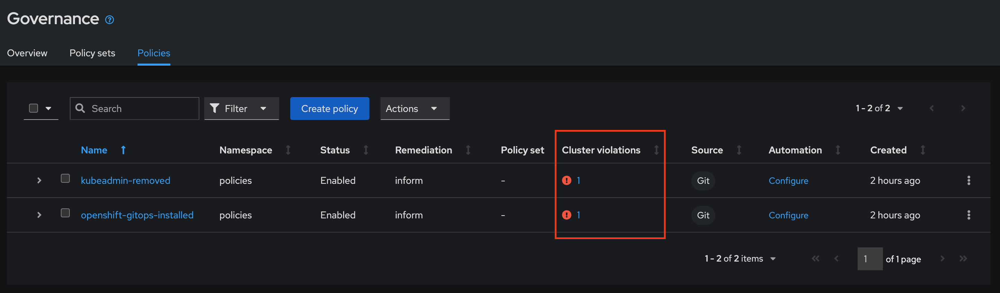
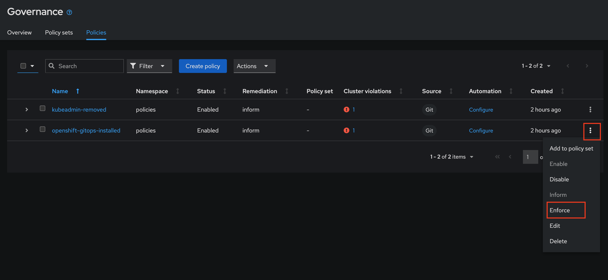
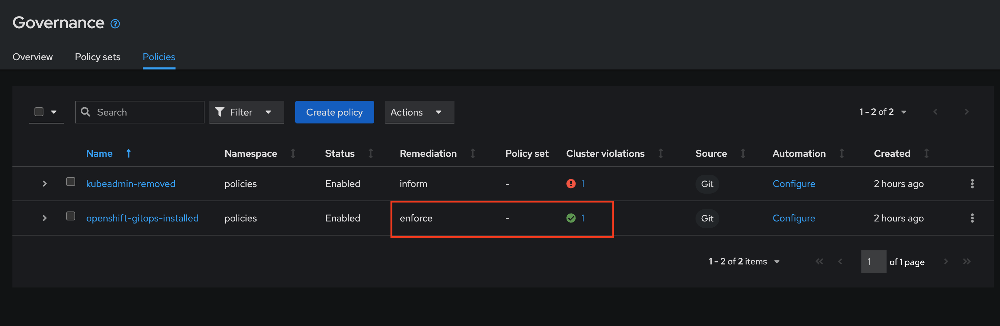

= Red Hat Advanced Cluster Management for Kubernetes - RHACM

== Working with Kubernetes Clusters and Cluster Lifecycle

At a high level Cluster Lifecycle management is about creating, upgrading, and destroying and importing clusters in a multi cloud environment, whenever that might be OpenShift Hosted Control Plane Cluster - HCP - a Single Node Cluster - SNO - or a Normal OpenShift cluster.

In the demo console where you have all the credentials, you will find the *OCP Console URL, Username and Password, AWS credentials*, *Access Key ID*, *Secret Access Key*, and the *Base DNS Domain*.

To get started, switch over to the OpenShift Console 
{{ MASTER_URL }}
Remember that the login is kubeadmin and the password is:
{{ KUBEADMIN_PASSWORD }}

Once you have logged in to OpenShift Console, Navigate to the *Cluster drop down menu* and then select  *All Clusters* this will bring you to the RHACM interface.

In this interface you will see 2 clusters available, first cluster is a Hosted Control Plane Cluster called *development* 

Hosted Control Planes - Project Name HyperShift - is a form factor of Red Hat OpenShift Container platform, but it follows a distinct architectural model.

In standalone OpenShift, the control plane and data plane are coupled in terms of locality. A dedicated group of nodes hosts the control plane with a minimum number to ensure a quorum and the network stack is shared; while functional, this approach may not always meet customers' diverse use cases, especially when it comes to multi-cluster scale deployments.

To address this, Red Hat provides hosted control planes in addition to standalone OpenShift. Hosted control planes is based on the upstream Red Hat project HyperShift which can be thought of as a middleware for hosting OpenShift control planes at a scale. HyperShift solves for cost and time to provision, as well as a strong separation of concerns between management and workloads.

Hosted control planes for Red Hat OpenShift decouple the control plane from the data plane:

* It provides network domain separation between control-plane and workloads.
* Offers a shared interface for fleet administrators and Site Reliability Engineers (SREs) to operate multiple clusters easily.
* Treats the control plane like any other workload, enabling administrators to use the same stack to monitor, secure, and operate their applications while managing the control plane.

The decoupling of the Control Plane and DP introduced multiple potential benefits and paves the way for a Hybrid-cloud approach. Below are possibilities that Hosted Control Plane as a technology enables:

* *Trust Segmentation & Human Error Reduction*: Management plane for control planes and cloud credentials separate from the end-user cluster. A separate network of management from the workload. Furthermore, with the control-plane managed, it is harder for users to basically shoot themselves in the foot and destroy their own clusters since they won’t be seeing the CP resources in the first place.
* *Cheaper Control Planes*: You can host ~7-21 control planes into the same three machines you were using for 1 control plane. And run ~1000 control planes on 150 nodes. Thus you run most densely on existing hardware. Which also makes HA clusters cheaper.
* *Immediate Clusters*: Since the control plane consists of pods being launched on OpenShift, you are not waiting for machines to provision.
* *Kubernetes Managing Kubernetes*: Having control-plane as Kubernetes workloads immediately unlocks for free all the features of Kubernetes such as HPA/VPA, cheap HA in the form of replicas, control-plane Hibernation now that control-plane is represented as deployments, pods, ... etc.
* *Infra Component Isolation*: Registries, HAProxy, Cluster Monitoring, Storage Nodes, and other infra type components are allowed to be pushed out to the tenant’s cloud provider account isolating their usage of those to just themselves
* *Increased Life Cycle Options*: You can upgrade the consolidated control planes out of cycle from the segmented worker nodes, including embargoed CVEs.
* *Future Mixed Management & Workers IaaS*: Although it is not in the solution today, we feel we could  get to running the control plane on a different IaaS provider than the workers faster under this architecture
* *Heterogeneous Arch Clusters: We can more easily run control planes on one CPU chip type (ie x86) and the workers on a different one (ie ARM or even Power/Z).
* *Easier Multi-Cluster Management*: More centralized multi-cluster management which results in fewer external factors influencing the cluster status and consistency
* *Cross Cluster Delivery Benefits*: As we look to have more and more layered offerings such as service mesh, server-less, pipelines, and other span multiple clusters, having a concept of externalized control planes may make delivering such solutions easier.
* *Easy Operability*: Think about SREs. Instead of chasing down cluster control-planes, they would now have a central-pane of glass where they could debug and navigate their way even to cluster data-plane. Centralized operations, less Time To Resolution (TTR), and higher productivity become low-hanging fruits.

You will also find a second cluster called *local-cluster*. This Cluster is where the Advanced Cluster Management For Kubernetes Operator resides.

Feel free to navigate the clusters interface and explore the different day 2 actions you can perform in the cluster. 

== Deploying Applications to Hosted Control Plane Clusters (HCP) in AWS

Your environment came pre-loaded with an existing Hosted Control Plane Cluster hosted in AWS called *development*, we will be deploying an application to this cluster.

Application Lifecycle functionality in RHACM provides the processes that are used to manage application resources on your managed clusters. This allows you to define a single or multi-cluster application using Kubernetes specifications, but with additional automation of the deployment and lifecycle management of resources to individual clusters. An application designed to run on a single cluster is straightforward and something you ought to be familiar with from working with OpenShift fundamentals. A multi-cluster application allows you to orchestrate the deployment of these same resources to multiple clusters, based on a set of rules you define for which clusters run the application components.

This table describes the different components that the Application Lifecycle model in RHACM is composed of:

|===
|*Resource*|*Purpose *

|Channel|Defines a place where deployable resources are stored, such as an object store, Kubernetes namespace, Helm repository, or GitHub repository.
|Subscription|Definitions that identify deployable resources available in a Channel resource that are to be deployed to a target cluster.
|PlacementRule|Defines the target clusters where subscriptions deploy and maintain the application. It is composed of Kubernetes resources identified by the Subscription resource and pulled from the location defined in the Channel resource.
|Application|A way to group the components here into a more easily viewable single resource. An Application resource typically references a Subscription resource.
|===

These are all Kubernetes custom resources, defined by a Custom Resource Definition (CRD), that are created for you when RHACM is installed. By creating these as Kubernetes native objects, you can interact with them the same way you would with a Pod. For instance, running +oc get application+ retrieves a list of deployed RHACM applications just as +oc get pods+ retrieves a list of deployed Pods.

This may seem like a lot of extra resources to manage in addition to the deployables that actually make up your application. However, they make it possible to automate the composition, placement, and overall control of your applications when you are deploying to many clusters. With a single cluster, it is easy to log in and run +oc create -f…​.+ If you need to do that on a dozen clusters, you want to make sure you do not make a mistake or miss a cluster, and you need a way to schedule and orchestrate updates to your applications. Leveraging the Application Lifecycle Builder in RHACM allows you to easily manage multi-cluster applications.

== Creating an Application

*Prerequisites:*

* Navigate to *Infrastructure → Clusters*
* Click on the *development* Cluster
* Click the *actions dropdown* and select *Edit Labels* button under *Labels* verify the *rhdp_usage=development* label exists in the cluster. If the label doesn't exist create it.

* Navigate to *Applications*

* Click *Create application, select Subscription*. Enter the following information:
** *Name*: `rocket-chat`
** *Namespace*: `rocket-chat`
** Under repository types, select the *GIT* repository
** *URL:*  https://github.com/levenhagen/rocketchat-acmt[https://github.com/levenhagen/rocketchat-acm]
** *Branch*:  `main`
** *Path:*  `rocketchat`

* Verify that *Deploy application resources only on clusters matching specified labels* is selected and enter the following information
** *Label*: `rhdp_usage`
** *Value*: `development`

* Verify all the information is correct. Click *Create*

It will take a few minutes to deploy the application, *Click* on the *Topology Tab* to view and verify that *all of the circles are green*.

Under the topology view, Select the *Route* and click on the *Launch Route* *URL*, this will take you to the Book Import application with several books available.

Feel free to experiment with the application

You successfully deployed an application to a Hosted Control Plane cluster using RHACM. This approach leveraged a Git repository which housed all of the manifests that defined your application. RHACM was able to take those manifests and use them as deployables, which were then deployed to the target cluster.

== Governance, Risk, and Compliance (Security and compliance use case)

Now that you have a cluster and a deployed application, you need to make sure that they do not drift from their original configurations. This kind of drift is a serious problem, because it can happen from benign and benevolent fixes and changes, as well as malicious activities that you might not notice but can cause significant problems. The solution that RHACM provides for this is the Governance, Risk, and Compliance, or GRC, functionality.

==== Review GRC Functionality

Enterprises must meet internal standards for software engineering, secure engineering, resiliency, security, and regulatory compliance for workloads hosted on private, multi and hybrid clouds. Red Hat Advanced Cluster Management for Kubernetes governance provides an extensible policy framework for enterprises to introduce their own security policies.

The governance lifecycle is based on defined policies, processes, and procedures to manage security and compliance from a central interface page. View the following diagram of the governance architecture:

Use the Red Hat Advanced Cluster Management for Kubernetes security policy framework to create and manage policies. Kubernetes custom resource definition instances are used to create policies.

Each Red Hat Advanced Cluster Management policy can have at least one or more templates. For more details about the policy elements, view the https://access.redhat.com/documentation/en-us/red_hat_advanced_cluster_management_for_kubernetes/2.7/html-single/governance/index#policy-yaml-table[Policy YAML] table section.

=== Creating Policies in ACM

In order to assist in the creation and management of Red Hat Advanced Cluster Management for Kubernetes policies we use the policy generator tool. This tool, along with GitOps, greatly simplifies the distribution of Kubernetes resource objects to managed OpenShift or Kubernetes clusters through RHACM policies. 

*Prerequisite*

To deploy policies with subscriptions, complete the following steps:

Bind the *open-cluster-management:subscription-admin* ClusterRole to the user creating the subscription, to do this follow this steps:

* Navigate to *Governance Tab*
* On the top tabs, click on *Policies*
* Click *Create Policy* 
* On the top switch the toogle to Display the YAML 
* Copy the following YAML and paste it on the YAML screen 

----
apiVersion: policy.open-cluster-management.io/v1
kind: Policy
metadata:
  name: policy-configure-subscription-admin-hub
  annotations:
    policy.open-cluster-management.io/standards: NIST SP 800-53
    policy.open-cluster-management.io/categories: CM Configuration Management
    policy.open-cluster-management.io/controls: CM-2 Baseline Configuration
spec:
  remediationAction: inform
  disabled: false
  policy-templates:
    - objectDefinition:
        apiVersion: policy.open-cluster-management.io/v1
        kind: ConfigurationPolicy
        metadata:
          name: policy-configure-subscription-admin-hub
        spec:
          remediationAction: inform
          severity: low
          object-templates:
            - complianceType: musthave
              objectDefinition:
                apiVersion: rbac.authorization.k8s.io/v1
                kind: ClusterRole
                metadata:
                  name: open-cluster-management:subscription-admin
                rules:
                - apiGroups:
                  - app.k8s.io
                  resources:
                  - applications
                  verbs:
                  - '*'
                - apiGroups:
                  - apps.open-cluster-management.io
                  resources:
                  - '*'
                  verbs:
                  - '*'
                - apiGroups:
                  - ""
                  resources:
                  - configmaps
                  - secrets
                  - namespaces
                  verbs:
                  - '*'
            - complianceType: musthave
              objectDefinition:
                apiVersion: rbac.authorization.k8s.io/v1
                kind: ClusterRoleBinding
                metadata:
                  name: open-cluster-management:subscription-admin
                roleRef:
                  apiGroup: rbac.authorization.k8s.io
                  kind: ClusterRole
                  name: open-cluster-management:subscription-admin
                subjects:
                - apiGroup: rbac.authorization.k8s.io
                  kind: User
                  name: kube:admin
                - apiGroup: rbac.authorization.k8s.io
                  kind: User
                  name: system:admin
---
apiVersion: policy.open-cluster-management.io/v1
kind: PlacementBinding
metadata:
  name: binding-policy-configure-subscription-admin-hub
placementRef:
  name: placement-policy-configure-subscription-admin-hub
  kind: PlacementRule
  apiGroup: apps.open-cluster-management.io
subjects:
- name: policy-configure-subscription-admin-hub
  kind: Policy
  apiGroup: policy.open-cluster-management.io
---
apiVersion: apps.open-cluster-management.io/v1
kind: PlacementRule
metadata:
  name: placement-policy-configure-subscription-admin-hub
spec:
  clusterConditions:
  - status: "True"
    type: ManagedClusterConditionAvailable
  clusterSelector:
    matchExpressions:
      - {key: name, operator: In, values: ["local-cluster"]} 
 ----

* Enter a namespace to place the policy, default name space is OK to use
* Click *Next* till the end and then *Submit*

Allow for the policy to propagate to the Local-cluster - RHACM Hub Cluster.

* Navigate back to policies and select the *policy-configure-subscription-admin-hub* policy. 

* Under the actions dropdown, select *Enforced* This will enforce the policy, wait until green checkmark is displayed.

=== Using Policy Generator 

This Policy Generator definition will achieve 2 configuration policies:

* *openshift-gitops-installed:* The goal of the first one is to inform if the OpenShift GitOps operator is installed on managed clusters.

* *kubeadmin-removed:* The goal of this second policy is to inform if the kubeadmin user is removed from managed clusters.

Both policies are informative only and will only execute them manually to showcase how to resolve issues.

In order to deliver these policies we will need to leverage the RHACM Application engine and the GitOps Subcription model.

* Navigate to *Applications*

* Click *Create application, select Subscription*. Enter the following information:
** *Name*: `policy-generator`
** *Namespace*: `policy-generator`
** Under repository types, select the *GIT* repository
** *URL:*  https://github.com/levenhagen/demo-policygenerator[https://github.com/levenhagen/demo-policygenerator.git]
** *Branch*:  `main`
* Verify that *Deploy only to local cluster* is selected
* Verify all the information is correct. Click *Create*

It will take a few minutes to deploy the application, *Click* on the *Topology Tab* to view and verify that *all of the circles are green*.

* Navigate to the *Governanc* tab 
* Click on the *Policies* tab
* Verify that you see 2 policies and that there *Cluster Violations* count is 1
** *kubeadmin-removed*
** *openshift-gitops-installed*

Now that the policies have been created for us leveraing the Policy Generator Engine let's go ahead and enforce them.

* On the *openshift-gitops-installed* policy, click on the elipses and set policy to *Enfornce*

* Click the *Enforce* button to verify 

* Wait a few minutes and you will see that the *Cluster Violations* will go from *red* to *green*

* Click on the Policy and select *Results* verify that the gitops operator has been installed.

Feel free to repeat the steps with the *kubeadmin-removed* Policy, however if you enforce this you won't be able to access that cluster through the console as the only account created on these clusters is Kubadmin.

Now you have succesfully created a Policy leveraing the Policy Generator to scan your clusters, if you would like to play with other policies please visit the https://github.com/stolostron/policy-collection[Policy Repo] for more Policies you can test out.

