= Kubernetes Security with Red Hat Advanced Cluster Security (Title to be changed)

== Goal of the Workshop

In this 20-60 minute session, participants will learn how to identify vulnerabilities in Kubernetes using the Red Hat Advanced Cluster Security for Kubernetes (RHACS) dashboard, focusing on the log4shell exploit. The session will cover how to effectively implement controls in a Kubernetes cluster and discuss the unique aspects of specific vulnerabilities. The optional section of this lab will discuss how to implement these controls into the build, deploy, and runtime stages. Additionally, if time permits, participants are encouraged to explore the interface for other security features that may be helpful for their use cases. 

== RHACS Basics

RHACS provides the tools and capabilities to address the security needs of a cloud-native development approach on Kubernetes.

The RHACS solution offers visibility into the security of your cluster, vulnerability management, and security compliance through auditing, network segmentation awareness and configuration, security risk profiling, security-related configuration management, threat detection, and incident response. In addition, ACS grants an ability to pull the actions from that tooling deep into the application code development process through APIs.

These security features represent any developer or administrator's primary work as they work across various environments, including multiple datacenters, private clouds, or public clouds that run Kubernetes clusters.

=== RHACS Features

Using Red Hat Advanced Cluster Security for Kubernetes, you can gain comprehensive Kubernetes security that includes the following use cases:

* Visibility: See your entire landscape of images, registries, containers, deployments, and runtime behavior.
* Vulnerability Management: Identify and remediate vulnerabilities in container images and Kubernetes across the entire software development life cycle.
* Compliance: Audit your systems against CIS Benchmarks, NIST, PCI, and HIPAA, with interactive dashboards and one-click audit reports.
* Network Segmentation: Visualize existing connections and enforce tighter segmentation using Kubernetes-native controls to reduce your blast radius.
* Risk Profiling: See all your deployments ranked by risk level, using context from Kubernetes' declarative data, to prioritize remediation.
* Configuration Management: Apply best practices for Docker and Kubernetes to harden your environment for a more secure and stable application.
* Threat Detection: Use rules, automated allow lists, and baselining to identify suspicious activity in your running applications accurately.
Incident Response: Take action, from failing builds and blocking deployments to killing pods and thwarting attacks, using Kubernetes for enforcement.

== Workshop Setup

=== Deploying the INSECURE Demo Application Sources - MANDATORY

In order to have the applications and vulnerabilities necessary for the demo, we need to introduce a few vulnerable applications into the cluster.

The command below will clone the tutorial sources and set the *TUTORIAL_HOME* environment variable to point to the root directory of the tutorial and deploy the applications:

[source,bash,role="execute"]
----
git clone https://github.com/openshiftdemos/openshift-ops-workshops acs-workshop
export TUTORIAL_HOME="$(pwd)/acs-workshop"
kubectl apply -f $TUTORIAL_HOME/workshop/demo-apps/configuration --recursive
kubectl apply -f $TUTORIAL_HOME/workshop/demo-apps/ --recursive
----

|===
*NOTE* This command applies a plethora of manifests to your environment. The important part is that the deployments are up and running. The

Run the following command and ensure that the applications are up and running
|===

[source,bash,role="execute"]
----
kubectl get deployments -l demo=acs -A
----

*Output*
```bash
NAMESPACE      NAME               READY   UP-TO-DATE   AVAILABLE   AGE
backend        api-server         1/1     1            1           0d
frontend       asset-cache        1/1     1            1           0d
log4shell      log4shell-app      3/3     3            3           0d
medical        reporting          1/1     1            1           0d
operations     jump-host          1/1     1            1           0d
payments       visa-processor     1/1     1            1           0d
spring4shell   spring4shell-app   3/3     3            3           0d
```

== Navigating the RHACS console and Vulnerability Management

The first half of this lab will focus on navigation and vulnerability management. This work will take place in the UI and require you to use both the dashboard and the lab environment.

=== Access the RHACS Console

In this section, you confirm that you can connect to RHACS from the command line and that you can connect to the RHACS portal. The following information will be available in the lab URL.

*Requirements* 

* The RHACS `admin` credentials
* The URL for the RHACS portal

|===
*NOTE* You will get a warning page that the webpage is not private. During setup, RHACS can utilize your certification server to avoid these errors. It is also best practice to integrate the application with your authentication server. 
|===

image::images/webpage-warning.png[]

.Procedure
[start=1]
. Click the URL for the RHACS web console to head to the console's login page.
** For example, 'https://central-stackrox.apps.cluster-4klh8.4klh8.sandbox1150.opentlc.com'

image::images/00-console-dashboard-3.png[RHACS console login]

[start=2]
. Log in with the ADMINISTRATOR credentials (admin)

image::images/00-console-dashboard-4.png[RHACS input]

[start=3]
. Ensure you maintain access to the console and keep your tab open for the future lab sections. 

image::images/00-console-dashboard-5.png[RHACS dashboard]

= Navigating the RHACS Console
In this section, you familiarize yourself with the RHACS portal, including its tabs, search capabilities and dashboard functionality.

Head to the RHACS web console from the course introduction lab. If you do not have access, please repeat the steps in the first lab titled "Access the RHACS Console."

== The 4 Main Dashboard Sections
The RHACS dashboard has four main sections:

[start=1]
. Top Bar
. Global search
. Navigation menu
. Dashboard

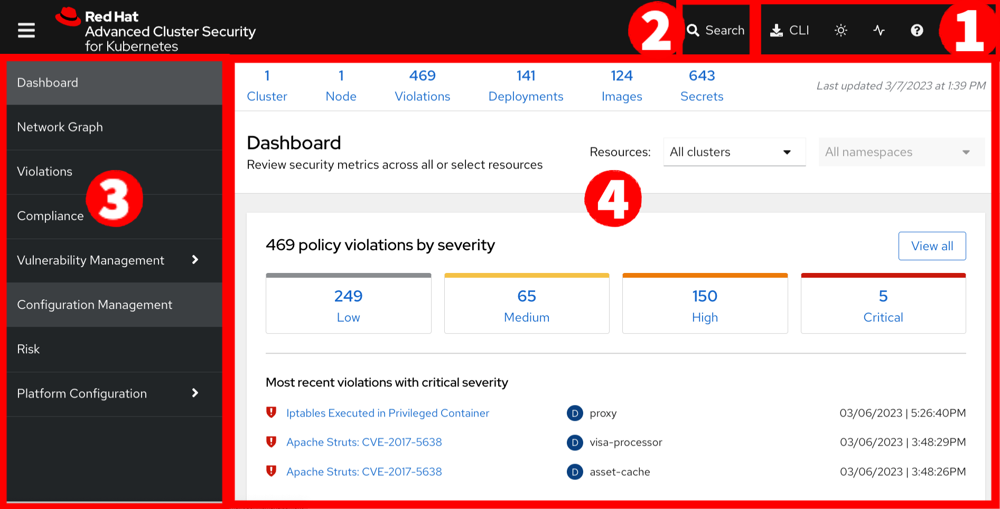

=== Top Bar

The top bar contains the following functionality 
* Global Search
* Command-line tools
* Cluster Health
* Documentation
* API Reference
* Enable Dark/Light Mode
* Logged-in user account

[NOTE]
The top bar is available in EVERY tab and displayed when accessing the RHACS console.

=== Global Search

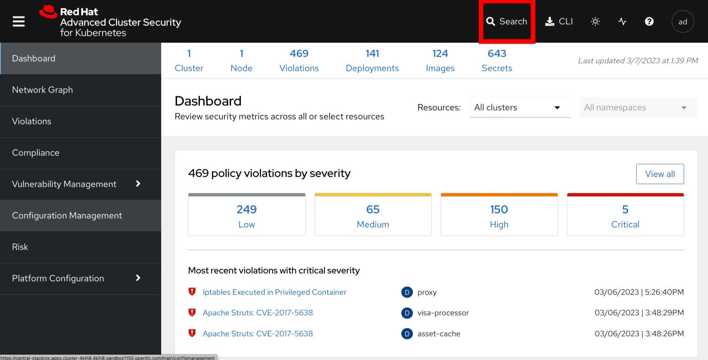

==== Searching and filtering

The ability to instantly find resources is essential to safeguard your cluster. Utilize the RHACS search feature to find relevant resources faster. 

For example, you can use it to find deployments exposed to a newly published CVE or all deployments with external network exposure.

.Search syntax
A search query consists of two parts:

* An attribute that identifies the resource type you want to search for.
* A search term that finds the matching resource.

*For example,* to find all violations in the visa-processor deployment, the search query is Deployment:visa-processor. In this search query, Deployment is the attribute, and visa-processor is the search term.

image::images/01-dashboard-02.png[RHACS search visa]

==== Using local page filtering
You can use local page filtering from within all views in the RHACS portal. Local page filtering works similarly to the global search, but only relevant attributes are available. You can select the search bar to show all available attributes for a specific view.

==== Common search queries
Here are some common search queries you can run with Red Hat Advanced Cluster Security for Kubernetes.

[start=1]
. Finding deployments that are affected by a specific CVE

[cols="2,2"]  
|=== 
|*Query*
|*Example*
|CVE:<CVE_number>
|CVE:CVE-2018-11776
|===

[start=2]
. Finding privileged running deployments

[cols="2,2"]
|=== 
|*Query*
|*Example*
|Privileged:<true_or_false>
|Privileged:true
|===

[start=3]
. Finding deployments that have external network exposure

[cols="2,2"]
|=== 
|*Query*
|*Example*
|Exposure Level:<level>
|Exposure Level:External
|===

[NOTE]
There are plenty more local and global search examples in the link:https://docs.openshift.com/acs/operating/search-filter.html[RHACS documentation] 

=== Navigation Menu

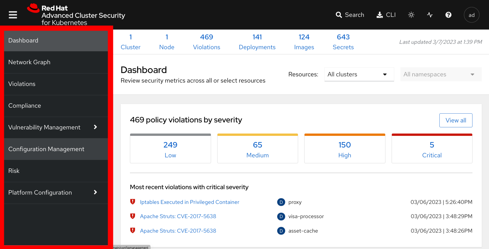

The left-hand navigation menu provides access to each of the security use cases, as well as product configuration to integrate RHACS with your existing tooling.
The navigation menu has the following items:

* *Dashboard*: Summary view of your environment
* *Network Graph*: Configured and actual network flows and the creation of Network Policies to implement network segmentation
* *Violations*: Events that do not match the defined security policies
* *Compliance*: Several industry and regulatory security standards, such as PCI DSS
* *Vulnerability Management*: Information about known vulnerabilities affecting your environment, including deployed workloads and infrastructure, risk acceptance and reporting.
* *Configuration Management*: Identification of potential misconfigurations that can lead to security issues
* *Risk*: Risks affecting your environment, such as suspicious executions
* *Platform Configuration*: RHACS configuration, policy management and integration details, including;
** *Clusters*
** *Policy Management*
** *Integrations*
** *Access Control*
** *System Configuration*
** *System Health*

This course follows the pattern of the major use cases, but in the order of most common to least common, starting with the *Main Dashboard* and moving to the *Vulnerability Management* tab next.

=== Dashboard

The Red Hat Advanced Cluster Security for Kubernetes (RHACS) Dashboard provides quick access to the data you need. It contains additional navigation shortcuts and actionable widgets that are easy to filter and customize so that you can focus on the data that matters most to you. You can view information about levels of risk in your environment, compliance status, policy violations, and common vulnerabilities and exposures (CVEs) in images.

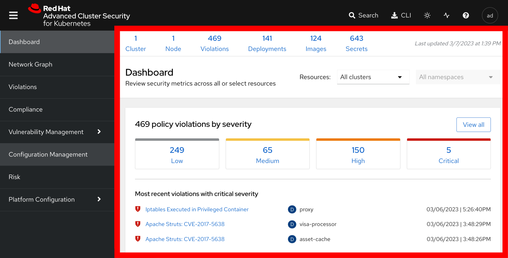

[NOTE]
When you open the RHACS portal for the first time, the Dashboard might be empty. After you deploy Sensor in at least one cluster, the Dashboard reflects the status of your environment.

== Navigating the Main Dashboard

The main Dashboard is your place to look at the vulnerabilities, risk, compliance, and policy violations across your clusters and namespaces. This section addresses all of the functionality in the main Dashboard to help you navigate it more effectively in the future.

Let's start by breaking the Dashboard down into sections.

=== The Three Dashboard Sections

The three core dashboard components are as follows
[start=1]
. The Status Bar
. The Dashboard Filter
. The Actionable Widgets

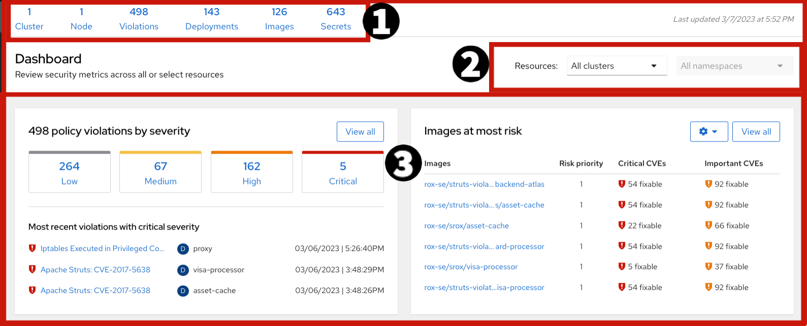

=== The Status Bar

The Status Bar provides at-a-glance numerical counters for critical resources. The counters reflect what is visible with your current access scope, defined by the roles associated with your user profile. These counters are clickable, providing fast access to the desired list view pages as follows:

[cols="1,2"]
|===
|*Counter*|*Destination*
|Clusters|Platform Configuration → Clusters
|Nodes|Configuration Management → Application & Infrastructure → Nodes
|Violations|Violations main menu
|Deployments|Configuration Management → Application & Infrastructure → Deployments
|Images|Vulnerability Management → Dashboard → Images
|Secrets|Configuration Management → Application & Infrastructure → Secrets
|===
=== The Dashboard Filter
The Dashboard includes a top-level filter that applies simultaneously to all widgets. You can select clusters and one or more namespaces within selected clusters. *When no clusters or namespaces are selected, the view automatically switches to All*. Any change to the filter is immediately reflected by all widgets, limiting the data they present to the selected scope. 

[NOTE]
The Dashboard filter does not affect the Status Bar.

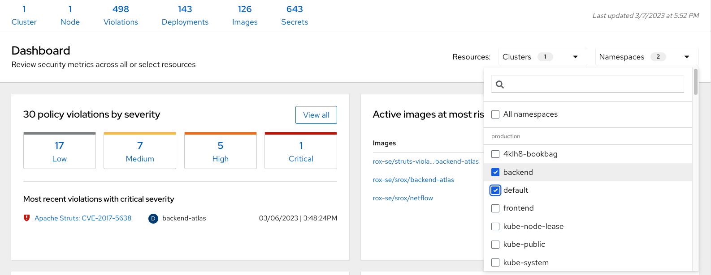

=== Actionable widgets (Optional)

If you have time, adjust the dashboards filtering options and the widgets themselves to hone the filtering capabilities. 

RHACS never seeks to highlight misconfigurations or vulnerabilities. Everything can be seen and triaged accordingly. 

== Vulnerability Management Dashboard

Let us start with Vulnerability Management, a familiar topic for most security teams. Click the *Vulnerability Management* tab, and then select *Dashboard*

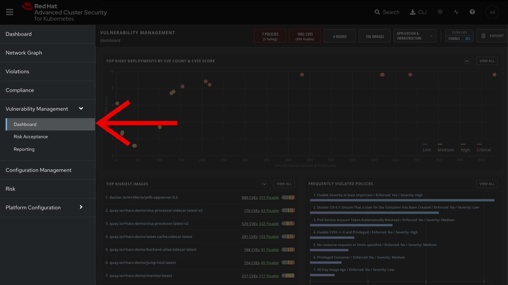

The overview provides several important reports - where the vulnerabilities are, the most widespread or the most recent, where Docker images are coming from, and important vulnerabilities in the cluster itself.

|===
*NOTE:* the locations and size of your panels may vary depending on your screen size and zoom. The pictures below will help to highlight the specific panels.
|===

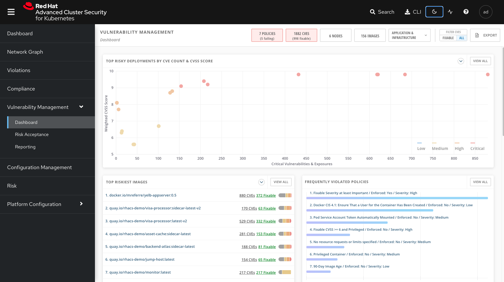

More important than fixing any vulnerability is establishing a process to keep container images updated and to prevent the promotion through the pipeline for images with serious, fixable vulnerabilities. ACS displays this through the *Top Risky Deployments by CVE and CVSS Score*. ACS takes the container's configuration and vulnerability details to show you the most *at risk* deployments in your cluster.

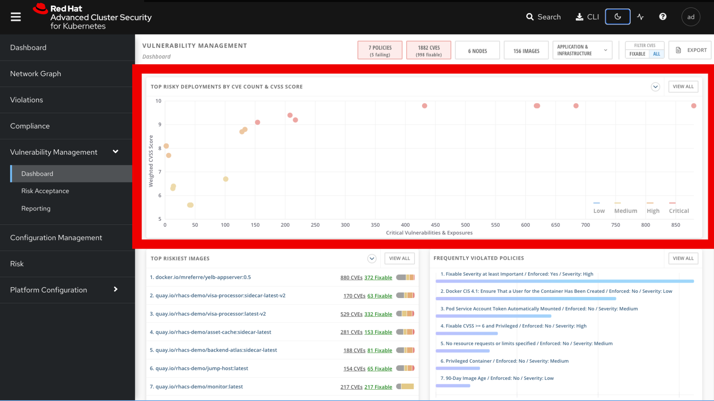

Above the *Risky Deployment* section, there are buttons to link you to all policies, CVEs, and images, and a menu to bring you to reports by cluster, namespace, deployment, and component. The vulnerability dashboard can be filtered by clicking the *Fixable CVSS* score button.

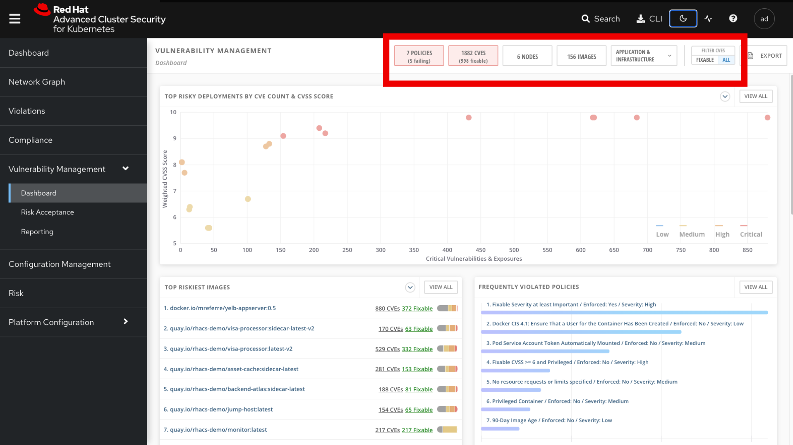

Locate the *Top Riskiest Images* panel. Here you can see the CVEs associated with containers currently running in the cluster. The goal is to find the log4shell exploit in your cluster and block that container from being pushed in the future.

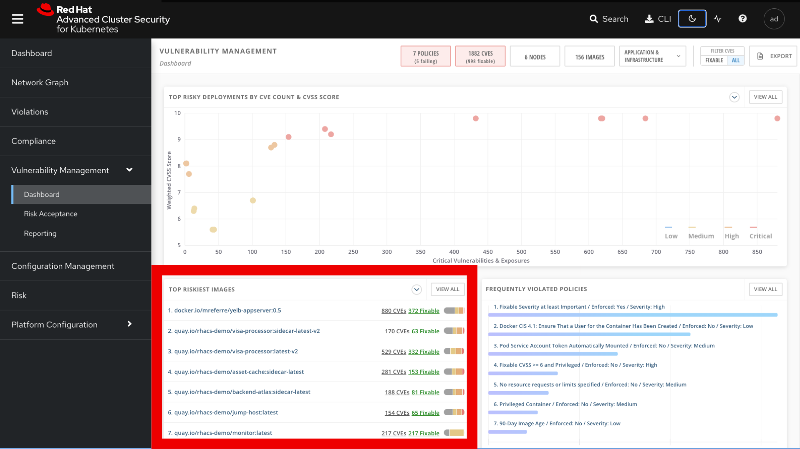

* In the *Top Riskiest Images* panel, click on the *VIEW ALL* button. 

|===
*NOTE:* For the following sections, please note that the order in which the images appear or the number of components affected may vary depending on versions and other applications running in the cluster.
|===

=== Image Overview and Details

Now you will see that the images are listed here in order of risk, based on the number and severity of the vulnerabilities present in the components in the images. 

Take a look:

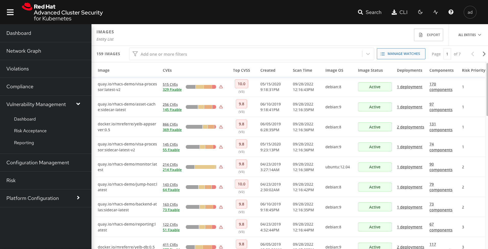

Notice which images are more exposed. Not only can we see the number of CVEs affecting the images, but which of them are fixable? We can also see:

- Creation date
- Scan time 
- Image OS
- Image status
- How many deployments are using the vulnerable image
- The total components in the image

You can click and get information about the CVEs and which are fixable.

* In the Top Riskiest Images, *find and click on* the image *visa-processor:latest-v2*. You will review the images' components and violations. 

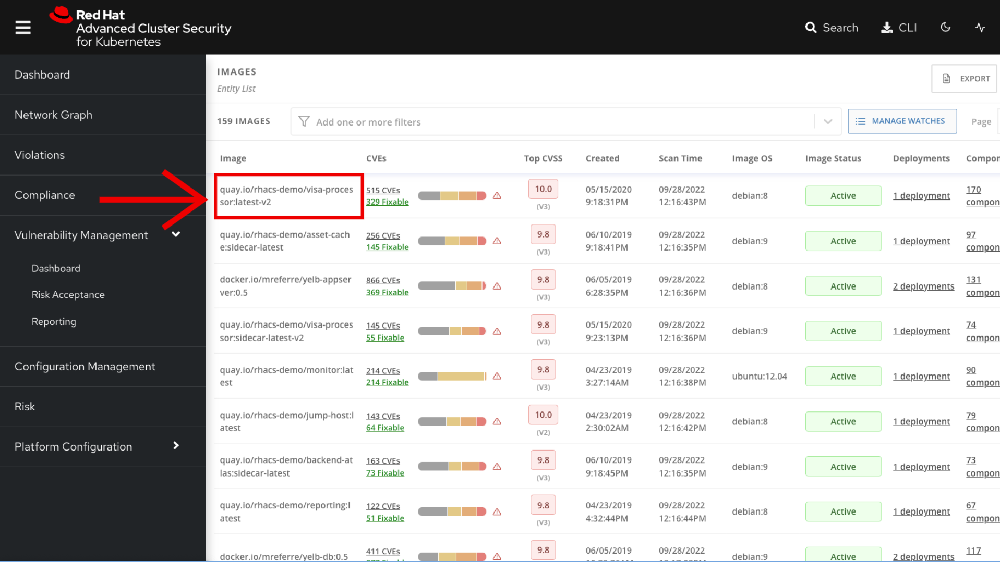

|===
Note: If you cannot find the *visa-processor:latest-v2* image, use the search bar to filter for the specific image you want. 

If you click the search bar, you will be shown the different labels you can search by. Click *Image* and type visa until the correct image comes up. 

You can use this method of searching in all search bars within the ACS dashboard.
|===

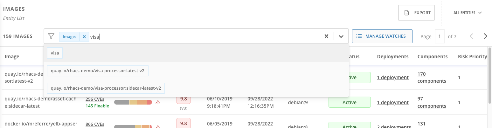

You can move on to the next section only when the dashboard displays the image below.

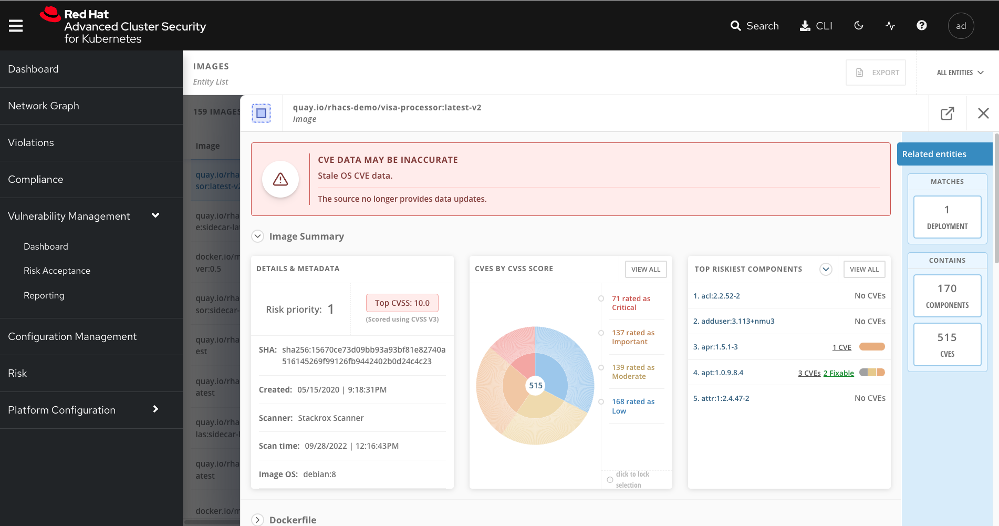

==== ACS Vulnerability Scanner

ACS' built-in vulnerability scanner breaks down images into layers and components - where components can be operating-system installed packages or dependencies installed by programming languages like Python, Javascript, or Java. The *Image Summary* provides the essential security details of the image overall, with links to the components. Below you can see why the image is ranked as a critically vulnerable application:

* In the DETAILS & METADATA → Image OS panel, the information you see there tells you that this image has a severe security problem - the base image was imported several years ago (Debian 8 - 2015).

* At the top of the page is the warning that CVE data is stale - that this image has a base OS version whose distribution has stopped providing security information and likely stopped publishing security fixes.

* Scroll down the page. In the *Image Findings* section, you find the details of the image vulnerabilities. There are 329 fixable vulnerabilities in the cluster (at the time of the creation of this workshop.)

image::images/risk-5.png[]

* Above the *Image Findings* section, click on the *Dockerfile* tab:

image::images/risk-6.png[]

The Dockerfile tab view shows the layer-by-layer view, and, as you can see, the most recent layers are also several years old. Time is not kind to images and components - as vulnerabilities are discovered, ACS will display newly discovered CVEs.

|===
It is not practical to ask your teams to fix Linux or Javascript - but we think it is reasonable to ask them to pick up fixes published by those communities.
|===    

=== log4shell CVE Vulnerability Analysis

It is time to find the components that have the log4shell vulnerability in your cluster.

* Head back to the *Top Riskiest Images* Dashboard

* Search for the log4shell vulnerability using its CVE number (CVE-2021-44228)

image::images/risk-7.png[]

* How many images are affected by the vulnerability?
* How many deployments contain the vulnerability?
* Why do you think the risk priority is where it is?
* Should the risk priority be higher? Or lower?

|===
The log4shell CVE is very serious - scoring 10/10 - and is fixable. 
|===

Luckily there is only *ONE* image being affected by this vulnerability, so you could go directly to the source and fix all three deployments in one opportunity. 

== Relating Image CVEs with Kubernetes Configuration Properties

All of this CVE detail is well and good, but it is a bit noisy. How do we judge the genuine risk - which vulnerabilities are likely to be exploited? Which vulnerabilities do we have to fix first?

ACS can use other sources of information in OpenShift to judge the risk that a given vulnerability would be exploited and set priorities for fixes.

The first risk factor - is the vulnerable component in a running deployment.

* Click on the *Risk* panel to continue.

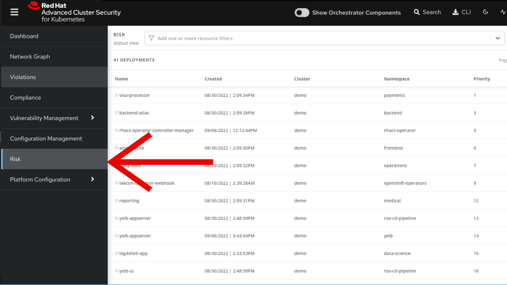

Take a look at the total amount of deployments in the cluster. If you remember, the log4shell image was approximately 10 in terms of risks based on CVSS score and other CVEs.

image::images/risk-2.png[]

So why is it down to #15 in this example?

* Click on the log4shell deployment and review the risk indicators.

image::images/risk-3.png[]

* Next, click on the *visa-processor* deployment and review its risk indicators.

image::images/risk-4.png[]

What do you think made the *visa-processor* deployment #1 in this example?

Factors that play into the overall score are in the risk indicators section. These include, but are not limited to:

1. Policy Violations
2. Image Vulnerabilities
3. Service Configuration
4. Service Reachability
5. Components Useful for Attackers
6. Number of Components in an Image
7. Image Freshness
8. RBAC Configuration

A primary reason for the *visa-processor* deployment to be ranked so high is that it is an ancient image (older than the log4shell app). A good indicator of risk is that the older an image is, the more likely it will have a significant exploitable vulnerability.

|===
We will leave it to you to make risk assessments in the future. Let us get to enforcing a log4shell policy and stopping future deployments containing the vulnerability.
|===

== Policy Management

RHACS has many built-in policies to detect activity related to attacker goals: gain a foothold, maintain a presence, move laterally, and exfiltrate data. The continuous runtime monitoring observes all container activity and will automatically respond to events with appropriate enforcement and notification. However, that would be missing out on an opportunity - RHACS wants to go one step further, to take advantage of containers' ephemeral, immutable nature to improve security in a measurable way from now on.

We want to use runtime incidents and vulnerabilities as a learning opportunity to improve security going forward by constraining how our containers can act.

We achieve this by creating policies and implementing them early in the CI/CD process.

* On the left-hand side of the application, click the *Platform Configuration* tab and *select* *Policy Management*.

image::images/policy-1.png[]

You can create policies based on rules and risks as well. Filter through the policies and find the *Package Manager Binary* policy.

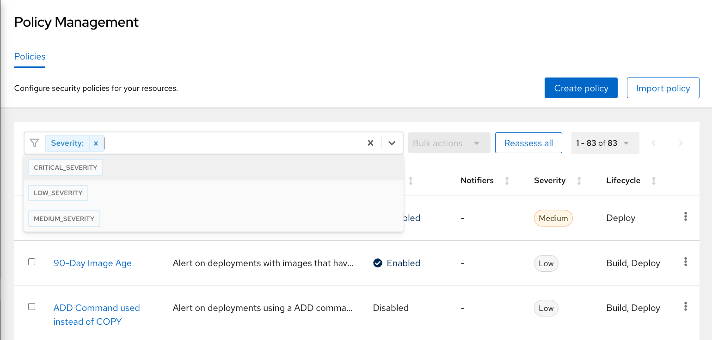

Once you have found the vulnerability, *click* on it to learn more.

image::images/policy-3.png[]

If you click the actions button, you will see how easy it is to edit, clone, export or disable these policies. We also recommended cloning the policies and adding or removing specific filters as you need them. 

= Runtime Policy Enforcement

== Runtime Policy Features

RHACS observes the processes running in containers, and collects this information to write policies. This information can also be used to create baseline policy configurations that can be updated by the user.

This allows the user to quickly assess and address novel situations.

=== Prevent Execution of Package Manager Binary

Package managers like `apt` (Ubuntu), `apk` (Alpine), or `yum` (RedHat) are binary software components used to manage and update installed software on a Linux^(R)^ host system. They are used extensively to manage running virtual machines. But using a package manager to install or remove software on a running container violates the immutable principle of container operation.

This policy demonstrates how RHACS detects and avoids a runtime violation, using Linux kernel instrumentation to detect the running process and OpenShift^(R)^ to terminate the pod for enforcement.

Using OpenShift to enforce runtime policy is preferable to enforcing rules directly within containers or in the container engine, as it avoids a disconnect between the state that OpenShift is maintaining and the state in which the container is actually operating.

Further, because a runtime policy may detect only part of an attacker's activity inside a container, removing the container avoids the attack.

=== Enable Enforcement of Policy

.Procedure
. Navigate to *Platform Configuration -> Policy Management* and find the `Ubuntu Package Manager Execution` policy.
+
[TIP]
====
On the *Policy Management* page, type `Policy` + `Ubuntu` into the filter bar at the top.
====

. Select the policy `Ubuntu Package Manager Execution`, and edit the policy.
. Use the `Policy Behavior` tab and enable runtime enforcement by clicking the `inform and enforce button`
. Click *Save*.

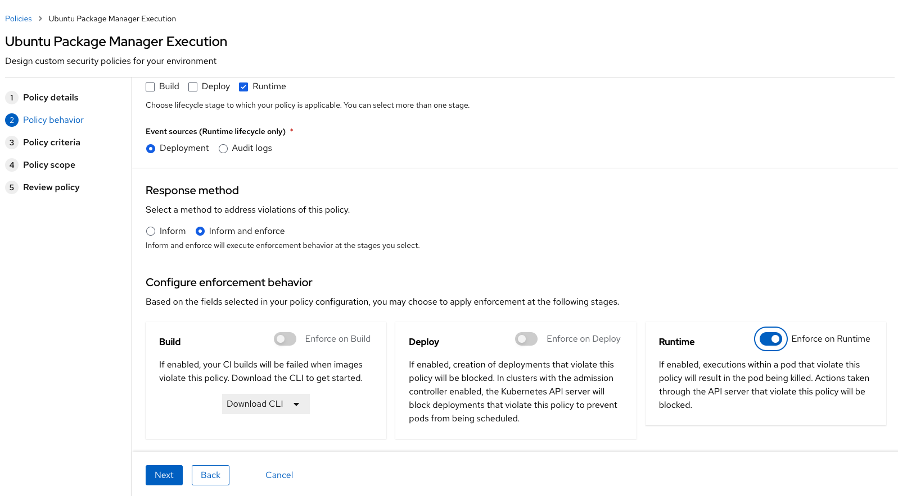

=== Test Policy (Bookbag Environment)

In this section, you use `tmux` to watch OpenShift _events_ while running the test, so you can see how RHACS enforces the policy at runtime.

.Procedure
. On your student VM, start `tmux` with two panes:
+
[source,bash,role="execute"]
----
tmux new-session \; split-window -v \; attach 
----
+
. Run a watch on OpenShift events in the first shell pane:
+
[source,bash,role="execute"]
----
oc get events -w
----
+
. Type `Ctrl-b o` to switch to the next pane.
. Run a temporary Ubuntu OS image using the `tmp-shell` application:
+
[source,bash,role="execute"]
----
oc run tmp-shell --labels="app=tmp-shell" --rm -i --tty --image ubuntu:18.04 -- /bin/bash
----
+
.Sample Output
[source,texinfo]
----
If you don't see a command prompt, try pressing enter.
root@tmp-shell:/#
----
+
After the cluster pulls the image and starts the pod, expect to see a Linux command shell as shown.

. Run the package manager in this shell:
+
[source,bash,role="execute"]
----
root@tmp-shell-65c98c7766-66fpw:/# apt update
----
+
. Examine the output and expect to see that the package manager performs an update operation:
+
.Sample Output
[source,texinfo]
----
Get:1 http://security.ubuntu.com/ubuntu bionic-security InRelease [88.7 kB]
Get:2 http://archive.ubuntu.com/ubuntu bionic InRelease [242 kB]
Get:3 http://security.ubuntu.com/ubuntu bionic-security/restricted amd64 Packages [860 kB]
Get:4 http://archive.ubuntu.com/ubuntu bionic-updates InRelease [88.7 kB]
Get:5 http://archive.ubuntu.com/ubuntu bionic-backports InRelease [74.6 kB]
Get:6 http://archive.ubuntu.com/ubuntu bionic/universe amd64 Packages [11.3 MB]
Get:7 http://security.ubuntu.com/ubuntu bionic-security/universe amd64 Packages [1484 kB]
Get:8 http://security.ubuntu.com/ubuntu bionic-security/multiverse amd64 Packages [21.1 kB]
Get:9 http://security.ubuntu.com/ubuntu bionic-security/main amd64 Packages [2660 kB]
Get:10 http://archive.ubuntu.com/ubuntu bionic/main amd64 Packages [1344 kB]
Get:11 http://archive.ubuntu.com/ubuntu bionic/multiverse amd64 Packages [186 kB]
Get:12 http://archive.ubuntu.com/ubuntu bionic/restricted amd64 Packages [13.5 kB]
Get:13 http://archive.ubuntu.com/ubuntu bionic-updates/restricted amd64 Packages [893 kB]
Get:14 http://archive.ubuntu.com/ubuntu bionic-updates/main amd64 Packages [3098 kB]
Get:15 http://archive.ubuntu.com/ubuntu bionic-updates/universe amd64 Packages [2262 kB]
Get:16 http://archive.ubuntu.com/ubuntu bionic-updates/multiverse amd64 Packages [29.8 kB]
Get:17 http://archive.ubuntu.com/ubuntu bionic-backports/main amd64 Packages [11.6 kB]
Get:18 http://archive.ubuntu.com/ubuntu bionic-backports/universe amd64 Packages [12.6 kB]
97% [13 Packages store 0 B]
Fetched 24.7 MB in 3s (7158 kB/s)
Reading package lists... Done
Building dependency tree
Reading state information... Done
All packages are up to date.
----
+
. Examine the `oc get events` tmux pane, and note that it shows that RHACS detected the package manager invocation and deleted the pod:
+
.Sample Output
[source,texinfo,options="nowrap"]
----
0s          Normal    Scheduled              pod/tmp-shell   Successfully assigned tok-00-project/tmp-shell to ip-10-0-239-17.us-east-2.compute.internal
0s          Normal    AddedInterface         pod/tmp-shell   Add eth0 [10.128.1.130/23] from openshift-sdn
0s          Normal    Pulled                 pod/tmp-shell   Container image "ubuntu:18.04" already present on machine
0s          Normal    Created                pod/tmp-shell   Created container tmp-shell
0s          Normal    Started                pod/tmp-shell   Started container tmp-shell
0s          Warning   StackRox enforcement   pod/tmp-shell   A pod (tmp-shell) violated StackRox policy "Ubuntu Package Manager Execution" and was killed
0s          Normal    Killing                pod/tmp-shell   Stopping container tmp-shell
----
+
After about 30 seconds, you can see that the pod is deleted.

. In your `tmux` shell pane, note that your shell session has terminated and that you are returned to the student VM command line:
+
.Sample Output
[source,texinfo,options="nowrap"]
----
root@tmp-shell:/#
root@tmp-shell:/# Session ended, resume using 'oc attach tmp-shell -c tmp-shell -i -t' command when the pod is running
No resources found
[lab-user@bastion ~]$
----

== Report and Resolve Violations

At this point, any attacker using a shell to install software is now disconnected from the environment.
A complete record of the event is available on the *Violations* page.

.Procedure
. Navigate to the *Violations* page.
. Find the violation labeled `tmp-shell` and select the `Ubuntu Package Manager Execution` policy.

. Explore the list of the violation events:
+
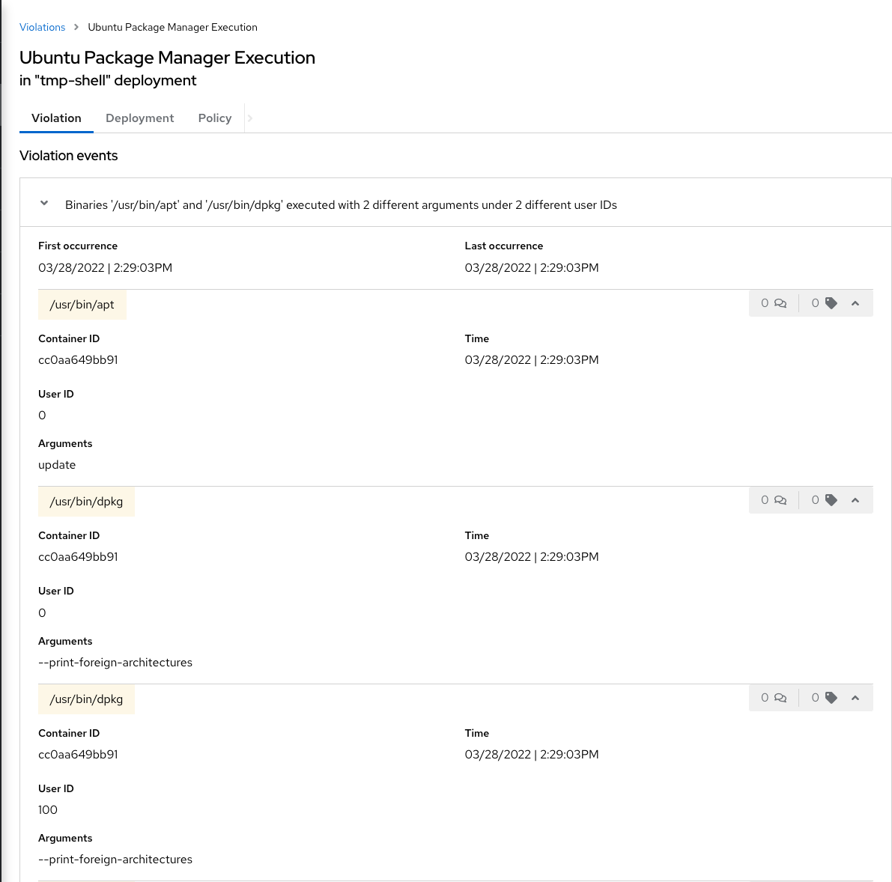
+
If configured, each violation record is pushed to a Security Information and Event Management (SIEM) integration, and is available to be retrieved via the API.
The forensic data shown in the UI is recorded, including the timestamp, process user IDs, process arguments, process ancestors, and enforcement action.
+
For more information about integration with SIEM tools, see the RHACS help documentation on link:https://docs.openshift.com/acs/3.74/welcome/index.html#integrating-with-other-products[external tools^].
+
After this issue is addressed--in this case by the RHACS product using the runtime enforcement action--you can remove it from the list by marking it as `Resolved`.

. Hover over the violation in the list to see the resolution options:
+
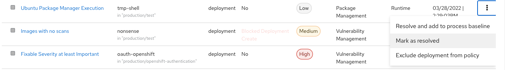

Summary needed here. 
