== Goal of the ACS Lab Portion

The goal of the two lab modules is to take you through the RHACS console/user interface and get you used to finding vulnerabilities in your clusters. After you are comfortable, we will apply a runtime policy to block packages from being downloaded to the host. 

If you have questions at any time, please don't hesitate to ask!

== ACS Basics

ACS provides the tools and capabilities to address the security needs of a cloud-native development approach on Kubernetes.

The ACS solution offers visibility into the security of your cluster, vulnerability management, and security compliance through auditing, network segmentation awareness and configuration, security risk profiling, security-related configuration management, threat detection, and incident response. In addition, ACS grants an ability to pull the actions from that tooling deep into the application code development process through APIs.

These security features represent any developer or administrator's primary work across various environments, including multiple datacenters, private clouds, or public clouds that run Kubernetes clusters.

=== ACS Features

Using Red Hat Advanced Cluster Security for Kubernetes, you can gain comprehensive Kubernetes security that includes the following use cases:

* *Visibility*: See your entire landscape of images, registries, containers, deployments, and runtime behavior.
* *Vulnerability Management*: Identify and remediate vulnerabilities in container images and Kubernetes across the entire software development life cycle.
* *Compliance*: Audit your systems against CIS Benchmarks, NIST, PCI, and HIPAA, with interactive dashboards and one-click audit reports.
* *Network Segmentation*: Visualize existing connections and enforce tighter segmentation using Kubernetes-native controls to reduce your blast radius.
* *Risk Profiling*: See all your deployments ranked by risk level, using context from Kubernetes' declarative data, to prioritize remediation.
* *Configuration Management*: Apply best practices for Docker and Kubernetes to harden your environment for a more secure and stable application.
* *Threat Detection*: Use rules, automated allow lists, and baselining to accurately identify suspicious activity in your running applications.
* *Incident Response*: Take action, from failing builds and blocking deployments to killing pods and thwarting attacks, using Kubernetes for enforcement.

== Workshop Setup (BookBag Environment)

=== MANDATORY - Deploy the INSECURE demo application to the cluster

To have the applications and vulnerabilities necessary for the demo, we need to introduce a few vulnerable applications into the cluster.

The command below will clone the tutorial sources and set the *TUTORIAL_HOME* environment variable to point to the root directory of the tutorial and deploy the applications.

1.  Please click the button to run the command in the terminal.

[source,bash,role="execute"]
----
git clone https://github.com/openshiftdemos/openshift-ops-workshops acs-workshop
export TUTORIAL_HOME="$(pwd)/acs-workshop"
kubectl apply -f $TUTORIAL_HOME/workshop/demo-apps/configuration --recursive
kubectl apply -f $TUTORIAL_HOME/workshop/demo-apps/ --recursive
----

|===
NOTE: This command applies a significant number of manifests to your environment. All of these applications are insecure and pose a significant threat if used elsewhere. Please use the command with caution.
|===

Now Let's verify our deployment was successful!

[start=2]
2. Run the following command and ensure that the applications are up and running

[source,bash,role="execute"]
----
kubectl get deployments -l demo=acs -A
----

*Output*
```bash
NAMESPACE      NAME               READY   UP-TO-DATE   AVAILABLE   AGE
backend        api-server         1/1     1            1           0d
frontend       asset-cache        1/1     1            1           0d
log4shell      log4shell-app      3/3     3            3           0d
medical        reporting          1/1     1            1           0d
operations     jump-host          1/1     1            1           0d
payments       visa-processor     1/1     1            1           0d
spring4shell   spring4shell-app   3/3     3            3           0d
```

|===
NOTE: If all of the applications are up and running please proceed to the next stage. If the applications are not healthy please run the deployment command again.
|===

== Navigating the ACS console and Vulnerability Management

The first half of this lab will focus on navigation and vulnerability management. This work will take place in the UI and require you to use both the dashboard and the lab environment.

=== Accessing the ACS Console

In this section, you will confirm that you can connect to that you can connect to the ACS portal. The following information will be available in the lab URL.

*Requirements* 

* The ACS `admin` credentials
* The URL for the ACS portal

.Procedure
[start=1]
. From the main lab page, click the URL for the ACS web console to head to the console's login page.
** For example, 'https://central-stackrox.apps.cluster-4klh8.4klh8.sandbox1150.opentlc.com'

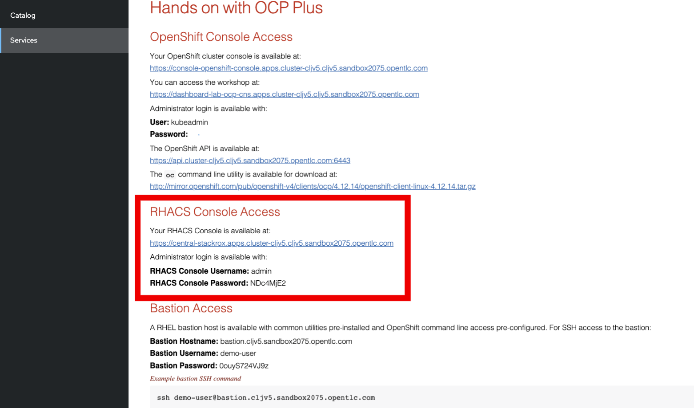

|===
*NOTE* You will get a warning page that the webpage is not private. During setup, ACS can utilize your certification server to avoid these errors. It is also best practice to integrate the application with your authentication server. 
|===

[start=2]
. Click through the warning page to get to the ACS console login page

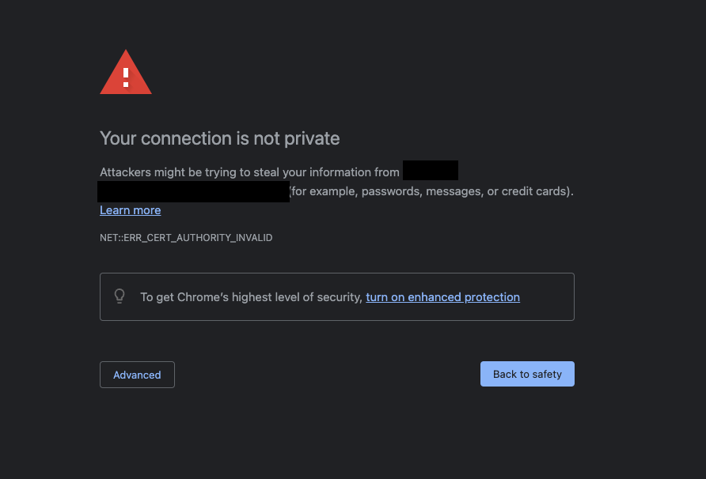
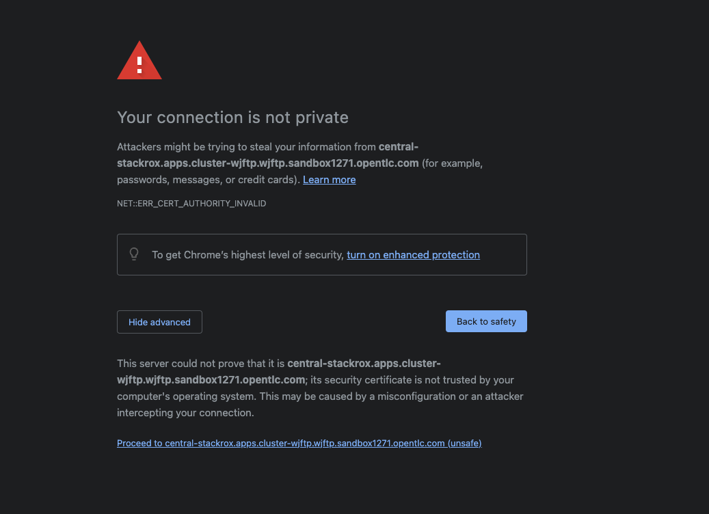
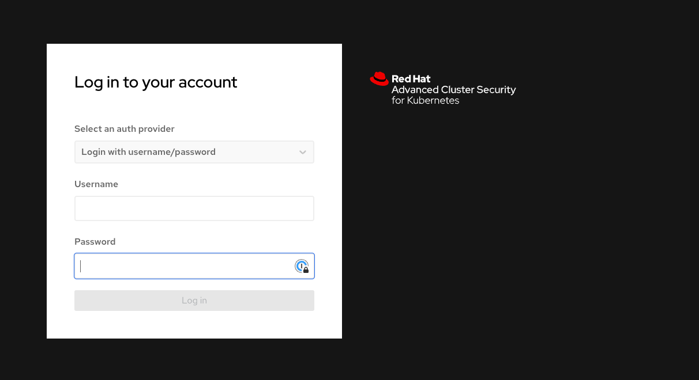

[start=3]
. Log in with the ADMINISTRATOR credentials from the main demo page. These credentials are located with all of the demo credentials and will be underneath the ACS console URL (HINT: The Username is always *admin*)

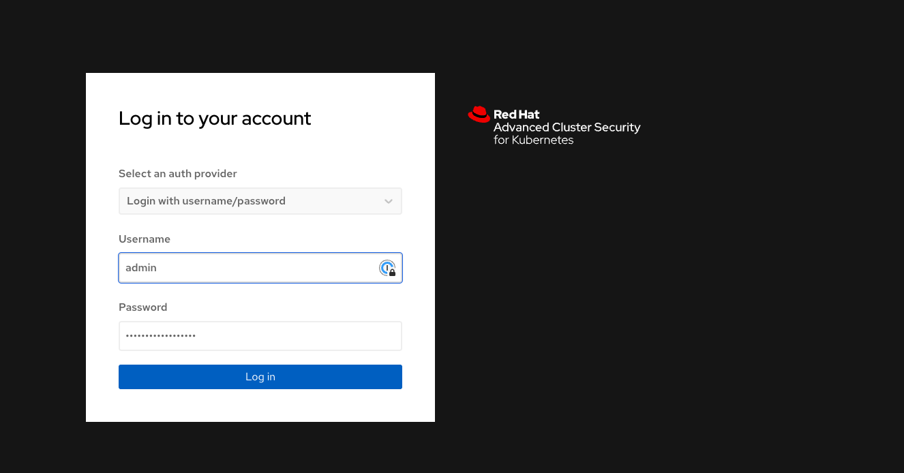

[start=4]
. Ensure you maintain access to the console and keep your tab open for the future lab sections. 

image::images/00-console-dashboard-5.png[ACS dashboard]

== Navigating the ACS Console
In this section, you familiarize yourself with the ACS portal, including its tabs, search capabilities and dashboard functionality.

Head to the ACS web console from the course introduction lab. If you do not have access, please repeat the steps in the first lab titled "Access the ACS Console."

=== The 4 Main Sections of the Dashboard
The ACS dashboard has four main sections:

[start=1]
. Top Bar
. Global search
. Navigation menu
. Dashboard

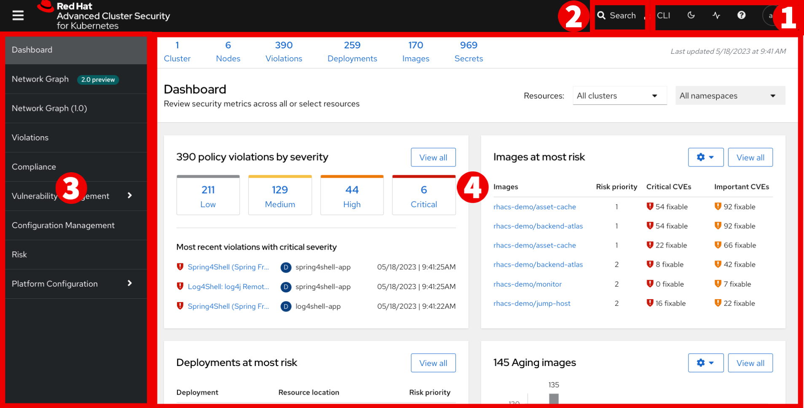

=== Top Bar

The top bar contains the following functionality 
* Global Search
* Command-line tools
* Cluster Health
* Documentation
* API Reference
* Enable Dark/Light Mode
* Logged-in user account

[NOTE]
The top bar is available in EVERY tab and displayed when accessing the ACS console.

=== Global Search

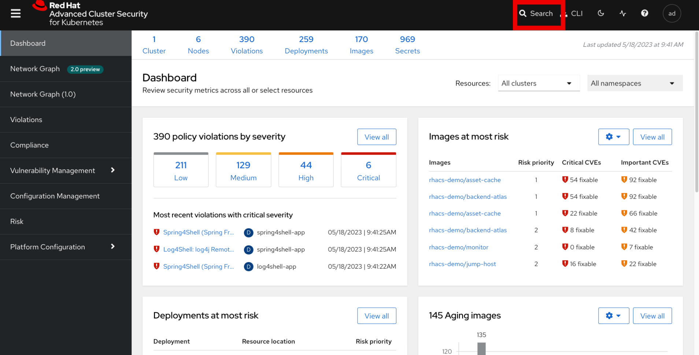

==== Searching and filtering

The ability to instantly find resources is essential to safeguard your cluster. Utilize the ACS search feature to find relevant resources faster. 

For example, you can use it to find deployments exposed to a newly published CVE or all deployments with external network exposure.

.Search syntax
A search query consists of two parts:

* An attribute that identifies the resource type you want to search for.
* A search term that finds the matching resource.

*For example,* to find all violations in the visa-processor deployment, the search query is *Deployment:visa-processor*. 

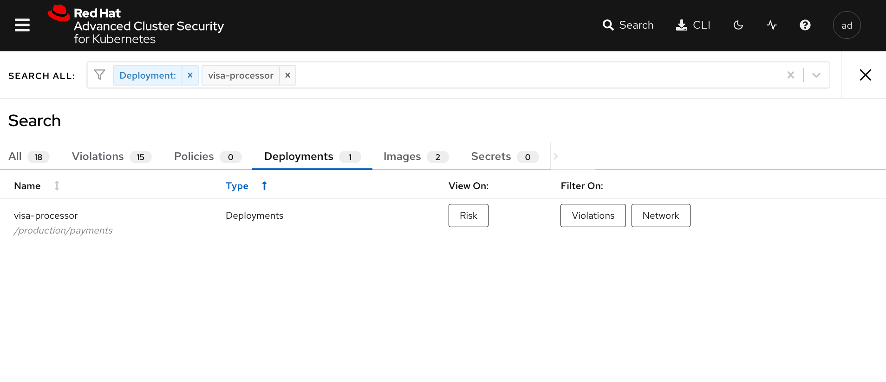

In this search query, *Deployment* is the attribute, and *visa-processor* is the search term.

|===
NOTE: When using the search functionality you must click the provided info from the dropdown. ACS maintains a library of searchable assets to help you search faster. If CVE or deployment cannot be searched it is most likely because the resource is not in the cluster or incorrectly typed. 
|===

==== Using local page filtering
You can use local page filtering from within all views in the ACS portal. Local page filtering works similarly to the global search, but only relevant attributes are available. You can select the search bar to show all available attributes for a specific view.

==== Common search queries
Here are some common search queries you can try in the ACS search bar if you'd like to test it's functionality.

[start=1]
. Finding deployments that are affected by a specific CVE

[cols="2,2"]  
|=== 
|*Query*
|*Example*
|CVE:<CVE_number>
|CVE:CVE-2018-11776
|===

[start=2]
. Finding privileged running deployments

[cols="2,2"]
|=== 
|*Query*
|*Example*
|Privileged:<true_or_false>
|Privileged:true
|===

[start=3]
. Finding deployments that have external network exposure

[cols="2,2"]
|=== 
|*Query*
|*Example*
|Exposure Level:<level>
|Exposure Level:External
|===

[NOTE]
There are plenty more local and global search examples in the link:https://docs.openshift.com/acs/operating/search-filter.html[ACS documentation] 

=== Navigation Menu

image::images/01-dashboard-3.png[ACS navigation]

The left-hand navigation menu provides access to each of the security use cases, as well as product configuration to integrate ACS with your existing tooling.
The navigation menu has the following items:

* *Dashboard*: Summary view of your environment
* *Network Graph*: Configured and actual network flows and the creation of Network Policies to implement network segmentation
* *Violations*: Events that do not match the defined security policies
* *Compliance*: Several industry and regulatory security standards, such as PCI DSS
* *Vulnerability Management*: Information about known vulnerabilities affecting your environment, including deployed workloads and infrastructure, risk acceptance and reporting.
* *Configuration Management*: Identification of potential misconfigurations that can lead to security issues
* *Risk*: Risks affecting your environment, such as suspicious executions
* *Platform Configuration*: ACS configuration, policy management and integration details, including;
** *Clusters*
** *Policy Management*
** *Integrations*
** *Access Control*
** *System Configuration*
** *System Health*

This course follows the pattern of the major use cases, but in the order of most common to least common, starting with the *Main Dashboard* and moving to the *Vulnerability Management* tab next.

=== Dashboard

The Red Hat Advanced Cluster Security for Kubernetes (ACS) Dashboard provides quick access to the data you need. It contains additional navigation shortcuts and actionable widgets that are easy to filter and customize so that you can focus on the data that matters most to you. You can view information about levels of risk in your environment, compliance status, policy violations, and common vulnerabilities and exposures (CVEs) in images.

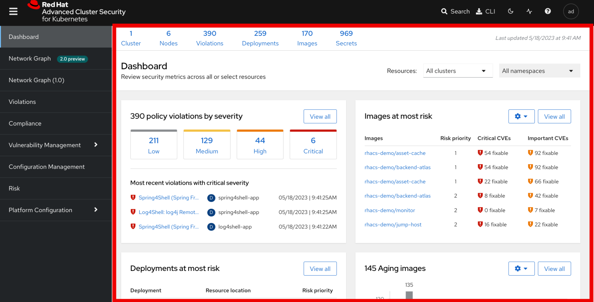

== Navigating the Main Dashboard

The main Dashboard is your place to look at the vulnerabilities, risk, compliance, and policy violations across your clusters and namespaces. This section addresses all of the functionality in the main Dashboard to help you navigate it more effectively in the future.

Let's start by breaking the Dashboard down into sections.

=== The Three Dashboard Sections

The three core dashboard components are as follows
[start=1]
. The Status Bar
. The Dashboard Filter
. The Actionable Widgets

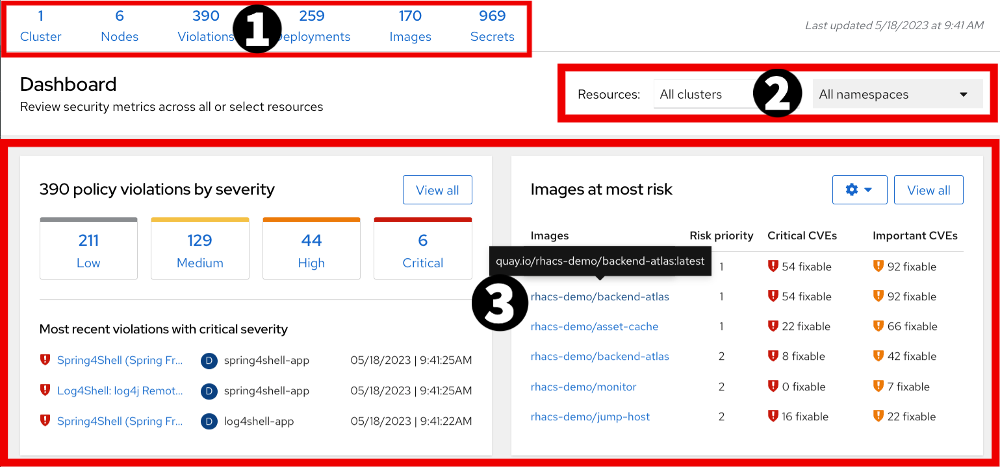

=== The Status Bar

The Status Bar provides at-a-glance numerical counters for critical resources. The counters reflect what is visible with your current access scope, defined by the roles associated with your user profile. These counters are clickable, providing fast access to the desired list view pages as follows:

[cols="1,2"]
|===
|*Counter*|*Destination*
|Clusters|Platform Configuration → Clusters
|Nodes|Configuration Management → Application & Infrastructure → Nodes
|Violations|Violations main menu
|Deployments|Configuration Management → Application & Infrastructure → Deployments
|Images|Vulnerability Management → Dashboard → Images
|Secrets|Configuration Management → Application & Infrastructure → Secrets
|===
=== The Dashboard Filter
The Dashboard includes a top-level filter that applies simultaneously to all widgets. You can select clusters and one or more namespaces within selected clusters. Any change to the filter is immediately reflected by all widgets, limiting the data they present to the selected scope. 


[NOTE]
The Dashboard filter does not affect the Status Bar and when no clusters or namespaces are selected, the view automatically switches to *All* 

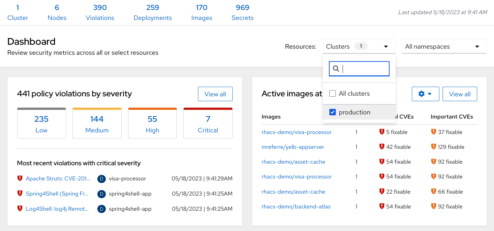
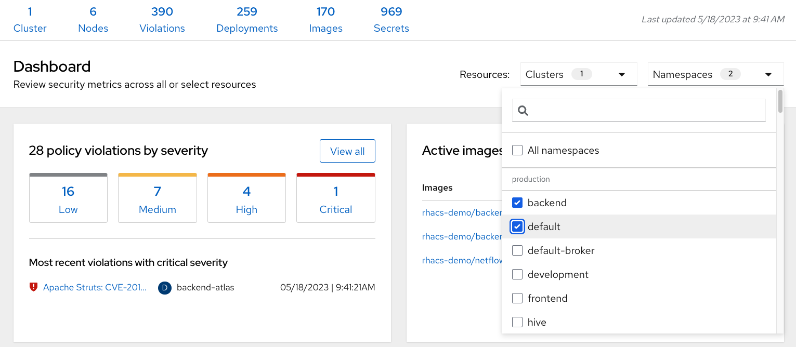

=== Actionable widgets (Optional)

|===
If you have time, adjust the dashboard filtering options and widgets to hone the filtering capabilities. 
|===

== Vulnerability Management Dashboard

Let us continue by looking at our primary use case for ACS and that is the *Vulnerability Management* features and dashboard, a familiar topic for most security teams. 

|===
*NOTE:* The locations and size of your panels may vary depending on your screen size and zoom.
|===
|===
*NOTE:* For the following section, please note that the order in which the images appear or the number of components affected may vary depending on versions and other applications running in the cluster.
|===

.Procedure
[start=1]
. Click the *Vulnerability Management* tab, and then select *Dashboard*

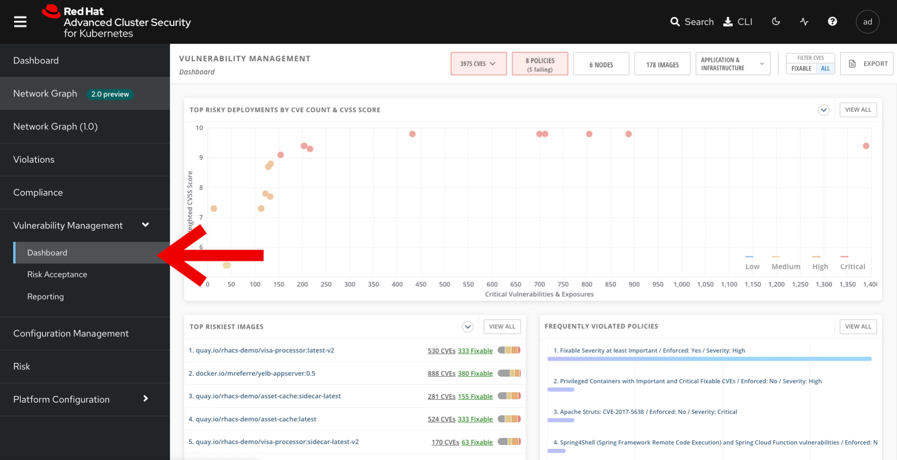

The dashboard provides several important vulnerability breakdowns such as:

* Top risky deployments/images
* Frequently violated policies
* Recently detected vulnerabilities
* Most common image vulnerabilities

More important than fixing any vulnerability is establishing a process to keep container images updated and to prevent the promotion through the pipeline for images with serious, fixable vulnerabilities. ACS displays this through the *Top Risky Deployments by CVE and CVSS Score* and takes the container's configuration and vulnerability details to show you the most *at risk* deployments in your cluster.

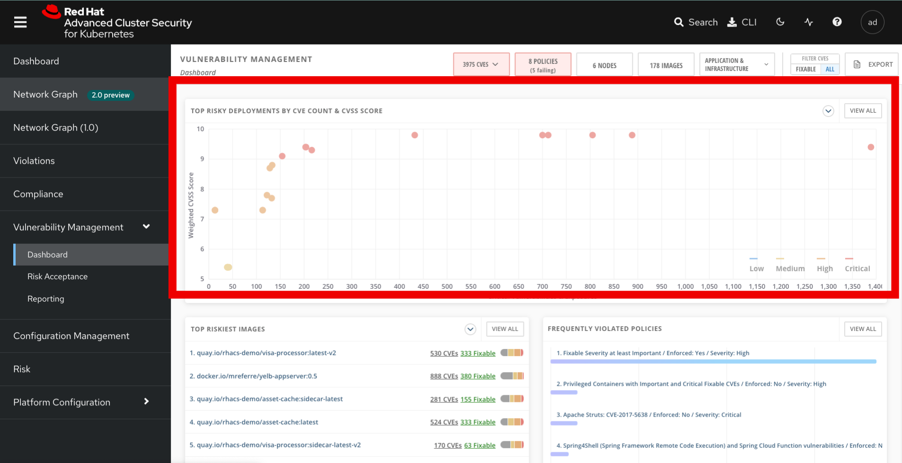

[start=2]
. Above the *Risky Deployments* section, there are buttons to link you to all policies, CVEs, and images, and a menu to bring you to reports by cluster, namespace, deployment, and component. The vulnerability dashboard can be filtered by clicking the *Fixable CVSS* score button.

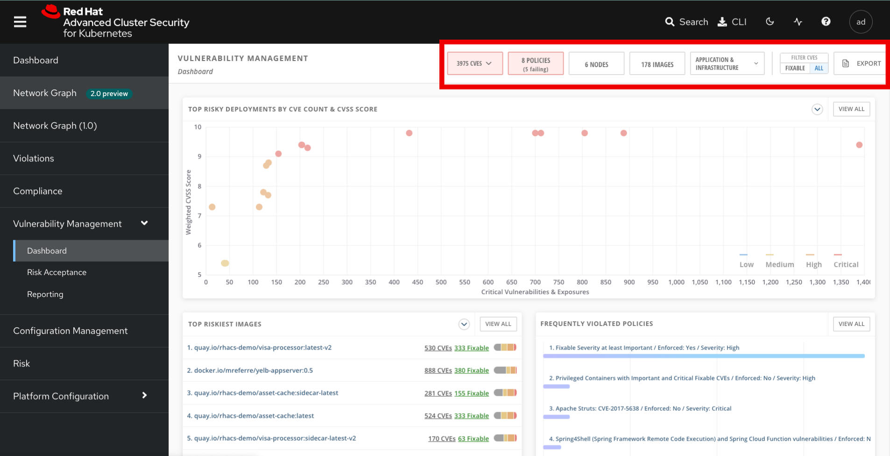

[start=4]
. Locate the *Top Riskiest Images* panel. Here you can see the CVEs associated with containers currently running in the cluster. The goal is to find the log4shell exploit in your cluster and block that container from being pushed in the future.

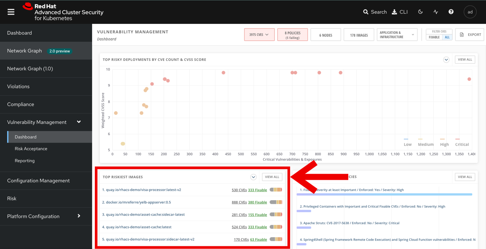

[start=5]
. In the *Top Riskiest Images* panel, click on the *VIEW ALL* button.

The images in this dashboard are listed here in order of RISK, based on the number and severity of the vulnerabilities present in the components in the images

Notice which images are more exposed. Not only can we see the number of CVEs affecting the images, but which of them are fixable? We can also see:

- Creation date
- Scan time 
- Image OS
- Image status
- How many deployments are using the vulnerable image
- The total components in the image

[start=6]
. Next, find and click on the image *visa-processor:latest-v2*. You will review the images' components and violations. 

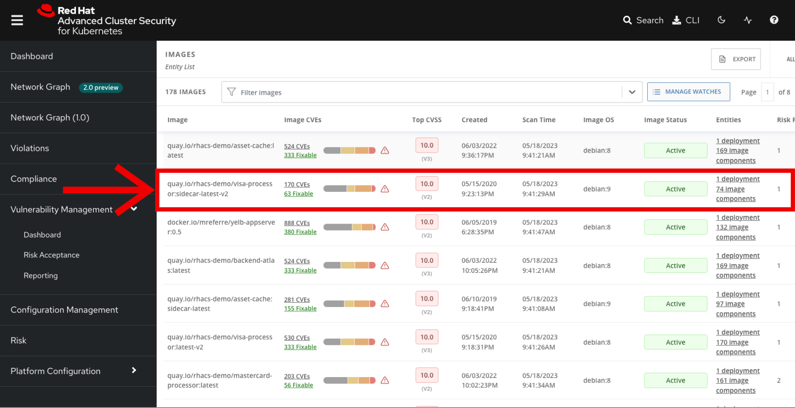

|===
Note: If you cannot find the *visa-processor:latest-v2* image, use the search bar to filter for the specific image you want. 

If you click the search bar, you will be shown the different labels you can search by. Click *Image* and type visa until the correct image comes up. 

You can use this method of searching in all search bars within the ACS dashboard.
|===

image::images/vuln-08.png[]

You can move on to the next section only when the dashboard displays the image below.

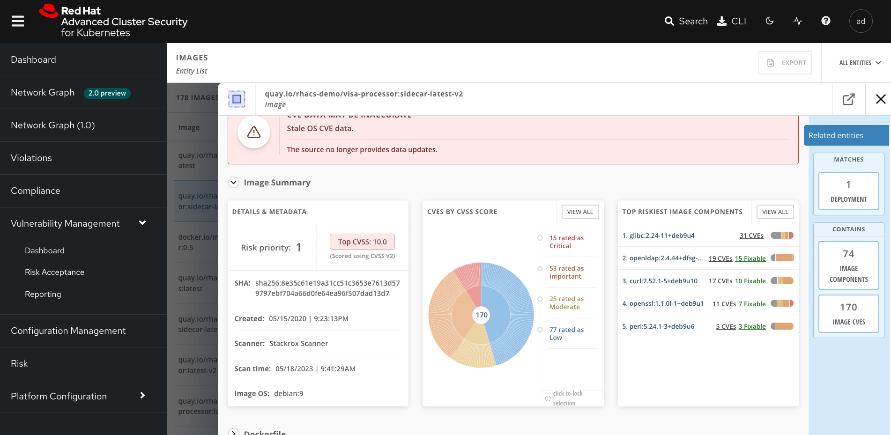

==== ACS Vulnerability Scanner

ACS' built-in vulnerability scanner breaks down images into layers and components - where components can be operating-system installed packages or dependencies installed by programming languages like Python, Javascript, or Java. The *Image Summary* provides the essential security details of the image overall, with links to the components. Below you can see why the image is ranked as a critically vulnerable application:

* In the DETAILS & METADATA → Image OS panel, the information you see there tells you that this image has a severe security problem - the base image was imported several years ago (Debian 8 - 2015).

* At the top of the page is the warning that CVE data is stale - that this image has a base OS version whose distribution has stopped providing security information and likely stopped publishing security fixes.

* Scroll down the page. In the *Image Findings* section, you find the details of the image vulnerabilities. There are 329 fixable vulnerabilities in the cluster (at the time of the creation of this workshop.)

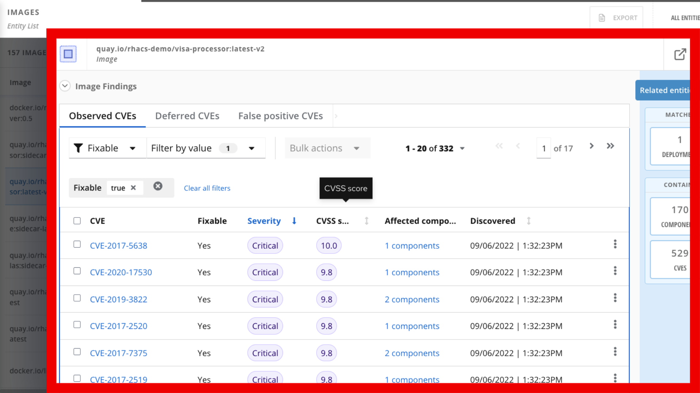

* Above the *Image Findings* section, click on the *Dockerfile* tab:

image::images/risk-6.png[]

The Dockerfile tab view shows the layer-by-layer view, and, as you can see, the most recent layers are also several years old. Time is not kind to images and components - as vulnerabilities are discovered, ACS will display newly discovered CVEs.

|===
Now lets put this UI to the test with a real use case.
|===

=== log4shell CVE Vulnerability Analysis

It is time to find the components that have the log4shell vulnerability in your cluster. Zero day and high priority vulnerabilities need to be triaged quickly. The log4shell vulnerability provides a great example of how security teams can asses a vulnerabilities impact quickly and effectively.

|===
Check out the https://access.redhat.com/security/vulnerabilities/RHSB-2021-009[Red Hat advisory] for more details)
|===

.Procedure

. Head back to the *Top Riskiest Images* Dashboard. (Vulnerability Management -> Top Riskiest Images)


[start=2]
. Search for the log4shell vulnerability using its CVE number (CVE-2021-44228)

image::images/risk-7.png[]

* How many images are affected by the vulnerability?
* How many deployments contain the vulnerability?
* Why do you think the risk priority is where it is?
* Should the risk priority be higher? Or lower?

|===
The log4shell CVE is very serious - scoring 10/10 - and is fixable. 
|===

Luckily there is only *ONE* image being affected by this vulnerability (2 deployments), so you could go directly to the source and fix all three deployments in one opportunity. 

*How would your DevSecOps team address this vulnerability?*

== Relating Image CVEs with Kubernetes Configuration Properties

All of these CVE details are well and good, but they are a bit noisy. How do we judge the genuine risk - which vulnerabilities are likely to be exploited? Which vulnerabilities do we have to fix first? ACS can use other sources of information in OpenShift to judge the risk that a given vulnerability would be exploited and set priorities for fixes.

The first risk factor - is the vulnerable component in a running deployment.

.Procedure
. Click on the *Risk* panel to continue.

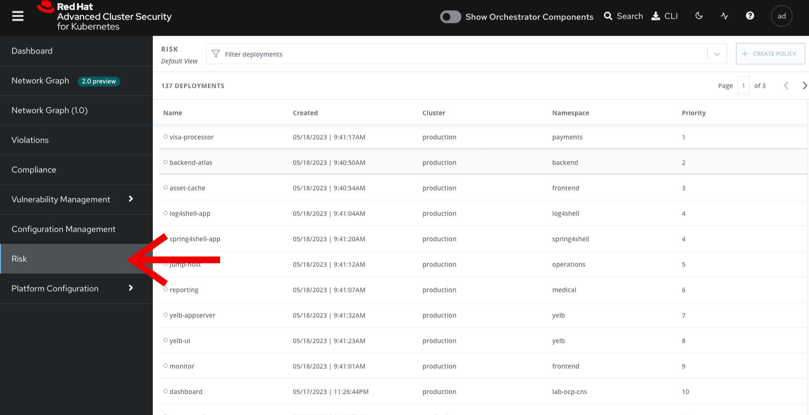

Take a look at the total amount of deployments in the cluster. If you remember, the *log4shell* image was approximately 10 in terms of risks based on CVSS score and other CVEs. So why is it down to #15 in this example?

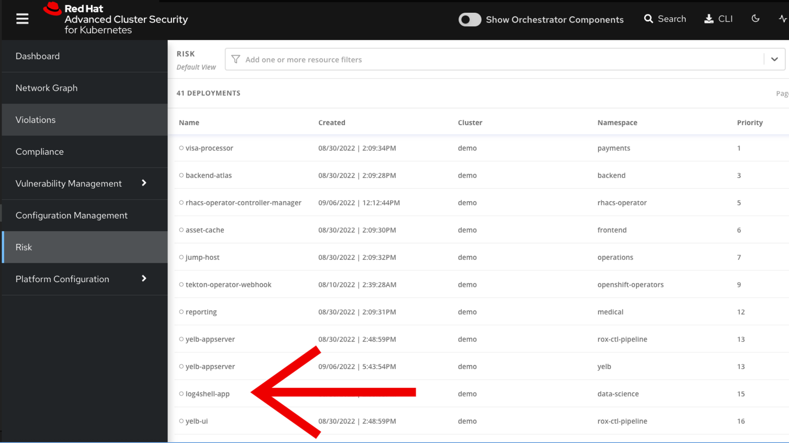

[start=2]
. Click on the log4shell deployment and review the risk indicators.

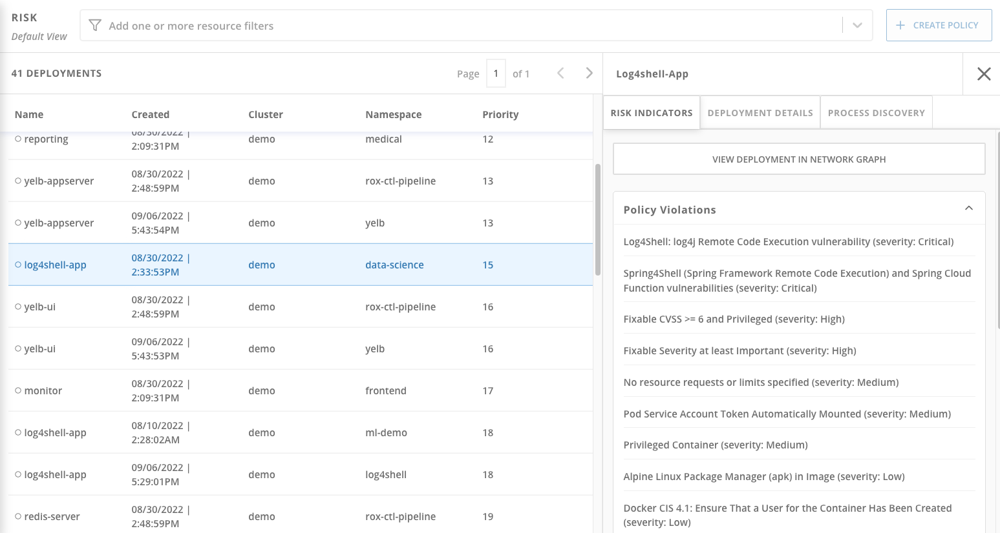

[start=3]
. Next, click on the *visa-processor* deployment and review its risk indicators. What do you think made the *visa-processor* deployment #1 in this example?

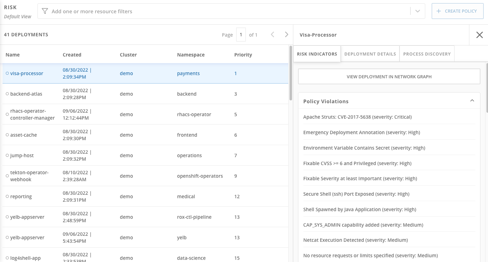

Factors that play into the overall score are in the risk indicators section. These include, but are not limited to:

1. Policy Violations
2. Image Vulnerabilities
3. Service Configuration
4. Service Reachability
5. Components Useful for Attackers
6. Number of Components in an Image
7. Image Freshness
8. RBAC Configuration

A primary reason for the *visa-processor* deployment to be ranked so high is that it is an ancient image (older than the log4shell app). A good indicator of risk is that the older an image is, the more likely it will have a significant exploitable vulnerability.

|===
We will leave it to you to make risk assessments in the future. Let us get to enforcing a log4shell policy and stopping future deployments containing the vulnerability.
|===

== Policy Management

ACS has many built-in policies to detect activity related to attacker goals: gain a foothold, maintain a presence, move laterally, and exfiltrate data. The continuous runtime monitoring observes all container activity and will automatically respond to events with appropriate enforcement and notification. However, that would be missing out on an opportunity - ACS wants to go one step further, to take advantage of containers' ephemeral, immutable nature to improve security in a measurable way from now on.

We want to use runtime incidents and vulnerabilities as a learning opportunity to improve security going forward by constraining how our containers can act. We achieve this by creating policies and implementing them early in the CI/CD process.

As we move into the next section, let focus on identifying and enforcing a runtime policy in the cluster. For the upcoming example, we will focus on stoping the Ubuntu pacakage manager from being run in our cluster

.Procedure

. On the left-hand side of the application, click the *Platform Configuration* tab and *select* *Policy Management*.

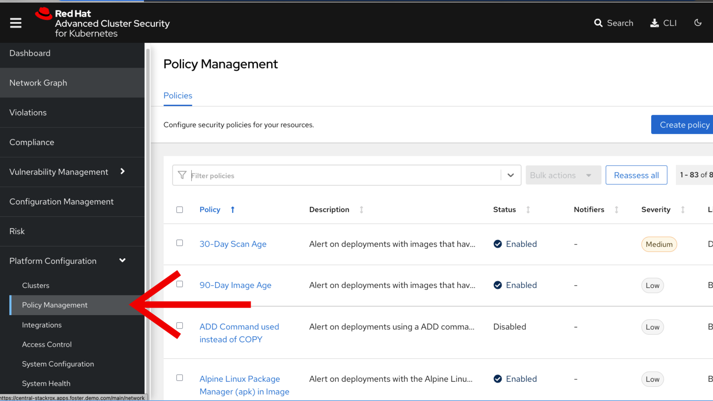

[start=2]
. Filter through the policies to find *Ubuntu Package Manager Execution* or use the search bar to select by *category.*

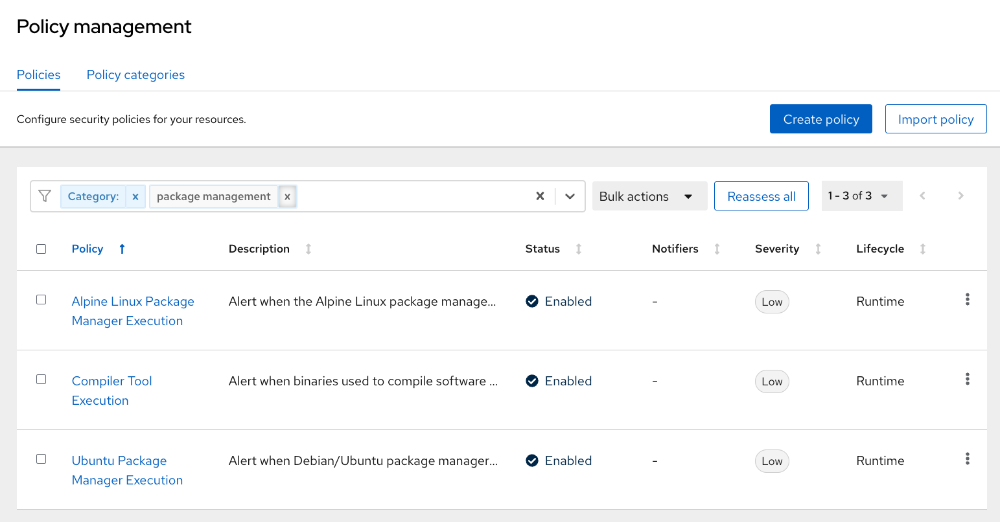

[start=3]
. Once you have found the vulnerability, *Ubuntu Package Manager Execution* on it to learn more.

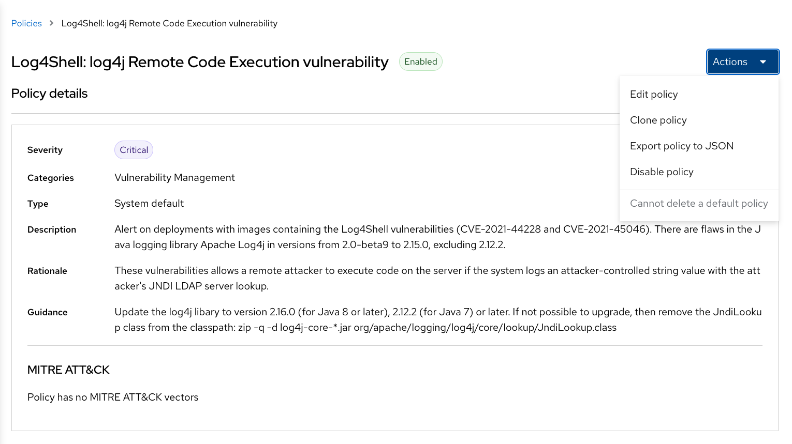

[start=4]

. If you click the actions button, you will see how easy it is to edit, clone, export or disable these policies. We also recommended cloning the policies and adding or removing specific filters as you need them. 

---

==== Move on to the next ACS module to see this policy in action at runtime

