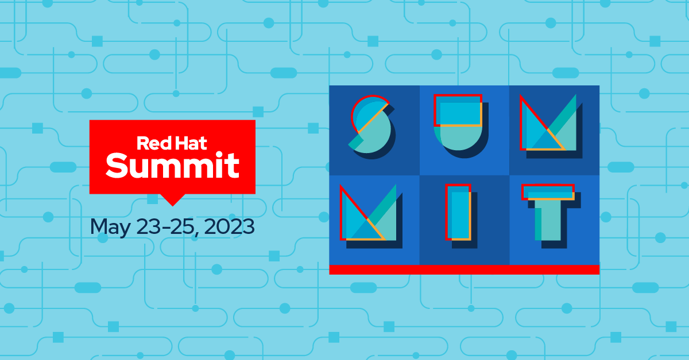

= Welcome to the Hands on with OCP Plus Workshop for Summit 2023

=== Introduction

In this workshop, we aim to cover the fundamental aspects of OpenShift Ops and delve into the operations side of Red Hat Advanced Cluster Management for Kubernetes and Red Hat Advanced Cluster Security for Kubernetes. Participants can expect to gain a comprehensive understanding of the basics of Openshift Ops, such as Environment Overview, Installation and Verification, and LDAP - Configuring External Authentication Providers. Furthermore, we will explore the operational capabilities of Red Hat Advanced Cluster Management for Kubernetes and Red Hat Advanced Cluster Security for Kubernetes, providing attendees with a well-rounded understanding of how to optimize and secure their Kubernetes environments. Overall, this workshop promises to be a valuable learning experience for anyone looking to expand their knowledge of OCP Plus.

=== Admin Ops Modules

The OpenShift Admin Ops section consists of three modules. The first module, Environment, provides an introduction to the OpenShift 4 cluster and the homeroom environment. In the second module, Installation & Verification, participants explore the components and procedures involved in an OpenShift 4 installation. The third module focuses on configuring OAuth, synchronizing LDAP groups with OpenShift groups, implementing group policies, and creating collaborative projects.

=== Red Hat Advanced Cluster Management for Kubernetes

Red Hat Advanced Cluster Management for Kubernetes (RHACM) is a multi-cluster management solution that helps organizations manage their Kubernetes clusters and applications across hybrid and multicloud environments. It provides a unified management console, policy-based governance, observability, and automation capabilities, helping to simplify and streamline Kubernetes management operations.

In this workshop we will showcase how to Manage Hosted Control Plane Clusters, deploy applications and manage polices. 

=== Red Hat Advanced Cluster Security for Kubernetes (RHACS)

The RHACS workshop section is divided into two modules: 

1. The First module focuses on UI navigation and exploring vulnerable workloads, such as the log4shell or Apache struts vulnerabilities. 
2. The second module takes this learned knowledge and extends it to runtime enforcement. Here we will create a workload that violates the Ubuntu Package Manager Execution and watch how we can stop the download of any malicious packages using RHACS. 

