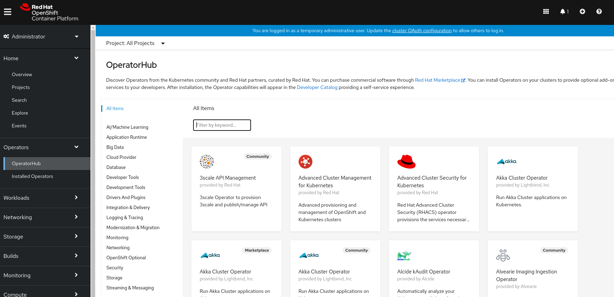
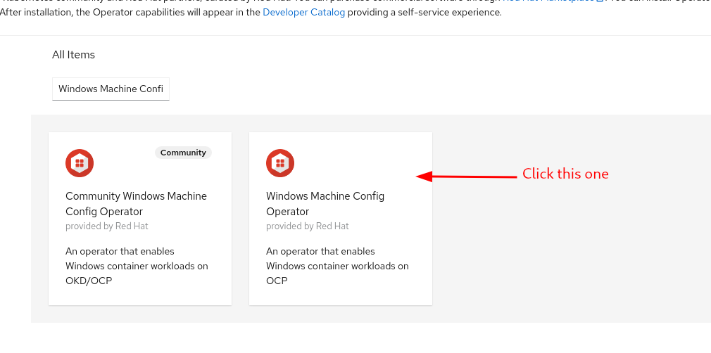
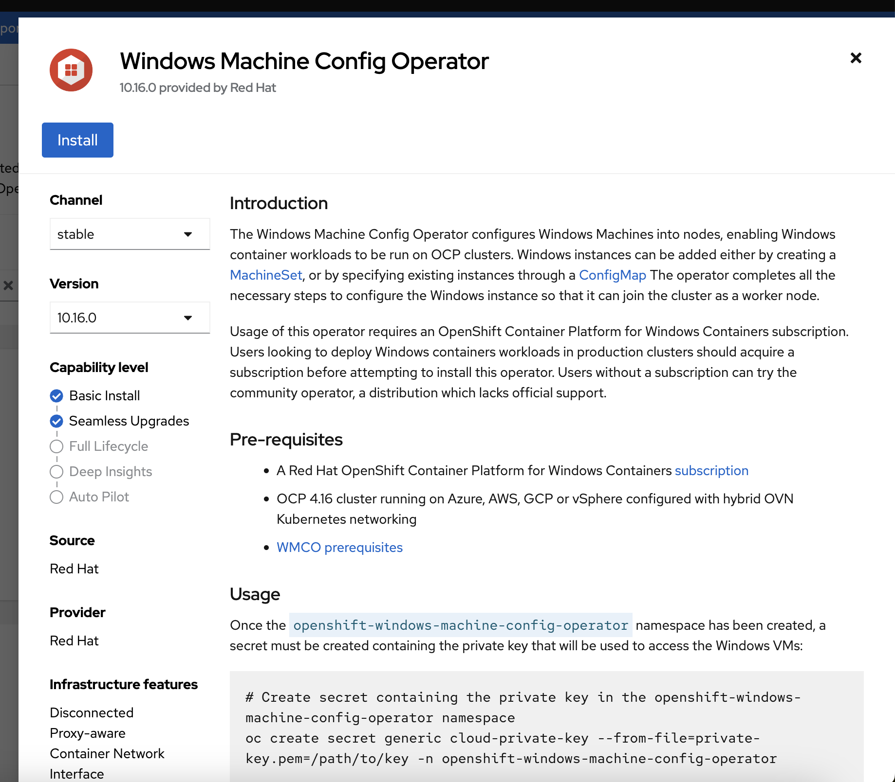
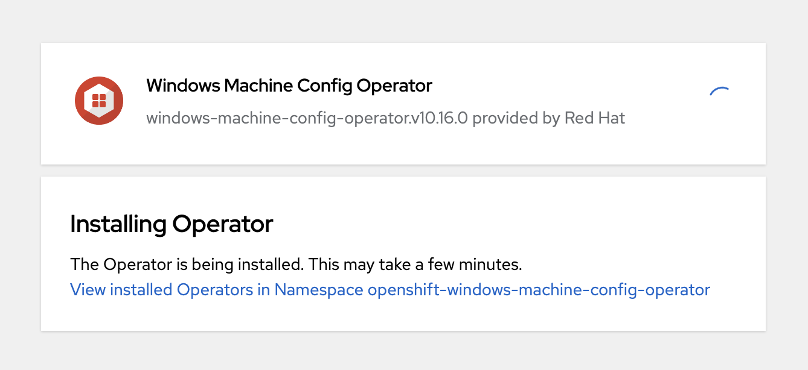
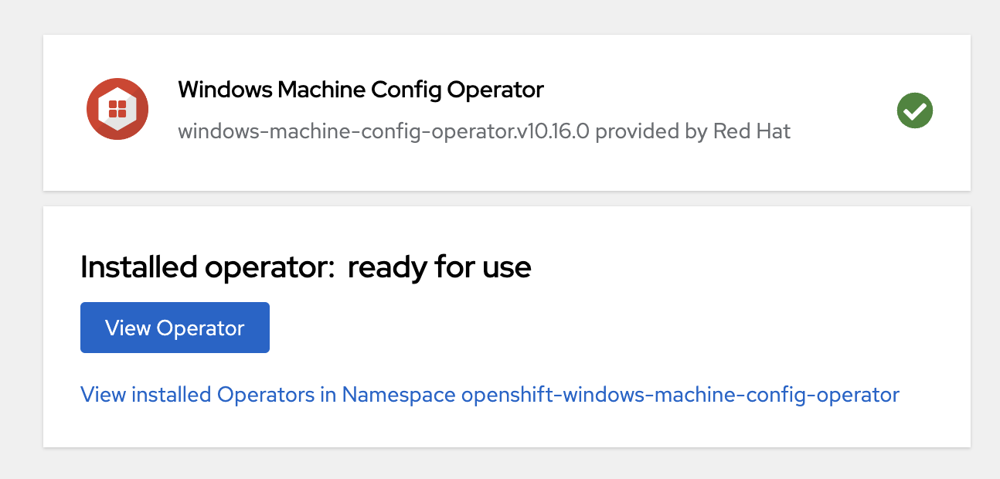
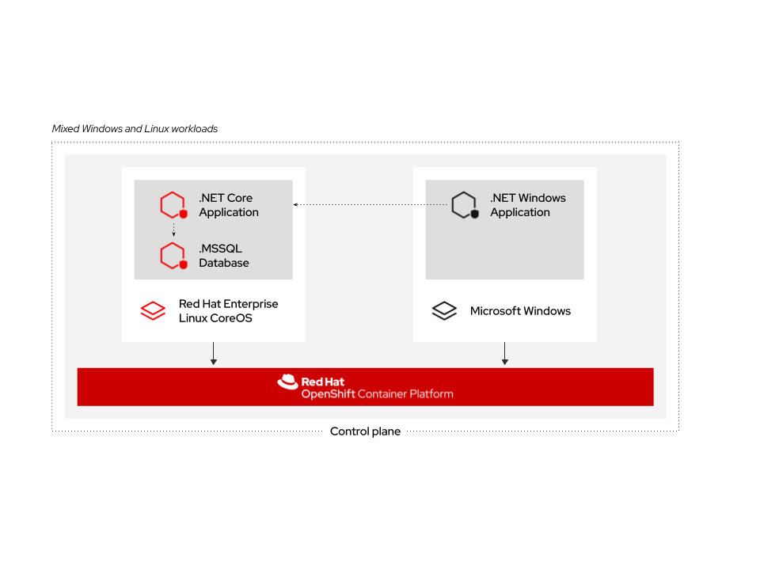
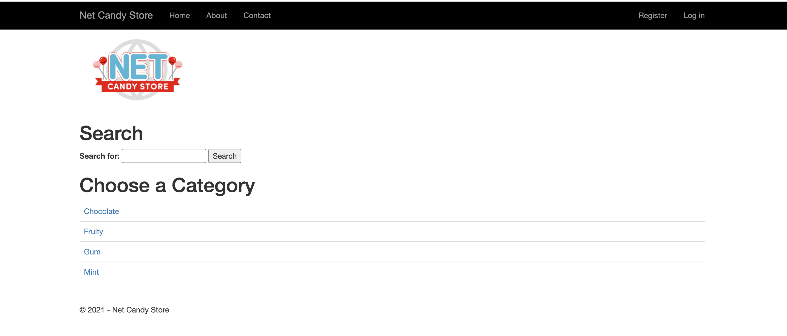

## Windows Containers

Windows Container Support for OpenShift provides support for running
Microsoft Windows Server containers on OpenShift Container Platform. For
those that administer environments with a mix of Linux and Windows
workloads, OpenShift allows you to deploy containerized Windows workloads
running on Windows Server on the same platfrom as your containerized Linux workloads.

Windows container workloads are supported for clusters running on the
following providers:

* Amazon Web Services (AWS)
* Microsoft Azure
* VMware vSphere
* Bare Metal (via link:https://docs.openshift.com/container-platform/4.16/windows_containers/byoh-windows-instance.html[BYOH])

NOTE: For more information  about what versions of Windows Server are supported, please see the link:https://docs.openshift.com/container-platform/4.16/windows_containers/understanding-windows-container-workloads.html[official documentation].

In this lab, you'll get hands on experence on how to deploy a Windows
worker node and how to deploy workloads onto an OpenShift platform with
Windows and Linux nodes.

#### Windows MachineConfig Operator

The Windows Machine Config Operator (WMCO) is the entry point for
OpenShift Administrators who want to run containerized Windows workloads
on their clusters.

It allows Cluster Administrators to add a Windows worker nodes as a day 2
operation with a prescribed configuration to an OpenShift cluster and
enable scheduling of Windows workloads.

The following diagram is a high level illustration on how the WMCO works.

.Windows MachineConfig Operator Design
image::images/wmcodiagram.png[wmco diagram]

The Windows Machine Config Operator is a Linux-based operator that runs on
Linux-based nodes on OpenShift. It watches for Machine Objects that are
of type Windows and connects to them over SSH.

During setup, the WMCO will:

* Transfer needed binaries to the Windows node.
* Installs and confiugres the Kubelet.
* Install and run it's own overlay network (Hybrid-overlay network).
* Confiugre the CNI on the Kubelet.
* Set up kube-proxy.

For more information please see the link:https://docs.openshift.com/container-platform/4.16/windows_containers/understanding-windows-container-workloads.html[official documentation].

#### Prerequisites

This cluster has already been installed to support Windows Nodes and
Windows Containers workloads. Therefore, we will be exploring the
prerequisites by looking at the current configuration of this cluster.

Before proceeding, make sure you're `kubeadmin`

[source,bash,role="execute"]
----
oc login -u kubeadmin -p {{ KUBEADMIN_PASSWORD }}
----

The first requisite is that you must be running OpenShift version 4.6
or newer. This cluster should have been installed at a supported version.

[source,bash,role="execute"]
----
oc version
----

The next requisite is that the cluster must be installed with
`OVNKubernetes` as the SDN for OpenShift. This can only be done at
install time in the `install-config.yaml` file. This file is stored on
the cluster after install. Take a look at the setting.

[source,bash,role="execute"]
----
oc extract cm/cluster-config-v1 -n kube-system --to=- | yq e '.networking.networkType' -
----

This should output `OVNKubernetes` as the network type.

NOTE: Learn more about the `install-config.yaml` file at the link:https://docs.openshift.com/container-platform/4.9/installing/installing_aws/installing-aws-customizations.html#installation-aws-config-yaml_installing-aws-customizations[official documentation page].

The next requisite is the cluster must be set up with overlay hybrid
networking. This is another step that can only be done at install
time. You can verify that the configuration has been done by running
the following:

[source,bash,role="execute"]
----
oc get network.operator cluster -o yaml | yq e '.spec.defaultNetwork' -
----

The output should look like this. As you can see, the
`hybridOverlayConfig` was set up. This is the overlay network setup on
the Windows Node.

[source,yaml]
----
ovnKubernetesConfig:
  egressIPConfig: {}
  gatewayConfig:
    ipv4: {}
    ipv6: {}
    routingViaHost: false
  genevePort: 6081
  hybridOverlayConfig:
    hybridClusterNetwork:
      - cidr: 10.132.0.0/14
        hostPrefix: 23
  ipsecConfig:
    mode: Disabled
  mtu: 8901
  policyAuditConfig:
    destination: "null"
    maxFileSize: 50
    maxLogFiles: 5
    rateLimit: 20
    syslogFacility: local0
type: OVNKubernetes
----

NOTE: To read more about how to setup HybridNetworking, please see the link:https://docs.openshift.com/container-platform/4.16/networking/ovn_kubernetes_network_provider/configuring-hybrid-networking.html#configuring-hybrid-ovnkubernetes_configuring-hybrid-networking[official doc].

To summarize, in order to use Windows Containers on OpenShift. You will need the following:

* OpenShift version 4.6 or newer.
* `OVNKubernetes` as the SDN.
* Additionally set up hybrid overlay networking.

Note, that all of this is done at install time. There's, currently,
no way to configure a cluster for Windows Containers post install.

WARNING: If you're not seeing the above output, you will not be able to continue with this lab. If you see that this cluster doesn't meet the requirements, please see your workshop proctor.

#### Installing the WMCO

Before you can deploy a Windows Node, you will need to install the Windows
Machine Config Operator (WMCO). This can be done via the OpenShift Web
Console. Use the "Console" tab, or open the console in another tab if it isn't open already.

{{ MASTER_URL }}

Use the `kubeadmin` username as the following password:

[source,role="copypaste"]
----
{{ KUBEADMIN_PASSWORD }}
----

Once you are logged in, navigate to *Operators* ~> *OperatorHub* menu.

.OperatorHub

Now type *Windows Machine Config Operator* in the *Filter by _keyword..._*
box. Click on the *Windows Machine Config Operator* card, taking care that
you don't use the community version.

.WMCO Operator

On the overview page, select *Install*.

.WMCO Operator Overview

On the *Install Operator* overview page, make sure you have *stable*
selected in the "Update channel" section. Also, in the "Installation mode"
section, leave *A specifc namespace on the cluster* selected. Leave the
"Installed Namspace" section as *Operator recommended Namespace* and tick
on *Enable Cluster Monitoring*. Finally, leave the "Approval strategy"
as *Automatic*. Then click *Install*. Use the below graphic to guide you.

.WMCO Install Operator Overview
image::images/windows-containers/wmco-install-operator-overivew-page.png[WMCO Install Overview]

The "Installing Operator" status page will come up.

.WMCO Install Operator status page

When the screen says "ready for use", the WMCO Operator is successfully installed.

.WMCO Install Operator status page

Back on the cli, you should now see the WMCO pod running.

[source,bash,role="execute"]
----
oc get pods -n openshift-windows-machine-config-operator
----

The output should look something like this.

[source,bash]
----
NAME                                               READY   STATUS    RESTARTS   AGE
windows-machine-config-operator-7ddc9f7d9b-vx4vx   1/1     Running   0          43m
----

Once the operator is up and running. You are ready to install a Windows Node.

#### Installing a Windows Node.

In order for the WMCO to setup the Windows Node, it will need an ssh key
to the cloud provider. The cloud provider will then mint a new keypair
based on the private key provided. The WMCO will then use this key to
login to the Windows Node and set it up as an OpenShift Node.

Generate an ssh key for the WMCO to use:

[source,bash,role="execute"]
----
ssh-keygen -t rsa -f ${HOME}/.ssh/winkey -q -N ''
----

Once you've generated the key, add it as a secret to the
`openshift-windows-machine-config-operator` namespace.

[source,bash,role="execute"]
----
oc create secret generic cloud-private-key --from-file=private-key.pem=${HOME}/.ssh/winkey -n openshift-windows-machine-config-operator 
----

This secret is used by the WMCO Operator to setup the Windows Node. Verify
that it was created before you proceed.

[source,bash,role="execute"]
----
oc get secret -n openshift-windows-machine-config-operator cloud-private-key
----

Once the WMCO Operator is up and running, and the ssh key loaded into
the cluster as a secret, you can now deploy a Windows Node. How do you
build a Windows Node? The same way you create OpenShift Linux nodes,
with the MachineAPI

NOTE: If you're unfamiliar with the MachineAPI, you can do the xref:machinesets.adoc[MachineSets, Machines, and Nodes] lab to get familair with the concepts.

First, we will be creating a MachineSet for Windows Nodes. We will then
explore important sections of the YAML.

[source,bash,role="execute"]
----
${HOME}/support/generate-windows-ms.sh
----

NOTE: For more information on how to create a Windows MachineSet YAML see the link:https://docs.openshift.com/container-platform/4.16/windows_containers/creating_windows_machinesets/creating-windows-machineset-aws.html[official docs].

This should create the `windows-ms.yaml` file in your home directory.

[source,bash,role="execute"]
----
ls -l ~/windows-ms.yaml
----

NOTE: Feel free to take a look at the file if you wish. You'll see that it doesn't differ from a Linux MachineSet.

The Windows MachineSet is labeled with an Operating System ID of `Windows`. The following command will show the label of `machine.openshift.io/os-id: Windows` for the MachineSet.

[source,bash,role="execute"]
----
yq e '.metadata.labels' ~/windows-ms.yaml
----

All the Windows Machines will have the `worker` label. The Windows Node
will be treated like any other node in the cluster.

[source,bash,role="execute"]
----
yq e '.spec.template.spec.metadata.labels' ~/windows-ms.yaml
----

The AMI ID is of a Windows Server 2019 AMI.

[source,bash,role="execute"]
----
yq e '.spec.template.spec.providerSpec.value.ami.id' ~/windows-ms.yaml
----

NOTE: You will need to use an AMI of a supported version of Windows Server. For more information, consult the link:https://docs.openshift.com/container-platform/4.15/windows_containers/wmco_rn/windows-containers-release-notes-10-15-x.html#supported-windows-server-versions[official documentation].

One last thing to note, is the user data secret.

[source,bash,role="execute"]
----
yq e '.spec.template.spec.providerSpec.value.userDataSecret.name' ~/windows-ms.yaml
----

This secret is generated by the WMCO when it was installed.

[source,bash,role="execute"]
----
oc get secret windows-user-data -n openshift-machine-api
----

Apply the YAML to create the Windows MachineSet on the cluster.

[source,bash,role="execute"]
----
oc apply -f ~/windows-ms.yaml
----

You can now see the status of the MachineSet.

[source,bash,role="execute"]
----
oc get machinesets  -n openshift-machine-api -l machine.openshift.io/os-id=Windows
----

This should show the following output.

[source,bash]
----
NAME                                            DESIRED   CURRENT   READY   AVAILABLE   AGE
cluster-w2tlt-7rwdh-windows-worker-us-east-2a     1         1                             9s
----

The MachineSet has the replica set to 1. The MachineAPI will see that desired state and, in turn, create a Windows Machine. This machine will eventually turn into a node. See the status of the machine with the following command.

[source,bash,role="execute"]
----
oc get machines  -n openshift-machine-api -l machine.openshift.io/os-id=Windows
----

Once the Machine is up and running, the WMCO will configure it. You can follow that status by looking at the WMCO pod log.

[source,bash,role="execute"]
----
oc logs -l name=windows-machine-config-operator -n openshift-windows-machine-config-operator   -f
----

You can exit by pressing kbd:[Ctrl+C].

NOTE: If you wish, you can wait until you see "Windows VM has been configured as a worker node" log message. Otherwise, go ahead and break out of following the log.

This Machine will create a Windows Node and the WMCO will add it to the cluster. You
can see the node with the following command.

[source,bash,role="execute"]
----
oc get nodes -l kubernetes.io/os=windows
----

NOTE: It'll take up to 15 mintues to see the Windows Node appear. It's recommneded to run a `watch` on `oc get nodes -l kubernetes.io/os=windows` so you can see when the node appears. Now will be a good time to take a break.

The output should look something like this.

[source,bash]
----
NAME                                        STATUS   ROLES    AGE   VERSION
ip-10-0-12-4.us-east-2.compute.internal     Ready    worker   25m    v1.29.6+aba1e8d
----

#### Managing a Windows Node

Now that the Windows Node is up and running, you will be able to manage
it like you would a Linux node. You will be able to scale and delete
nodes using the MachineAPI.

WARNING: Windows Machine Config Operator is not responsible for Windows operating system updates. The Cluster Administrator provides the Windows image while creating the VMs and hence, the Cluster Administrator is responsible for providing an updated image. The Cluster Administrator can provide an updated image by changing the image in the MachineSet spec.

Currently, you have one Windows node.

[source,bash,role="execute"]
----
oc get nodes -l kubernetes.io/os=windows
----

In order to add another node, you will just scale the corespoinding
MachineSet. Currently, you should have one

[source,bash,role="execute"]
----
oc get machineset -l machine.openshift.io/os-id=Windows -n openshift-machine-api
----

You should have the below output. It shows that you have one Windows
Machine managed by this MachineSet.

[source,bash]
----
NAME                                       DESIRED   CURRENT   READY   AVAILABLE   AGE
cluster1-zzv5j-windows-worker-us-east-1a   1         1         1       1           138m
----

To add another Windows Node, scale the Windows MachineSet to two
replicas. This will create a new Windows Machine, and then the WMCO will
add it as an OpenShift Node.

[source,bash,role="execute"]
----
oc scale machineset -l machine.openshift.io/os-id=Windows -n openshift-machine-api --replicas=2
----

NOTE: Just like when you created the inital Windows Node, this can take upwards of 15 minutes. This can be another good time to take a small break.

After some time, another Windows Node will have joined the cluster.

[source,bash,role="execute"]
----
oc get nodes -l kubernetes.io/os=windows
----

Here's an example output.

[source,bash]
----
NAME                                         STATUS   ROLES    AGE     VERSION
ip-10-0-12-4.us-east-2.compute.internal     Ready    worker   23m    v1.29.6+aba1e8d
ip-10-0-20-199.us-east-2.compute.internal   Ready    worker   2m5s   v1.29.6+aba1e8d
----

You can see how easy it is to manage a Windows Machine
with the MachineAPI on OpenShift. It is managed by the
same system as your Linux Nodes. You can even attach the Windows
link:https://docs.openshift.com/container-platform/4.16/machine_management/applying-autoscaling.html[MachineSet Autoscaler] as well

Remove this node by scaling the Windows MachineSet back down to 1.

[source,bash,role="execute"]
----
oc scale machineset -l machine.openshift.io/os-id=Windows -n openshift-machine-api --replicas=1
----

WARNING: Please scale your Windows MachineSet to 1 before starting the next exercise.

After some time, you should be back at 1 Windows node.

[source,bash,role="execute"]
----
oc get nodes -l kubernetes.io/os=windows
----

#### Exploring The Windows Node

Now that you've learned how to manage a Windows Node, we will explore how this
node is set up. You can access this Windows node via the same mechanism
as the WMCO, via SSH.

Since this cluster was installed in the cloud, the Windows Node isn't
exposed to the public internet. So we will need to deploy an ssh bastion Pod.

NOTE: For information on how to enable RDP on an AWS instance, please see the link:https://docs.aws.amazon.com/AWSEC2/latest/WindowsGuide/connecting_to_windows_instance.html[official documentation] on their website.

The ssh bastion pod can be deployed using the Deployment YAML provided to you in this lab.

[source,bash,role="execute"]
----
oc apply -n openshift-windows-machine-config-operator -f ~/support/win-node-ssh.yaml
----

You can wait for the rollout of this ssh bastion pod.

[source,bash,role="execute"]
----
oc rollout status deploy/winc-ssh -n openshift-windows-machine-config-operator
----

Once rolled out, you should have the ssh bastion pod running.

[source,bash,role="execute"]
----
oc get pods -n openshift-windows-machine-config-operator -l app=winc-ssh
----

The ssh bastion pod mounts the ssh key needed to login to the Windows Node.

[source,bash,role="execute"]
----
yq e '.spec.template.spec.volumes' ~/support/win-node-ssh.yaml
----

In order to be able to ssh into this node you will need the hostname. Get
this hostname with the following command and make note of it.

[source,bash,role="execute"]
----
oc get nodes -l kubernetes.io/os=windows
----

Now open a bash session into the ssh bastion pod using the `oc exec` command.

[source,bash,role="execute"]
----
oc exec -it deploy/winc-ssh -n openshift-windows-machine-config-operator -- bash
----

Use the provided `sshcmd.sh` command built into the pod to login to the
Windows Node. Here is an example:

[source,bash]
----
bash-4.4$ sshcmd.sh ip-10-0-20-199.us-east-2.compute.internal
----

This should drop you into a PowerShell session. It should look something like this.

[source,bash]
----
Windows PowerShell
Copyright (C) Microsoft Corporation. All rights reserved.

PS C:\Users\Administrator>
----

Once on the Windows Node, you can see the `containerd`, `hybrid-overlay-node`, `kubelet`, `kube-proxy`,
`windows_exporter` and `windows-instance-config-daemon` processes are running.

[source,bash,role="execute"]
----
Get-Process | ?{ $_.ProcessName -match "daemon|exporter|kube|overlay|containerd" }
----

You should see the following output.

[source,bash]
----
Handles  NPM(K)    PM(K)      WS(K)     CPU(s)     Id  SI ProcessName
-------  ------    -----      -----     ------     --  -- -----------
    173      14    31488      36740       5.97   4688   0 containerd
    254      17    31080      40376       2.48   5320   0 hybrid-overlay-node
    482      31    56224      80748      46.11   1924   0 kubelet
    101       8    12704       6096       0.09   5100   0 kube-log-runner
    104       8    12424       5332       0.11   5440   0 kube-log-runner
    268      21    33176      44792       3.80   6080   0 kube-proxy
    436      23    30824      32440      20.22   2676   0 windows_exporter
    209      15    26252      85528       4.23   3056   0 windows-instance-config-daemon
----

These are the main components needed to run a Windows Node. Remember that
this node is managed the same way as a Linux node, Via the MachineAPI;
so you won't have to do much with this Windows Node.

You can now exit out of the PowerShell session.

[source,bash,role="execute"]
----
exit
----

You can also exit out of the bash container session as well.

[source,bash,role="execute"]
----
exit
----

#### Running a Windows Container Workload

Before you deploy a sample Windows Container workload, let's explore
how the container gets scheduled on the Windows node.

If you run an `oc describe` on the Windows Node, you'll see it has
a taint.

NOTE: Please see the xref:taints-and-tolerations.adoc[Taints and Tolerations lab] to get more familiar about how they work.

[source,bash,role="execute"]
----
oc describe nodes -l kubernetes.io/os=windows | grep Taint
----

You should see the following output.

[source,bash]
----
Taints:             os=Windows:NoSchedule
----

Every Windows Node will come with this taint by default. This taint will
"repel" all workloads that don't tolerate this taint. It is a part of
the WMCO's job to ensure that all Windows Nodes have this taint.

In this lab, there is a sample workload saved under
`~/support/winc-sample-workload.yaml`. Let's explore this file a bit
before we apply it.

[source,bash,role="execute"]
----
yq e '.items[2].spec.template.spec.tolerations' ~/support/winc-sample-workload.yaml
----

The output should look something like this.

[source,yaml]
----
- key: "os"
  value: "Windows"
  Effect: "NoSchedule"
----

This sample workload has the toleration in place to be able to run on
the Windows Node. However, that's not enough. A `nodeSelector` will need
to be present as well.

[source,bash,role="execute"]
----
yq e '.items[2].spec.template.spec.nodeSelector' ~/support/winc-sample-workload.yaml
----

The output should look something like this.

[source,bash]
----
kubernetes.io/os: windows
----

So here, the `nodeSelector` will place this container on the Windows
Node. Furthermore, the appropriate toleration is in place so the Windows
Node won't repel the container.

One last thing to look at. Take a look at the container that is being deployed.

[source,bash,role="execute"]
----
yq e '.items[2].spec.template.spec.containers[0].image' ~/support/winc-sample-workload.yaml
----

WARNING: Note that this container has to be prepulled onto the Windows Node. Please see the <<Exploring The Windows Node>> exercise for more info.

Apply this YAML file to deploy the sample workload.

[source,bash,role="execute"]
----
oc apply -f ~/support/winc-sample-workload.yaml
----

Wait for the deployment to finish rolling out. This can take 5-10 minutes as Windows images are large in size.

[source,bash,role="execute"]
----
oc rollout status deploy/win-webserver -n winc-sample
----

If you check the pod, you can see that it's running on the Windows
Node. Look at the wide output of the Pod and select the Windows Node
to verify.

[source,bash,role="execute"]
----
oc get pods -n winc-sample  -o wide
oc get nodes -l kubernetes.io/os=windows
----

Make a note of the Windows Node name, we will log into the node using
the bastion ssh container.

[source,bash,role="execute"]
----
oc exec -it deploy/winc-ssh -n openshift-windows-machine-config-operator -- bash
----

Now log into the Windows Node using the hostname. Example:

[source,bash]
----
bash-4.4$ sshcmd.sh ip-10-0-20-199.us-east-2.compute.internal
----

To view Windows containers running on the node, you need to install the `crictl` tool
to interact with the containerd runtime.

[source,bash,role="execute"]
----
$ProgressPreference = "SilentlyContinue"; wget https://github.com/kubernetes-sigs/cri-tools/releases/download/v1.27.0/crictl-v1.27.0-windows-amd64.tar.gz -o crictl-v1.27.0-windows-amd64.tar.gz; tar -xvf crictl-v1.27.0-windows-amd64.tar.gz -C C:\Windows\
----

Now lets configure `crictl`.
[source,bash,role="execute"]
----
crictl config --set runtime-endpoint="npipe:\\\\.\\pipe\\containerd-containerd"
----

Here, you can see the Windows container running on the node.

[source,bash,role="execute"]
----
crictl ps
----

Here you'll see the Container running. Here is an example output.

[source,bash]
----
CONTAINER           IMAGE               CREATED             STATE               NAME                ATTEMPT             POD ID              POD
c06eb847b6313       b51a50ce03f12       2 minutes ago       Running             windowswebserver    0                   6a295ed1a5a8d       win-webserver-776bb9fb97-zxf78
----

You can also see the images downloaded on the host.

[source,bash,role="execute"]
----
crictl images
----

You should see the following output.

[source,bash]
----
IMAGE                                    TAG                 IMAGE ID            SIZE
mcr.microsoft.com/oss/kubernetes/pause   3.9                 6778bc79db242       270MB
mcr.microsoft.com/windows/servercore     ltsc2019            b51a50ce03f12       2.18GB
----

Go ahead an logout of the Windows Node

[source,bash,role="execute"]
----
exit
----

You can also exit out of the bash container session as well.

[source,bash,role="execute"]
----
exit
----

You can interact with the Windows Container workload as you would any
other pod. For instance you can remote shell into the container itself
by calling the `Powershell` command.

[source,bash,role="execute"]
----
oc -n winc-sample exec -it $(oc get pods -l app=win-webserver -n winc-sample -o name ) -- powershell
----

This should put you in a `Powershell` session in the Windows Container. It
should look something like this

[source,bash]
----
Windows PowerShell
Copyright (C) Microsoft Corporation. All rights reserved.

PS C:\>
----

Here, you can query for the running HTTP process.

NOTE: You may have to press `ENTER` to execute the following commands while in the Windows Container for them to run.

[source,bash,role="execute"]
----
Get-WmiObject Win32_Process -Filter "name = 'powershell.exe'" | Select-Object CommandLine | Select-String -Pattern http
----

Go ahead an logout of the Windows Container.

[source,bash,role="execute"]
----
exit
----

You can interact with the Windows Container `Deployment` the same as you
would for a Linux one. Scale the `Deployment` of the Windows Container:

[source,bash,role="execute"]
----
oc scale deploy/win-webserver -n winc-sample --replicas=2
----

You should now have two Pods running.

[source,bash,role="execute"]
----
oc get pods -n winc-sample
----

#### Running a Mixed Linux/Windows Container Workload.

With Windows Containers support for OpenShift; You also have the ability
to run application stacks of mixed workloads. This gives you the
ability to run an application stack consisting of both Linx and Windows
Containers.

In this section, we will show how you can run Windows workloads that
work together with Linux workloads.

You will be deploying a sample application stack that delivers an
eCommerce site, The NetCandy Store. This application is built using
Windows Containers working together with Linux Containers.

This application consists of:

* Windows Container running a .NET v4 frontend, which is consuming a backend service.
* Linux Container running a .NET Core backend service, which is using a database.
* Linux Container running a MSSql database.

We will be using a helm chart to deploy the sample application. In
order to successfully deploy the application stack, make sure you're
`kubeadmin`.

NOTE: For more information about `helm` and how it can be used as a package manager for your containerized workloads, please see the link:https://docs.openshift.com/container-platform/4.16/applications/working_with_helm_charts/installing-helm.html[OpenShift documentation]

Next add the Red Hat Developer Demos Helm repository.

[source,bash,role="execute"]
----
helm repo add redhat-demos https://redhat-developer-demos.github.io/helm-repo
helm repo update
----

Create the namespace for `netcandystore`.

[source,bash,role="execute"]
----
oc create namespace netcandystore
----

Next we will use this command below to create a Kubernetes resource with specific security restrictions and context constraints within the OpenShift cluster.

[source,bash,role="execute"]
----
oc create -f ${HOME}/support/restrictedfsgroupscc.yaml
----

Next, we'll allow a specific group of service accounts (in this case, those related to Microsoft SQL Server) to follow the strict security rules defined by the "restrictedfsgroup" Security Context Constraints in the OpenShift system.

[source,bash,role="execute"]
----
oc adm policy add-scc-to-group restrictedfsgroup system:serviceaccounts:mssql
----

With the two variables exported, and the helm repo added, you can install
the application stack using the `helm` cli.

[source,bash,role="execute"]
----
helm install ncs --namespace netcandystore \
--timeout=1200s \
redhat-demos/netcandystore
----

NOTE: Note that the `--timeout=1200s` is needed because the default timeout for `helm` is 5 minutes and, in most cases, the Windows container image will take longer than that to download.

This will look like it's "hanging" or "stuck". It's not! What's happening
is that the image is getting pulled into the Windows node. As stated
before, Windows containers can be very large, so it might take some time.

After some time, you should see something like the following return.

[source,bash]
----
NAME: ncs
LAST DEPLOYED: Sun Mar 28 00:16:05 2021
NAMESPACE: netcandystore
STATUS: deployed
REVISION: 1
TEST SUITE: None
NOTES:
1. Get the application URL by running these commands:
oc get route netcandystore -n netcandystore -o jsonpath='{.spec.host}{"\n"}'

2. NOTE: The Windows container deployed only supports the following OS:

Windows Version:
=============
Windows Server 2019 Release 1809

Build Version:
=============

Major  Minor  Build  Revision
-----  -----  -----  --------
10     0      17763  0
----

If the helm installation finishes quickly, please examine the pods. It might be necessary to wait for approximately 10-20 minutes for this specific pod to become operational.

Verify that the helm chart was installed successfully.

[source,bash,role="execute"]
----
helm ls -n netcandystore
----

The output should look something like this.

[source,bash]
----
NAME    NAMESPACE       REVISION        UPDATED                                 STATUS          CHART                   APP VERSION
ncs     netcandystore   1               2021-03-31 19:54:50.576808462 +0000 UTC deployed        netcandystore-1.0.1     3.1
----

There should be 3 pods running for this application. One for the frondend
called netcandystore, one for the categories service called getcategories
and a DB called mysql.

[source,bash,role="execute"]
----
oc get pods -n netcandystore
----

If the NetCandyStore Pod looks kinda like this, please wait for a little longer:

----
netcandystore-78d78677c8-j7k62        0/1     ContainerCreating   0          104s
----

You can easily look into more details about what's happening with your pod by using the oc describe command. Just replace the pod name with your own.

[source,bash,role="execute"]
----
oc describe pod <netcandystore-78d78677c8-j7k62> -n netcandystore
----

You'll be able to tell it's done when the events start looking like this:

----
Events:
  Type    Reason     Age    From               Message
  ----    ------     ----   ----               -------
  Normal  Scheduled  13m    default-scheduler  Successfully assigned netcandystore/netcandystore-78d78677c8-j7k62
to ip-10-0-130-99.us-east-2.compute.internal
  Normal  Pulling    13m    kubelet            Pulling image "quay.io/donschenck/netcandystore:2021mar8.1"
  Normal  Pulled     4m48s  kubelet            Successfully pulled image "quay.io/donschenck/netcandystore:2021mar
8.1" in 8m41.7951457s (8m41.7951457s including waiting)
  Normal  Created    4m48s  kubelet            Created container netcandystore
  Normal  Started    4m46s  kubelet            Started container netcandystore
----

Looking at the frontend application, you can list where the pod is
running. Comparing it to the nodes output, you can see it's running on
a Windows Node.

[source,bash,role="execute"]
----
oc get pods -n netcandystore -l app=netcandystore -o wide
oc get nodes -l kubernetes.io/os=windows
----

Now, looking at the backend, you can see it's running on a Linux node.

[source,bash,role="execute"]
----
oc get pods -n netcandystore -l app=getcategories -o wide
oc get nodes -l kubernetes.io/os=linux
----

The MSSQL Database is also running on the Linux node.

[source,bash,role="execute"]
----
oc get pods -n netcandystore -l deploymentconfig=mssql -o wide
----

You can see the application by visiting the link:http://netcandystore-netcandystore.{{ ROUTE_SUBDOMAIN }}[Net Candystore Route]. If you get a message saying 'Application is not available'. Please give it some time and try again later.

The frontpage should look like this, feel free to play around with the application!

#### Conclusion

In this lab you worked with Windows Containers on OpenShift Container
Platfrom. You saw how the cluster was prepared to support Windows
Containers. You also learned about the Windows Machine Config Operator and
how it's used to provision a Windows Node.

You also learned about how to manage Windows Nodes using the MachineAPi
and how to manage Windows Container workloads using the same tools as
Linux Nodes.

Finally, you learned how you can used mixed workloads made up of Linux
and Windows containers.

